本調査の分析
================
加藤言人
2019年8月31日

-   [記述統計](#記述統計)
    -   [従属変数：金融緩和政策選好](#従属変数金融緩和政策選好)
    -   [独立変数：イデオロギー](#独立変数イデオロギー)
        -   [自己申告イデオロギー](#自己申告イデオロギー)
        -   [争点態度イデオロギー](#争点態度イデオロギー)
        -   [政党支持イデオロギー](#政党支持イデオロギー)
        -   [自己申告イデオロギーと争点態度イデオロギーの相関](#自己申告イデオロギーと争点態度イデオロギーの相関)
-   [実験群比較](#実験群比較)
    -   [準備](#準備)
    -   [実験刺激の直接効果](#実験刺激の直接効果)
    -   [自己申告イデオロギー条件付け](#自己申告イデオロギー条件付け)
    -   [争点態度イデオロギー条件付け](#争点態度イデオロギー条件付け)
    -   [政党支持イデオロギー条件付け](#政党支持イデオロギー条件付け)
    -   [図２：仮説検証用プロット](#図仮説検証用プロット)
    -   [表のエクスポート](#表のエクスポート)

``` r
## Read Data
d <- readRDS("../data_public/main_data_v1.rds")
#d <- read_dta("../data_public/main_data_v1.dta", encoding="UTF-8")
nrow(d)
```

    ## [1] 1240

``` r
## Drop Respondents (Currently NULL)
d <- d[which(d$satisficer==0),] # Not Satisficers
d <- d[which(d$surveytime<=90),] # Took too long
#d <- d[which(d$check_fail==0),] # Not Failing Manipulation Check
nrow(d)
```

    ## [1] 1200

``` r
dtmp <- d[complete.cases(d[,c("knall","fem","age","lvlen","ownh",
  "edu3","wk","mar","cld")]),]
nrow(dtmp)
```

    ## [1] 1123

``` r
table(dtmp$g_easing)
```

    ## 
    ##     0_control     1_ec_only       2_ec_po       3_ec_eq 4_ec_only_cue 
    ##           184           185           185           196           182 
    ##   5_ec_po_cue 
    ##           191

記述統計
========

従属変数：金融緩和政策選好
--------------------------

``` r
tab <- table(d$easing_opi)/sum(table(d$easing_opi))
tab <- data.frame(prop = as.numeric(tab),
                  names = c("反対\n(-3)","-2","-1",
                            "どちらともいえない\n(0)",
                            "1","2","賛成\n(3)"))
tab$names <- factor(tab$names, levels=tab$names)

p <- ggplot(tab, aes(x=names,y=prop)) + 
  geom_bar(stat="identity") + 
  ylab("回答割合") + xlab(NULL) + 
  #ggtitle("金融緩和に対する意見の回答分布") + 
  theme_bw() + 
  theme(plot.title = element_text(hjust=0.5, face="bold"),
        axis.text.x = element_text(size=12, face="bold"))
p
```

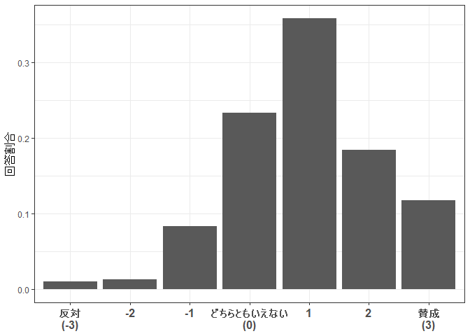

``` r
ggsave("../out/dvdist.png", p, width=7, height=5)
```

独立変数：イデオロギー
----------------------

### 自己申告イデオロギー

``` r
tab <- table(d$ide_self)/sum(table(d$ide_self))
tab <- data.frame(prop = as.numeric(tab),
                  names = c("左派/\nリベラル\n(-3)","-2","-1",
                            "中立\n(0)","1","2","右派/\n保守\n(3)"))
tab$names <- factor(tab$names, levels=tab$names)

p1 <- ggplot(tab, aes(x=names,y=prop)) + 
  geom_bar(stat="identity") + 
  ylab(NULL) + xlab(NULL) + 
  ggtitle("自己申告\nイデオロギー\n（度数分布）") + 
  theme_bw() + 
  theme(plot.title = element_text(hjust=0.5, face="bold"),
        axis.text.x = element_text(size=12, face="bold"))
p1
```

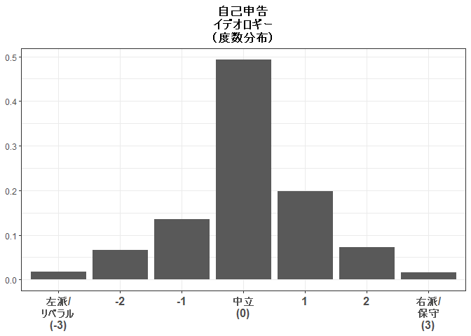

### 争点態度イデオロギー

``` r
p2_1 <- ggplot(d, aes(x=ide_iss_1,y=..count../sum(..count..))) + 
  geom_histogram(bins=10,color="white") +
  ylab(NULL) + xlab(NULL) + 
  ggtitle("外交安全保障\nイデオロギー\n（ヒストグラム）") + 
  scale_x_continuous(breaks=c(-3,-2,-1,0,1,2,3),
                     limits=c(-3,3),
                     labels=c("左派\n(-3)\n","-2","-1","0","1","2","右派\n(3)\n")) +
  theme_bw() + 
  theme(plot.title = element_text(hjust=0.5, face="bold"),
        axis.text.x = element_text(size=12, face="bold"))
p2_1
```

    ## Warning: Removed 2 rows containing non-finite values (stat_bin).

    ## Warning: Removed 1 rows containing missing values (geom_bar).

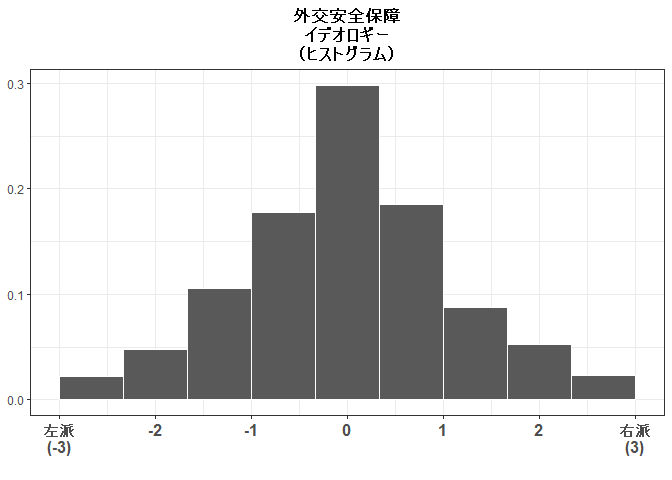

``` r
p2_2 <- ggplot(d, aes(x=ide_iss_2,y=..count../sum(..count..))) + 
  geom_histogram(bins=10,color="white") +
  ylab(NULL) + xlab(NULL) + 
  ggtitle("権利機会平等\nイデオロギー\n（ヒストグラム）") + 
  scale_x_continuous(breaks=c(-3,-2,-1,0,1,2,3),
                     limits=c(-3,3),
                     labels=c("左派\n(-3)\n","-2","-1","0","1","2","右派\n(3)\n")) +
  theme_bw() + 
  theme(plot.title = element_text(hjust=0.5, face="bold"),
        axis.text.x = element_text(size=12, face="bold"))
p2_2
```

    ## Warning: Removed 15 rows containing non-finite values (stat_bin).

    ## Warning: Removed 1 rows containing missing values (geom_bar).

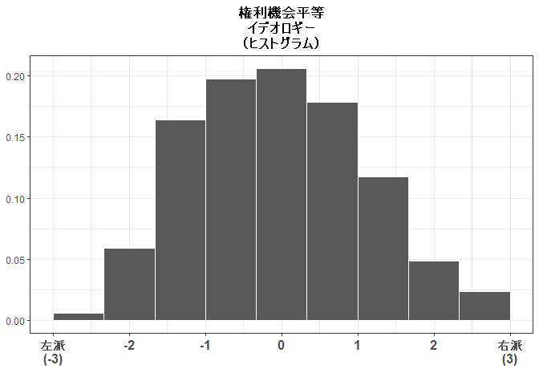

### 政党支持イデオロギー

``` r
tab <- table(d$ide_psup)/sum(table(d$ide_psup))
tab <- data.frame(prop = as.numeric(tab),
                  names = c("左派\n政党支持\n(-1)","無党派\nその他\n(0)",
                            "右派\n政党支持\n(1)"))
tab$names <- factor(tab$names, levels=tab$names)

p3 <- ggplot(tab, aes(x=names,y=prop)) + 
  geom_bar(stat="identity") + 
  ylab(NULL) + xlab(NULL) + 
  ggtitle("政党支持\nイデオロギー\n（度数分布）") + 
  theme_bw() + 
  theme(plot.title = element_text(hjust=0.5, face="bold"),
        axis.text.x = element_text(size=12, face="bold"))
p3
```

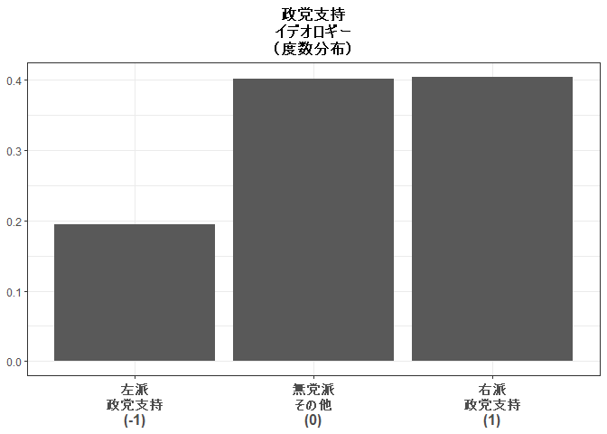

``` r
ggplot() + theme_void()
p <- arrangeGrob(p1,p3, nrow=1, left="回答割合")
grid.draw(p)
```

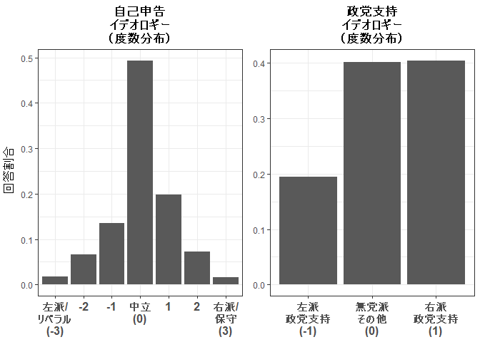

``` r
ggsave("../out/idedist13.png", p, width=8, height=4.5)
```

``` r
ggplot() + theme_void()
p <- arrangeGrob(p1,p3,p2_1,p2_2, nrow=1, left="回答割合")
```

    ## Warning: Removed 2 rows containing non-finite values (stat_bin).

    ## Warning: Removed 1 rows containing missing values (geom_bar).

    ## Warning: Removed 15 rows containing non-finite values (stat_bin).

    ## Warning: Removed 1 rows containing missing values (geom_bar).

``` r
grid.draw(p)
```

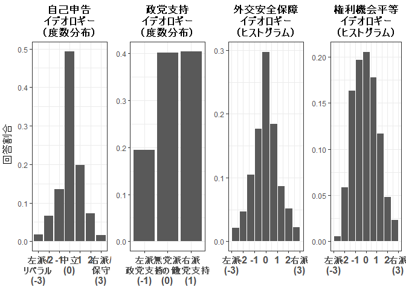

``` r
ggsave("../out/idedist123.png", p, width=9.5, height=4)
```

### 自己申告イデオロギーと争点態度イデオロギーの相関

``` r
p12cor_1 <- ggplot(d, aes(x=ide_self,y=ide_iss_1)) + 
  geom_jitter(alpha=0.6, width=0.2, height=0.2,size=2) + 
  ylab("外交安全保障イデオロギー") + 
  xlab("自己申告イデオロギー") + 
  annotate("text", x=-2.5, y=3.2, size=4.5,
           label=paste("r =",round(cor(d$ide_self,d$ide_iss_1),3))) + 
  scale_x_continuous(breaks=c(-3,-2,-1,0,1,2,3),
                     labels=c("左派/\nリベラル\n(-3)","-2","-1",
                              "中立\n(0)","1","2","右派/\n保守\n(3)")) + 
  scale_y_continuous(breaks=c(-3,-2,-1,0,1,2,3),
                     #limits=c(-3,3),
                     labels=c("左派(-3)","-2","-1","0","1","2","右派(3)")) +
  theme_bw() + 
  theme(plot.title = element_text(hjust=0.5, face="bold"),
        axis.title = element_text(size=12, face="bold"),
        axis.text = element_text(size=12, face="bold"))
p12cor_1
```

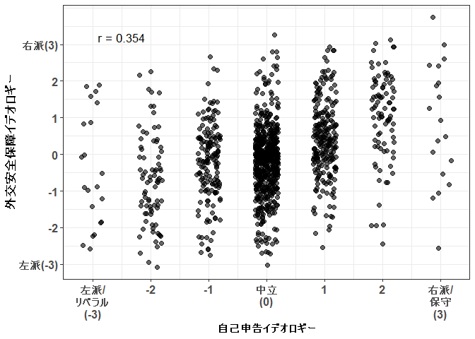

``` r
p12cor_2 <- ggplot(d, aes(x=ide_self,y=ide_iss_2)) + 
  geom_jitter(alpha=0.6, width=0.2, height=0.2,size=2) + 
  ylab("権利機会平等イデオロギー") + 
  xlab("自己申告イデオロギー") + 
  annotate("text", x=-2.5, y=3.5, size=4.5,
           label=paste("r =",round(cor(d$ide_self,d$ide_iss_2),3))) + 
  scale_x_continuous(breaks=c(-3,-2,-1,0,1,2,3),
                     labels=c("左派/\nリベラル\n(-3)","-2","-1",
                              "中立\n(0)","1","2","右派/\n保守\n(3)")) + 
  scale_y_continuous(breaks=c(-3,-2,-1,0,1,2,3),
                     #limits=c(-3,3),
                     labels=c("左派(-3)","-2","-1","0","1","2","右派(3)")) +
  theme_bw() + 
  theme(plot.title = element_text(hjust=0.5, face="bold"),
        axis.title = element_text(size=12, face="bold"),
        axis.text = element_text(size=12, face="bold"))
p12cor_2
```

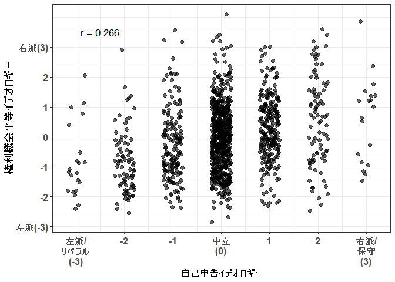

``` r
ggplot() + theme_void()
p12cor <- arrangeGrob(p12cor_1 + xlab(NULL) + ylab(NULL) + ggtitle("外交安全保障"),
                 p12cor_2 + xlab(NULL) + ylab(NULL) + ggtitle("権利機会平等"), 
                 nrow=1, left="争点態度イデオロギー",
                 bottom="自己申告イデオロギー")
grid.draw(p12cor)
```

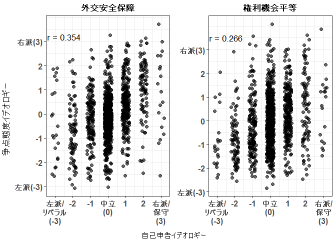

実験群比較
==========

準備
----

``` r
# 統制変数
ctl <- formula( ~ .+ knall + fem + age + lvlen + ownh + 
                  as.factor(edu3) + wk + mar + cld)

# 予測値計算用データ
preddata <- data.frame(g_easing_N = seq(0,5,1))
preddata$knall = median(d$knall,na.rm=TRUE)
preddata$fem = median(d$fem, na.rm=TRUE)
preddata$age = median(d$age, na.rm=TRUE)
preddata$lvlen = median(d$lvlen, na.rm=TRUE)
preddata$ownh = median(d$ownh, na.rm=TRUE)
preddata$edu3 = median(as.numeric(d$edu3)-1, na.rm=TRUE)
preddata$wk = median(d$wk, na.rm=TRUE)
preddata$mar = median(d$mar, na.rm=TRUE)
preddata$cld = median(d$cld, na.rm=TRUE)[1]

# 変数名
vn <- c("（定数項）",
        "1.経済成長",
        "2.経済成長＆貧困削減",
        "3.経済成長＆格差縮小", 
        "4.経済成長＆学者賛成",
        "5.経済成長＆貧困削減＆学者賛成",
        "政治知識","性別（女性）",
        "年齢","居住年数","持ち家",
        "教育：短大／高専／専門学校",
        "教育：大卒以上",
        "就労","婚姻","子ども")
vnx <- c(vn[1:6],"イデオロギー",vn[7:16],
         "イデオロギー×1.成長",
         "イデオロギー×2.成長＆貧困",
         "イデオロギー×3.成長＆格差",
         "イデオロギー×4.成長＆学者",
         "イデオロギー×5.成長＆貧困＆学者",
         "イデオロギー",
         "イデオロギー×1.成長",
         "イデオロギー×2.成長＆貧困",
         "イデオロギー×3.成長＆格差",
         "イデオロギー×4.成長＆学者",
         "イデオロギー×5.成長＆貧困＆学者",
         "イデオロギー",
         "イデオロギー×1.成長",
         "イデオロギー×2.成長＆貧困",
         "イデオロギー×3.成長＆格差",
         "イデオロギー×4.成長＆学者",
         "イデオロギー×5.成長＆貧困＆学者")
vnx2 <- c(vn,vnx[c(7,18:34)])
```

実験刺激の直接効果
------------------

    ## Variable Manipulations: 
    ##    Omitted               Original                          Final
    ##     KEPT            (Intercept)                     （定数項）
    ##     KEPT as.factor(g_easing_N)1                     1.経済成長
    ##     KEPT as.factor(g_easing_N)2           2.経済成長＆貧困削減
    ##     KEPT as.factor(g_easing_N)3           3.経済成長＆格差縮小
    ##     KEPT as.factor(g_easing_N)4           4.経済成長＆学者賛成
    ##     KEPT as.factor(g_easing_N)5 5.経済成長＆貧困削減＆学者賛成
    ##     KEPT                  knall                       政治知識
    ##     KEPT                    fem                   性別（女性）
    ##     KEPT                    age                           年齢
    ##     KEPT                  lvlen                       居住年数
    ##     KEPT                   ownh                         持ち家
    ##     KEPT       as.factor(edu3)1     教育：短大／高専／専門学校
    ##     KEPT       as.factor(edu3)2                 教育：大卒以上
    ##     KEPT                     wk                           就労
    ##     KEPT                    mar                           婚姻
    ##     KEPT                    cld                         子ども

    ## The table was written to the file '../out/basetab.tex'.

    ## 
    ## ======================================
    ##                   基本モデル               
    ## --------------------------------------
    ## （定数項）                1.131 (0.204) ***
    ## 1.経済成長               0.130 (0.129)    
    ## 2.経済成長＆貧困削減          0.287 (0.127) *  
    ## 3.経済成長＆格差縮小          0.077 (0.121)    
    ## 4.経済成長＆学者賛成          0.137 (0.122)    
    ## 5.経済成長＆貧困削減＆学者賛成     0.368 (0.120) ** 
    ## 政治知識                 0.235 (0.143)    
    ## 性別（女性）              -0.317 (0.079) ***
    ## 年齢                  -0.008 (0.004) *  
    ## 居住年数                -0.058 (0.030) +  
    ## 持ち家                 -0.002 (0.081)    
    ## 教育：短大／高専／専門学校        0.145 (0.124)    
    ## 教育：大卒以上              0.102 (0.101)    
    ## 就労                  -0.005 (0.082)    
    ## 婚姻                  -0.106 (0.111)    
    ## 子ども                  0.222 (0.112) *  
    ## --------------------------------------
    ## R^2                  0.045            
    ## Adj. R^2             0.032            
    ## Num. obs.         1123                
    ## RMSE                 1.203            
    ## ======================================
    ## *** p < 0.001, ** p < 0.01, * p < 0.05, + p < 0.1 最小二乗法による重回帰分析、ロバスト標準誤差使用．

    ## 
    ## t test of coefficients:
    ## 
    ##                          Estimate Std. Error t value  Pr(>|t|)    
    ## (Intercept)             1.1313224  0.2036217  5.5560 3.456e-08 ***
    ## as.factor(g_easing_N)1  0.1300488  0.1288959  1.0089  0.313222    
    ## as.factor(g_easing_N)2  0.2869094  0.1265187  2.2677  0.023538 *  
    ## as.factor(g_easing_N)3  0.0773386  0.1210506  0.6389  0.523023    
    ## as.factor(g_easing_N)4  0.1369104  0.1222046  1.1203  0.262813    
    ## as.factor(g_easing_N)5  0.3677372  0.1201467  3.0607  0.002261 ** 
    ## knall                   0.2349404  0.1430947  1.6419  0.100905    
    ## fem                    -0.3172302  0.0787000 -4.0309 5.937e-05 ***
    ## age                    -0.0077677  0.0037568 -2.0676  0.038906 *  
    ## lvlen                  -0.0577694  0.0295857 -1.9526  0.051117 .  
    ## ownh                   -0.0018423  0.0814593 -0.0226  0.981960    
    ## as.factor(edu3)1        0.1447129  0.1237378  1.1695  0.242449    
    ## as.factor(edu3)2        0.1020382  0.1012407  1.0079  0.313734    
    ## wk                     -0.0047382  0.0820897 -0.0577  0.953982    
    ## mar                    -0.1057500  0.1108700 -0.9538  0.340383    
    ## cld                     0.2222635  0.1117271  1.9893  0.046909 *  
    ## ---
    ## Signif. codes:  0 '***' 0.001 '**' 0.01 '*' 0.05 '.' 0.1 ' ' 1

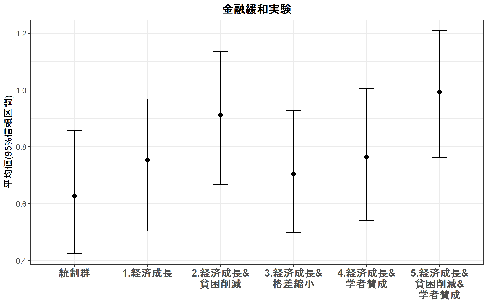

``` r
ggsave("../out/expres.png", p, width=8, height=5)
```

自己申告イデオロギー条件付け
----------------------------

``` r
mx_easing <- lm(update(easing_opi ~ factor(g_easing_N,levels=c("1","0","2","3","4","5"))*ide_self,ctl), data=d)
coeftest(mx_easing, vcovHC(mx_easing, "HC1"))
```

    ## 
    ## t test of coefficients:
    ## 
    ##                                                                          Estimate
    ## (Intercept)                                                             1.2582910
    ## factor(g_easing_N, levels = c("1", "0", "2", "3", "4", "5"))0          -0.1217739
    ## factor(g_easing_N, levels = c("1", "0", "2", "3", "4", "5"))2           0.1598691
    ## factor(g_easing_N, levels = c("1", "0", "2", "3", "4", "5"))3          -0.0357833
    ## factor(g_easing_N, levels = c("1", "0", "2", "3", "4", "5"))4           0.0142494
    ## factor(g_easing_N, levels = c("1", "0", "2", "3", "4", "5"))5           0.2570982
    ## ide_self                                                                0.1946088
    ## knall                                                                   0.2228342
    ## fem                                                                    -0.2881165
    ## age                                                                    -0.0081679
    ## lvlen                                                                  -0.0592958
    ## ownh                                                                   -0.0024912
    ## as.factor(edu3)1                                                        0.1324656
    ## as.factor(edu3)2                                                        0.0847187
    ## wk                                                                      0.0125461
    ## mar                                                                    -0.1096521
    ## cld                                                                     0.2018877
    ## factor(g_easing_N, levels = c("1", "0", "2", "3", "4", "5"))0:ide_self -0.0313469
    ## factor(g_easing_N, levels = c("1", "0", "2", "3", "4", "5"))2:ide_self  0.0172544
    ## factor(g_easing_N, levels = c("1", "0", "2", "3", "4", "5"))3:ide_self -0.1413967
    ## factor(g_easing_N, levels = c("1", "0", "2", "3", "4", "5"))4:ide_self -0.0100863
    ## factor(g_easing_N, levels = c("1", "0", "2", "3", "4", "5"))5:ide_self -0.3059107
    ##                                                                        Std. Error
    ## (Intercept)                                                             0.2023844
    ## factor(g_easing_N, levels = c("1", "0", "2", "3", "4", "5"))0           0.1291375
    ## factor(g_easing_N, levels = c("1", "0", "2", "3", "4", "5"))2           0.1347810
    ## factor(g_easing_N, levels = c("1", "0", "2", "3", "4", "5"))3           0.1300826
    ## factor(g_easing_N, levels = c("1", "0", "2", "3", "4", "5"))4           0.1296460
    ## factor(g_easing_N, levels = c("1", "0", "2", "3", "4", "5"))5           0.1295483
    ## ide_self                                                                0.0887801
    ## knall                                                                   0.1405112
    ## fem                                                                     0.0788624
    ## age                                                                     0.0037199
    ## lvlen                                                                   0.0293817
    ## ownh                                                                    0.0807404
    ## as.factor(edu3)1                                                        0.1244099
    ## as.factor(edu3)2                                                        0.1001255
    ## wk                                                                      0.0815922
    ## mar                                                                     0.1085470
    ## cld                                                                     0.1089845
    ## factor(g_easing_N, levels = c("1", "0", "2", "3", "4", "5"))0:ide_self  0.1224024
    ## factor(g_easing_N, levels = c("1", "0", "2", "3", "4", "5"))2:ide_self  0.1212379
    ## factor(g_easing_N, levels = c("1", "0", "2", "3", "4", "5"))3:ide_self  0.1238582
    ## factor(g_easing_N, levels = c("1", "0", "2", "3", "4", "5"))4:ide_self  0.1147675
    ## factor(g_easing_N, levels = c("1", "0", "2", "3", "4", "5"))5:ide_self  0.1243035
    ##                                                                        t value
    ## (Intercept)                                                             6.2173
    ## factor(g_easing_N, levels = c("1", "0", "2", "3", "4", "5"))0          -0.9430
    ## factor(g_easing_N, levels = c("1", "0", "2", "3", "4", "5"))2           1.1861
    ## factor(g_easing_N, levels = c("1", "0", "2", "3", "4", "5"))3          -0.2751
    ## factor(g_easing_N, levels = c("1", "0", "2", "3", "4", "5"))4           0.1099
    ## factor(g_easing_N, levels = c("1", "0", "2", "3", "4", "5"))5           1.9846
    ## ide_self                                                                2.1920
    ## knall                                                                   1.5859
    ## fem                                                                    -3.6534
    ## age                                                                    -2.1958
    ## lvlen                                                                  -2.0181
    ## ownh                                                                   -0.0309
    ## as.factor(edu3)1                                                        1.0648
    ## as.factor(edu3)2                                                        0.8461
    ## wk                                                                      0.1538
    ## mar                                                                    -1.0102
    ## cld                                                                     1.8524
    ## factor(g_easing_N, levels = c("1", "0", "2", "3", "4", "5"))0:ide_self -0.2561
    ## factor(g_easing_N, levels = c("1", "0", "2", "3", "4", "5"))2:ide_self  0.1423
    ## factor(g_easing_N, levels = c("1", "0", "2", "3", "4", "5"))3:ide_self -1.1416
    ## factor(g_easing_N, levels = c("1", "0", "2", "3", "4", "5"))4:ide_self -0.0879
    ## factor(g_easing_N, levels = c("1", "0", "2", "3", "4", "5"))5:ide_self -2.4610
    ##                                                                         Pr(>|t|)
    ## (Intercept)                                                            7.166e-10
    ## factor(g_easing_N, levels = c("1", "0", "2", "3", "4", "5"))0           0.345899
    ## factor(g_easing_N, levels = c("1", "0", "2", "3", "4", "5"))2           0.235823
    ## factor(g_easing_N, levels = c("1", "0", "2", "3", "4", "5"))3           0.783305
    ## factor(g_easing_N, levels = c("1", "0", "2", "3", "4", "5"))4           0.912501
    ## factor(g_easing_N, levels = c("1", "0", "2", "3", "4", "5"))5           0.047440
    ## ide_self                                                                0.028586
    ## knall                                                                   0.113053
    ## fem                                                                     0.000271
    ## age                                                                     0.028317
    ## lvlen                                                                   0.043821
    ## ownh                                                                    0.975391
    ## as.factor(edu3)1                                                        0.287222
    ## as.factor(edu3)2                                                        0.397667
    ## wk                                                                      0.877822
    ## mar                                                                     0.312631
    ## cld                                                                     0.064230
    ## factor(g_easing_N, levels = c("1", "0", "2", "3", "4", "5"))0:ide_self  0.797924
    ## factor(g_easing_N, levels = c("1", "0", "2", "3", "4", "5"))2:ide_self  0.886854
    ## factor(g_easing_N, levels = c("1", "0", "2", "3", "4", "5"))3:ide_self  0.253868
    ## factor(g_easing_N, levels = c("1", "0", "2", "3", "4", "5"))4:ide_self  0.929985
    ## factor(g_easing_N, levels = c("1", "0", "2", "3", "4", "5"))5:ide_self  0.014008
    ##                                                                           
    ## (Intercept)                                                            ***
    ## factor(g_easing_N, levels = c("1", "0", "2", "3", "4", "5"))0             
    ## factor(g_easing_N, levels = c("1", "0", "2", "3", "4", "5"))2             
    ## factor(g_easing_N, levels = c("1", "0", "2", "3", "4", "5"))3             
    ## factor(g_easing_N, levels = c("1", "0", "2", "3", "4", "5"))4             
    ## factor(g_easing_N, levels = c("1", "0", "2", "3", "4", "5"))5          *  
    ## ide_self                                                               *  
    ## knall                                                                     
    ## fem                                                                    ***
    ## age                                                                    *  
    ## lvlen                                                                  *  
    ## ownh                                                                      
    ## as.factor(edu3)1                                                          
    ## as.factor(edu3)2                                                          
    ## wk                                                                        
    ## mar                                                                       
    ## cld                                                                    .  
    ## factor(g_easing_N, levels = c("1", "0", "2", "3", "4", "5"))0:ide_self    
    ## factor(g_easing_N, levels = c("1", "0", "2", "3", "4", "5"))2:ide_self    
    ## factor(g_easing_N, levels = c("1", "0", "2", "3", "4", "5"))3:ide_self    
    ## factor(g_easing_N, levels = c("1", "0", "2", "3", "4", "5"))4:ide_self    
    ## factor(g_easing_N, levels = c("1", "0", "2", "3", "4", "5"))5:ide_self *  
    ## ---
    ## Signif. codes:  0 '***' 0.001 '**' 0.01 '*' 0.05 '.' 0.1 ' ' 1

``` r
m1h3a <- mx_easing
mx_easing <- lm(update(easing_opi ~ factor(g_easing_N,levels=c("2","0","1","3","4","5"))*ide_self,ctl), data=d)
coeftest(mx_easing, vcovHC(mx_easing, "HC1"))
```

    ## 
    ## t test of coefficients:
    ## 
    ##                                                                          Estimate
    ## (Intercept)                                                             1.4181601
    ## factor(g_easing_N, levels = c("2", "0", "1", "3", "4", "5"))0          -0.2816430
    ## factor(g_easing_N, levels = c("2", "0", "1", "3", "4", "5"))1          -0.1598691
    ## factor(g_easing_N, levels = c("2", "0", "1", "3", "4", "5"))3          -0.1956524
    ## factor(g_easing_N, levels = c("2", "0", "1", "3", "4", "5"))4          -0.1456197
    ## factor(g_easing_N, levels = c("2", "0", "1", "3", "4", "5"))5           0.0972291
    ## ide_self                                                                0.2118632
    ## knall                                                                   0.2228342
    ## fem                                                                    -0.2881165
    ## age                                                                    -0.0081679
    ## lvlen                                                                  -0.0592958
    ## ownh                                                                   -0.0024912
    ## as.factor(edu3)1                                                        0.1324656
    ## as.factor(edu3)2                                                        0.0847187
    ## wk                                                                      0.0125461
    ## mar                                                                    -0.1096521
    ## cld                                                                     0.2018877
    ## factor(g_easing_N, levels = c("2", "0", "1", "3", "4", "5"))0:ide_self -0.0486013
    ## factor(g_easing_N, levels = c("2", "0", "1", "3", "4", "5"))1:ide_self -0.0172544
    ## factor(g_easing_N, levels = c("2", "0", "1", "3", "4", "5"))3:ide_self -0.1586511
    ## factor(g_easing_N, levels = c("2", "0", "1", "3", "4", "5"))4:ide_self -0.0273407
    ## factor(g_easing_N, levels = c("2", "0", "1", "3", "4", "5"))5:ide_self -0.3231651
    ##                                                                        Std. Error
    ## (Intercept)                                                             0.2049621
    ## factor(g_easing_N, levels = c("2", "0", "1", "3", "4", "5"))0           0.1256109
    ## factor(g_easing_N, levels = c("2", "0", "1", "3", "4", "5"))1           0.1347810
    ## factor(g_easing_N, levels = c("2", "0", "1", "3", "4", "5"))3           0.1267579
    ## factor(g_easing_N, levels = c("2", "0", "1", "3", "4", "5"))4           0.1251326
    ## factor(g_easing_N, levels = c("2", "0", "1", "3", "4", "5"))5           0.1242382
    ## ide_self                                                                0.0831209
    ## knall                                                                   0.1405112
    ## fem                                                                     0.0788624
    ## age                                                                     0.0037199
    ## lvlen                                                                   0.0293817
    ## ownh                                                                    0.0807404
    ## as.factor(edu3)1                                                        0.1244099
    ## as.factor(edu3)2                                                        0.1001255
    ## wk                                                                      0.0815922
    ## mar                                                                     0.1085470
    ## cld                                                                     0.1089845
    ## factor(g_easing_N, levels = c("2", "0", "1", "3", "4", "5"))0:ide_self  0.1181499
    ## factor(g_easing_N, levels = c("2", "0", "1", "3", "4", "5"))1:ide_self  0.1212379
    ## factor(g_easing_N, levels = c("2", "0", "1", "3", "4", "5"))3:ide_self  0.1202218
    ## factor(g_easing_N, levels = c("2", "0", "1", "3", "4", "5"))4:ide_self  0.1108642
    ## factor(g_easing_N, levels = c("2", "0", "1", "3", "4", "5"))5:ide_self  0.1204686
    ##                                                                        t value
    ## (Intercept)                                                             6.9191
    ## factor(g_easing_N, levels = c("2", "0", "1", "3", "4", "5"))0          -2.2422
    ## factor(g_easing_N, levels = c("2", "0", "1", "3", "4", "5"))1          -1.1861
    ## factor(g_easing_N, levels = c("2", "0", "1", "3", "4", "5"))3          -1.5435
    ## factor(g_easing_N, levels = c("2", "0", "1", "3", "4", "5"))4          -1.1637
    ## factor(g_easing_N, levels = c("2", "0", "1", "3", "4", "5"))5           0.7826
    ## ide_self                                                                2.5489
    ## knall                                                                   1.5859
    ## fem                                                                    -3.6534
    ## age                                                                    -2.1958
    ## lvlen                                                                  -2.0181
    ## ownh                                                                   -0.0309
    ## as.factor(edu3)1                                                        1.0648
    ## as.factor(edu3)2                                                        0.8461
    ## wk                                                                      0.1538
    ## mar                                                                    -1.0102
    ## cld                                                                     1.8524
    ## factor(g_easing_N, levels = c("2", "0", "1", "3", "4", "5"))0:ide_self -0.4114
    ## factor(g_easing_N, levels = c("2", "0", "1", "3", "4", "5"))1:ide_self -0.1423
    ## factor(g_easing_N, levels = c("2", "0", "1", "3", "4", "5"))3:ide_self -1.3197
    ## factor(g_easing_N, levels = c("2", "0", "1", "3", "4", "5"))4:ide_self -0.2466
    ## factor(g_easing_N, levels = c("2", "0", "1", "3", "4", "5"))5:ide_self -2.6826
    ##                                                                         Pr(>|t|)
    ## (Intercept)                                                            7.696e-12
    ## factor(g_easing_N, levels = c("2", "0", "1", "3", "4", "5"))0           0.025148
    ## factor(g_easing_N, levels = c("2", "0", "1", "3", "4", "5"))1           0.235823
    ## factor(g_easing_N, levels = c("2", "0", "1", "3", "4", "5"))3           0.122994
    ## factor(g_easing_N, levels = c("2", "0", "1", "3", "4", "5"))4           0.244788
    ## factor(g_easing_N, levels = c("2", "0", "1", "3", "4", "5"))5           0.434029
    ## ide_self                                                                0.010942
    ## knall                                                                   0.113053
    ## fem                                                                     0.000271
    ## age                                                                     0.028317
    ## lvlen                                                                   0.043821
    ## ownh                                                                    0.975391
    ## as.factor(edu3)1                                                        0.287222
    ## as.factor(edu3)2                                                        0.397667
    ## wk                                                                      0.877822
    ## mar                                                                     0.312631
    ## cld                                                                     0.064230
    ## factor(g_easing_N, levels = c("2", "0", "1", "3", "4", "5"))0:ide_self  0.680894
    ## factor(g_easing_N, levels = c("2", "0", "1", "3", "4", "5"))1:ide_self  0.886854
    ## factor(g_easing_N, levels = c("2", "0", "1", "3", "4", "5"))3:ide_self  0.187225
    ## factor(g_easing_N, levels = c("2", "0", "1", "3", "4", "5"))4:ide_self  0.805253
    ## factor(g_easing_N, levels = c("2", "0", "1", "3", "4", "5"))5:ide_self  0.007415
    ##                                                                           
    ## (Intercept)                                                            ***
    ## factor(g_easing_N, levels = c("2", "0", "1", "3", "4", "5"))0          *  
    ## factor(g_easing_N, levels = c("2", "0", "1", "3", "4", "5"))1             
    ## factor(g_easing_N, levels = c("2", "0", "1", "3", "4", "5"))3             
    ## factor(g_easing_N, levels = c("2", "0", "1", "3", "4", "5"))4             
    ## factor(g_easing_N, levels = c("2", "0", "1", "3", "4", "5"))5             
    ## ide_self                                                               *  
    ## knall                                                                     
    ## fem                                                                    ***
    ## age                                                                    *  
    ## lvlen                                                                  *  
    ## ownh                                                                      
    ## as.factor(edu3)1                                                          
    ## as.factor(edu3)2                                                          
    ## wk                                                                        
    ## mar                                                                       
    ## cld                                                                    .  
    ## factor(g_easing_N, levels = c("2", "0", "1", "3", "4", "5"))0:ide_self    
    ## factor(g_easing_N, levels = c("2", "0", "1", "3", "4", "5"))1:ide_self    
    ## factor(g_easing_N, levels = c("2", "0", "1", "3", "4", "5"))3:ide_self    
    ## factor(g_easing_N, levels = c("2", "0", "1", "3", "4", "5"))4:ide_self    
    ## factor(g_easing_N, levels = c("2", "0", "1", "3", "4", "5"))5:ide_self ** 
    ## ---
    ## Signif. codes:  0 '***' 0.001 '**' 0.01 '*' 0.05 '.' 0.1 ' ' 1

``` r
m1h3b <- mx_easing
mx_easing <- lm(update(easing_opi ~ as.factor(g_easing_N)*ide_self,ctl), data=d)
m1 <- mx_easing
coeftest(mx_easing, vcovHC(mx_easing, "HC1"))
```

    ## 
    ## t test of coefficients:
    ## 
    ##                                   Estimate Std. Error t value  Pr(>|t|)
    ## (Intercept)                      1.1365171  0.2033221  5.5897 2.866e-08
    ## as.factor(g_easing_N)1           0.1217739  0.1291375  0.9430  0.345899
    ## as.factor(g_easing_N)2           0.2816430  0.1256109  2.2422  0.025148
    ## as.factor(g_easing_N)3           0.0859906  0.1214760  0.7079  0.479169
    ## as.factor(g_easing_N)4           0.1360233  0.1210416  1.1238  0.261354
    ## as.factor(g_easing_N)5           0.3788721  0.1191029  3.1810  0.001508
    ## ide_self                         0.1632619  0.0845884  1.9301  0.053854
    ## knall                            0.2228342  0.1405112  1.5859  0.113053
    ## fem                             -0.2881165  0.0788624 -3.6534  0.000271
    ## age                             -0.0081679  0.0037199 -2.1958  0.028317
    ## lvlen                           -0.0592958  0.0293817 -2.0181  0.043821
    ## ownh                            -0.0024912  0.0807404 -0.0309  0.975391
    ## as.factor(edu3)1                 0.1324656  0.1244099  1.0648  0.287222
    ## as.factor(edu3)2                 0.0847187  0.1001255  0.8461  0.397667
    ## wk                               0.0125461  0.0815922  0.1538  0.877822
    ## mar                             -0.1096521  0.1085470 -1.0102  0.312631
    ## cld                              0.2018877  0.1089845  1.8524  0.064230
    ## as.factor(g_easing_N)1:ide_self  0.0313469  0.1224024  0.2561  0.797924
    ## as.factor(g_easing_N)2:ide_self  0.0486013  0.1181499  0.4114  0.680894
    ## as.factor(g_easing_N)3:ide_self -0.1100498  0.1210688 -0.9090  0.363557
    ## as.factor(g_easing_N)4:ide_self  0.0212607  0.1115399  0.1906  0.848866
    ## as.factor(g_easing_N)5:ide_self -0.2745638  0.1226836 -2.2380  0.025422
    ##                                    
    ## (Intercept)                     ***
    ## as.factor(g_easing_N)1             
    ## as.factor(g_easing_N)2          *  
    ## as.factor(g_easing_N)3             
    ## as.factor(g_easing_N)4             
    ## as.factor(g_easing_N)5          ** 
    ## ide_self                        .  
    ## knall                              
    ## fem                             ***
    ## age                             *  
    ## lvlen                           *  
    ## ownh                               
    ## as.factor(edu3)1                   
    ## as.factor(edu3)2                   
    ## wk                                 
    ## mar                                
    ## cld                             .  
    ## as.factor(g_easing_N)1:ide_self    
    ## as.factor(g_easing_N)2:ide_self    
    ## as.factor(g_easing_N)3:ide_self    
    ## as.factor(g_easing_N)4:ide_self    
    ## as.factor(g_easing_N)5:ide_self *  
    ## ---
    ## Signif. codes:  0 '***' 0.001 '**' 0.01 '*' 0.05 '.' 0.1 ' ' 1

``` r
preddatax <- rbind(preddata,preddata,preddata)
preddatax$ide_self <- rep(c(-2,0,2), each=6)
pr <- simu_pred(mx_easing, profile=preddatax, vcov.est = "robust")

prx_easing <- data.frame(t = factor(rep(pr_easing$t_jp,3),levels=pr_easing$t_jp),
                         Ideology = factor(rep(c("左派(-2)","中立(0)","右派(2)"), each=6),
                                           levels=c("左派(-2)","中立(0)","右派(2)")),
                         pr = pr$predsum$Mean,
                         loCI = pr$predsum$lowerCI,
                         upCI = pr$predsum$upperCI)
```

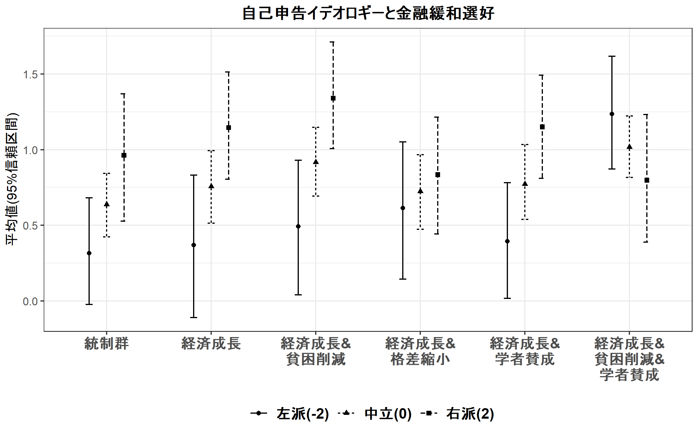

``` r
ggsave("../out/expres_self.png", p, width=8, height=5)
```

争点態度イデオロギー条件付け
----------------------------

``` r
mx_easing <- lm(update(easing_opi ~ factor(g_easing_N,levels=c("1","0","2","3","4","5"))*ide_iss_1,ctl), data=d)
coeftest(mx_easing, vcovHC(mx_easing, "HC1"))
```

    ## 
    ## t test of coefficients:
    ## 
    ##                                                                           Estimate
    ## (Intercept)                                                              1.1503083
    ## factor(g_easing_N, levels = c("1", "0", "2", "3", "4", "5"))0           -0.1506610
    ## factor(g_easing_N, levels = c("1", "0", "2", "3", "4", "5"))2            0.1549137
    ## factor(g_easing_N, levels = c("1", "0", "2", "3", "4", "5"))3           -0.0295300
    ## factor(g_easing_N, levels = c("1", "0", "2", "3", "4", "5"))4            0.0066279
    ## factor(g_easing_N, levels = c("1", "0", "2", "3", "4", "5"))5            0.2515006
    ## ide_iss_1                                                                0.4417231
    ## knall                                                                    0.1764224
    ## fem                                                                     -0.1870846
    ## age                                                                     -0.0059227
    ## lvlen                                                                   -0.0521220
    ## ownh                                                                    -0.0194330
    ## as.factor(edu3)1                                                         0.1361236
    ## as.factor(edu3)2                                                         0.1373802
    ## wk                                                                      -0.0185465
    ## mar                                                                     -0.1648048
    ## cld                                                                      0.2404459
    ## factor(g_easing_N, levels = c("1", "0", "2", "3", "4", "5"))0:ide_iss_1 -0.0887475
    ## factor(g_easing_N, levels = c("1", "0", "2", "3", "4", "5"))2:ide_iss_1 -0.0953969
    ## factor(g_easing_N, levels = c("1", "0", "2", "3", "4", "5"))3:ide_iss_1 -0.2881421
    ## factor(g_easing_N, levels = c("1", "0", "2", "3", "4", "5"))4:ide_iss_1 -0.1211718
    ## factor(g_easing_N, levels = c("1", "0", "2", "3", "4", "5"))5:ide_iss_1 -0.2954941
    ##                                                                         Std. Error
    ## (Intercept)                                                              0.1928159
    ## factor(g_easing_N, levels = c("1", "0", "2", "3", "4", "5"))0            0.1214018
    ## factor(g_easing_N, levels = c("1", "0", "2", "3", "4", "5"))2            0.1278375
    ## factor(g_easing_N, levels = c("1", "0", "2", "3", "4", "5"))3            0.1227925
    ## factor(g_easing_N, levels = c("1", "0", "2", "3", "4", "5"))4            0.1224537
    ## factor(g_easing_N, levels = c("1", "0", "2", "3", "4", "5"))5            0.1247937
    ## ide_iss_1                                                                0.1001428
    ## knall                                                                    0.1360963
    ## fem                                                                      0.0787808
    ## age                                                                      0.0035609
    ## lvlen                                                                    0.0279204
    ## ownh                                                                     0.0778092
    ## as.factor(edu3)1                                                         0.1215504
    ## as.factor(edu3)2                                                         0.0972100
    ## wk                                                                       0.0792312
    ## mar                                                                      0.1070041
    ## cld                                                                      0.1069265
    ## factor(g_easing_N, levels = c("1", "0", "2", "3", "4", "5"))0:ide_iss_1  0.1259273
    ## factor(g_easing_N, levels = c("1", "0", "2", "3", "4", "5"))2:ide_iss_1  0.1303646
    ## factor(g_easing_N, levels = c("1", "0", "2", "3", "4", "5"))3:ide_iss_1  0.1340447
    ## factor(g_easing_N, levels = c("1", "0", "2", "3", "4", "5"))4:ide_iss_1  0.1228783
    ## factor(g_easing_N, levels = c("1", "0", "2", "3", "4", "5"))5:ide_iss_1  0.1264154
    ##                                                                         t value
    ## (Intercept)                                                              5.9658
    ## factor(g_easing_N, levels = c("1", "0", "2", "3", "4", "5"))0           -1.2410
    ## factor(g_easing_N, levels = c("1", "0", "2", "3", "4", "5"))2            1.2118
    ## factor(g_easing_N, levels = c("1", "0", "2", "3", "4", "5"))3           -0.2405
    ## factor(g_easing_N, levels = c("1", "0", "2", "3", "4", "5"))4            0.0541
    ## factor(g_easing_N, levels = c("1", "0", "2", "3", "4", "5"))5            2.0153
    ## ide_iss_1                                                                4.4109
    ## knall                                                                    1.2963
    ## fem                                                                     -2.3747
    ## age                                                                     -1.6633
    ## lvlen                                                                   -1.8668
    ## ownh                                                                    -0.2498
    ## as.factor(edu3)1                                                         1.1199
    ## as.factor(edu3)2                                                         1.4132
    ## wk                                                                      -0.2341
    ## mar                                                                     -1.5402
    ## cld                                                                      2.2487
    ## factor(g_easing_N, levels = c("1", "0", "2", "3", "4", "5"))0:ide_iss_1 -0.7048
    ## factor(g_easing_N, levels = c("1", "0", "2", "3", "4", "5"))2:ide_iss_1 -0.7318
    ## factor(g_easing_N, levels = c("1", "0", "2", "3", "4", "5"))3:ide_iss_1 -2.1496
    ## factor(g_easing_N, levels = c("1", "0", "2", "3", "4", "5"))4:ide_iss_1 -0.9861
    ## factor(g_easing_N, levels = c("1", "0", "2", "3", "4", "5"))5:ide_iss_1 -2.3375
    ##                                                                          Pr(>|t|)
    ## (Intercept)                                                             3.276e-09
    ## factor(g_easing_N, levels = c("1", "0", "2", "3", "4", "5"))0             0.21487
    ## factor(g_easing_N, levels = c("1", "0", "2", "3", "4", "5"))2             0.22585
    ## factor(g_easing_N, levels = c("1", "0", "2", "3", "4", "5"))3             0.81000
    ## factor(g_easing_N, levels = c("1", "0", "2", "3", "4", "5"))4             0.95684
    ## factor(g_easing_N, levels = c("1", "0", "2", "3", "4", "5"))5             0.04411
    ## ide_iss_1                                                               1.130e-05
    ## knall                                                                     0.19514
    ## fem                                                                       0.01773
    ## age                                                                       0.09654
    ## lvlen                                                                     0.06219
    ## ownh                                                                      0.80283
    ## as.factor(edu3)1                                                          0.26300
    ## as.factor(edu3)2                                                          0.15787
    ## wk                                                                        0.81497
    ## mar                                                                       0.12381
    ## cld                                                                       0.02473
    ## factor(g_easing_N, levels = c("1", "0", "2", "3", "4", "5"))0:ide_iss_1   0.48111
    ## factor(g_easing_N, levels = c("1", "0", "2", "3", "4", "5"))2:ide_iss_1   0.46446
    ## factor(g_easing_N, levels = c("1", "0", "2", "3", "4", "5"))3:ide_iss_1   0.03180
    ## factor(g_easing_N, levels = c("1", "0", "2", "3", "4", "5"))4:ide_iss_1   0.32429
    ## factor(g_easing_N, levels = c("1", "0", "2", "3", "4", "5"))5:ide_iss_1   0.01959
    ##                                                                            
    ## (Intercept)                                                             ***
    ## factor(g_easing_N, levels = c("1", "0", "2", "3", "4", "5"))0              
    ## factor(g_easing_N, levels = c("1", "0", "2", "3", "4", "5"))2              
    ## factor(g_easing_N, levels = c("1", "0", "2", "3", "4", "5"))3              
    ## factor(g_easing_N, levels = c("1", "0", "2", "3", "4", "5"))4              
    ## factor(g_easing_N, levels = c("1", "0", "2", "3", "4", "5"))5           *  
    ## ide_iss_1                                                               ***
    ## knall                                                                      
    ## fem                                                                     *  
    ## age                                                                     .  
    ## lvlen                                                                   .  
    ## ownh                                                                       
    ## as.factor(edu3)1                                                           
    ## as.factor(edu3)2                                                           
    ## wk                                                                         
    ## mar                                                                        
    ## cld                                                                     *  
    ## factor(g_easing_N, levels = c("1", "0", "2", "3", "4", "5"))0:ide_iss_1    
    ## factor(g_easing_N, levels = c("1", "0", "2", "3", "4", "5"))2:ide_iss_1    
    ## factor(g_easing_N, levels = c("1", "0", "2", "3", "4", "5"))3:ide_iss_1 *  
    ## factor(g_easing_N, levels = c("1", "0", "2", "3", "4", "5"))4:ide_iss_1    
    ## factor(g_easing_N, levels = c("1", "0", "2", "3", "4", "5"))5:ide_iss_1 *  
    ## ---
    ## Signif. codes:  0 '***' 0.001 '**' 0.01 '*' 0.05 '.' 0.1 ' ' 1

``` r
m2h3a_1 <- mx_easing
mx_easing <- lm(update(easing_opi ~ factor(g_easing_N,levels=c("2","0","1","3","4","5"))*ide_iss_1,ctl), data=d)
coeftest(mx_easing, vcovHC(mx_easing, "HC1"))
```

    ## 
    ## t test of coefficients:
    ## 
    ##                                                                           Estimate
    ## (Intercept)                                                              1.3052220
    ## factor(g_easing_N, levels = c("2", "0", "1", "3", "4", "5"))0           -0.3055746
    ## factor(g_easing_N, levels = c("2", "0", "1", "3", "4", "5"))1           -0.1549137
    ## factor(g_easing_N, levels = c("2", "0", "1", "3", "4", "5"))3           -0.1844437
    ## factor(g_easing_N, levels = c("2", "0", "1", "3", "4", "5"))4           -0.1482857
    ## factor(g_easing_N, levels = c("2", "0", "1", "3", "4", "5"))5            0.0965869
    ## ide_iss_1                                                                0.3463262
    ## knall                                                                    0.1764224
    ## fem                                                                     -0.1870846
    ## age                                                                     -0.0059227
    ## lvlen                                                                   -0.0521220
    ## ownh                                                                    -0.0194330
    ## as.factor(edu3)1                                                         0.1361236
    ## as.factor(edu3)2                                                         0.1373802
    ## wk                                                                      -0.0185465
    ## mar                                                                     -0.1648048
    ## cld                                                                      0.2404459
    ## factor(g_easing_N, levels = c("2", "0", "1", "3", "4", "5"))0:ide_iss_1  0.0066494
    ## factor(g_easing_N, levels = c("2", "0", "1", "3", "4", "5"))1:ide_iss_1  0.0953969
    ## factor(g_easing_N, levels = c("2", "0", "1", "3", "4", "5"))3:ide_iss_1 -0.1927452
    ## factor(g_easing_N, levels = c("2", "0", "1", "3", "4", "5"))4:ide_iss_1 -0.0257749
    ## factor(g_easing_N, levels = c("2", "0", "1", "3", "4", "5"))5:ide_iss_1 -0.2000972
    ##                                                                         Std. Error
    ## (Intercept)                                                              0.1965319
    ## factor(g_easing_N, levels = c("2", "0", "1", "3", "4", "5"))0            0.1211658
    ## factor(g_easing_N, levels = c("2", "0", "1", "3", "4", "5"))1            0.1278375
    ## factor(g_easing_N, levels = c("2", "0", "1", "3", "4", "5"))3            0.1221628
    ## factor(g_easing_N, levels = c("2", "0", "1", "3", "4", "5"))4            0.1207646
    ## factor(g_easing_N, levels = c("2", "0", "1", "3", "4", "5"))5            0.1219963
    ## ide_iss_1                                                                0.0845803
    ## knall                                                                    0.1360963
    ## fem                                                                      0.0787808
    ## age                                                                      0.0035609
    ## lvlen                                                                    0.0279204
    ## ownh                                                                     0.0778092
    ## as.factor(edu3)1                                                         0.1215504
    ## as.factor(edu3)2                                                         0.0972100
    ## wk                                                                       0.0792312
    ## mar                                                                      0.1070041
    ## cld                                                                      0.1069265
    ## factor(g_easing_N, levels = c("2", "0", "1", "3", "4", "5"))0:ide_iss_1  0.1143274
    ## factor(g_easing_N, levels = c("2", "0", "1", "3", "4", "5"))1:ide_iss_1  0.1303646
    ## factor(g_easing_N, levels = c("2", "0", "1", "3", "4", "5"))3:ide_iss_1  0.1231581
    ## factor(g_easing_N, levels = c("2", "0", "1", "3", "4", "5"))4:ide_iss_1  0.1110601
    ## factor(g_easing_N, levels = c("2", "0", "1", "3", "4", "5"))5:ide_iss_1  0.1149579
    ##                                                                         t value
    ## (Intercept)                                                              6.6413
    ## factor(g_easing_N, levels = c("2", "0", "1", "3", "4", "5"))0           -2.5220
    ## factor(g_easing_N, levels = c("2", "0", "1", "3", "4", "5"))1           -1.2118
    ## factor(g_easing_N, levels = c("2", "0", "1", "3", "4", "5"))3           -1.5098
    ## factor(g_easing_N, levels = c("2", "0", "1", "3", "4", "5"))4           -1.2279
    ## factor(g_easing_N, levels = c("2", "0", "1", "3", "4", "5"))5            0.7917
    ## ide_iss_1                                                                4.0946
    ## knall                                                                    1.2963
    ## fem                                                                     -2.3747
    ## age                                                                     -1.6633
    ## lvlen                                                                   -1.8668
    ## ownh                                                                    -0.2498
    ## as.factor(edu3)1                                                         1.1199
    ## as.factor(edu3)2                                                         1.4132
    ## wk                                                                      -0.2341
    ## mar                                                                     -1.5402
    ## cld                                                                      2.2487
    ## factor(g_easing_N, levels = c("2", "0", "1", "3", "4", "5"))0:ide_iss_1  0.0582
    ## factor(g_easing_N, levels = c("2", "0", "1", "3", "4", "5"))1:ide_iss_1  0.7318
    ## factor(g_easing_N, levels = c("2", "0", "1", "3", "4", "5"))3:ide_iss_1 -1.5650
    ## factor(g_easing_N, levels = c("2", "0", "1", "3", "4", "5"))4:ide_iss_1 -0.2321
    ## factor(g_easing_N, levels = c("2", "0", "1", "3", "4", "5"))5:ide_iss_1 -1.7406
    ##                                                                          Pr(>|t|)
    ## (Intercept)                                                             4.876e-11
    ## factor(g_easing_N, levels = c("2", "0", "1", "3", "4", "5"))0             0.01181
    ## factor(g_easing_N, levels = c("2", "0", "1", "3", "4", "5"))1             0.22585
    ## factor(g_easing_N, levels = c("2", "0", "1", "3", "4", "5"))3             0.13138
    ## factor(g_easing_N, levels = c("2", "0", "1", "3", "4", "5"))4             0.21975
    ## factor(g_easing_N, levels = c("2", "0", "1", "3", "4", "5"))5             0.42869
    ## ide_iss_1                                                               4.537e-05
    ## knall                                                                     0.19514
    ## fem                                                                       0.01773
    ## age                                                                       0.09654
    ## lvlen                                                                     0.06219
    ## ownh                                                                      0.80283
    ## as.factor(edu3)1                                                          0.26300
    ## as.factor(edu3)2                                                          0.15787
    ## wk                                                                        0.81497
    ## mar                                                                       0.12381
    ## cld                                                                       0.02473
    ## factor(g_easing_N, levels = c("2", "0", "1", "3", "4", "5"))0:ide_iss_1   0.95363
    ## factor(g_easing_N, levels = c("2", "0", "1", "3", "4", "5"))1:ide_iss_1   0.46446
    ## factor(g_easing_N, levels = c("2", "0", "1", "3", "4", "5"))3:ide_iss_1   0.11787
    ## factor(g_easing_N, levels = c("2", "0", "1", "3", "4", "5"))4:ide_iss_1   0.81652
    ## factor(g_easing_N, levels = c("2", "0", "1", "3", "4", "5"))5:ide_iss_1   0.08203
    ##                                                                            
    ## (Intercept)                                                             ***
    ## factor(g_easing_N, levels = c("2", "0", "1", "3", "4", "5"))0           *  
    ## factor(g_easing_N, levels = c("2", "0", "1", "3", "4", "5"))1              
    ## factor(g_easing_N, levels = c("2", "0", "1", "3", "4", "5"))3              
    ## factor(g_easing_N, levels = c("2", "0", "1", "3", "4", "5"))4              
    ## factor(g_easing_N, levels = c("2", "0", "1", "3", "4", "5"))5              
    ## ide_iss_1                                                               ***
    ## knall                                                                      
    ## fem                                                                     *  
    ## age                                                                     .  
    ## lvlen                                                                   .  
    ## ownh                                                                       
    ## as.factor(edu3)1                                                           
    ## as.factor(edu3)2                                                           
    ## wk                                                                         
    ## mar                                                                        
    ## cld                                                                     *  
    ## factor(g_easing_N, levels = c("2", "0", "1", "3", "4", "5"))0:ide_iss_1    
    ## factor(g_easing_N, levels = c("2", "0", "1", "3", "4", "5"))1:ide_iss_1    
    ## factor(g_easing_N, levels = c("2", "0", "1", "3", "4", "5"))3:ide_iss_1    
    ## factor(g_easing_N, levels = c("2", "0", "1", "3", "4", "5"))4:ide_iss_1    
    ## factor(g_easing_N, levels = c("2", "0", "1", "3", "4", "5"))5:ide_iss_1 .  
    ## ---
    ## Signif. codes:  0 '***' 0.001 '**' 0.01 '*' 0.05 '.' 0.1 ' ' 1

``` r
m2h3b_1 <- mx_easing
mx_easing <- lm(update(easing_opi ~ as.factor(g_easing_N)*ide_iss_1,ctl), data=d)
m2_1 <- mx_easing
coeftest(mx_easing, vcovHC(mx_easing, "HC1"))
```

    ## 
    ## t test of coefficients:
    ## 
    ##                                    Estimate Std. Error t value  Pr(>|t|)
    ## (Intercept)                       0.9996473  0.1933705  5.1696 2.785e-07
    ## as.factor(g_easing_N)1            0.1506610  0.1214018  1.2410 0.2148662
    ## as.factor(g_easing_N)2            0.3055746  0.1211658  2.5220 0.0118107
    ## as.factor(g_easing_N)3            0.1211309  0.1159883  1.0443 0.2965586
    ## as.factor(g_easing_N)4            0.1572889  0.1157760  1.3586 0.1745635
    ## as.factor(g_easing_N)5            0.4021616  0.1161925  3.4612 0.0005585
    ## ide_iss_1                         0.3529756  0.0770727  4.5798 5.185e-06
    ## knall                             0.1764224  0.1360963  1.2963 0.1951419
    ## fem                              -0.1870846  0.0787808 -2.3747 0.0177315
    ## age                              -0.0059227  0.0035609 -1.6633 0.0965427
    ## lvlen                            -0.0521220  0.0279204 -1.8668 0.0621946
    ## ownh                             -0.0194330  0.0778092 -0.2498 0.8028254
    ## as.factor(edu3)1                  0.1361236  0.1215504  1.1199 0.2630032
    ## as.factor(edu3)2                  0.1373802  0.0972100  1.4132 0.1578703
    ## wk                               -0.0185465  0.0792312 -0.2341 0.8149661
    ## mar                              -0.1648048  0.1070041 -1.5402 0.1238056
    ## cld                               0.2404459  0.1069265  2.2487 0.0247285
    ## as.factor(g_easing_N)1:ide_iss_1  0.0887475  0.1259273  0.7048 0.4811135
    ## as.factor(g_easing_N)2:ide_iss_1 -0.0066494  0.1143274 -0.0582 0.9536308
    ## as.factor(g_easing_N)3:ide_iss_1 -0.1993946  0.1185787 -1.6815 0.0929420
    ## as.factor(g_easing_N)4:ide_iss_1 -0.0324243  0.1055528 -0.3072 0.7587601
    ## as.factor(g_easing_N)5:ide_iss_1 -0.2067466  0.1109287 -1.8638 0.0626188
    ##                                     
    ## (Intercept)                      ***
    ## as.factor(g_easing_N)1              
    ## as.factor(g_easing_N)2           *  
    ## as.factor(g_easing_N)3              
    ## as.factor(g_easing_N)4              
    ## as.factor(g_easing_N)5           ***
    ## ide_iss_1                        ***
    ## knall                               
    ## fem                              *  
    ## age                              .  
    ## lvlen                            .  
    ## ownh                                
    ## as.factor(edu3)1                    
    ## as.factor(edu3)2                    
    ## wk                                  
    ## mar                                 
    ## cld                              *  
    ## as.factor(g_easing_N)1:ide_iss_1    
    ## as.factor(g_easing_N)2:ide_iss_1    
    ## as.factor(g_easing_N)3:ide_iss_1 .  
    ## as.factor(g_easing_N)4:ide_iss_1    
    ## as.factor(g_easing_N)5:ide_iss_1 .  
    ## ---
    ## Signif. codes:  0 '***' 0.001 '**' 0.01 '*' 0.05 '.' 0.1 ' ' 1

``` r
preddatax <- rbind(preddata,preddata,preddata)
preddatax$ide_iss_1 <- rep(c(-2,0,2), each=6)
pr <- simu_pred(mx_easing, profile=preddatax, vcov.est = "robust")

prx_easing <- data.frame(t = factor(rep(pr_easing$t_jp,3),levels=pr_easing$t_jp),
                         Ideology = factor(rep(c("左派(-2)","中立(0)","右派(2)"), each=6),
                                           levels=c("左派(-2)","中立(0)","右派(2)")),
                         pr = pr$predsum$Mean,
                         loCI = pr$predsum$lowerCI,
                         upCI = pr$predsum$upperCI)
```

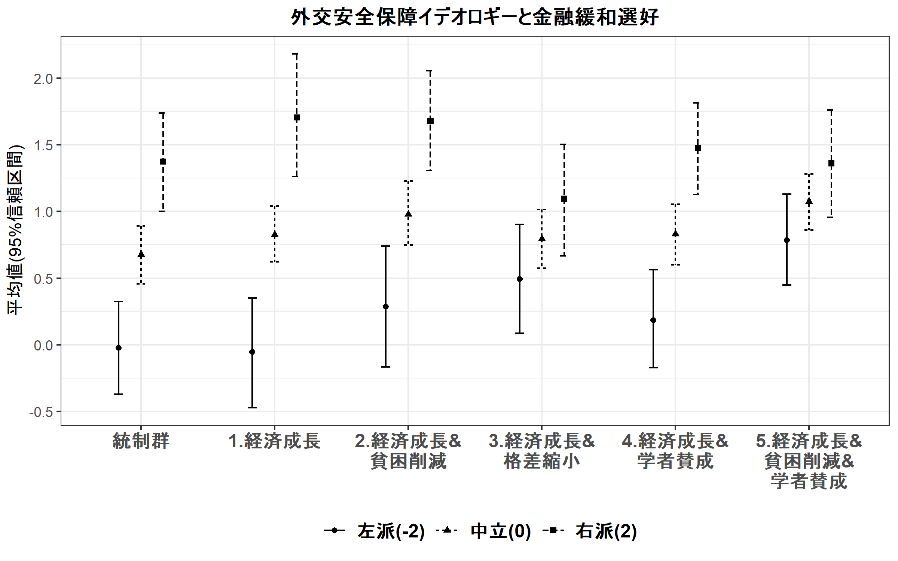

``` r
ggsave("../out/expres_iss_1.png", p, width=8, height=5)
```

``` r
mx_easing <- lm(update(easing_opi ~ factor(g_easing_N,levels=c("1","0","2","3","4","5"))*ide_iss_2,ctl), data=d)
coeftest(mx_easing, vcovHC(mx_easing, "HC1"))
```

    ## 
    ## t test of coefficients:
    ## 
    ##                                                                           Estimate
    ## (Intercept)                                                              1.2213390
    ## factor(g_easing_N, levels = c("1", "0", "2", "3", "4", "5"))0           -0.1477198
    ## factor(g_easing_N, levels = c("1", "0", "2", "3", "4", "5"))2            0.1491795
    ## factor(g_easing_N, levels = c("1", "0", "2", "3", "4", "5"))3           -0.0614906
    ## factor(g_easing_N, levels = c("1", "0", "2", "3", "4", "5"))4            0.0101298
    ## factor(g_easing_N, levels = c("1", "0", "2", "3", "4", "5"))5            0.2434246
    ## ide_iss_2                                                               -0.1329830
    ## knall                                                                    0.2286126
    ## fem                                                                     -0.3543303
    ## age                                                                     -0.0062853
    ## lvlen                                                                   -0.0521809
    ## ownh                                                                     0.0052134
    ## as.factor(edu3)1                                                         0.1376603
    ## as.factor(edu3)2                                                         0.0864609
    ## wk                                                                      -0.0071311
    ## mar                                                                     -0.0921996
    ## cld                                                                      0.2170813
    ## factor(g_easing_N, levels = c("1", "0", "2", "3", "4", "5"))0:ide_iss_2  0.2192920
    ## factor(g_easing_N, levels = c("1", "0", "2", "3", "4", "5"))2:ide_iss_2  0.0078854
    ## factor(g_easing_N, levels = c("1", "0", "2", "3", "4", "5"))3:ide_iss_2  0.0033070
    ## factor(g_easing_N, levels = c("1", "0", "2", "3", "4", "5"))4:ide_iss_2  0.0259839
    ## factor(g_easing_N, levels = c("1", "0", "2", "3", "4", "5"))5:ide_iss_2  0.1785999
    ##                                                                         Std. Error
    ## (Intercept)                                                              0.2026498
    ## factor(g_easing_N, levels = c("1", "0", "2", "3", "4", "5"))0            0.1295894
    ## factor(g_easing_N, levels = c("1", "0", "2", "3", "4", "5"))2            0.1334840
    ## factor(g_easing_N, levels = c("1", "0", "2", "3", "4", "5"))3            0.1272125
    ## factor(g_easing_N, levels = c("1", "0", "2", "3", "4", "5"))4            0.1291306
    ## factor(g_easing_N, levels = c("1", "0", "2", "3", "4", "5"))5            0.1286603
    ## ide_iss_2                                                                0.0983666
    ## knall                                                                    0.1431266
    ## fem                                                                      0.0805000
    ## age                                                                      0.0038883
    ## lvlen                                                                    0.0295235
    ## ownh                                                                     0.0815719
    ## as.factor(edu3)1                                                         0.1239043
    ## as.factor(edu3)2                                                         0.1020790
    ## wk                                                                       0.0821571
    ## mar                                                                      0.1105544
    ## cld                                                                      0.1114239
    ## factor(g_easing_N, levels = c("1", "0", "2", "3", "4", "5"))0:ide_iss_2  0.1197580
    ## factor(g_easing_N, levels = c("1", "0", "2", "3", "4", "5"))2:ide_iss_2  0.1223779
    ## factor(g_easing_N, levels = c("1", "0", "2", "3", "4", "5"))3:ide_iss_2  0.1240695
    ## factor(g_easing_N, levels = c("1", "0", "2", "3", "4", "5"))4:ide_iss_2  0.1213096
    ## factor(g_easing_N, levels = c("1", "0", "2", "3", "4", "5"))5:ide_iss_2  0.1244004
    ##                                                                         t value
    ## (Intercept)                                                              6.0268
    ## factor(g_easing_N, levels = c("1", "0", "2", "3", "4", "5"))0           -1.1399
    ## factor(g_easing_N, levels = c("1", "0", "2", "3", "4", "5"))2            1.1176
    ## factor(g_easing_N, levels = c("1", "0", "2", "3", "4", "5"))3           -0.4834
    ## factor(g_easing_N, levels = c("1", "0", "2", "3", "4", "5"))4            0.0784
    ## factor(g_easing_N, levels = c("1", "0", "2", "3", "4", "5"))5            1.8920
    ## ide_iss_2                                                               -1.3519
    ## knall                                                                    1.5973
    ## fem                                                                     -4.4016
    ## age                                                                     -1.6165
    ## lvlen                                                                   -1.7674
    ## ownh                                                                     0.0639
    ## as.factor(edu3)1                                                         1.1110
    ## as.factor(edu3)2                                                         0.8470
    ## wk                                                                      -0.0868
    ## mar                                                                     -0.8340
    ## cld                                                                      1.9482
    ## factor(g_easing_N, levels = c("1", "0", "2", "3", "4", "5"))0:ide_iss_2  1.8311
    ## factor(g_easing_N, levels = c("1", "0", "2", "3", "4", "5"))2:ide_iss_2  0.0644
    ## factor(g_easing_N, levels = c("1", "0", "2", "3", "4", "5"))3:ide_iss_2  0.0267
    ## factor(g_easing_N, levels = c("1", "0", "2", "3", "4", "5"))4:ide_iss_2  0.2142
    ## factor(g_easing_N, levels = c("1", "0", "2", "3", "4", "5"))5:ide_iss_2  1.4357
    ##                                                                          Pr(>|t|)
    ## (Intercept)                                                             2.278e-09
    ## factor(g_easing_N, levels = c("1", "0", "2", "3", "4", "5"))0             0.25457
    ## factor(g_easing_N, levels = c("1", "0", "2", "3", "4", "5"))2             0.26399
    ## factor(g_easing_N, levels = c("1", "0", "2", "3", "4", "5"))3             0.62893
    ## factor(g_easing_N, levels = c("1", "0", "2", "3", "4", "5"))4             0.93749
    ## factor(g_easing_N, levels = c("1", "0", "2", "3", "4", "5"))5             0.05875
    ## ide_iss_2                                                                 0.17668
    ## knall                                                                     0.11049
    ## fem                                                                     1.179e-05
    ## age                                                                       0.10628
    ## lvlen                                                                     0.07743
    ## ownh                                                                      0.94905
    ## as.factor(edu3)1                                                          0.26680
    ## as.factor(edu3)2                                                          0.39718
    ## wk                                                                        0.93085
    ## mar                                                                       0.40448
    ## cld                                                                       0.05164
    ## factor(g_easing_N, levels = c("1", "0", "2", "3", "4", "5"))0:ide_iss_2   0.06735
    ## factor(g_easing_N, levels = c("1", "0", "2", "3", "4", "5"))2:ide_iss_2   0.94864
    ## factor(g_easing_N, levels = c("1", "0", "2", "3", "4", "5"))3:ide_iss_2   0.97874
    ## factor(g_easing_N, levels = c("1", "0", "2", "3", "4", "5"))4:ide_iss_2   0.83043
    ## factor(g_easing_N, levels = c("1", "0", "2", "3", "4", "5"))5:ide_iss_2   0.15138
    ##                                                                            
    ## (Intercept)                                                             ***
    ## factor(g_easing_N, levels = c("1", "0", "2", "3", "4", "5"))0              
    ## factor(g_easing_N, levels = c("1", "0", "2", "3", "4", "5"))2              
    ## factor(g_easing_N, levels = c("1", "0", "2", "3", "4", "5"))3              
    ## factor(g_easing_N, levels = c("1", "0", "2", "3", "4", "5"))4              
    ## factor(g_easing_N, levels = c("1", "0", "2", "3", "4", "5"))5           .  
    ## ide_iss_2                                                                  
    ## knall                                                                      
    ## fem                                                                     ***
    ## age                                                                        
    ## lvlen                                                                   .  
    ## ownh                                                                       
    ## as.factor(edu3)1                                                           
    ## as.factor(edu3)2                                                           
    ## wk                                                                         
    ## mar                                                                        
    ## cld                                                                     .  
    ## factor(g_easing_N, levels = c("1", "0", "2", "3", "4", "5"))0:ide_iss_2 .  
    ## factor(g_easing_N, levels = c("1", "0", "2", "3", "4", "5"))2:ide_iss_2    
    ## factor(g_easing_N, levels = c("1", "0", "2", "3", "4", "5"))3:ide_iss_2    
    ## factor(g_easing_N, levels = c("1", "0", "2", "3", "4", "5"))4:ide_iss_2    
    ## factor(g_easing_N, levels = c("1", "0", "2", "3", "4", "5"))5:ide_iss_2    
    ## ---
    ## Signif. codes:  0 '***' 0.001 '**' 0.01 '*' 0.05 '.' 0.1 ' ' 1

``` r
m2h3a_2 <- mx_easing
mx_easing <- lm(update(easing_opi ~ factor(g_easing_N,levels=c("2","0","1","3","4","5"))*ide_iss_2,ctl), data=d)
coeftest(mx_easing, vcovHC(mx_easing, "HC1"))
```

    ## 
    ## t test of coefficients:
    ## 
    ##                                                                           Estimate
    ## (Intercept)                                                              1.3705186
    ## factor(g_easing_N, levels = c("2", "0", "1", "3", "4", "5"))0           -0.2968993
    ## factor(g_easing_N, levels = c("2", "0", "1", "3", "4", "5"))1           -0.1491795
    ## factor(g_easing_N, levels = c("2", "0", "1", "3", "4", "5"))3           -0.2106701
    ## factor(g_easing_N, levels = c("2", "0", "1", "3", "4", "5"))4           -0.1390498
    ## factor(g_easing_N, levels = c("2", "0", "1", "3", "4", "5"))5            0.0942451
    ## ide_iss_2                                                               -0.1250975
    ## knall                                                                    0.2286126
    ## fem                                                                     -0.3543303
    ## age                                                                     -0.0062853
    ## lvlen                                                                   -0.0521809
    ## ownh                                                                     0.0052134
    ## as.factor(edu3)1                                                         0.1376603
    ## as.factor(edu3)2                                                         0.0864609
    ## wk                                                                      -0.0071311
    ## mar                                                                     -0.0921996
    ## cld                                                                      0.2170813
    ## factor(g_easing_N, levels = c("2", "0", "1", "3", "4", "5"))0:ide_iss_2  0.2114066
    ## factor(g_easing_N, levels = c("2", "0", "1", "3", "4", "5"))1:ide_iss_2 -0.0078854
    ## factor(g_easing_N, levels = c("2", "0", "1", "3", "4", "5"))3:ide_iss_2 -0.0045784
    ## factor(g_easing_N, levels = c("2", "0", "1", "3", "4", "5"))4:ide_iss_2  0.0180985
    ## factor(g_easing_N, levels = c("2", "0", "1", "3", "4", "5"))5:ide_iss_2  0.1707144
    ##                                                                         Std. Error
    ## (Intercept)                                                              0.2039888
    ## factor(g_easing_N, levels = c("2", "0", "1", "3", "4", "5"))0            0.1271164
    ## factor(g_easing_N, levels = c("2", "0", "1", "3", "4", "5"))1            0.1334840
    ## factor(g_easing_N, levels = c("2", "0", "1", "3", "4", "5"))3            0.1243987
    ## factor(g_easing_N, levels = c("2", "0", "1", "3", "4", "5"))4            0.1251067
    ## factor(g_easing_N, levels = c("2", "0", "1", "3", "4", "5"))5            0.1238434
    ## ide_iss_2                                                                0.0744356
    ## knall                                                                    0.1431266
    ## fem                                                                      0.0805000
    ## age                                                                      0.0038883
    ## lvlen                                                                    0.0295235
    ## ownh                                                                     0.0815719
    ## as.factor(edu3)1                                                         0.1239043
    ## as.factor(edu3)2                                                         0.1020790
    ## wk                                                                       0.0821571
    ## mar                                                                      0.1105544
    ## cld                                                                      0.1114239
    ## factor(g_easing_N, levels = c("2", "0", "1", "3", "4", "5"))0:ide_iss_2  0.1005431
    ## factor(g_easing_N, levels = c("2", "0", "1", "3", "4", "5"))1:ide_iss_2  0.1223779
    ## factor(g_easing_N, levels = c("2", "0", "1", "3", "4", "5"))3:ide_iss_2  0.1062166
    ## factor(g_easing_N, levels = c("2", "0", "1", "3", "4", "5"))4:ide_iss_2  0.1017665
    ## factor(g_easing_N, levels = c("2", "0", "1", "3", "4", "5"))5:ide_iss_2  0.1061429
    ##                                                                         t value
    ## (Intercept)                                                              6.7186
    ## factor(g_easing_N, levels = c("2", "0", "1", "3", "4", "5"))0           -2.3356
    ## factor(g_easing_N, levels = c("2", "0", "1", "3", "4", "5"))1           -1.1176
    ## factor(g_easing_N, levels = c("2", "0", "1", "3", "4", "5"))3           -1.6935
    ## factor(g_easing_N, levels = c("2", "0", "1", "3", "4", "5"))4           -1.1114
    ## factor(g_easing_N, levels = c("2", "0", "1", "3", "4", "5"))5            0.7610
    ## ide_iss_2                                                               -1.6806
    ## knall                                                                    1.5973
    ## fem                                                                     -4.4016
    ## age                                                                     -1.6165
    ## lvlen                                                                   -1.7674
    ## ownh                                                                     0.0639
    ## as.factor(edu3)1                                                         1.1110
    ## as.factor(edu3)2                                                         0.8470
    ## wk                                                                      -0.0868
    ## mar                                                                     -0.8340
    ## cld                                                                      1.9482
    ## factor(g_easing_N, levels = c("2", "0", "1", "3", "4", "5"))0:ide_iss_2  2.1026
    ## factor(g_easing_N, levels = c("2", "0", "1", "3", "4", "5"))1:ide_iss_2 -0.0644
    ## factor(g_easing_N, levels = c("2", "0", "1", "3", "4", "5"))3:ide_iss_2 -0.0431
    ## factor(g_easing_N, levels = c("2", "0", "1", "3", "4", "5"))4:ide_iss_2  0.1778
    ## factor(g_easing_N, levels = c("2", "0", "1", "3", "4", "5"))5:ide_iss_2  1.6083
    ##                                                                          Pr(>|t|)
    ## (Intercept)                                                             2.937e-11
    ## factor(g_easing_N, levels = c("2", "0", "1", "3", "4", "5"))0             0.01969
    ## factor(g_easing_N, levels = c("2", "0", "1", "3", "4", "5"))1             0.26399
    ## factor(g_easing_N, levels = c("2", "0", "1", "3", "4", "5"))3             0.09064
    ## factor(g_easing_N, levels = c("2", "0", "1", "3", "4", "5"))4             0.26662
    ## factor(g_easing_N, levels = c("2", "0", "1", "3", "4", "5"))5             0.44682
    ## ide_iss_2                                                                 0.09312
    ## knall                                                                     0.11049
    ## fem                                                                     1.179e-05
    ## age                                                                       0.10628
    ## lvlen                                                                     0.07743
    ## ownh                                                                      0.94905
    ## as.factor(edu3)1                                                          0.26680
    ## as.factor(edu3)2                                                          0.39718
    ## wk                                                                        0.93085
    ## mar                                                                       0.40448
    ## cld                                                                       0.05164
    ## factor(g_easing_N, levels = c("2", "0", "1", "3", "4", "5"))0:ide_iss_2   0.03572
    ## factor(g_easing_N, levels = c("2", "0", "1", "3", "4", "5"))1:ide_iss_2   0.94864
    ## factor(g_easing_N, levels = c("2", "0", "1", "3", "4", "5"))3:ide_iss_2   0.96563
    ## factor(g_easing_N, levels = c("2", "0", "1", "3", "4", "5"))4:ide_iss_2   0.85888
    ## factor(g_easing_N, levels = c("2", "0", "1", "3", "4", "5"))5:ide_iss_2   0.10805
    ##                                                                            
    ## (Intercept)                                                             ***
    ## factor(g_easing_N, levels = c("2", "0", "1", "3", "4", "5"))0           *  
    ## factor(g_easing_N, levels = c("2", "0", "1", "3", "4", "5"))1              
    ## factor(g_easing_N, levels = c("2", "0", "1", "3", "4", "5"))3           .  
    ## factor(g_easing_N, levels = c("2", "0", "1", "3", "4", "5"))4              
    ## factor(g_easing_N, levels = c("2", "0", "1", "3", "4", "5"))5              
    ## ide_iss_2                                                               .  
    ## knall                                                                      
    ## fem                                                                     ***
    ## age                                                                        
    ## lvlen                                                                   .  
    ## ownh                                                                       
    ## as.factor(edu3)1                                                           
    ## as.factor(edu3)2                                                           
    ## wk                                                                         
    ## mar                                                                        
    ## cld                                                                     .  
    ## factor(g_easing_N, levels = c("2", "0", "1", "3", "4", "5"))0:ide_iss_2 *  
    ## factor(g_easing_N, levels = c("2", "0", "1", "3", "4", "5"))1:ide_iss_2    
    ## factor(g_easing_N, levels = c("2", "0", "1", "3", "4", "5"))3:ide_iss_2    
    ## factor(g_easing_N, levels = c("2", "0", "1", "3", "4", "5"))4:ide_iss_2    
    ## factor(g_easing_N, levels = c("2", "0", "1", "3", "4", "5"))5:ide_iss_2    
    ## ---
    ## Signif. codes:  0 '***' 0.001 '**' 0.01 '*' 0.05 '.' 0.1 ' ' 1

``` r
m2h3b_2 <- mx_easing
mx_easing <- lm(update(easing_opi ~ as.factor(g_easing_N)*ide_iss_2,ctl), data=d)
m2_2 <- mx_easing
coeftest(mx_easing, vcovHC(mx_easing, "HC1"))
```

    ## 
    ## t test of coefficients:
    ## 
    ##                                    Estimate Std. Error t value  Pr(>|t|)
    ## (Intercept)                       1.0736193  0.2023605  5.3055 1.358e-07
    ## as.factor(g_easing_N)1            0.1477198  0.1295894  1.1399   0.25457
    ## as.factor(g_easing_N)2            0.2968993  0.1271164  2.3356   0.01969
    ## as.factor(g_easing_N)3            0.0862292  0.1213962  0.7103   0.47766
    ## as.factor(g_easing_N)4            0.1578495  0.1233543  1.2796   0.20094
    ## as.factor(g_easing_N)5            0.3911444  0.1208863  3.2356   0.00125
    ## ide_iss_2                         0.0863090  0.0690125  1.2506   0.21134
    ## knall                             0.2286126  0.1431266  1.5973   0.11049
    ## fem                              -0.3543303  0.0805000 -4.4016 1.179e-05
    ## age                              -0.0062853  0.0038883 -1.6165   0.10628
    ## lvlen                            -0.0521809  0.0295235 -1.7674   0.07743
    ## ownh                              0.0052134  0.0815719  0.0639   0.94905
    ## as.factor(edu3)1                  0.1376603  0.1239043  1.1110   0.26680
    ## as.factor(edu3)2                  0.0864609  0.1020790  0.8470   0.39718
    ## wk                               -0.0071311  0.0821571 -0.0868   0.93085
    ## mar                              -0.0921996  0.1105544 -0.8340   0.40448
    ## cld                               0.2170813  0.1114239  1.9482   0.05164
    ## as.factor(g_easing_N)1:ide_iss_2 -0.2192920  0.1197580 -1.8311   0.06735
    ## as.factor(g_easing_N)2:ide_iss_2 -0.2114066  0.1005431 -2.1026   0.03572
    ## as.factor(g_easing_N)3:ide_iss_2 -0.2159849  0.1022475 -2.1124   0.03488
    ## as.factor(g_easing_N)4:ide_iss_2 -0.1933081  0.0983143 -1.9662   0.04952
    ## as.factor(g_easing_N)5:ide_iss_2 -0.0406921  0.1031091 -0.3947   0.69318
    ##                                     
    ## (Intercept)                      ***
    ## as.factor(g_easing_N)1              
    ## as.factor(g_easing_N)2           *  
    ## as.factor(g_easing_N)3              
    ## as.factor(g_easing_N)4              
    ## as.factor(g_easing_N)5           ** 
    ## ide_iss_2                           
    ## knall                               
    ## fem                              ***
    ## age                                 
    ## lvlen                            .  
    ## ownh                                
    ## as.factor(edu3)1                    
    ## as.factor(edu3)2                    
    ## wk                                  
    ## mar                                 
    ## cld                              .  
    ## as.factor(g_easing_N)1:ide_iss_2 .  
    ## as.factor(g_easing_N)2:ide_iss_2 *  
    ## as.factor(g_easing_N)3:ide_iss_2 *  
    ## as.factor(g_easing_N)4:ide_iss_2 *  
    ## as.factor(g_easing_N)5:ide_iss_2    
    ## ---
    ## Signif. codes:  0 '***' 0.001 '**' 0.01 '*' 0.05 '.' 0.1 ' ' 1

``` r
preddatax <- rbind(preddata,preddata,preddata)
preddatax$ide_iss_2 <- rep(c(-2,0,2), each=6)
pr <- simu_pred(mx_easing, profile=preddatax, vcov.est = "robust")

prx_easing <- data.frame(t = factor(rep(pr_easing$t_jp,3),levels=pr_easing$t_jp),
                         Ideology = factor(rep(c("左派(-2)","中立(0)","右派(2)"), each=6),
                                           levels=c("左派(-2)","中立(0)","右派(2)")),
                         pr = pr$predsum$Mean,
                         loCI = pr$predsum$lowerCI,
                         upCI = pr$predsum$upperCI)
```

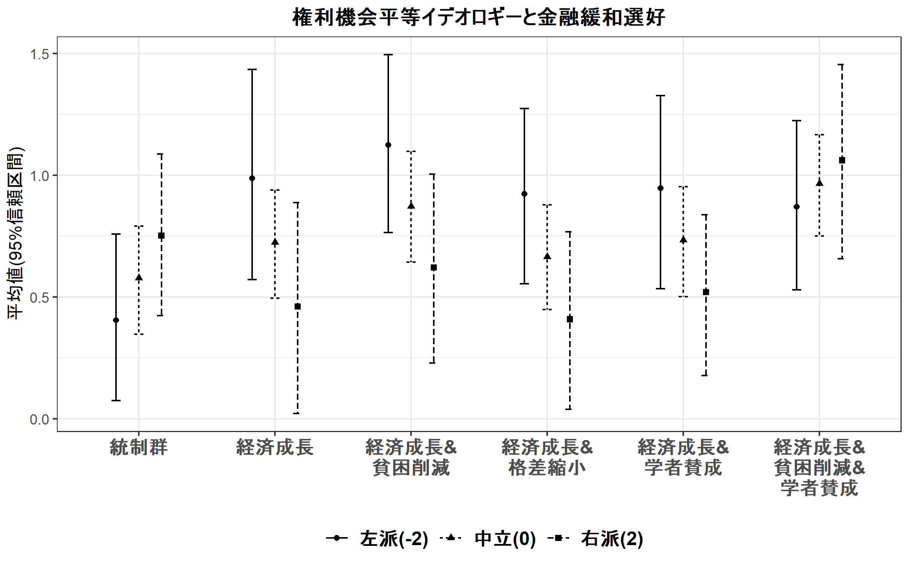

``` r
ggsave("../out/expres_iss_2.png", p, width=8, height=5)
```

政党支持イデオロギー条件付け
----------------------------

``` r
mx_easing <- lm(update(easing_opi ~ factor(g_easing_N,levels=c("1","0","2","3","4","5"))*ide_psup,ctl), data=d)
coeftest(mx_easing, vcovHC(mx_easing, "HC1"))
```

    ## 
    ## t test of coefficients:
    ## 
    ##                                                                           Estimate
    ## (Intercept)                                                             1.22804122
    ## factor(g_easing_N, levels = c("1", "0", "2", "3", "4", "5"))0          -0.23310401
    ## factor(g_easing_N, levels = c("1", "0", "2", "3", "4", "5"))2           0.12143962
    ## factor(g_easing_N, levels = c("1", "0", "2", "3", "4", "5"))3          -0.05671607
    ## factor(g_easing_N, levels = c("1", "0", "2", "3", "4", "5"))4          -0.00394922
    ## factor(g_easing_N, levels = c("1", "0", "2", "3", "4", "5"))5           0.28444105
    ## ide_psup                                                                0.21352493
    ## knall                                                                   0.20239555
    ## fem                                                                    -0.27859947
    ## age                                                                    -0.00754762
    ## lvlen                                                                  -0.05257759
    ## ownh                                                                   -0.01275432
    ## as.factor(edu3)1                                                        0.15619379
    ## as.factor(edu3)2                                                        0.10993368
    ## wk                                                                     -0.01174462
    ## mar                                                                    -0.16281457
    ## cld                                                                     0.22359966
    ## factor(g_easing_N, levels = c("1", "0", "2", "3", "4", "5"))0:ide_psup  0.16019702
    ## factor(g_easing_N, levels = c("1", "0", "2", "3", "4", "5"))2:ide_psup  0.08666355
    ## factor(g_easing_N, levels = c("1", "0", "2", "3", "4", "5"))3:ide_psup  0.02985730
    ## factor(g_easing_N, levels = c("1", "0", "2", "3", "4", "5"))4:ide_psup  0.00093954
    ## factor(g_easing_N, levels = c("1", "0", "2", "3", "4", "5"))5:ide_psup -0.28516866
    ##                                                                         Std. Error
    ## (Intercept)                                                             0.20242882
    ## factor(g_easing_N, levels = c("1", "0", "2", "3", "4", "5"))0           0.12942535
    ## factor(g_easing_N, levels = c("1", "0", "2", "3", "4", "5"))2           0.14001438
    ## factor(g_easing_N, levels = c("1", "0", "2", "3", "4", "5"))3           0.13208136
    ## factor(g_easing_N, levels = c("1", "0", "2", "3", "4", "5"))4           0.13684743
    ## factor(g_easing_N, levels = c("1", "0", "2", "3", "4", "5"))5           0.13105353
    ## ide_psup                                                                0.13405198
    ## knall                                                                   0.14224957
    ## fem                                                                     0.07883174
    ## age                                                                     0.00373039
    ## lvlen                                                                   0.02913341
    ## ownh                                                                    0.07981957
    ## as.factor(edu3)1                                                        0.12450070
    ## as.factor(edu3)2                                                        0.10202056
    ## wk                                                                      0.08200736
    ## mar                                                                     0.11088958
    ## cld                                                                     0.11049660
    ## factor(g_easing_N, levels = c("1", "0", "2", "3", "4", "5"))0:ide_psup  0.17657268
    ## factor(g_easing_N, levels = c("1", "0", "2", "3", "4", "5"))2:ide_psup  0.18234016
    ## factor(g_easing_N, levels = c("1", "0", "2", "3", "4", "5"))3:ide_psup  0.18181986
    ## factor(g_easing_N, levels = c("1", "0", "2", "3", "4", "5"))4:ide_psup  0.18233069
    ## factor(g_easing_N, levels = c("1", "0", "2", "3", "4", "5"))5:ide_psup  0.17741871
    ##                                                                        t value
    ## (Intercept)                                                             6.0665
    ## factor(g_easing_N, levels = c("1", "0", "2", "3", "4", "5"))0          -1.8011
    ## factor(g_easing_N, levels = c("1", "0", "2", "3", "4", "5"))2           0.8673
    ## factor(g_easing_N, levels = c("1", "0", "2", "3", "4", "5"))3          -0.4294
    ## factor(g_easing_N, levels = c("1", "0", "2", "3", "4", "5"))4          -0.0289
    ## factor(g_easing_N, levels = c("1", "0", "2", "3", "4", "5"))5           2.1704
    ## ide_psup                                                                1.5929
    ## knall                                                                   1.4228
    ## fem                                                                    -3.5341
    ## age                                                                    -2.0233
    ## lvlen                                                                  -1.8047
    ## ownh                                                                   -0.1598
    ## as.factor(edu3)1                                                        1.2546
    ## as.factor(edu3)2                                                        1.0776
    ## wk                                                                     -0.1432
    ## mar                                                                    -1.4683
    ## cld                                                                     2.0236
    ## factor(g_easing_N, levels = c("1", "0", "2", "3", "4", "5"))0:ide_psup  0.9073
    ## factor(g_easing_N, levels = c("1", "0", "2", "3", "4", "5"))2:ide_psup  0.4753
    ## factor(g_easing_N, levels = c("1", "0", "2", "3", "4", "5"))3:ide_psup  0.1642
    ## factor(g_easing_N, levels = c("1", "0", "2", "3", "4", "5"))4:ide_psup  0.0052
    ## factor(g_easing_N, levels = c("1", "0", "2", "3", "4", "5"))5:ide_psup -1.6073
    ##                                                                         Pr(>|t|)
    ## (Intercept)                                                            1.795e-09
    ## factor(g_easing_N, levels = c("1", "0", "2", "3", "4", "5"))0          0.0719655
    ## factor(g_easing_N, levels = c("1", "0", "2", "3", "4", "5"))2          0.3859465
    ## factor(g_easing_N, levels = c("1", "0", "2", "3", "4", "5"))3          0.6677143
    ## factor(g_easing_N, levels = c("1", "0", "2", "3", "4", "5"))4          0.9769826
    ## factor(g_easing_N, levels = c("1", "0", "2", "3", "4", "5"))5          0.0301883
    ## ide_psup                                                               0.1114805
    ## knall                                                                  0.1550716
    ## fem                                                                    0.0004261
    ## age                                                                    0.0432856
    ## lvlen                                                                  0.0713919
    ## ownh                                                                   0.8730763
    ## as.factor(edu3)1                                                       0.2099042
    ## as.factor(edu3)2                                                       0.2814644
    ## wk                                                                     0.8861472
    ## mar                                                                    0.1423196
    ## cld                                                                    0.0432537
    ## factor(g_easing_N, levels = c("1", "0", "2", "3", "4", "5"))0:ide_psup 0.3644688
    ## factor(g_easing_N, levels = c("1", "0", "2", "3", "4", "5"))2:ide_psup 0.6346781
    ## factor(g_easing_N, levels = c("1", "0", "2", "3", "4", "5"))3:ide_psup 0.8695931
    ## factor(g_easing_N, levels = c("1", "0", "2", "3", "4", "5"))4:ide_psup 0.9958895
    ## factor(g_easing_N, levels = c("1", "0", "2", "3", "4", "5"))5:ide_psup 0.1082709
    ##                                                                           
    ## (Intercept)                                                            ***
    ## factor(g_easing_N, levels = c("1", "0", "2", "3", "4", "5"))0          .  
    ## factor(g_easing_N, levels = c("1", "0", "2", "3", "4", "5"))2             
    ## factor(g_easing_N, levels = c("1", "0", "2", "3", "4", "5"))3             
    ## factor(g_easing_N, levels = c("1", "0", "2", "3", "4", "5"))4             
    ## factor(g_easing_N, levels = c("1", "0", "2", "3", "4", "5"))5          *  
    ## ide_psup                                                                  
    ## knall                                                                     
    ## fem                                                                    ***
    ## age                                                                    *  
    ## lvlen                                                                  .  
    ## ownh                                                                      
    ## as.factor(edu3)1                                                          
    ## as.factor(edu3)2                                                          
    ## wk                                                                        
    ## mar                                                                       
    ## cld                                                                    *  
    ## factor(g_easing_N, levels = c("1", "0", "2", "3", "4", "5"))0:ide_psup    
    ## factor(g_easing_N, levels = c("1", "0", "2", "3", "4", "5"))2:ide_psup    
    ## factor(g_easing_N, levels = c("1", "0", "2", "3", "4", "5"))3:ide_psup    
    ## factor(g_easing_N, levels = c("1", "0", "2", "3", "4", "5"))4:ide_psup    
    ## factor(g_easing_N, levels = c("1", "0", "2", "3", "4", "5"))5:ide_psup    
    ## ---
    ## Signif. codes:  0 '***' 0.001 '**' 0.01 '*' 0.05 '.' 0.1 ' ' 1

``` r
m3h3a <- mx_easing
mx_easing <- lm(update(easing_opi ~ factor(g_easing_N,levels=c("2","0","1","3","4","5"))*ide_psup,ctl), data=d)
coeftest(mx_easing, vcovHC(mx_easing, "HC1"))
```

    ## 
    ## t test of coefficients:
    ## 
    ##                                                                          Estimate
    ## (Intercept)                                                             1.3494808
    ## factor(g_easing_N, levels = c("2", "0", "1", "3", "4", "5"))0          -0.3545436
    ## factor(g_easing_N, levels = c("2", "0", "1", "3", "4", "5"))1          -0.1214396
    ## factor(g_easing_N, levels = c("2", "0", "1", "3", "4", "5"))3          -0.1781557
    ## factor(g_easing_N, levels = c("2", "0", "1", "3", "4", "5"))4          -0.1253888
    ## factor(g_easing_N, levels = c("2", "0", "1", "3", "4", "5"))5           0.1630014
    ## ide_psup                                                                0.3001885
    ## knall                                                                   0.2023955
    ## fem                                                                    -0.2785995
    ## age                                                                    -0.0075476
    ## lvlen                                                                  -0.0525776
    ## ownh                                                                   -0.0127543
    ## as.factor(edu3)1                                                        0.1561938
    ## as.factor(edu3)2                                                        0.1099337
    ## wk                                                                     -0.0117446
    ## mar                                                                    -0.1628146
    ## cld                                                                     0.2235997
    ## factor(g_easing_N, levels = c("2", "0", "1", "3", "4", "5"))0:ide_psup  0.0735335
    ## factor(g_easing_N, levels = c("2", "0", "1", "3", "4", "5"))1:ide_psup -0.0866636
    ## factor(g_easing_N, levels = c("2", "0", "1", "3", "4", "5"))3:ide_psup -0.0568063
    ## factor(g_easing_N, levels = c("2", "0", "1", "3", "4", "5"))4:ide_psup -0.0857240
    ## factor(g_easing_N, levels = c("2", "0", "1", "3", "4", "5"))5:ide_psup -0.3718322
    ##                                                                        Std. Error
    ## (Intercept)                                                             0.2084136
    ## factor(g_easing_N, levels = c("2", "0", "1", "3", "4", "5"))0           0.1321426
    ## factor(g_easing_N, levels = c("2", "0", "1", "3", "4", "5"))1           0.1400144
    ## factor(g_easing_N, levels = c("2", "0", "1", "3", "4", "5"))3           0.1350173
    ## factor(g_easing_N, levels = c("2", "0", "1", "3", "4", "5"))4           0.1385510
    ## factor(g_easing_N, levels = c("2", "0", "1", "3", "4", "5"))5           0.1322460
    ## ide_psup                                                                0.1245376
    ## knall                                                                   0.1422496
    ## fem                                                                     0.0788317
    ## age                                                                     0.0037304
    ## lvlen                                                                   0.0291334
    ## ownh                                                                    0.0798196
    ## as.factor(edu3)1                                                        0.1245007
    ## as.factor(edu3)2                                                        0.1020206
    ## wk                                                                      0.0820074
    ## mar                                                                     0.1108896
    ## cld                                                                     0.1104966
    ## factor(g_easing_N, levels = c("2", "0", "1", "3", "4", "5"))0:ide_psup  0.1684099
    ## factor(g_easing_N, levels = c("2", "0", "1", "3", "4", "5"))1:ide_psup  0.1823402
    ## factor(g_easing_N, levels = c("2", "0", "1", "3", "4", "5"))3:ide_psup  0.1743645
    ## factor(g_easing_N, levels = c("2", "0", "1", "3", "4", "5"))4:ide_psup  0.1761577
    ## factor(g_easing_N, levels = c("2", "0", "1", "3", "4", "5"))5:ide_psup  0.1698113
    ##                                                                        t value
    ## (Intercept)                                                             6.4750
    ## factor(g_easing_N, levels = c("2", "0", "1", "3", "4", "5"))0          -2.6830
    ## factor(g_easing_N, levels = c("2", "0", "1", "3", "4", "5"))1          -0.8673
    ## factor(g_easing_N, levels = c("2", "0", "1", "3", "4", "5"))3          -1.3195
    ## factor(g_easing_N, levels = c("2", "0", "1", "3", "4", "5"))4          -0.9050
    ## factor(g_easing_N, levels = c("2", "0", "1", "3", "4", "5"))5           1.2326
    ## ide_psup                                                                2.4104
    ## knall                                                                   1.4228
    ## fem                                                                    -3.5341
    ## age                                                                    -2.0233
    ## lvlen                                                                  -1.8047
    ## ownh                                                                   -0.1598
    ## as.factor(edu3)1                                                        1.2546
    ## as.factor(edu3)2                                                        1.0776
    ## wk                                                                     -0.1432
    ## mar                                                                    -1.4683
    ## cld                                                                     2.0236
    ## factor(g_easing_N, levels = c("2", "0", "1", "3", "4", "5"))0:ide_psup  0.4366
    ## factor(g_easing_N, levels = c("2", "0", "1", "3", "4", "5"))1:ide_psup -0.4753
    ## factor(g_easing_N, levels = c("2", "0", "1", "3", "4", "5"))3:ide_psup -0.3258
    ## factor(g_easing_N, levels = c("2", "0", "1", "3", "4", "5"))4:ide_psup -0.4866
    ## factor(g_easing_N, levels = c("2", "0", "1", "3", "4", "5"))5:ide_psup -2.1897
    ##                                                                         Pr(>|t|)
    ## (Intercept)                                                            1.425e-10
    ## factor(g_easing_N, levels = c("2", "0", "1", "3", "4", "5"))0          0.0074050
    ## factor(g_easing_N, levels = c("2", "0", "1", "3", "4", "5"))1          0.3859465
    ## factor(g_easing_N, levels = c("2", "0", "1", "3", "4", "5"))3          0.1872755
    ## factor(g_easing_N, levels = c("2", "0", "1", "3", "4", "5"))4          0.3656626
    ## factor(g_easing_N, levels = c("2", "0", "1", "3", "4", "5"))5          0.2180024
    ## ide_psup                                                               0.0160971
    ## knall                                                                  0.1550716
    ## fem                                                                    0.0004261
    ## age                                                                    0.0432856
    ## lvlen                                                                  0.0713919
    ## ownh                                                                   0.8730763
    ## as.factor(edu3)1                                                       0.2099042
    ## as.factor(edu3)2                                                       0.2814644
    ## wk                                                                     0.8861472
    ## mar                                                                    0.1423196
    ## cld                                                                    0.0432537
    ## factor(g_easing_N, levels = c("2", "0", "1", "3", "4", "5"))0:ide_psup 0.6624624
    ## factor(g_easing_N, levels = c("2", "0", "1", "3", "4", "5"))1:ide_psup 0.6346781
    ## factor(g_easing_N, levels = c("2", "0", "1", "3", "4", "5"))3:ide_psup 0.7446449
    ## factor(g_easing_N, levels = c("2", "0", "1", "3", "4", "5"))4:ide_psup 0.6266158
    ## factor(g_easing_N, levels = c("2", "0", "1", "3", "4", "5"))5:ide_psup 0.0287568
    ##                                                                           
    ## (Intercept)                                                            ***
    ## factor(g_easing_N, levels = c("2", "0", "1", "3", "4", "5"))0          ** 
    ## factor(g_easing_N, levels = c("2", "0", "1", "3", "4", "5"))1             
    ## factor(g_easing_N, levels = c("2", "0", "1", "3", "4", "5"))3             
    ## factor(g_easing_N, levels = c("2", "0", "1", "3", "4", "5"))4             
    ## factor(g_easing_N, levels = c("2", "0", "1", "3", "4", "5"))5             
    ## ide_psup                                                               *  
    ## knall                                                                     
    ## fem                                                                    ***
    ## age                                                                    *  
    ## lvlen                                                                  .  
    ## ownh                                                                      
    ## as.factor(edu3)1                                                          
    ## as.factor(edu3)2                                                          
    ## wk                                                                        
    ## mar                                                                       
    ## cld                                                                    *  
    ## factor(g_easing_N, levels = c("2", "0", "1", "3", "4", "5"))0:ide_psup    
    ## factor(g_easing_N, levels = c("2", "0", "1", "3", "4", "5"))1:ide_psup    
    ## factor(g_easing_N, levels = c("2", "0", "1", "3", "4", "5"))3:ide_psup    
    ## factor(g_easing_N, levels = c("2", "0", "1", "3", "4", "5"))4:ide_psup    
    ## factor(g_easing_N, levels = c("2", "0", "1", "3", "4", "5"))5:ide_psup *  
    ## ---
    ## Signif. codes:  0 '***' 0.001 '**' 0.01 '*' 0.05 '.' 0.1 ' ' 1

``` r
m3h3b <- mx_easing
mx_easing <- lm(update(easing_opi ~ 
                         as.factor(g_easing_N)*ide_psup
                         # as.factor(g_easing_N)*left_psup +
                         # as.factor(g_easing_N)*right_psup
                         ,ctl), data=d)
m3 <- mx_easing
coeftest(mx_easing, vcovHC(mx_easing, "HC1"))
```

    ## 
    ## t test of coefficients:
    ## 
    ##                                   Estimate Std. Error t value  Pr(>|t|)
    ## (Intercept)                      0.9949372  0.2031967  4.8964 1.122e-06
    ## as.factor(g_easing_N)1           0.2331040  0.1294254  1.8011 0.0719655
    ## as.factor(g_easing_N)2           0.3545436  0.1321426  2.6830 0.0074050
    ## as.factor(g_easing_N)3           0.1763879  0.1245865  1.4158 0.1571207
    ## as.factor(g_easing_N)4           0.2291548  0.1296795  1.7671 0.0774909
    ## as.factor(g_easing_N)5           0.5175451  0.1217713  4.2501 2.317e-05
    ## ide_psup                         0.3737220  0.1155788  3.2335 0.0012592
    ## knall                            0.2023955  0.1422496  1.4228 0.1550716
    ## fem                             -0.2785995  0.0788317 -3.5341 0.0004261
    ## age                             -0.0075476  0.0037304 -2.0233 0.0432856
    ## lvlen                           -0.0525776  0.0291334 -1.8047 0.0713919
    ## ownh                            -0.0127543  0.0798196 -0.1598 0.8730763
    ## as.factor(edu3)1                 0.1561938  0.1245007  1.2546 0.2099042
    ## as.factor(edu3)2                 0.1099337  0.1020206  1.0776 0.2814644
    ## wk                              -0.0117446  0.0820074 -0.1432 0.8861472
    ## mar                             -0.1628146  0.1108896 -1.4683 0.1423196
    ## cld                              0.2235997  0.1104966  2.0236 0.0432537
    ## as.factor(g_easing_N)1:ide_psup -0.1601970  0.1765727 -0.9073 0.3644688
    ## as.factor(g_easing_N)2:ide_psup -0.0735335  0.1684099 -0.4366 0.6624624
    ## as.factor(g_easing_N)3:ide_psup -0.1303397  0.1673422 -0.7789 0.4362171
    ## as.factor(g_easing_N)4:ide_psup -0.1592575  0.1696802 -0.9386 0.3481553
    ## as.factor(g_easing_N)5:ide_psup -0.4453657  0.1649507 -2.7000 0.0070404
    ##                                    
    ## (Intercept)                     ***
    ## as.factor(g_easing_N)1          .  
    ## as.factor(g_easing_N)2          ** 
    ## as.factor(g_easing_N)3             
    ## as.factor(g_easing_N)4          .  
    ## as.factor(g_easing_N)5          ***
    ## ide_psup                        ** 
    ## knall                              
    ## fem                             ***
    ## age                             *  
    ## lvlen                           .  
    ## ownh                               
    ## as.factor(edu3)1                   
    ## as.factor(edu3)2                   
    ## wk                                 
    ## mar                                
    ## cld                             *  
    ## as.factor(g_easing_N)1:ide_psup    
    ## as.factor(g_easing_N)2:ide_psup    
    ## as.factor(g_easing_N)3:ide_psup    
    ## as.factor(g_easing_N)4:ide_psup    
    ## as.factor(g_easing_N)5:ide_psup ** 
    ## ---
    ## Signif. codes:  0 '***' 0.001 '**' 0.01 '*' 0.05 '.' 0.1 ' ' 1

``` r
preddatax <- rbind(preddata,preddata,preddata)
preddatax$ide_psup <- rep(c(-1,0,1), each=6)
preddatax$left_psup = rep(c(1,0,0), each=6)
preddatax$right_psup = rep(c(0,0,1), each=6)
pr <- simu_pred(mx_easing, profile=preddatax, vcov.est = "robust")

prx_easing <- data.frame(t = factor(rep(pr_easing$t_jp,3),levels=pr_easing$t_jp),
                         Ideology = factor(rep(c("左派政党支持(-1)",
                                                 "無党派(0)",
                                                 "右派政党支持(1)"), each=6),
                                           levels=c("左派政党支持(-1)",
                                                    "無党派(0)",
                                                    "右派政党支持(1)")),
                         pr = pr$predsum$Mean,
                         loCI = pr$predsum$lowerCI,
                         upCI = pr$predsum$upperCI)
```

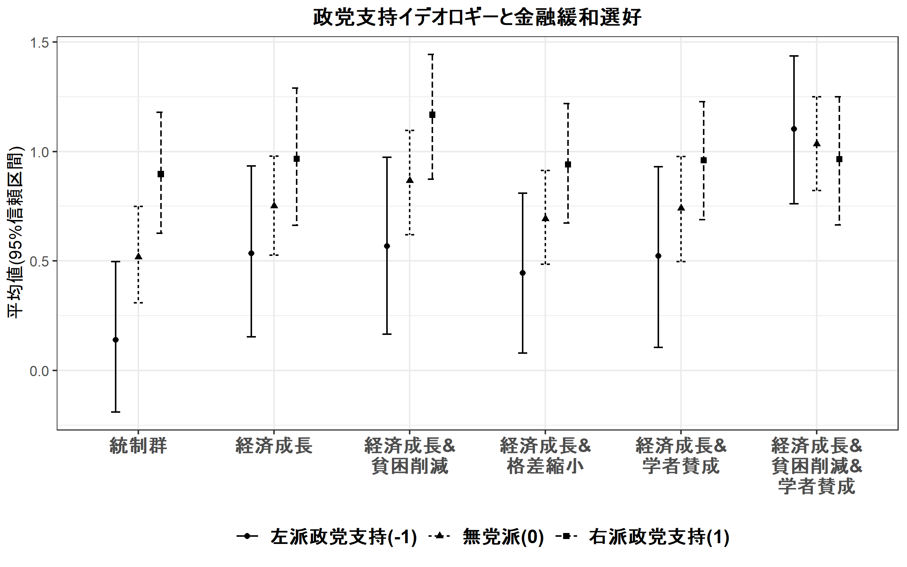

``` r
ggsave("../out/expres_psup.png", p, width=8, height=5)
```

図２：仮説検証用プロット
------------------------

``` r
# H1
h1cf <- rbind(coeftest(m1, vcovHC(m1, "HC1"))[18,],
              coeftest(m3, vcovHC(m3, "HC1"))[18,],
              coeftest(m2_1, vcovHC(m2_1, "HC1"))[18,],
              coeftest(m2_2, vcovHC(m2_2, "HC1"))[18,])

# H2A
h2acf <- rbind(coeftest(m1h3a, vcovHC(m1h3a, "HC1"))[19,],
               coeftest(m3h3a, vcovHC(m3h3a, "HC1"))[19,],
               coeftest(m2h3a_1, vcovHC(m2h3a_1, "HC1"))[19,],
               coeftest(m2h3a_2, vcovHC(m2h3a_2, "HC1"))[19,])

# H2B
h2bcf <- rbind(coeftest(m1h3a, vcovHC(m1h3a, "HC1"))[20,],
               coeftest(m3h3a, vcovHC(m3h3a, "HC1"))[20,],
               coeftest(m2h3a_1, vcovHC(m2h3a_1, "HC1"))[20,],
               coeftest(m2h3a_2, vcovHC(m2h3a_2, "HC1"))[20,])

# H3A
h3acf <- rbind(coeftest(m1h3a, vcovHC(m1h3a, "HC1"))[21,],
               coeftest(m3h3a, vcovHC(m3h3a, "HC1"))[21,],
               coeftest(m2h3a_1, vcovHC(m2h3a_1, "HC1"))[21,],
               coeftest(m2h3a_2, vcovHC(m2h3a_2, "HC1"))[21,])

# H3B
h3bcf <- rbind(coeftest(m1h3b, vcovHC(m1h3b, "HC1"))[22,],
               coeftest(m3h3b, vcovHC(m3h3b, "HC1"))[22,],
               coeftest(m2h3b_1, vcovHC(m2h3b_1, "HC1"))[22,],
               coeftest(m2h3b_2, vcovHC(m2h3b_2, "HC1"))[22,])

htest <- as.data.frame(rbind(h1cf,h2acf,h2bcf,h3acf,h3bcf))
names(htest) <- c("est","se","tval","pval")
htest$hyp <- rep(c("H1:1.経済成長\nv.s.統制群",
                   "H2A:2.経済成長＆貧困削減\nv.s.1.経済成長",
                   "H2B:3.経済成長＆格差縮小\nv.s.1.経済成長",
                   "H3:4.経済成長＆学者賛成\nv.s.1.経済成長",
                   "H3:5.経済成長＆貧困削減＆学者賛成\nv.s.2.経済成長＆貧困削減"),
                 each=4)
htest$hyp <- factor(htest$hyp, levels=rev(unique(htest$hyp)))
htest$ms <- rep(c("自己申告","政党支持","外交安全保障","権利機会平等"),5)
htest$ms <- factor(htest$ms, levels=unique(htest$ms))

htest$l90CI <- htest$est - htest$se*qnorm(0.95)
htest$u90CI <- htest$est + htest$se*qnorm(0.95)
htest$l95CI <- htest$est - htest$se*qnorm(0.975)
htest$u95CI <- htest$est + htest$se*qnorm(0.975)

htest$ptest <- ifelse(htest$pval<0.05,"p<.05",
                      ifelse(htest$pval<0.10,"p<.10","n.s.(p>=.10)"))
htest$ptest <- factor(htest$ptest, levels=c("p<.05","p<.10","n.s.(p>=.10)"))

p <- ggplot(htest, aes(x=hyp)) + 
  geom_hline(aes(yintercept=0), linetype=2) + 
  geom_errorbar(aes(ymin=l95CI,ymax=u95CI,
                    color=ptest),width=0.1) + 
  geom_errorbar(aes(ymin=l90CI,ymax=u90CI,
                    color=ptest),width=0,size=0.8) + 
  geom_point(aes(y=est,color=ptest,shape=ptest),size=2) + 
  scale_y_continuous(breaks=c(-0.3,0,0.3)) + 
  scale_color_manual(name="", values=c("red2","darkorange2","gray50")) + 
  scale_shape_discrete(name="") + 
  facet_grid(.~ms) +
  xlab(NULL) + ylab("イデオロギー交差項の係数＋９５％信頼区間\n（太線は９０％信頼区間）") + 
  labs(subtitle="イデオロギー指標",
       caption="分析結果の詳細については表１を参照．") + 
  coord_flip() + theme_bw() + 
  theme(plot.margin = unit(c(0.5,0.5,0.5,-0), "cm"),
        panel.grid = element_line(color=NA),
        plot.subtitle = element_text(hjust=0.5),
        axis.text.y = element_text(color="black"),
        legend.position = "bottom")
p
```

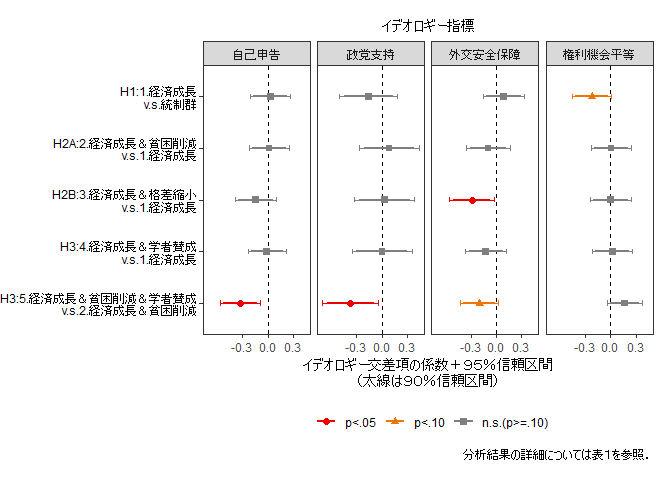

``` r
ggsave("../out/expres_htest.png", p, width=8, height=5)
```

表のエクスポート
----------------

``` r
# table_coef(list(m1,m3), vcov.est="robust", 
#            single.row=TRUE, custom.variable.names = vnx[1:28],
#            m.names = c("自己申告","政党支持"),
#            caption="自己申告・政党支持イデオロギーと金融緩和選好の関係に実験情報刺激が与える効果（重回帰分析）",
#            label="idetab", dcolumn = TRUE,
#            custom.footnote = "最小二乗法による重回帰分析、ロバスト標準誤差使用．",
#            order.variable = c(1:7,18:28,8:17),
#            format = "tex", file.name = "../out/idetab_13")
# 
# table_coef(list(m2_1,m2_2), vcov.est="robust", 
#            single.row=TRUE, custom.variable.names = vnx[1:28],
#            m.names = c("外交安全保障","権利機会平等"),
#            caption="争点態度イデオロギーと金融緩和選好の関係に実験情報刺激が与える効果（重回帰分析）",
#            label="idetab_2", dcolumn = TRUE,
#            custom.footnote = "最小二乗法による重回帰分析、ロバスト標準誤差使用．",
#            order.variable = c(1:7,18:28,8:17),
#            format = "tex", file.name = "../out/idetab_2")

table_coef(list(m1,m3,m2_1,m2_2), vcov.est="robust", 
           single.row=FALSE, custom.variable.names = c(vnx,vnx[29:34]),
           m.names = c("自己申告","政党支持","外交安全保障","権利機会平等"),
           caption="イデオロギーと金融緩和選好の関係に実験情報刺激が与える効果（重回帰分析）",
           label="idetab", dcolumn = TRUE,
           custom.footnote = "最小二乗法による重回帰分析、ロバスト標準誤差使用．",
           order.variable = c(1:7,18:40,8:17),
           format = "tex", file.name = "../out/idetab")
```

    ## Variable Manipulations: 
    ##    Omitted                         Original                            Final
    ##     KEPT                      (Intercept)                       （定数項）
    ##     KEPT           as.factor(g_easing_N)1                       1.経済成長
    ##     KEPT           as.factor(g_easing_N)2             2.経済成長＆貧困削減
    ##     KEPT           as.factor(g_easing_N)3             3.経済成長＆格差縮小
    ##     KEPT           as.factor(g_easing_N)4             4.経済成長＆学者賛成
    ##     KEPT           as.factor(g_easing_N)5   5.経済成長＆貧困削減＆学者賛成
    ##     KEPT                         ide_self                     イデオロギー
    ##     KEPT                            knall                         政治知識
    ##     KEPT                              fem                     性別（女性）
    ##     KEPT                              age                             年齢
    ##     KEPT                            lvlen                         居住年数
    ##     KEPT                             ownh                           持ち家
    ##     KEPT                 as.factor(edu3)1       教育：短大／高専／専門学校
    ##     KEPT                 as.factor(edu3)2                   教育：大卒以上
    ##     KEPT                               wk                             就労
    ##     KEPT                              mar                             婚姻
    ##     KEPT                              cld                           子ども
    ##     KEPT  as.factor(g_easing_N)1:ide_self             イデオロギー×1.成長
    ##     KEPT  as.factor(g_easing_N)2:ide_self       イデオロギー×2.成長＆貧困
    ##     KEPT  as.factor(g_easing_N)3:ide_self       イデオロギー×3.成長＆格差
    ##     KEPT  as.factor(g_easing_N)4:ide_self       イデオロギー×4.成長＆学者
    ##     KEPT  as.factor(g_easing_N)5:ide_self イデオロギー×5.成長＆貧困＆学者
    ##     KEPT                         ide_psup                     イデオロギー
    ##     KEPT  as.factor(g_easing_N)1:ide_psup             イデオロギー×1.成長
    ##     KEPT  as.factor(g_easing_N)2:ide_psup       イデオロギー×2.成長＆貧困
    ##     KEPT  as.factor(g_easing_N)3:ide_psup       イデオロギー×3.成長＆格差
    ##     KEPT  as.factor(g_easing_N)4:ide_psup       イデオロギー×4.成長＆学者
    ##     KEPT  as.factor(g_easing_N)5:ide_psup イデオロギー×5.成長＆貧困＆学者
    ##     KEPT                        ide_iss_1                     イデオロギー
    ##     KEPT as.factor(g_easing_N)1:ide_iss_1             イデオロギー×1.成長
    ##     KEPT as.factor(g_easing_N)2:ide_iss_1       イデオロギー×2.成長＆貧困
    ##     KEPT as.factor(g_easing_N)3:ide_iss_1       イデオロギー×3.成長＆格差
    ##     KEPT as.factor(g_easing_N)4:ide_iss_1       イデオロギー×4.成長＆学者
    ##     KEPT as.factor(g_easing_N)5:ide_iss_1 イデオロギー×5.成長＆貧困＆学者
    ##     KEPT                        ide_iss_2                     イデオロギー
    ##     KEPT as.factor(g_easing_N)1:ide_iss_2             イデオロギー×1.成長
    ##     KEPT as.factor(g_easing_N)2:ide_iss_2       イデオロギー×2.成長＆貧困
    ##     KEPT as.factor(g_easing_N)3:ide_iss_2       イデオロギー×3.成長＆格差
    ##     KEPT as.factor(g_easing_N)4:ide_iss_2       イデオロギー×4.成長＆学者
    ##     KEPT as.factor(g_easing_N)5:ide_iss_2 イデオロギー×5.成長＆貧困＆学者

    ## The table was written to the file '../out/idetab.tex'.

    ## 
    ## =========================================================================
    ##                    自己申告          政党支持          外交安全保障        権利機会平等      
    ## -------------------------------------------------------------------------
    ## （定数項）                 1.137 ***     0.995 ***     1.000 ***     1.074 ***
    ##                      (0.203)       (0.203)       (0.193)       (0.202)   
    ## 1.経済成長                0.122         0.233 +       0.151         0.148    
    ##                      (0.129)       (0.129)       (0.121)       (0.130)   
    ## 2.経済成長＆貧困削減           0.282 *       0.355 **      0.306 *       0.297 *  
    ##                      (0.126)       (0.132)       (0.121)       (0.127)   
    ## 3.経済成長＆格差縮小           0.086         0.176         0.121         0.086    
    ##                      (0.121)       (0.125)       (0.116)       (0.121)   
    ## 4.経済成長＆学者賛成           0.136         0.229 +       0.157         0.158    
    ##                      (0.121)       (0.130)       (0.116)       (0.123)   
    ## 5.経済成長＆貧困削減＆学者賛成      0.379 **      0.518 ***     0.402 ***     0.391 ** 
    ##                      (0.119)       (0.122)       (0.116)       (0.121)   
    ## イデオロギー                0.163 +       0.374 **      0.353 ***     0.086    
    ##                      (0.085)       (0.116)       (0.077)       (0.069)   
    ## イデオロギー×1.成長           0.031        -0.160         0.089        -0.219 +  
    ##                      (0.122)       (0.177)       (0.126)       (0.120)   
    ## イデオロギー×2.成長＆貧困        0.049        -0.074        -0.007        -0.211 *  
    ##                      (0.118)       (0.168)       (0.114)       (0.101)   
    ## イデオロギー×3.成長＆格差       -0.110        -0.130        -0.199 +      -0.216 *  
    ##                      (0.121)       (0.167)       (0.119)       (0.102)   
    ## イデオロギー×4.成長＆学者        0.021        -0.159        -0.032        -0.193 *  
    ##                      (0.112)       (0.170)       (0.106)       (0.098)   
    ## イデオロギー×5.成長＆貧困＆学者    -0.275 *      -0.445 **     -0.207 +      -0.041    
    ##                      (0.123)       (0.165)       (0.111)       (0.103)   
    ## 政治知識                  0.223         0.202         0.176         0.229    
    ##                      (0.141)       (0.142)       (0.136)       (0.143)   
    ## 性別（女性）               -0.288 ***    -0.279 ***    -0.187 *      -0.354 ***
    ##                      (0.079)       (0.079)       (0.079)       (0.080)   
    ## 年齢                   -0.008 *      -0.008 *      -0.006 +      -0.006    
    ##                      (0.004)       (0.004)       (0.004)       (0.004)   
    ## 居住年数                 -0.059 *      -0.053 +      -0.052 +      -0.052 +  
    ##                      (0.029)       (0.029)       (0.028)       (0.030)   
    ## 持ち家                  -0.002        -0.013        -0.019         0.005    
    ##                      (0.081)       (0.080)       (0.078)       (0.082)   
    ## 教育：短大／高専／専門学校         0.132         0.156         0.136         0.138    
    ##                      (0.124)       (0.125)       (0.122)       (0.124)   
    ## 教育：大卒以上               0.085         0.110         0.137         0.086    
    ##                      (0.100)       (0.102)       (0.097)       (0.102)   
    ## 就労                    0.013        -0.012        -0.019        -0.007    
    ##                      (0.082)       (0.082)       (0.079)       (0.082)   
    ## 婚姻                   -0.110        -0.163        -0.165        -0.092    
    ##                      (0.109)       (0.111)       (0.107)       (0.111)   
    ## 子ども                   0.202 +       0.224 *       0.240 *       0.217 +  
    ##                      (0.109)       (0.110)       (0.107)       (0.111)   
    ## -------------------------------------------------------------------------
    ## R^2                   0.067         0.067         0.116         0.056    
    ## Adj. R^2              0.049         0.049         0.100         0.038    
    ## Num. obs.          1123          1123          1123          1123        
    ## RMSE                  1.193         1.192         1.160         1.200    
    ## =========================================================================
    ## *** p < 0.001, ** p < 0.01, * p < 0.05, + p < 0.1 最小二乗法による重回帰分析、ロバスト標準誤差使用．

``` r
# tmpvn <- unique(c(names(coef(m1h3a)),names(coef(m3h3a)),names(coef(m2h3a_1)),names(coef(m2h3a_2))))
# table_coef(list(m1h3a,m3h3a,m2h3a_1,m2h3a_2), vcov.est="robust", 
#            single.row=FALSE, 
#            custom.variable.names = rep("イデオロギーX成長＆学者",4),
#            drop.variable.names = tmpvn[-c(21,27,33,39)],
#            m.names = c("自己申告","政党支持","外交安全保障","権利機会平等"),
#            caption="イデオロギーと金融緩和選好の関係に実験情報刺激が与える効果（重回帰分析）。仮説３の検証として、実験群４と１を比較。",
#            label="idetab_h3a", dcolumn = TRUE,
#            custom.footnote = "最小二乗法による重回帰分析、ロバスト標準誤差使用．",
#            format = "tex", file.name = "../out/idetab_h3a")
# 
# tmpvn <- unique(c(names(coef(m1h3b)),names(coef(m3h3b)),names(coef(m2h3b_1)),names(coef(m2h3b_2))))
# table_coef(list(m1h3b,m3h3b,m2h3b_1,m2h3b_2), vcov.est="robust", 
#            single.row=FALSE, 
#            custom.variable.names = rep("イデオロギーX成長＆貧困＆学者",4),
#            drop.variable.names = tmpvn[-c(22,28,34,40)],
#            m.names = c("自己申告","政党支持","外交安全保障","権利機会平等"),
#            caption="イデオロギーと金融緩和選好の関係に実験情報刺激が与える効果（重回帰分析）。仮説３の検証として、実験群５と２を比較。",
#            label="idetab_h3b", dcolumn = TRUE,
#            custom.footnote = "最小二乗法による重回帰分析、ロバスト標準誤差使用．",
#            format = "tex", file.name = "../out/idetab_h3b")
```
