本調査の分析
================
加藤言人
2019年12月26日

-   [争点イデオロギー指標の作成（因子分析）](#争点イデオロギー指標の作成因子分析)
-   [イデオロギー指標間の相関](#イデオロギー指標間の相関)
-   [記述統計](#記述統計)
    -   [従属変数：金融緩和政策選好](#従属変数金融緩和政策選好)
    -   [独立変数：イデオロギー](#独立変数イデオロギー)
        -   [自己申告イデオロギー](#自己申告イデオロギー)
        -   [争点態度イデオロギー](#争点態度イデオロギー)
        -   [政党支持イデオロギー](#政党支持イデオロギー)
        -   [自己申告イデオロギーと争点態度イデオロギーの相関](#自己申告イデオロギーと争点態度イデオロギーの相関)
-   [実験群比較](#実験群比較)
    -   [準備](#準備)
    -   [自己申告イデオロギー条件付け](#自己申告イデオロギー条件付け)
    -   [争点態度イデオロギー条件付け](#争点態度イデオロギー条件付け)
        -   [外交安全保障イデオロギー](#外交安全保障イデオロギー)
        -   [権利機会平等イデオロギー](#権利機会平等イデオロギー)
    -   [政党支持イデオロギー条件付け](#政党支持イデオロギー条件付け)
    -   [条件付け効果のプロット](#条件付け効果のプロット)
    -   [図２：仮説検証用プロット](#図仮説検証用プロット)
    -   [表のエクスポート](#表のエクスポート)

``` r
## Read Data
d <- readRDS("../data_public/main_data_v3.rds")
#d <- read_dta("../data_public/main_data_v1.dta", encoding="UTF-8")
nrow(d)
```

    ## [1] 1028

``` r
## Drop Respondents
d <- d[which(d$satisficer==0),] # Not Satisficers
d <- d[which(d$surveytime<=90),] # Took too long
nrow(d)
```

    ## [1] 994

``` r
dtmp <- d[complete.cases(d[,c("knall","fem","age","lvlen","ownh",
  "edu3","wk","mar","cld")]),]
nrow(dtmp)
```

    ## [1] 927

争点イデオロギー指標の作成（因子分析）
======================================

``` r
# Issue Ideology 
require(psych)
mydata <- d[,c("issue_1",
               "issue_2",
               "issue_3",
               "issue_4",
               "issue_5",
               "issue_6",
               "issue_7",
               "issue_8",
               "issue_9",
               "issue_10",
               "issue_11",
               "issue_12",
               "issue_13",
               "issue_14",
               "issue_15")]
mydata <- apply(mydata, 2, function(k){k[is.na(k)]<- 0; k})

# Scree-plot (Aiming at two vectors)
plot(eigen(cor(mydata))$values, type="b",
     ylab="Eigen Value",xlab="")
```

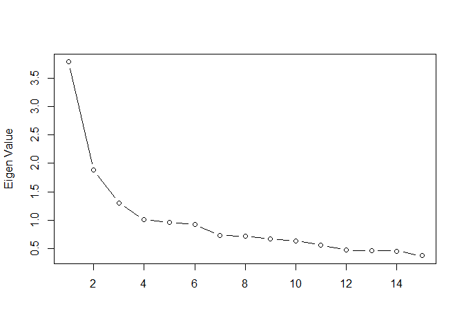

``` r
# with promax rotation (two factors)
fit <- fa(mydata, 2, fm="ml", 
          rotate="promax",
          scores="Bartlett")
print(fit, digits=3, cutoff=.1, sort=TRUE)
```

    ## Factor Analysis using method =  ml
    ## Call: fa(r = mydata, nfactors = 2, rotate = "promax", scores = "Bartlett", 
    ##     fm = "ml")
    ## Standardized loadings (pattern matrix) based upon correlation matrix
    ##          item    ML1    ML2     h2    u2  com
    ## issue_2     2  0.781 -0.054 0.6237 0.376 1.01
    ## issue_1     1  0.695 -0.009 0.4846 0.515 1.00
    ## issue_4     4  0.607 -0.186 0.4339 0.566 1.19
    ## issue_6     6  0.564 -0.049 0.3276 0.672 1.02
    ## issue_15   15  0.488  0.023 0.2361 0.764 1.00
    ## issue_3     3  0.479 -0.062 0.2411 0.759 1.03
    ## issue_5     5  0.447 -0.055 0.2091 0.791 1.03
    ## issue_7     7  0.390  0.116 0.1530 0.847 1.18
    ## issue_9     9  0.309  0.087 0.0955 0.905 1.16
    ## issue_14   14 -0.047  0.686 0.4811 0.519 1.01
    ## issue_13   13 -0.098  0.661 0.4639 0.536 1.04
    ## issue_12   12 -0.270  0.481 0.3398 0.660 1.57
    ## issue_11   11 -0.170  0.367 0.1809 0.819 1.41
    ## issue_8     8  0.149  0.254 0.0765 0.923 1.61
    ## issue_10   10  0.060  0.144 0.0220 0.978 1.34
    ## 
    ##                         ML1   ML2
    ## SS loadings           2.887 1.482
    ## Proportion Var        0.192 0.099
    ## Cumulative Var        0.192 0.291
    ## Proportion Explained  0.661 0.339
    ## Cumulative Proportion 0.661 1.000
    ## 
    ##  With factor correlations of 
    ##        ML1    ML2
    ## ML1  1.000 -0.136
    ## ML2 -0.136  1.000
    ## 
    ## Mean item complexity =  1.2
    ## Test of the hypothesis that 2 factors are sufficient.
    ## 
    ## The degrees of freedom for the null model are  105  and the objective function was  3.147 0.1 with Chi Square of  3107.102
    ## The degrees of freedom for the model are 76  and the objective function was  0.501 
    ##  0.1
    ## The root mean square of the residuals (RMSR) is  0.054 
    ## The df corrected root mean square of the residuals is  0.063 
    ##  0.1
    ## The harmonic number of observations is  994 with the empirical chi square  609.035  with prob <  3.64e-84 
    ##  0.1The total number of observations was  994  with Likelihood Chi Square =  494.178  with prob <  1.44e-62 
    ##  0.1
    ## Tucker Lewis Index of factoring reliability =  0.8073
    ## RMSEA index =  0.0748  and the 90 % confidence intervals are  0.0683 0.0808 0.1
    ## BIC =  -30.354
    ## Fit based upon off diagonal values = 0.941
    ## Measures of factor score adequacy             
    ##                                                     ML1   ML2
    ## Correlation of (regression) scores with factors   0.912 0.840
    ## Multiple R square of scores with factors          0.832 0.705
    ## Minimum correlation of possible factor scores     0.663 0.410

``` r
# plot factor 1 by factor 2 
load <- fit$loadings[,1:2] 
plot(load,type="n") # set up plot 
text(load,labels=colnames(mydata),cex=.7) # add variable names
```


``` r
require(ggrepel)
load <- as.data.frame(load)
load$vn <- c("自衛隊の拡充",
             "集団的自衛権の行使",
             "在日米軍の維持",
             "国防軍の組織",
             "憲法改正要件の緩和",
             "首相の公式靖国参拝",
             "財政出動の実施",
             "公共事業の実施",
             "TPPへの参加",
             "増税で社会福祉充実",
             "移民受け入れの推進",
             "外国人参政権の付与",
             "夫婦別姓の合法化",
             "同性婚の合法化",
             "原発の再稼働")

p <- 
  ggplot(load, aes(x=ML1,y=ML2)) + 
  geom_hline(yintercept=0,color="gray30",linetype=2) +
  geom_vline(xintercept=0,color="gray30",linetype=2) +
  geom_point() + 
  geom_text_repel(aes(label=vn)) + 
  labs(title="争点態度イデオロギーの因子分析（因子負荷量）",
       x="外交安全保障イデオロギー（第1因子）",
       y="権利機会平等イデオロギー（第2因子）",
       caption="\n※因子負荷量の推定にはプロマックス回転と最尤法を用いた．因子スコアはBartlett法を用いて算出した．") +
  theme_classic() + 
  theme(plot.title=element_text(hjust=0.5),
        axis.text = element_text(size=10))
p
```

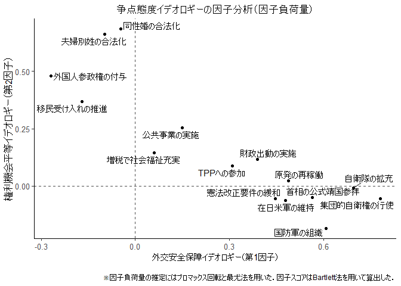

``` r
ggsave("../out/v4_score_ide_iss.png", p, width=7, height=5.5)
```

``` r
# Defense Ideology (supposedly)
d$ide_iss_1 <- fit$scores[,1]
hist(d$ide_iss_1)
```

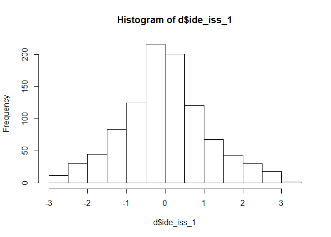

``` r
# Welfare/Economic Ideology (supposedly)
d$ide_iss_2 <- -fit$scores[,2]
hist(d$ide_iss_2)
```

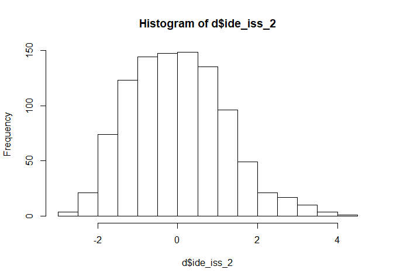

イデオロギー指標間の相関
========================

``` r
require(xtable)

ctab <- cor(d[,c("ide_self","ide_psup","ide_iss_1","ide_iss_2")])
ctab[upper.tri(ctab)] <- NA
colnames(ctab) <- rownames(ctab) <- c("自己申告","政党支持","外交安全保障","権利機会平等")
print(xtable(ctab, digits=3,caption="イデオロギー指標間の相関"), 
      caption.placement="top")
```

    ## % latex table generated in R 3.5.1 by xtable 1.8-3 package
    ## % Thu Dec 26 16:57:45 2019
    ## \begin{table}[ht]
    ## \centering
    ## \caption{イデオロギー指標間の相関} 
    ## \begin{tabular}{rrrrr}
    ##   \hline
    ##  & 自己申告 & 政党支持 & 外交安全保障 & 権利機会平等 \\ 
    ##   \hline
    ## 自己申告 & 1.000 &  &  &  \\ 
    ##   政党支持 & 0.366 & 1.000 &  &  \\ 
    ##   外交安全保障 & 0.362 & 0.453 & 1.000 &  \\ 
    ##   権利機会平等 & 0.289 & 0.167 & 0.055 & 1.000 \\ 
    ##    \hline
    ## \end{tabular}
    ## \end{table}

記述統計
========

従属変数：金融緩和政策選好
--------------------------

``` r
tab <- table(d$easing_opi)/sum(table(d$easing_opi))
tab <- data.frame(prop = as.numeric(tab),
                  names = c("反対\n(-3)","-2","-1",
                            "どちらともいえない\n(0)",
                            "1","2","賛成\n(3)"))
tab$names <- factor(tab$names, levels=tab$names)

p <- ggplot(tab, aes(x=names,y=prop)) + 
  geom_bar(stat="identity") + 
  ylab("回答割合") + xlab(NULL) + 
  #ggtitle("金融緩和に対する意見の回答分布") + 
  theme_bw() + 
  theme(plot.title = element_text(hjust=0.5, face="bold"),
        axis.text.x = element_text(size=12, face="bold"))
p
```

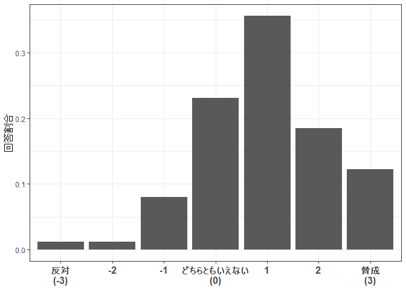

``` r
ggsave("../out/v4_dvdist.png", p, width=7, height=5)
```

独立変数：イデオロギー
----------------------

### 自己申告イデオロギー

``` r
tab <- table(d$ide_self)/sum(table(d$ide_self))
tab <- data.frame(prop = as.numeric(tab),
                  names = c("左派/\nリベラル\n(-3)","-2","-1",
                            "中立\n(0)","1","2","右派/\n保守\n(3)"))
tab$names <- factor(tab$names, levels=tab$names)

p1 <- ggplot(tab, aes(x=names,y=prop)) + 
  geom_bar(stat="identity") + 
  ylab(NULL) + xlab(NULL) + 
  ggtitle("自己申告\nイデオロギー\n（度数分布）") + 
  theme_bw() + 
  theme(plot.title = element_text(hjust=0.5, face="bold"),
        axis.text.x = element_text(size=12, face="bold"))
p1
```

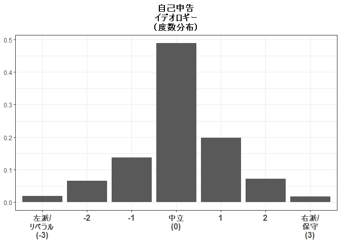

### 争点態度イデオロギー

``` r
p2_1 <- ggplot(d, aes(x=ide_iss_1,y=..count../sum(..count..))) + 
  geom_histogram(bins=10,color="white") +
  ylab(NULL) + xlab(NULL) + 
  ggtitle("外交安全保障\nイデオロギー\n（ヒストグラム）") + 
  scale_x_continuous(breaks=c(-3,-2,-1,0,1,2,3),
                     limits=c(-3,3),
                     labels=c("左派\n(-3)\n","-2","-1","0","1","2","右派\n(3)\n")) +
  theme_bw() + 
  theme(plot.title = element_text(hjust=0.5, face="bold"),
        axis.text.x = element_text(size=12, face="bold"))
p2_1
```

    ## Warning: Removed 2 rows containing non-finite values (stat_bin).

    ## Warning: Removed 1 rows containing missing values (geom_bar).

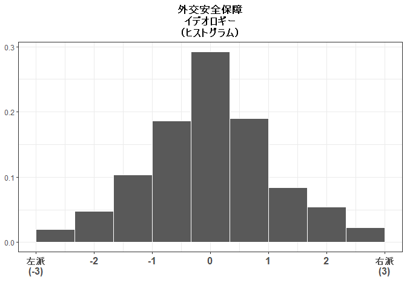

``` r
p2_2 <- ggplot(d, aes(x=ide_iss_2,y=..count../sum(..count..))) + 
  geom_histogram(bins=10,color="white") +
  ylab(NULL) + xlab(NULL) + 
  ggtitle("権利機会平等\nイデオロギー\n（ヒストグラム）") + 
  scale_x_continuous(breaks=c(-3,-2,-1,0,1,2,3),
                     limits=c(-3,3),
                     labels=c("左派\n(-3)\n","-2","-1","0","1","2","右派\n(3)\n")) +
  theme_bw() + 
  theme(plot.title = element_text(hjust=0.5, face="bold"),
        axis.text.x = element_text(size=12, face="bold"))
p2_2
```

    ## Warning: Removed 15 rows containing non-finite values (stat_bin).

    ## Warning: Removed 1 rows containing missing values (geom_bar).

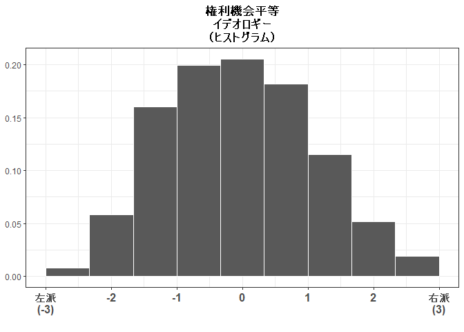

### 政党支持イデオロギー

``` r
tab <- table(d$ide_psup)/sum(table(d$ide_psup))
tab <- data.frame(prop = as.numeric(tab),
                  names = c("左派\n政党支持\n(-1)","無党派\nその他\n(0)",
                            "右派\n政党支持\n(1)"))
tab$names <- factor(tab$names, levels=tab$names)

p3 <- ggplot(tab, aes(x=names,y=prop)) + 
  geom_bar(stat="identity") + 
  ylab(NULL) + xlab(NULL) + 
  ggtitle("政党支持\nイデオロギー\n（度数分布）") + 
  theme_bw() + 
  theme(plot.title = element_text(hjust=0.5, face="bold"),
        axis.text.x = element_text(size=12, face="bold"))
p3
```

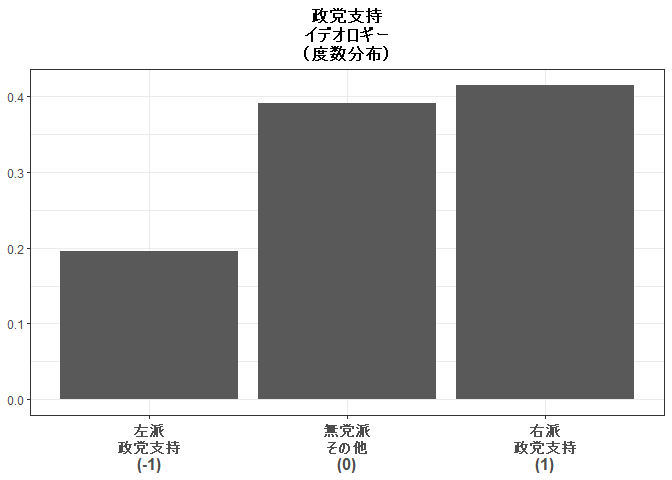

``` r
ggplot() + theme_void()
p <- arrangeGrob(p1,p3,p2_1,p2_2, nrow=1, left="回答割合")
```

    ## Warning: Removed 2 rows containing non-finite values (stat_bin).

    ## Warning: Removed 1 rows containing missing values (geom_bar).

    ## Warning: Removed 15 rows containing non-finite values (stat_bin).

    ## Warning: Removed 1 rows containing missing values (geom_bar).

``` r
grid.draw(p)
```

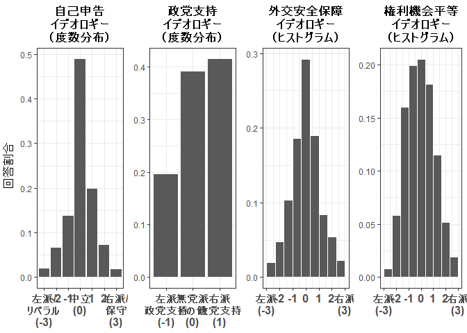

``` r
ggsave("../out/v4_idedist123.png", p, width=9.5, height=4)
```

### 自己申告イデオロギーと争点態度イデオロギーの相関

``` r
p12cor_1 <- ggplot(d, aes(x=ide_self,y=ide_iss_1)) + 
  geom_jitter(alpha=0.6, width=0.2, height=0.2,size=2) + 
  ylab("外交安全保障イデオロギー") + 
  xlab("自己申告イデオロギー") + 
  annotate("text", x=-2.5, y=3.2, size=4.5,
           label=paste("r =",round(cor(d$ide_self,d$ide_iss_1),3))) + 
  scale_x_continuous(breaks=c(-3,-2,-1,0,1,2,3),
                     labels=c("左派/\nリベラル\n(-3)","-2","-1",
                              "中立\n(0)","1","2","右派/\n保守\n(3)")) + 
  scale_y_continuous(breaks=c(-3,-2,-1,0,1,2,3),
                     #limits=c(-3,3),
                     labels=c("左派(-3)","-2","-1","0","1","2","右派(3)")) +
  theme_bw() + 
  theme(plot.title = element_text(hjust=0.5, face="bold"),
        axis.title = element_text(size=12, face="bold"),
        axis.text = element_text(size=12, face="bold"))
p12cor_1
```

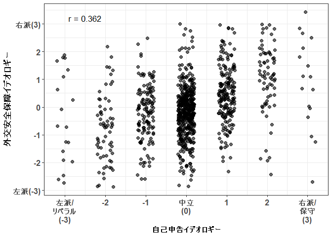

``` r
p12cor_2 <- ggplot(d, aes(x=ide_self,y=ide_iss_2)) + 
  geom_jitter(alpha=0.6, width=0.2, height=0.2,size=2) + 
  ylab("権利機会平等イデオロギー") + 
  xlab("自己申告イデオロギー") + 
  annotate("text", x=-2.5, y=3.5, size=4.5,
           label=paste("r =",round(cor(d$ide_self,d$ide_iss_2),3))) + 
  scale_x_continuous(breaks=c(-3,-2,-1,0,1,2,3),
                     labels=c("左派/\nリベラル\n(-3)","-2","-1",
                              "中立\n(0)","1","2","右派/\n保守\n(3)")) + 
  scale_y_continuous(breaks=c(-3,-2,-1,0,1,2,3),
                     #limits=c(-3,3),
                     labels=c("左派(-3)","-2","-1","0","1","2","右派(3)")) +
  theme_bw() + 
  theme(plot.title = element_text(hjust=0.5, face="bold"),
        axis.title = element_text(size=12, face="bold"),
        axis.text = element_text(size=12, face="bold"))
p12cor_2
```

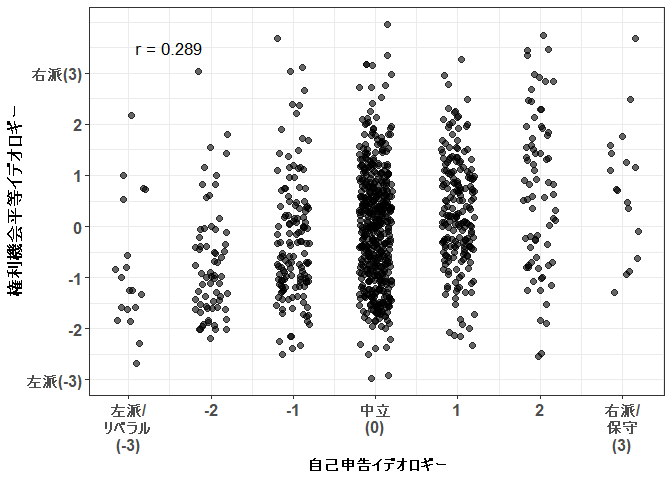

``` r
ggplot() + theme_void()
p12cor <- arrangeGrob(p12cor_1 + xlab(NULL) + ylab(NULL) + ggtitle("外交安全保障"),
                 p12cor_2 + xlab(NULL) + ylab(NULL) + ggtitle("権利機会平等"), 
                 nrow=1, left="争点態度イデオロギー",
                 bottom="自己申告イデオロギー")
grid.draw(p12cor)
```

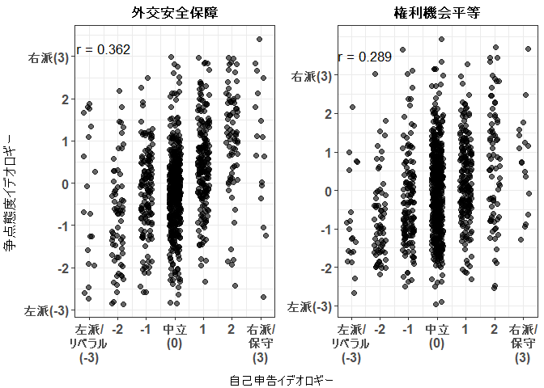

実験群比較
==========

準備
----

``` r
# 統制変数
ctl <- formula( ~ .+ knall + fem + age + lvlen + ownh + 
                  as.factor(edu3) + wk + mar + cld)

# 予測値計算用データ
preddata <- data.frame(g_easing_N = seq(0,4,1))
preddata$knall = median(d$knall,na.rm=TRUE)
preddata$fem = median(d$fem, na.rm=TRUE)
preddata$age = median(d$age, na.rm=TRUE)
preddata$lvlen = median(d$lvlen, na.rm=TRUE)
preddata$ownh = median(d$ownh, na.rm=TRUE)
preddata$edu3 = median(as.numeric(d$edu3)-1, na.rm=TRUE)
preddata$wk = median(d$wk, na.rm=TRUE)
preddata$mar = median(d$mar, na.rm=TRUE)
preddata$cld = median(d$cld, na.rm=TRUE)[1]

# 変数名
vn <- c("（定数項）",
        "1.経済成長",
        "2.経済成長＆貧困削減",
        "3.経済成長＆学者賛成",
        "4.経済成長＆貧困＆学者",
        "政治知識","性別（女性）",
        "年齢","居住年数","持ち家",
        "教育：短大／高専／専門学校",
        "教育：大卒以上",
        "就労","婚姻","子ども")
vnx <- c(vn[1:5],"イデオロギー",vn[6:15],
         "イデオロギー×1.成長",
         "イデオロギー×2.成長＆貧困",
         "イデオロギー×3.成長＆学者",
         "イデオロギー×4.成長＆貧困＆学者",
         "イデオロギー",
         "イデオロギー×1.成長",
         "イデオロギー×2.成長＆貧困",
         "イデオロギー×3.成長＆学者",
         "イデオロギー×4.成長＆貧困＆学者",
         "イデオロギー",
         "イデオロギー×1.成長",
         "イデオロギー×2.成長＆貧困",
         "イデオロギー×3.成長＆学者",
         "イデオロギー×4.成長＆貧困＆学者")
vnx2 <- c(vn,vnx[c(6,17:30)])
```

自己申告イデオロギー条件付け
----------------------------

``` r
## Main Models
mx_easing <- lm(update(easing_opi ~ factor(g_easing_N,levels=c("1","0","2","3","4"))*ide_self,ctl), data=d)
coeftest(mx_easing, vcovHC(mx_easing, "HC1"))
```

    ## 
    ## t test of coefficients:
    ## 
    ##                                                                     Estimate
    ## (Intercept)                                                        1.2300654
    ## factor(g_easing_N, levels = c("1", "0", "2", "3", "4"))0          -0.1280661
    ## factor(g_easing_N, levels = c("1", "0", "2", "3", "4"))2           0.1506110
    ## factor(g_easing_N, levels = c("1", "0", "2", "3", "4"))3           0.0086499
    ## factor(g_easing_N, levels = c("1", "0", "2", "3", "4"))4           0.2540825
    ## ide_self                                                           0.1922437
    ## knall                                                              0.2622539
    ## fem                                                               -0.3237358
    ## age                                                               -0.0067726
    ## lvlen                                                             -0.0713992
    ## ownh                                                               0.0028695
    ## as.factor(edu3)1                                                   0.1747093
    ## as.factor(edu3)2                                                   0.0875030
    ## wk                                                                 0.0136266
    ## mar                                                               -0.1320398
    ## cld                                                                0.2113174
    ## factor(g_easing_N, levels = c("1", "0", "2", "3", "4"))0:ide_self -0.0330658
    ## factor(g_easing_N, levels = c("1", "0", "2", "3", "4"))2:ide_self  0.0156258
    ## factor(g_easing_N, levels = c("1", "0", "2", "3", "4"))3:ide_self -0.0080513
    ## factor(g_easing_N, levels = c("1", "0", "2", "3", "4"))4:ide_self -0.3047746
    ##                                                                   Std. Error
    ## (Intercept)                                                        0.2210885
    ## factor(g_easing_N, levels = c("1", "0", "2", "3", "4"))0           0.1291646
    ## factor(g_easing_N, levels = c("1", "0", "2", "3", "4"))2           0.1352602
    ## factor(g_easing_N, levels = c("1", "0", "2", "3", "4"))3           0.1298240
    ## factor(g_easing_N, levels = c("1", "0", "2", "3", "4"))4           0.1299033
    ## ide_self                                                           0.0890765
    ## knall                                                              0.1547369
    ## fem                                                                0.0878332
    ## age                                                                0.0040678
    ## lvlen                                                              0.0316058
    ## ownh                                                               0.0897218
    ## as.factor(edu3)1                                                   0.1399967
    ## as.factor(edu3)2                                                   0.1095950
    ## wk                                                                 0.0908276
    ## mar                                                                0.1193442
    ## cld                                                                0.1200059
    ## factor(g_easing_N, levels = c("1", "0", "2", "3", "4"))0:ide_self  0.1226934
    ## factor(g_easing_N, levels = c("1", "0", "2", "3", "4"))2:ide_self  0.1218803
    ## factor(g_easing_N, levels = c("1", "0", "2", "3", "4"))3:ide_self  0.1147478
    ## factor(g_easing_N, levels = c("1", "0", "2", "3", "4"))4:ide_self  0.1247498
    ##                                                                   t value
    ## (Intercept)                                                        5.5637
    ## factor(g_easing_N, levels = c("1", "0", "2", "3", "4"))0          -0.9915
    ## factor(g_easing_N, levels = c("1", "0", "2", "3", "4"))2           1.1135
    ## factor(g_easing_N, levels = c("1", "0", "2", "3", "4"))3           0.0666
    ## factor(g_easing_N, levels = c("1", "0", "2", "3", "4"))4           1.9559
    ## ide_self                                                           2.1582
    ## knall                                                              1.6948
    ## fem                                                               -3.6858
    ## age                                                               -1.6649
    ## lvlen                                                             -2.2591
    ## ownh                                                               0.0320
    ## as.factor(edu3)1                                                   1.2480
    ## as.factor(edu3)2                                                   0.7984
    ## wk                                                                 0.1500
    ## mar                                                               -1.1064
    ## cld                                                                1.7609
    ## factor(g_easing_N, levels = c("1", "0", "2", "3", "4"))0:ide_self -0.2695
    ## factor(g_easing_N, levels = c("1", "0", "2", "3", "4"))2:ide_self  0.1282
    ## factor(g_easing_N, levels = c("1", "0", "2", "3", "4"))3:ide_self -0.0702
    ## factor(g_easing_N, levels = c("1", "0", "2", "3", "4"))4:ide_self -2.4431
    ##                                                                    Pr(>|t|)
    ## (Intercept)                                                       3.477e-08
    ## factor(g_easing_N, levels = c("1", "0", "2", "3", "4"))0          0.3217083
    ## factor(g_easing_N, levels = c("1", "0", "2", "3", "4"))2          0.2657928
    ## factor(g_easing_N, levels = c("1", "0", "2", "3", "4"))3          0.9468924
    ## factor(g_easing_N, levels = c("1", "0", "2", "3", "4"))4          0.0507795
    ## ide_self                                                          0.0311751
    ## knall                                                             0.0904495
    ## fem                                                               0.0002415
    ## age                                                               0.0962750
    ## lvlen                                                             0.0241168
    ## ownh                                                              0.9744932
    ## as.factor(edu3)1                                                  0.2123704
    ## as.factor(edu3)2                                                  0.4248351
    ## wk                                                                0.8807771
    ## mar                                                               0.2688563
    ## cld                                                               0.0785937
    ## factor(g_easing_N, levels = c("1", "0", "2", "3", "4"))0:ide_self 0.7876065
    ## factor(g_easing_N, levels = c("1", "0", "2", "3", "4"))2:ide_self 0.8980140
    ## factor(g_easing_N, levels = c("1", "0", "2", "3", "4"))3:ide_self 0.9440777
    ## factor(g_easing_N, levels = c("1", "0", "2", "3", "4"))4:ide_self 0.0147520
    ##                                                                      
    ## (Intercept)                                                       ***
    ## factor(g_easing_N, levels = c("1", "0", "2", "3", "4"))0             
    ## factor(g_easing_N, levels = c("1", "0", "2", "3", "4"))2             
    ## factor(g_easing_N, levels = c("1", "0", "2", "3", "4"))3             
    ## factor(g_easing_N, levels = c("1", "0", "2", "3", "4"))4          .  
    ## ide_self                                                          *  
    ## knall                                                             .  
    ## fem                                                               ***
    ## age                                                               .  
    ## lvlen                                                             *  
    ## ownh                                                                 
    ## as.factor(edu3)1                                                     
    ## as.factor(edu3)2                                                     
    ## wk                                                                   
    ## mar                                                                  
    ## cld                                                               .  
    ## factor(g_easing_N, levels = c("1", "0", "2", "3", "4"))0:ide_self    
    ## factor(g_easing_N, levels = c("1", "0", "2", "3", "4"))2:ide_self    
    ## factor(g_easing_N, levels = c("1", "0", "2", "3", "4"))3:ide_self    
    ## factor(g_easing_N, levels = c("1", "0", "2", "3", "4"))4:ide_self *  
    ## ---
    ## Signif. codes:  0 '***' 0.001 '**' 0.01 '*' 0.05 '.' 0.1 ' ' 1

``` r
m1h3a <- mx_easing
mx_easing <- lm(update(easing_opi ~ factor(g_easing_N,levels=c("2","0","1","3","4"))*ide_self,ctl), data=d)
coeftest(mx_easing, vcovHC(mx_easing, "HC1"))
```

    ## 
    ## t test of coefficients:
    ## 
    ##                                                                     Estimate
    ## (Intercept)                                                        1.3806764
    ## factor(g_easing_N, levels = c("2", "0", "1", "3", "4"))0          -0.2786771
    ## factor(g_easing_N, levels = c("2", "0", "1", "3", "4"))1          -0.1506110
    ## factor(g_easing_N, levels = c("2", "0", "1", "3", "4"))3          -0.1419610
    ## factor(g_easing_N, levels = c("2", "0", "1", "3", "4"))4           0.1034715
    ## ide_self                                                           0.2078696
    ## knall                                                              0.2622539
    ## fem                                                               -0.3237358
    ## age                                                               -0.0067726
    ## lvlen                                                             -0.0713992
    ## ownh                                                               0.0028695
    ## as.factor(edu3)1                                                   0.1747093
    ## as.factor(edu3)2                                                   0.0875030
    ## wk                                                                 0.0136266
    ## mar                                                               -0.1320398
    ## cld                                                                0.2113174
    ## factor(g_easing_N, levels = c("2", "0", "1", "3", "4"))0:ide_self -0.0486917
    ## factor(g_easing_N, levels = c("2", "0", "1", "3", "4"))1:ide_self -0.0156258
    ## factor(g_easing_N, levels = c("2", "0", "1", "3", "4"))3:ide_self -0.0236771
    ## factor(g_easing_N, levels = c("2", "0", "1", "3", "4"))4:ide_self -0.3204005
    ##                                                                   Std. Error
    ## (Intercept)                                                        0.2252181
    ## factor(g_easing_N, levels = c("2", "0", "1", "3", "4"))0           0.1258302
    ## factor(g_easing_N, levels = c("2", "0", "1", "3", "4"))1           0.1352602
    ## factor(g_easing_N, levels = c("2", "0", "1", "3", "4"))3           0.1254286
    ## factor(g_easing_N, levels = c("2", "0", "1", "3", "4"))4           0.1245133
    ## ide_self                                                           0.0837034
    ## knall                                                              0.1547369
    ## fem                                                                0.0878332
    ## age                                                                0.0040678
    ## lvlen                                                              0.0316058
    ## ownh                                                               0.0897218
    ## as.factor(edu3)1                                                   0.1399967
    ## as.factor(edu3)2                                                   0.1095950
    ## wk                                                                 0.0908276
    ## mar                                                                0.1193442
    ## cld                                                                0.1200059
    ## factor(g_easing_N, levels = c("2", "0", "1", "3", "4"))0:ide_self  0.1185678
    ## factor(g_easing_N, levels = c("2", "0", "1", "3", "4"))1:ide_self  0.1218803
    ## factor(g_easing_N, levels = c("2", "0", "1", "3", "4"))3:ide_self  0.1112586
    ## factor(g_easing_N, levels = c("2", "0", "1", "3", "4"))4:ide_self  0.1210004
    ##                                                                   t value
    ## (Intercept)                                                        6.1304
    ## factor(g_easing_N, levels = c("2", "0", "1", "3", "4"))0          -2.2147
    ## factor(g_easing_N, levels = c("2", "0", "1", "3", "4"))1          -1.1135
    ## factor(g_easing_N, levels = c("2", "0", "1", "3", "4"))3          -1.1318
    ## factor(g_easing_N, levels = c("2", "0", "1", "3", "4"))4           0.8310
    ## ide_self                                                           2.4834
    ## knall                                                              1.6948
    ## fem                                                               -3.6858
    ## age                                                               -1.6649
    ## lvlen                                                             -2.2591
    ## ownh                                                               0.0320
    ## as.factor(edu3)1                                                   1.2480
    ## as.factor(edu3)2                                                   0.7984
    ## wk                                                                 0.1500
    ## mar                                                               -1.1064
    ## cld                                                                1.7609
    ## factor(g_easing_N, levels = c("2", "0", "1", "3", "4"))0:ide_self -0.4107
    ## factor(g_easing_N, levels = c("2", "0", "1", "3", "4"))1:ide_self -0.1282
    ## factor(g_easing_N, levels = c("2", "0", "1", "3", "4"))3:ide_self -0.2128
    ## factor(g_easing_N, levels = c("2", "0", "1", "3", "4"))4:ide_self -2.6479
    ##                                                                    Pr(>|t|)
    ## (Intercept)                                                       1.306e-09
    ## factor(g_easing_N, levels = c("2", "0", "1", "3", "4"))0          0.0270281
    ## factor(g_easing_N, levels = c("2", "0", "1", "3", "4"))1          0.2657928
    ## factor(g_easing_N, levels = c("2", "0", "1", "3", "4"))3          0.2580146
    ## factor(g_easing_N, levels = c("2", "0", "1", "3", "4"))4          0.4061881
    ## ide_self                                                          0.0131929
    ## knall                                                             0.0904495
    ## fem                                                               0.0002415
    ## age                                                               0.0962750
    ## lvlen                                                             0.0241168
    ## ownh                                                              0.9744932
    ## as.factor(edu3)1                                                  0.2123704
    ## as.factor(edu3)2                                                  0.4248351
    ## wk                                                                0.8807771
    ## mar                                                               0.2688563
    ## cld                                                               0.0785937
    ## factor(g_easing_N, levels = c("2", "0", "1", "3", "4"))0:ide_self 0.6814148
    ## factor(g_easing_N, levels = c("2", "0", "1", "3", "4"))1:ide_self 0.8980140
    ## factor(g_easing_N, levels = c("2", "0", "1", "3", "4"))3:ide_self 0.8315216
    ## factor(g_easing_N, levels = c("2", "0", "1", "3", "4"))4:ide_self 0.0082392
    ##                                                                      
    ## (Intercept)                                                       ***
    ## factor(g_easing_N, levels = c("2", "0", "1", "3", "4"))0          *  
    ## factor(g_easing_N, levels = c("2", "0", "1", "3", "4"))1             
    ## factor(g_easing_N, levels = c("2", "0", "1", "3", "4"))3             
    ## factor(g_easing_N, levels = c("2", "0", "1", "3", "4"))4             
    ## ide_self                                                          *  
    ## knall                                                             .  
    ## fem                                                               ***
    ## age                                                               .  
    ## lvlen                                                             *  
    ## ownh                                                                 
    ## as.factor(edu3)1                                                     
    ## as.factor(edu3)2                                                     
    ## wk                                                                   
    ## mar                                                                  
    ## cld                                                               .  
    ## factor(g_easing_N, levels = c("2", "0", "1", "3", "4"))0:ide_self    
    ## factor(g_easing_N, levels = c("2", "0", "1", "3", "4"))1:ide_self    
    ## factor(g_easing_N, levels = c("2", "0", "1", "3", "4"))3:ide_self    
    ## factor(g_easing_N, levels = c("2", "0", "1", "3", "4"))4:ide_self ** 
    ## ---
    ## Signif. codes:  0 '***' 0.001 '**' 0.01 '*' 0.05 '.' 0.1 ' ' 1

``` r
m1h3b <- mx_easing
mx_easing <- lm(update(easing_opi ~ as.factor(g_easing_N)*ide_self,ctl), data=d)
m1 <- mx_easing
coeftest(mx_easing, vcovHC(mx_easing, "HC1"))
```

    ## 
    ## t test of coefficients:
    ## 
    ##                                   Estimate Std. Error t value  Pr(>|t|)
    ## (Intercept)                      1.1019993  0.2235865  4.9287 9.838e-07
    ## as.factor(g_easing_N)1           0.1280661  0.1291646  0.9915 0.3217083
    ## as.factor(g_easing_N)2           0.2786771  0.1258302  2.2147 0.0270281
    ## as.factor(g_easing_N)3           0.1367160  0.1211865  1.1281 0.2595566
    ## as.factor(g_easing_N)4           0.3821485  0.1190130  3.2110 0.0013694
    ## ide_self                         0.1591779  0.0847669  1.8778 0.0607250
    ## knall                            0.2622539  0.1547369  1.6948 0.0904495
    ## fem                             -0.3237358  0.0878332 -3.6858 0.0002415
    ## age                             -0.0067726  0.0040678 -1.6649 0.0962750
    ## lvlen                           -0.0713992  0.0316058 -2.2591 0.0241168
    ## ownh                             0.0028695  0.0897218  0.0320 0.9744932
    ## as.factor(edu3)1                 0.1747093  0.1399967  1.2480 0.2123704
    ## as.factor(edu3)2                 0.0875030  0.1095950  0.7984 0.4248351
    ## wk                               0.0136266  0.0908276  0.1500 0.8807771
    ## mar                             -0.1320398  0.1193442 -1.1064 0.2688563
    ## cld                              0.2113174  0.1200059  1.7609 0.0785937
    ## as.factor(g_easing_N)1:ide_self  0.0330658  0.1226934  0.2695 0.7876065
    ## as.factor(g_easing_N)2:ide_self  0.0486917  0.1185678  0.4107 0.6814148
    ## as.factor(g_easing_N)3:ide_self  0.0250145  0.1114570  0.2244 0.8224715
    ## as.factor(g_easing_N)4:ide_self -0.2717088  0.1232360 -2.2048 0.0277196
    ##                                    
    ## (Intercept)                     ***
    ## as.factor(g_easing_N)1             
    ## as.factor(g_easing_N)2          *  
    ## as.factor(g_easing_N)3             
    ## as.factor(g_easing_N)4          ** 
    ## ide_self                        .  
    ## knall                           .  
    ## fem                             ***
    ## age                             .  
    ## lvlen                           *  
    ## ownh                               
    ## as.factor(edu3)1                   
    ## as.factor(edu3)2                   
    ## wk                                 
    ## mar                                
    ## cld                             .  
    ## as.factor(g_easing_N)1:ide_self    
    ## as.factor(g_easing_N)2:ide_self    
    ## as.factor(g_easing_N)3:ide_self    
    ## as.factor(g_easing_N)4:ide_self *  
    ## ---
    ## Signif. codes:  0 '***' 0.001 '**' 0.01 '*' 0.05 '.' 0.1 ' ' 1

``` r
## Marginal Effect
m1_mg <- simu_interact(m1,"ide_self",moveprof=data.frame(g_easing_N=seq(0,4,1)),
                       vcov.est = "robust")
m1_mg90 <- simu_interact(m1,"ide_self",moveprof=data.frame(g_easing_N=seq(0,4,1)),
                           level.ci = 0.90, vcov.est = "robust")
```

争点態度イデオロギー条件付け
----------------------------

### 外交安全保障イデオロギー

``` r
## Main Models
mx_easing <- lm(update(easing_opi ~ factor(g_easing_N,levels=c("1","0","2","3","4"))*ide_iss_1,ctl), data=d)
coeftest(mx_easing, vcovHC(mx_easing, "HC1"))
```

    ## 
    ## t test of coefficients:
    ## 
    ##                                                                      Estimate
    ## (Intercept)                                                         1.1096421
    ## factor(g_easing_N, levels = c("1", "0", "2", "3", "4"))0           -0.1579272
    ## factor(g_easing_N, levels = c("1", "0", "2", "3", "4"))2            0.1461717
    ## factor(g_easing_N, levels = c("1", "0", "2", "3", "4"))3            0.0016214
    ## factor(g_easing_N, levels = c("1", "0", "2", "3", "4"))4            0.2439286
    ## ide_iss_1                                                           0.4531974
    ## knall                                                               0.2177209
    ## fem                                                                -0.2055631
    ## age                                                                -0.0044287
    ## lvlen                                                              -0.0627568
    ## ownh                                                               -0.0180691
    ## as.factor(edu3)1                                                    0.1786036
    ## as.factor(edu3)2                                                    0.1497945
    ## wk                                                                 -0.0186995
    ## mar                                                                -0.1998430
    ## cld                                                                 0.2693820
    ## factor(g_easing_N, levels = c("1", "0", "2", "3", "4"))0:ide_iss_1 -0.0891627
    ## factor(g_easing_N, levels = c("1", "0", "2", "3", "4"))2:ide_iss_1 -0.0964432
    ## factor(g_easing_N, levels = c("1", "0", "2", "3", "4"))3:ide_iss_1 -0.1256131
    ## factor(g_easing_N, levels = c("1", "0", "2", "3", "4"))4:ide_iss_1 -0.3049099
    ##                                                                    Std. Error
    ## (Intercept)                                                         0.2094936
    ## factor(g_easing_N, levels = c("1", "0", "2", "3", "4"))0            0.1213284
    ## factor(g_easing_N, levels = c("1", "0", "2", "3", "4"))2            0.1278352
    ## factor(g_easing_N, levels = c("1", "0", "2", "3", "4"))3            0.1225159
    ## factor(g_easing_N, levels = c("1", "0", "2", "3", "4"))4            0.1253330
    ## ide_iss_1                                                           0.1023500
    ## knall                                                               0.1480715
    ## fem                                                                 0.0873480
    ## age                                                                 0.0038611
    ## lvlen                                                               0.0298686
    ## ownh                                                                0.0863616
    ## as.factor(edu3)1                                                    0.1365318
    ## as.factor(edu3)2                                                    0.1063507
    ## wk                                                                  0.0878038
    ## mar                                                                 0.1170878
    ## cld                                                                 0.1170687
    ## factor(g_easing_N, levels = c("1", "0", "2", "3", "4"))0:ide_iss_1  0.1278645
    ## factor(g_easing_N, levels = c("1", "0", "2", "3", "4"))2:ide_iss_1  0.1329909
    ## factor(g_easing_N, levels = c("1", "0", "2", "3", "4"))3:ide_iss_1  0.1253218
    ## factor(g_easing_N, levels = c("1", "0", "2", "3", "4"))4:ide_iss_1  0.1287906
    ##                                                                    t value
    ## (Intercept)                                                         5.2968
    ## factor(g_easing_N, levels = c("1", "0", "2", "3", "4"))0           -1.3017
    ## factor(g_easing_N, levels = c("1", "0", "2", "3", "4"))2            1.1434
    ## factor(g_easing_N, levels = c("1", "0", "2", "3", "4"))3            0.0132
    ## factor(g_easing_N, levels = c("1", "0", "2", "3", "4"))4            1.9462
    ## ide_iss_1                                                           4.4279
    ## knall                                                               1.4704
    ## fem                                                                -2.3534
    ## age                                                                -1.1470
    ## lvlen                                                              -2.1011
    ## ownh                                                               -0.2092
    ## as.factor(edu3)1                                                    1.3081
    ## as.factor(edu3)2                                                    1.4085
    ## wk                                                                 -0.2130
    ## mar                                                                -1.7068
    ## cld                                                                 2.3011
    ## factor(g_easing_N, levels = c("1", "0", "2", "3", "4"))0:ide_iss_1 -0.6973
    ## factor(g_easing_N, levels = c("1", "0", "2", "3", "4"))2:ide_iss_1 -0.7252
    ## factor(g_easing_N, levels = c("1", "0", "2", "3", "4"))3:ide_iss_1 -1.0023
    ## factor(g_easing_N, levels = c("1", "0", "2", "3", "4"))4:ide_iss_1 -2.3675
    ##                                                                     Pr(>|t|)
    ## (Intercept)                                                        1.480e-07
    ## factor(g_easing_N, levels = c("1", "0", "2", "3", "4"))0             0.19337
    ## factor(g_easing_N, levels = c("1", "0", "2", "3", "4"))2             0.25316
    ## factor(g_easing_N, levels = c("1", "0", "2", "3", "4"))3             0.98944
    ## factor(g_easing_N, levels = c("1", "0", "2", "3", "4"))4             0.05193
    ## ide_iss_1                                                          1.067e-05
    ## knall                                                                0.14181
    ## fem                                                                  0.01882
    ## age                                                                  0.25169
    ## lvlen                                                                0.03591
    ## ownh                                                                 0.83432
    ## as.factor(edu3)1                                                     0.19116
    ## as.factor(edu3)2                                                     0.15933
    ## wk                                                                   0.83140
    ## mar                                                                  0.08821
    ## cld                                                                  0.02161
    ## factor(g_easing_N, levels = c("1", "0", "2", "3", "4"))0:ide_iss_1   0.48578
    ## factor(g_easing_N, levels = c("1", "0", "2", "3", "4"))2:ide_iss_1   0.46852
    ## factor(g_easing_N, levels = c("1", "0", "2", "3", "4"))3:ide_iss_1   0.31645
    ## factor(g_easing_N, levels = c("1", "0", "2", "3", "4"))4:ide_iss_1   0.01812
    ##                                                                       
    ## (Intercept)                                                        ***
    ## factor(g_easing_N, levels = c("1", "0", "2", "3", "4"))0              
    ## factor(g_easing_N, levels = c("1", "0", "2", "3", "4"))2              
    ## factor(g_easing_N, levels = c("1", "0", "2", "3", "4"))3              
    ## factor(g_easing_N, levels = c("1", "0", "2", "3", "4"))4           .  
    ## ide_iss_1                                                          ***
    ## knall                                                                 
    ## fem                                                                *  
    ## age                                                                   
    ## lvlen                                                              *  
    ## ownh                                                                  
    ## as.factor(edu3)1                                                      
    ## as.factor(edu3)2                                                      
    ## wk                                                                    
    ## mar                                                                .  
    ## cld                                                                *  
    ## factor(g_easing_N, levels = c("1", "0", "2", "3", "4"))0:ide_iss_1    
    ## factor(g_easing_N, levels = c("1", "0", "2", "3", "4"))2:ide_iss_1    
    ## factor(g_easing_N, levels = c("1", "0", "2", "3", "4"))3:ide_iss_1    
    ## factor(g_easing_N, levels = c("1", "0", "2", "3", "4"))4:ide_iss_1 *  
    ## ---
    ## Signif. codes:  0 '***' 0.001 '**' 0.01 '*' 0.05 '.' 0.1 ' ' 1

``` r
m2h3a_1 <- mx_easing
mx_easing <- lm(update(easing_opi ~ factor(g_easing_N,levels=c("2","0","1","3","4"))*ide_iss_1,ctl), data=d)
coeftest(mx_easing, vcovHC(mx_easing, "HC1"))
```

    ## 
    ## t test of coefficients:
    ## 
    ##                                                                      Estimate
    ## (Intercept)                                                         1.2558138
    ## factor(g_easing_N, levels = c("2", "0", "1", "3", "4"))0           -0.3040989
    ## factor(g_easing_N, levels = c("2", "0", "1", "3", "4"))1           -0.1461717
    ## factor(g_easing_N, levels = c("2", "0", "1", "3", "4"))3           -0.1445503
    ## factor(g_easing_N, levels = c("2", "0", "1", "3", "4"))4            0.0977569
    ## ide_iss_1                                                           0.3567542
    ## knall                                                               0.2177209
    ## fem                                                                -0.2055631
    ## age                                                                -0.0044287
    ## lvlen                                                              -0.0627568
    ## ownh                                                               -0.0180691
    ## as.factor(edu3)1                                                    0.1786036
    ## as.factor(edu3)2                                                    0.1497945
    ## wk                                                                 -0.0186995
    ## mar                                                                -0.1998430
    ## cld                                                                 0.2693820
    ## factor(g_easing_N, levels = c("2", "0", "1", "3", "4"))0:ide_iss_1  0.0072804
    ## factor(g_easing_N, levels = c("2", "0", "1", "3", "4"))1:ide_iss_1  0.0964432
    ## factor(g_easing_N, levels = c("2", "0", "1", "3", "4"))3:ide_iss_1 -0.0291699
    ## factor(g_easing_N, levels = c("2", "0", "1", "3", "4"))4:ide_iss_1 -0.2084667
    ##                                                                    Std. Error
    ## (Intercept)                                                         0.2139712
    ## factor(g_easing_N, levels = c("2", "0", "1", "3", "4"))0            0.1209380
    ## factor(g_easing_N, levels = c("2", "0", "1", "3", "4"))1            0.1278352
    ## factor(g_easing_N, levels = c("2", "0", "1", "3", "4"))3            0.1204050
    ## factor(g_easing_N, levels = c("2", "0", "1", "3", "4"))4            0.1219023
    ## ide_iss_1                                                           0.0862923
    ## knall                                                               0.1480715
    ## fem                                                                 0.0873480
    ## age                                                                 0.0038611
    ## lvlen                                                               0.0298686
    ## ownh                                                                0.0863616
    ## as.factor(edu3)1                                                    0.1365318
    ## as.factor(edu3)2                                                    0.1063507
    ## wk                                                                  0.0878038
    ## mar                                                                 0.1170878
    ## cld                                                                 0.1170687
    ## factor(g_easing_N, levels = c("2", "0", "1", "3", "4"))0:ide_iss_1  0.1158606
    ## factor(g_easing_N, levels = c("2", "0", "1", "3", "4"))1:ide_iss_1  0.1329909
    ## factor(g_easing_N, levels = c("2", "0", "1", "3", "4"))3:ide_iss_1  0.1131693
    ## factor(g_easing_N, levels = c("2", "0", "1", "3", "4"))4:ide_iss_1  0.1170396
    ##                                                                    t value
    ## (Intercept)                                                         5.8691
    ## factor(g_easing_N, levels = c("2", "0", "1", "3", "4"))0           -2.5145
    ## factor(g_easing_N, levels = c("2", "0", "1", "3", "4"))1           -1.1434
    ## factor(g_easing_N, levels = c("2", "0", "1", "3", "4"))3           -1.2005
    ## factor(g_easing_N, levels = c("2", "0", "1", "3", "4"))4            0.8019
    ## ide_iss_1                                                           4.1343
    ## knall                                                               1.4704
    ## fem                                                                -2.3534
    ## age                                                                -1.1470
    ## lvlen                                                              -2.1011
    ## ownh                                                               -0.2092
    ## as.factor(edu3)1                                                    1.3081
    ## as.factor(edu3)2                                                    1.4085
    ## wk                                                                 -0.2130
    ## mar                                                                -1.7068
    ## cld                                                                 2.3011
    ## factor(g_easing_N, levels = c("2", "0", "1", "3", "4"))0:ide_iss_1  0.0628
    ## factor(g_easing_N, levels = c("2", "0", "1", "3", "4"))1:ide_iss_1  0.7252
    ## factor(g_easing_N, levels = c("2", "0", "1", "3", "4"))3:ide_iss_1 -0.2578
    ## factor(g_easing_N, levels = c("2", "0", "1", "3", "4"))4:ide_iss_1 -1.7812
    ##                                                                     Pr(>|t|)
    ## (Intercept)                                                        6.141e-09
    ## factor(g_easing_N, levels = c("2", "0", "1", "3", "4"))0             0.01209
    ## factor(g_easing_N, levels = c("2", "0", "1", "3", "4"))1             0.25316
    ## factor(g_easing_N, levels = c("2", "0", "1", "3", "4"))3             0.23025
    ## factor(g_easing_N, levels = c("2", "0", "1", "3", "4"))4             0.42280
    ## ide_iss_1                                                          3.891e-05
    ## knall                                                                0.14181
    ## fem                                                                  0.01882
    ## age                                                                  0.25169
    ## lvlen                                                                0.03591
    ## ownh                                                                 0.83432
    ## as.factor(edu3)1                                                     0.19116
    ## as.factor(edu3)2                                                     0.15933
    ## wk                                                                   0.83140
    ## mar                                                                  0.08821
    ## cld                                                                  0.02161
    ## factor(g_easing_N, levels = c("2", "0", "1", "3", "4"))0:ide_iss_1   0.94991
    ## factor(g_easing_N, levels = c("2", "0", "1", "3", "4"))1:ide_iss_1   0.46852
    ## factor(g_easing_N, levels = c("2", "0", "1", "3", "4"))3:ide_iss_1   0.79665
    ## factor(g_easing_N, levels = c("2", "0", "1", "3", "4"))4:ide_iss_1   0.07522
    ##                                                                       
    ## (Intercept)                                                        ***
    ## factor(g_easing_N, levels = c("2", "0", "1", "3", "4"))0           *  
    ## factor(g_easing_N, levels = c("2", "0", "1", "3", "4"))1              
    ## factor(g_easing_N, levels = c("2", "0", "1", "3", "4"))3              
    ## factor(g_easing_N, levels = c("2", "0", "1", "3", "4"))4              
    ## ide_iss_1                                                          ***
    ## knall                                                                 
    ## fem                                                                *  
    ## age                                                                   
    ## lvlen                                                              *  
    ## ownh                                                                  
    ## as.factor(edu3)1                                                      
    ## as.factor(edu3)2                                                      
    ## wk                                                                    
    ## mar                                                                .  
    ## cld                                                                *  
    ## factor(g_easing_N, levels = c("2", "0", "1", "3", "4"))0:ide_iss_1    
    ## factor(g_easing_N, levels = c("2", "0", "1", "3", "4"))1:ide_iss_1    
    ## factor(g_easing_N, levels = c("2", "0", "1", "3", "4"))3:ide_iss_1    
    ## factor(g_easing_N, levels = c("2", "0", "1", "3", "4"))4:ide_iss_1 .  
    ## ---
    ## Signif. codes:  0 '***' 0.001 '**' 0.01 '*' 0.05 '.' 0.1 ' ' 1

``` r
m2h3b_1 <- mx_easing
mx_easing <- lm(update(easing_opi ~ as.factor(g_easing_N)*ide_iss_1,ctl), data=d)
m2_1 <- mx_easing
coeftest(mx_easing, vcovHC(mx_easing, "HC1"))
```

    ## 
    ## t test of coefficients:
    ## 
    ##                                    Estimate Std. Error t value  Pr(>|t|)
    ## (Intercept)                       0.9517149  0.2110618  4.5092 7.361e-06
    ## as.factor(g_easing_N)1            0.1579272  0.1213284  1.3017 0.1933661
    ## as.factor(g_easing_N)2            0.3040989  0.1209380  2.5145 0.0120921
    ## as.factor(g_easing_N)3            0.1595487  0.1156671  1.3794 0.1681181
    ## as.factor(g_easing_N)4            0.4018559  0.1161750  3.4591 0.0005673
    ## ide_iss_1                         0.3640347  0.0775770  4.6926 3.114e-06
    ## knall                             0.2177209  0.1480715  1.4704 0.1418065
    ## fem                              -0.2055631  0.0873480 -2.3534 0.0188163
    ## age                              -0.0044287  0.0038611 -1.1470 0.2516853
    ## lvlen                            -0.0627568  0.0298686 -2.1011 0.0359083
    ## ownh                             -0.0180691  0.0863616 -0.2092 0.8343190
    ## as.factor(edu3)1                  0.1786036  0.1365318  1.3081 0.1911553
    ## as.factor(edu3)2                  0.1497945  0.1063507  1.4085 0.1593272
    ## wk                               -0.0186995  0.0878038 -0.2130 0.8313991
    ## mar                              -0.1998430  0.1170878 -1.7068 0.0882055
    ## cld                               0.2693820  0.1170687  2.3011 0.0216143
    ## as.factor(g_easing_N)1:ide_iss_1  0.0891627  0.1278645  0.6973 0.4857799
    ## as.factor(g_easing_N)2:ide_iss_1 -0.0072804  0.1158606 -0.0628 0.9499094
    ## as.factor(g_easing_N)3:ide_iss_1 -0.0364504  0.1068092 -0.3413 0.7329821
    ## as.factor(g_easing_N)4:ide_iss_1 -0.2157472  0.1124931 -1.9179 0.0554412
    ##                                     
    ## (Intercept)                      ***
    ## as.factor(g_easing_N)1              
    ## as.factor(g_easing_N)2           *  
    ## as.factor(g_easing_N)3              
    ## as.factor(g_easing_N)4           ***
    ## ide_iss_1                        ***
    ## knall                               
    ## fem                              *  
    ## age                                 
    ## lvlen                            *  
    ## ownh                                
    ## as.factor(edu3)1                    
    ## as.factor(edu3)2                    
    ## wk                                  
    ## mar                              .  
    ## cld                              *  
    ## as.factor(g_easing_N)1:ide_iss_1    
    ## as.factor(g_easing_N)2:ide_iss_1    
    ## as.factor(g_easing_N)3:ide_iss_1    
    ## as.factor(g_easing_N)4:ide_iss_1 .  
    ## ---
    ## Signif. codes:  0 '***' 0.001 '**' 0.01 '*' 0.05 '.' 0.1 ' ' 1

``` r
## Marginal Effect
m2_1_mg <- simu_interact(m2_1,"ide_iss_1",moveprof=data.frame(g_easing_N=seq(0,4,1)),
                         vcov.est = "robust")
m2_1_mg90 <- simu_interact(m2_1,"ide_iss_1",moveprof=data.frame(g_easing_N=seq(0,4,1)),
                           level.ci = 0.90, vcov.est = "robust")
```

### 権利機会平等イデオロギー

``` r
## Main Models
mx_easing <- lm(update(easing_opi ~ factor(g_easing_N,levels=c("1","0","2","3","4"))*ide_iss_2,ctl), data=d)
coeftest(mx_easing, vcovHC(mx_easing, "HC1"))
```

    ## 
    ## t test of coefficients:
    ## 
    ##                                                                      Estimate
    ## (Intercept)                                                         1.1778930
    ## factor(g_easing_N, levels = c("1", "0", "2", "3", "4"))0           -0.1497302
    ## factor(g_easing_N, levels = c("1", "0", "2", "3", "4"))2            0.1392572
    ## factor(g_easing_N, levels = c("1", "0", "2", "3", "4"))3            0.0055748
    ## factor(g_easing_N, levels = c("1", "0", "2", "3", "4"))4            0.2428917
    ## ide_iss_2                                                          -0.1414590
    ## knall                                                               0.2818719
    ## fem                                                                -0.3948610
    ## age                                                                -0.0046637
    ## lvlen                                                              -0.0633082
    ## ownh                                                                0.0112682
    ## as.factor(edu3)1                                                    0.1806439
    ## as.factor(edu3)2                                                    0.0932952
    ## wk                                                                 -0.0120556
    ## mar                                                                -0.1179216
    ## cld                                                                 0.2341255
    ## factor(g_easing_N, levels = c("1", "0", "2", "3", "4"))0:ide_iss_2  0.2165846
    ## factor(g_easing_N, levels = c("1", "0", "2", "3", "4"))2:ide_iss_2  0.0095510
    ## factor(g_easing_N, levels = c("1", "0", "2", "3", "4"))3:ide_iss_2  0.0207708
    ## factor(g_easing_N, levels = c("1", "0", "2", "3", "4"))4:ide_iss_2  0.1824680
    ##                                                                    Std. Error
    ## (Intercept)                                                         0.2215611
    ## factor(g_easing_N, levels = c("1", "0", "2", "3", "4"))0            0.1295059
    ## factor(g_easing_N, levels = c("1", "0", "2", "3", "4"))2            0.1340365
    ## factor(g_easing_N, levels = c("1", "0", "2", "3", "4"))3            0.1291933
    ## factor(g_easing_N, levels = c("1", "0", "2", "3", "4"))4            0.1291462
    ## ide_iss_2                                                           0.0987005
    ## knall                                                               0.1575250
    ## fem                                                                 0.0895309
    ## age                                                                 0.0042546
    ## lvlen                                                               0.0318607
    ## ownh                                                                0.0913148
    ## as.factor(edu3)1                                                    0.1390714
    ## as.factor(edu3)2                                                    0.1122737
    ## wk                                                                  0.0909455
    ## mar                                                                 0.1216134
    ## cld                                                                 0.1231871
    ## factor(g_easing_N, levels = c("1", "0", "2", "3", "4"))0:ide_iss_2  0.1198961
    ## factor(g_easing_N, levels = c("1", "0", "2", "3", "4"))2:ide_iss_2  0.1231744
    ## factor(g_easing_N, levels = c("1", "0", "2", "3", "4"))3:ide_iss_2  0.1217785
    ## factor(g_easing_N, levels = c("1", "0", "2", "3", "4"))4:ide_iss_2  0.1248614
    ##                                                                    t value
    ## (Intercept)                                                         5.3163
    ## factor(g_easing_N, levels = c("1", "0", "2", "3", "4"))0           -1.1562
    ## factor(g_easing_N, levels = c("1", "0", "2", "3", "4"))2            1.0389
    ## factor(g_easing_N, levels = c("1", "0", "2", "3", "4"))3            0.0432
    ## factor(g_easing_N, levels = c("1", "0", "2", "3", "4"))4            1.8808
    ## ide_iss_2                                                          -1.4332
    ## knall                                                               1.7894
    ## fem                                                                -4.4103
    ## age                                                                -1.0961
    ## lvlen                                                              -1.9870
    ## ownh                                                                0.1234
    ## as.factor(edu3)1                                                    1.2989
    ## as.factor(edu3)2                                                    0.8310
    ## wk                                                                 -0.1326
    ## mar                                                                -0.9696
    ## cld                                                                 1.9006
    ## factor(g_easing_N, levels = c("1", "0", "2", "3", "4"))0:ide_iss_2  1.8064
    ## factor(g_easing_N, levels = c("1", "0", "2", "3", "4"))2:ide_iss_2  0.0775
    ## factor(g_easing_N, levels = c("1", "0", "2", "3", "4"))3:ide_iss_2  0.1706
    ## factor(g_easing_N, levels = c("1", "0", "2", "3", "4"))4:ide_iss_2  1.4614
    ##                                                                     Pr(>|t|)
    ## (Intercept)                                                        1.334e-07
    ## factor(g_easing_N, levels = c("1", "0", "2", "3", "4"))0             0.24792
    ## factor(g_easing_N, levels = c("1", "0", "2", "3", "4"))2             0.29911
    ## factor(g_easing_N, levels = c("1", "0", "2", "3", "4"))3             0.96559
    ## factor(g_easing_N, levels = c("1", "0", "2", "3", "4"))4             0.06033
    ## ide_iss_2                                                            0.15214
    ## knall                                                                0.07389
    ## fem                                                                1.156e-05
    ## age                                                                  0.27331
    ## lvlen                                                                0.04722
    ## ownh                                                                 0.90182
    ## as.factor(edu3)1                                                     0.19430
    ## as.factor(edu3)2                                                     0.40621
    ## wk                                                                   0.89457
    ## mar                                                                  0.33248
    ## cld                                                                  0.05768
    ## factor(g_easing_N, levels = c("1", "0", "2", "3", "4"))0:ide_iss_2   0.07118
    ## factor(g_easing_N, levels = c("1", "0", "2", "3", "4"))2:ide_iss_2   0.93821
    ## factor(g_easing_N, levels = c("1", "0", "2", "3", "4"))3:ide_iss_2   0.86461
    ## factor(g_easing_N, levels = c("1", "0", "2", "3", "4"))4:ide_iss_2   0.14426
    ##                                                                       
    ## (Intercept)                                                        ***
    ## factor(g_easing_N, levels = c("1", "0", "2", "3", "4"))0              
    ## factor(g_easing_N, levels = c("1", "0", "2", "3", "4"))2              
    ## factor(g_easing_N, levels = c("1", "0", "2", "3", "4"))3              
    ## factor(g_easing_N, levels = c("1", "0", "2", "3", "4"))4           .  
    ## ide_iss_2                                                             
    ## knall                                                              .  
    ## fem                                                                ***
    ## age                                                                   
    ## lvlen                                                              *  
    ## ownh                                                                  
    ## as.factor(edu3)1                                                      
    ## as.factor(edu3)2                                                      
    ## wk                                                                    
    ## mar                                                                   
    ## cld                                                                .  
    ## factor(g_easing_N, levels = c("1", "0", "2", "3", "4"))0:ide_iss_2 .  
    ## factor(g_easing_N, levels = c("1", "0", "2", "3", "4"))2:ide_iss_2    
    ## factor(g_easing_N, levels = c("1", "0", "2", "3", "4"))3:ide_iss_2    
    ## factor(g_easing_N, levels = c("1", "0", "2", "3", "4"))4:ide_iss_2    
    ## ---
    ## Signif. codes:  0 '***' 0.001 '**' 0.01 '*' 0.05 '.' 0.1 ' ' 1

``` r
m2h3a_2 <- mx_easing
mx_easing <- lm(update(easing_opi ~ factor(g_easing_N,levels=c("2","0","1","3","4"))*ide_iss_2,ctl), data=d)
coeftest(mx_easing, vcovHC(mx_easing, "HC1"))
```

    ## 
    ## t test of coefficients:
    ## 
    ##                                                                      Estimate
    ## (Intercept)                                                         1.3171502
    ## factor(g_easing_N, levels = c("2", "0", "1", "3", "4"))0           -0.2889874
    ## factor(g_easing_N, levels = c("2", "0", "1", "3", "4"))1           -0.1392572
    ## factor(g_easing_N, levels = c("2", "0", "1", "3", "4"))3           -0.1336823
    ## factor(g_easing_N, levels = c("2", "0", "1", "3", "4"))4            0.1036345
    ## ide_iss_2                                                          -0.1319080
    ## knall                                                               0.2818719
    ## fem                                                                -0.3948610
    ## age                                                                -0.0046637
    ## lvlen                                                              -0.0633082
    ## ownh                                                                0.0112682
    ## as.factor(edu3)1                                                    0.1806439
    ## as.factor(edu3)2                                                    0.0932952
    ## wk                                                                 -0.0120556
    ## mar                                                                -0.1179216
    ## cld                                                                 0.2341255
    ## factor(g_easing_N, levels = c("2", "0", "1", "3", "4"))0:ide_iss_2  0.2070336
    ## factor(g_easing_N, levels = c("2", "0", "1", "3", "4"))1:ide_iss_2 -0.0095510
    ## factor(g_easing_N, levels = c("2", "0", "1", "3", "4"))3:ide_iss_2  0.0112198
    ## factor(g_easing_N, levels = c("2", "0", "1", "3", "4"))4:ide_iss_2  0.1729170
    ##                                                                    Std. Error
    ## (Intercept)                                                         0.2242161
    ## factor(g_easing_N, levels = c("2", "0", "1", "3", "4"))0            0.1271581
    ## factor(g_easing_N, levels = c("2", "0", "1", "3", "4"))1            0.1340365
    ## factor(g_easing_N, levels = c("2", "0", "1", "3", "4"))3            0.1250955
    ## factor(g_easing_N, levels = c("2", "0", "1", "3", "4"))4            0.1240451
    ## ide_iss_2                                                           0.0756216
    ## knall                                                               0.1575250
    ## fem                                                                 0.0895309
    ## age                                                                 0.0042546
    ## lvlen                                                               0.0318607
    ## ownh                                                                0.0913148
    ## as.factor(edu3)1                                                    0.1390714
    ## as.factor(edu3)2                                                    0.1122737
    ## wk                                                                  0.0909455
    ## mar                                                                 0.1216134
    ## cld                                                                 0.1231871
    ## factor(g_easing_N, levels = c("2", "0", "1", "3", "4"))0:ide_iss_2  0.1010376
    ## factor(g_easing_N, levels = c("2", "0", "1", "3", "4"))1:ide_iss_2  0.1231744
    ## factor(g_easing_N, levels = c("2", "0", "1", "3", "4"))3:ide_iss_2  0.1024578
    ## factor(g_easing_N, levels = c("2", "0", "1", "3", "4"))4:ide_iss_2  0.1072059
    ##                                                                    t value
    ## (Intercept)                                                         5.8745
    ## factor(g_easing_N, levels = c("2", "0", "1", "3", "4"))0           -2.2727
    ## factor(g_easing_N, levels = c("2", "0", "1", "3", "4"))1           -1.0389
    ## factor(g_easing_N, levels = c("2", "0", "1", "3", "4"))3           -1.0686
    ## factor(g_easing_N, levels = c("2", "0", "1", "3", "4"))4            0.8355
    ## ide_iss_2                                                          -1.7443
    ## knall                                                               1.7894
    ## fem                                                                -4.4103
    ## age                                                                -1.0961
    ## lvlen                                                              -1.9870
    ## ownh                                                                0.1234
    ## as.factor(edu3)1                                                    1.2989
    ## as.factor(edu3)2                                                    0.8310
    ## wk                                                                 -0.1326
    ## mar                                                                -0.9696
    ## cld                                                                 1.9006
    ## factor(g_easing_N, levels = c("2", "0", "1", "3", "4"))0:ide_iss_2  2.0491
    ## factor(g_easing_N, levels = c("2", "0", "1", "3", "4"))1:ide_iss_2 -0.0775
    ## factor(g_easing_N, levels = c("2", "0", "1", "3", "4"))3:ide_iss_2  0.1095
    ## factor(g_easing_N, levels = c("2", "0", "1", "3", "4"))4:ide_iss_2  1.6129
    ##                                                                     Pr(>|t|)
    ## (Intercept)                                                        5.952e-09
    ## factor(g_easing_N, levels = c("2", "0", "1", "3", "4"))0             0.02328
    ## factor(g_easing_N, levels = c("2", "0", "1", "3", "4"))1             0.29911
    ## factor(g_easing_N, levels = c("2", "0", "1", "3", "4"))3             0.28552
    ## factor(g_easing_N, levels = c("2", "0", "1", "3", "4"))4             0.40368
    ## ide_iss_2                                                            0.08144
    ## knall                                                                0.07389
    ## fem                                                                1.156e-05
    ## age                                                                  0.27331
    ## lvlen                                                                0.04722
    ## ownh                                                                 0.90182
    ## as.factor(edu3)1                                                     0.19430
    ## as.factor(edu3)2                                                     0.40621
    ## wk                                                                   0.89457
    ## mar                                                                  0.33248
    ## cld                                                                  0.05768
    ## factor(g_easing_N, levels = c("2", "0", "1", "3", "4"))0:ide_iss_2   0.04074
    ## factor(g_easing_N, levels = c("2", "0", "1", "3", "4"))1:ide_iss_2   0.93821
    ## factor(g_easing_N, levels = c("2", "0", "1", "3", "4"))3:ide_iss_2   0.91282
    ## factor(g_easing_N, levels = c("2", "0", "1", "3", "4"))4:ide_iss_2   0.10710
    ##                                                                       
    ## (Intercept)                                                        ***
    ## factor(g_easing_N, levels = c("2", "0", "1", "3", "4"))0           *  
    ## factor(g_easing_N, levels = c("2", "0", "1", "3", "4"))1              
    ## factor(g_easing_N, levels = c("2", "0", "1", "3", "4"))3              
    ## factor(g_easing_N, levels = c("2", "0", "1", "3", "4"))4              
    ## ide_iss_2                                                          .  
    ## knall                                                              .  
    ## fem                                                                ***
    ## age                                                                   
    ## lvlen                                                              *  
    ## ownh                                                                  
    ## as.factor(edu3)1                                                      
    ## as.factor(edu3)2                                                      
    ## wk                                                                    
    ## mar                                                                   
    ## cld                                                                .  
    ## factor(g_easing_N, levels = c("2", "0", "1", "3", "4"))0:ide_iss_2 *  
    ## factor(g_easing_N, levels = c("2", "0", "1", "3", "4"))1:ide_iss_2    
    ## factor(g_easing_N, levels = c("2", "0", "1", "3", "4"))3:ide_iss_2    
    ## factor(g_easing_N, levels = c("2", "0", "1", "3", "4"))4:ide_iss_2    
    ## ---
    ## Signif. codes:  0 '***' 0.001 '**' 0.01 '*' 0.05 '.' 0.1 ' ' 1

``` r
m2h3b_2 <- mx_easing
mx_easing <- lm(update(easing_opi ~ as.factor(g_easing_N)*ide_iss_2,ctl), data=d)
m2_2 <- mx_easing
coeftest(mx_easing, vcovHC(mx_easing, "HC1"))
```

    ## 
    ## t test of coefficients:
    ## 
    ##                                    Estimate Std. Error t value  Pr(>|t|)
    ## (Intercept)                       1.0281628  0.2224236  4.6225 4.340e-06
    ## as.factor(g_easing_N)1            0.1497302  0.1295059  1.1562  0.247918
    ## as.factor(g_easing_N)2            0.2889874  0.1271581  2.2727  0.023280
    ## as.factor(g_easing_N)3            0.1553051  0.1231278  1.2613  0.207513
    ## as.factor(g_easing_N)4            0.3926219  0.1206917  3.2531  0.001184
    ## ide_iss_2                         0.0751256  0.0688307  1.0915  0.275362
    ## knall                             0.2818719  0.1575250  1.7894  0.073887
    ## fem                              -0.3948610  0.0895309 -4.4103 1.156e-05
    ## age                              -0.0046637  0.0042546 -1.0961  0.273310
    ## lvlen                            -0.0633082  0.0318607 -1.9870  0.047219
    ## ownh                              0.0112682  0.0913148  0.1234  0.901818
    ## as.factor(edu3)1                  0.1806439  0.1390714  1.2989  0.194298
    ## as.factor(edu3)2                  0.0932952  0.1122737  0.8310  0.406214
    ## wk                               -0.0120556  0.0909455 -0.1326  0.894572
    ## mar                              -0.1179216  0.1216134 -0.9696  0.332483
    ## cld                               0.2341255  0.1231871  1.9006  0.057676
    ## as.factor(g_easing_N)1:ide_iss_2 -0.2165846  0.1198961 -1.8064  0.071182
    ## as.factor(g_easing_N)2:ide_iss_2 -0.2070336  0.1010376 -2.0491  0.040742
    ## as.factor(g_easing_N)3:ide_iss_2 -0.1958138  0.0981927 -1.9942  0.046432
    ## as.factor(g_easing_N)4:ide_iss_2 -0.0341166  0.1033331 -0.3302  0.741354
    ##                                     
    ## (Intercept)                      ***
    ## as.factor(g_easing_N)1              
    ## as.factor(g_easing_N)2           *  
    ## as.factor(g_easing_N)3              
    ## as.factor(g_easing_N)4           ** 
    ## ide_iss_2                           
    ## knall                            .  
    ## fem                              ***
    ## age                                 
    ## lvlen                            *  
    ## ownh                                
    ## as.factor(edu3)1                    
    ## as.factor(edu3)2                    
    ## wk                                  
    ## mar                                 
    ## cld                              .  
    ## as.factor(g_easing_N)1:ide_iss_2 .  
    ## as.factor(g_easing_N)2:ide_iss_2 *  
    ## as.factor(g_easing_N)3:ide_iss_2 *  
    ## as.factor(g_easing_N)4:ide_iss_2    
    ## ---
    ## Signif. codes:  0 '***' 0.001 '**' 0.01 '*' 0.05 '.' 0.1 ' ' 1

``` r
## Marginal Effect
m2_2_mg <- simu_interact(m2_2,"ide_iss_2",moveprof=data.frame(g_easing_N=seq(0,4,1)),
                         vcov.est = "robust")
m2_2_mg90 <- simu_interact(m2_2,"ide_iss_2",moveprof=data.frame(g_easing_N=seq(0,4,1)),
                           level.ci = 0.90, vcov.est = "robust")
```

政党支持イデオロギー条件付け
----------------------------

``` r
mx_easing <- lm(update(easing_opi ~ factor(g_easing_N,levels=c("1","0","2","3","4"))*ide_psup,ctl), data=d)
coeftest(mx_easing, vcovHC(mx_easing, "HC1"))
```

    ## 
    ## t test of coefficients:
    ## 
    ##                                                                     Estimate
    ## (Intercept)                                                        1.1967258
    ## factor(g_easing_N, levels = c("1", "0", "2", "3", "4"))0          -0.2380076
    ## factor(g_easing_N, levels = c("1", "0", "2", "3", "4"))2           0.1121499
    ## factor(g_easing_N, levels = c("1", "0", "2", "3", "4"))3          -0.0100380
    ## factor(g_easing_N, levels = c("1", "0", "2", "3", "4"))4           0.2809882
    ## ide_psup                                                           0.2102946
    ## knall                                                              0.2512987
    ## fem                                                               -0.3126573
    ## age                                                               -0.0061152
    ## lvlen                                                             -0.0664003
    ## ownh                                                              -0.0068797
    ## as.factor(edu3)1                                                   0.2047998
    ## as.factor(edu3)2                                                   0.1141137
    ## wk                                                                -0.0130404
    ## mar                                                               -0.1919506
    ## cld                                                                0.2430895
    ## factor(g_easing_N, levels = c("1", "0", "2", "3", "4"))0:ide_psup  0.1574763
    ## factor(g_easing_N, levels = c("1", "0", "2", "3", "4"))2:ide_psup  0.0860023
    ## factor(g_easing_N, levels = c("1", "0", "2", "3", "4"))3:ide_psup  0.0026012
    ## factor(g_easing_N, levels = c("1", "0", "2", "3", "4"))4:ide_psup -0.2833720
    ##                                                                   Std. Error
    ## (Intercept)                                                        0.2216151
    ## factor(g_easing_N, levels = c("1", "0", "2", "3", "4"))0           0.1294776
    ## factor(g_easing_N, levels = c("1", "0", "2", "3", "4"))2           0.1405222
    ## factor(g_easing_N, levels = c("1", "0", "2", "3", "4"))3           0.1369546
    ## factor(g_easing_N, levels = c("1", "0", "2", "3", "4"))4           0.1313858
    ## ide_psup                                                           0.1344144
    ## knall                                                              0.1559802
    ## fem                                                                0.0877906
    ## age                                                                0.0040922
    ## lvlen                                                              0.0312671
    ## ownh                                                               0.0892427
    ## as.factor(edu3)1                                                   0.1394606
    ## as.factor(edu3)2                                                   0.1119080
    ## wk                                                                 0.0913859
    ## mar                                                                0.1226183
    ## cld                                                                0.1221993
    ## factor(g_easing_N, levels = c("1", "0", "2", "3", "4"))0:ide_psup  0.1767075
    ## factor(g_easing_N, levels = c("1", "0", "2", "3", "4"))2:ide_psup  0.1830235
    ## factor(g_easing_N, levels = c("1", "0", "2", "3", "4"))3:ide_psup  0.1821796
    ## factor(g_easing_N, levels = c("1", "0", "2", "3", "4"))4:ide_psup  0.1781492
    ##                                                                   t value
    ## (Intercept)                                                        5.4000
    ## factor(g_easing_N, levels = c("1", "0", "2", "3", "4"))0          -1.8382
    ## factor(g_easing_N, levels = c("1", "0", "2", "3", "4"))2           0.7981
    ## factor(g_easing_N, levels = c("1", "0", "2", "3", "4"))3          -0.0733
    ## factor(g_easing_N, levels = c("1", "0", "2", "3", "4"))4           2.1386
    ## ide_psup                                                           1.5645
    ## knall                                                              1.6111
    ## fem                                                               -3.5614
    ## age                                                               -1.4944
    ## lvlen                                                             -2.1236
    ## ownh                                                              -0.0771
    ## as.factor(edu3)1                                                   1.4685
    ## as.factor(edu3)2                                                   1.0197
    ## wk                                                                -0.1427
    ## mar                                                               -1.5654
    ## cld                                                                1.9893
    ## factor(g_easing_N, levels = c("1", "0", "2", "3", "4"))0:ide_psup  0.8912
    ## factor(g_easing_N, levels = c("1", "0", "2", "3", "4"))2:ide_psup  0.4699
    ## factor(g_easing_N, levels = c("1", "0", "2", "3", "4"))3:ide_psup  0.0143
    ## factor(g_easing_N, levels = c("1", "0", "2", "3", "4"))4:ide_psup -1.5906
    ##                                                                    Pr(>|t|)
    ## (Intercept)                                                       8.514e-08
    ## factor(g_easing_N, levels = c("1", "0", "2", "3", "4"))0          0.0663576
    ## factor(g_easing_N, levels = c("1", "0", "2", "3", "4"))2          0.4250250
    ## factor(g_easing_N, levels = c("1", "0", "2", "3", "4"))3          0.9415880
    ## factor(g_easing_N, levels = c("1", "0", "2", "3", "4"))4          0.0327306
    ## ide_psup                                                          0.1180433
    ## knall                                                             0.1075073
    ## fem                                                               0.0003881
    ## age                                                               0.1354270
    ## lvlen                                                             0.0339696
    ## ownh                                                              0.9385692
    ## as.factor(edu3)1                                                  0.1423114
    ## as.factor(edu3)2                                                  0.3081380
    ## wk                                                                0.8865623
    ## mar                                                               0.1178305
    ## cld                                                               0.0469694
    ## factor(g_easing_N, levels = c("1", "0", "2", "3", "4"))0:ide_psup 0.3730747
    ## factor(g_easing_N, levels = c("1", "0", "2", "3", "4"))2:ide_psup 0.6385412
    ## factor(g_easing_N, levels = c("1", "0", "2", "3", "4"))3:ide_psup 0.9886110
    ## factor(g_easing_N, levels = c("1", "0", "2", "3", "4"))4:ide_psup 0.1120381
    ##                                                                      
    ## (Intercept)                                                       ***
    ## factor(g_easing_N, levels = c("1", "0", "2", "3", "4"))0          .  
    ## factor(g_easing_N, levels = c("1", "0", "2", "3", "4"))2             
    ## factor(g_easing_N, levels = c("1", "0", "2", "3", "4"))3             
    ## factor(g_easing_N, levels = c("1", "0", "2", "3", "4"))4          *  
    ## ide_psup                                                             
    ## knall                                                                
    ## fem                                                               ***
    ## age                                                                  
    ## lvlen                                                             *  
    ## ownh                                                                 
    ## as.factor(edu3)1                                                     
    ## as.factor(edu3)2                                                     
    ## wk                                                                   
    ## mar                                                                  
    ## cld                                                               *  
    ## factor(g_easing_N, levels = c("1", "0", "2", "3", "4"))0:ide_psup    
    ## factor(g_easing_N, levels = c("1", "0", "2", "3", "4"))2:ide_psup    
    ## factor(g_easing_N, levels = c("1", "0", "2", "3", "4"))3:ide_psup    
    ## factor(g_easing_N, levels = c("1", "0", "2", "3", "4"))4:ide_psup    
    ## ---
    ## Signif. codes:  0 '***' 0.001 '**' 0.01 '*' 0.05 '.' 0.1 ' ' 1

``` r
m3h3a <- mx_easing
mx_easing <- lm(update(easing_opi ~ factor(g_easing_N,levels=c("2","0","1","3","4"))*ide_psup,ctl), data=d)
coeftest(mx_easing, vcovHC(mx_easing, "HC1"))
```

    ## 
    ## t test of coefficients:
    ## 
    ##                                                                     Estimate
    ## (Intercept)                                                        1.3088757
    ## factor(g_easing_N, levels = c("2", "0", "1", "3", "4"))0          -0.3501575
    ## factor(g_easing_N, levels = c("2", "0", "1", "3", "4"))1          -0.1121499
    ## factor(g_easing_N, levels = c("2", "0", "1", "3", "4"))3          -0.1221879
    ## factor(g_easing_N, levels = c("2", "0", "1", "3", "4"))4           0.1688383
    ## ide_psup                                                           0.2962969
    ## knall                                                              0.2512987
    ## fem                                                               -0.3126573
    ## age                                                               -0.0061152
    ## lvlen                                                             -0.0664003
    ## ownh                                                              -0.0068797
    ## as.factor(edu3)1                                                   0.2047998
    ## as.factor(edu3)2                                                   0.1141137
    ## wk                                                                -0.0130404
    ## mar                                                               -0.1919506
    ## cld                                                                0.2430895
    ## factor(g_easing_N, levels = c("2", "0", "1", "3", "4"))0:ide_psup  0.0714740
    ## factor(g_easing_N, levels = c("2", "0", "1", "3", "4"))1:ide_psup -0.0860023
    ## factor(g_easing_N, levels = c("2", "0", "1", "3", "4"))3:ide_psup -0.0834011
    ## factor(g_easing_N, levels = c("2", "0", "1", "3", "4"))4:ide_psup -0.3693743
    ##                                                                   Std. Error
    ## (Intercept)                                                        0.2288745
    ## factor(g_easing_N, levels = c("2", "0", "1", "3", "4"))0           0.1324597
    ## factor(g_easing_N, levels = c("2", "0", "1", "3", "4"))1           0.1405222
    ## factor(g_easing_N, levels = c("2", "0", "1", "3", "4"))3           0.1388774
    ## factor(g_easing_N, levels = c("2", "0", "1", "3", "4"))4           0.1326294
    ## ide_psup                                                           0.1252775
    ## knall                                                              0.1559802
    ## fem                                                                0.0877906
    ## age                                                                0.0040922
    ## lvlen                                                              0.0312671
    ## ownh                                                               0.0892427
    ## as.factor(edu3)1                                                   0.1394606
    ## as.factor(edu3)2                                                   0.1119080
    ## wk                                                                 0.0913859
    ## mar                                                                0.1226183
    ## cld                                                                0.1221993
    ## factor(g_easing_N, levels = c("2", "0", "1", "3", "4"))0:ide_psup  0.1685847
    ## factor(g_easing_N, levels = c("2", "0", "1", "3", "4"))1:ide_psup  0.1830235
    ## factor(g_easing_N, levels = c("2", "0", "1", "3", "4"))3:ide_psup  0.1765121
    ## factor(g_easing_N, levels = c("2", "0", "1", "3", "4"))4:ide_psup  0.1706596
    ##                                                                   t value
    ## (Intercept)                                                        5.7187
    ## factor(g_easing_N, levels = c("2", "0", "1", "3", "4"))0          -2.6435
    ## factor(g_easing_N, levels = c("2", "0", "1", "3", "4"))1          -0.7981
    ## factor(g_easing_N, levels = c("2", "0", "1", "3", "4"))3          -0.8798
    ## factor(g_easing_N, levels = c("2", "0", "1", "3", "4"))4           1.2730
    ## ide_psup                                                           2.3651
    ## knall                                                              1.6111
    ## fem                                                               -3.5614
    ## age                                                               -1.4944
    ## lvlen                                                             -2.1236
    ## ownh                                                              -0.0771
    ## as.factor(edu3)1                                                   1.4685
    ## as.factor(edu3)2                                                   1.0197
    ## wk                                                                -0.1427
    ## mar                                                               -1.5654
    ## cld                                                                1.9893
    ## factor(g_easing_N, levels = c("2", "0", "1", "3", "4"))0:ide_psup  0.4240
    ## factor(g_easing_N, levels = c("2", "0", "1", "3", "4"))1:ide_psup -0.4699
    ## factor(g_easing_N, levels = c("2", "0", "1", "3", "4"))3:ide_psup -0.4725
    ## factor(g_easing_N, levels = c("2", "0", "1", "3", "4"))4:ide_psup -2.1644
    ##                                                                    Pr(>|t|)
    ## (Intercept)                                                       1.456e-08
    ## factor(g_easing_N, levels = c("2", "0", "1", "3", "4"))0          0.0083469
    ## factor(g_easing_N, levels = c("2", "0", "1", "3", "4"))1          0.4250250
    ## factor(g_easing_N, levels = c("2", "0", "1", "3", "4"))3          0.3791867
    ## factor(g_easing_N, levels = c("2", "0", "1", "3", "4"))4          0.2033413
    ## ide_psup                                                          0.0182336
    ## knall                                                             0.1075073
    ## fem                                                               0.0003881
    ## age                                                               0.1354270
    ## lvlen                                                             0.0339696
    ## ownh                                                              0.9385692
    ## as.factor(edu3)1                                                  0.1423114
    ## as.factor(edu3)2                                                  0.3081380
    ## wk                                                                0.8865623
    ## mar                                                               0.1178305
    ## cld                                                               0.0469694
    ## factor(g_easing_N, levels = c("2", "0", "1", "3", "4"))0:ide_psup 0.6716918
    ## factor(g_easing_N, levels = c("2", "0", "1", "3", "4"))1:ide_psup 0.6385412
    ## factor(g_easing_N, levels = c("2", "0", "1", "3", "4"))3:ide_psup 0.6366872
    ## factor(g_easing_N, levels = c("2", "0", "1", "3", "4"))4:ide_psup 0.0306945
    ##                                                                      
    ## (Intercept)                                                       ***
    ## factor(g_easing_N, levels = c("2", "0", "1", "3", "4"))0          ** 
    ## factor(g_easing_N, levels = c("2", "0", "1", "3", "4"))1             
    ## factor(g_easing_N, levels = c("2", "0", "1", "3", "4"))3             
    ## factor(g_easing_N, levels = c("2", "0", "1", "3", "4"))4             
    ## ide_psup                                                          *  
    ## knall                                                                
    ## fem                                                               ***
    ## age                                                                  
    ## lvlen                                                             *  
    ## ownh                                                                 
    ## as.factor(edu3)1                                                     
    ## as.factor(edu3)2                                                     
    ## wk                                                                   
    ## mar                                                                  
    ## cld                                                               *  
    ## factor(g_easing_N, levels = c("2", "0", "1", "3", "4"))0:ide_psup    
    ## factor(g_easing_N, levels = c("2", "0", "1", "3", "4"))1:ide_psup    
    ## factor(g_easing_N, levels = c("2", "0", "1", "3", "4"))3:ide_psup    
    ## factor(g_easing_N, levels = c("2", "0", "1", "3", "4"))4:ide_psup *  
    ## ---
    ## Signif. codes:  0 '***' 0.001 '**' 0.01 '*' 0.05 '.' 0.1 ' ' 1

``` r
m3h3b <- mx_easing
mx_easing <- lm(update(easing_opi ~ 
                         as.factor(g_easing_N)*ide_psup
                         # as.factor(g_easing_N)*left_psup +
                         # as.factor(g_easing_N)*right_psup
                         ,ctl), data=d)
m3 <- mx_easing
coeftest(mx_easing, vcovHC(mx_easing, "HC1"))
```

    ## 
    ## t test of coefficients:
    ## 
    ##                                   Estimate Std. Error t value  Pr(>|t|)
    ## (Intercept)                      0.9587182  0.2240306  4.2794 2.073e-05
    ## as.factor(g_easing_N)1           0.2380076  0.1294776  1.8382 0.0663576
    ## as.factor(g_easing_N)2           0.3501575  0.1324597  2.6435 0.0083469
    ## as.factor(g_easing_N)3           0.2279696  0.1298369  1.7558 0.0794575
    ## as.factor(g_easing_N)4           0.5189958  0.1217406  4.2631 2.227e-05
    ## ide_psup                         0.3677710  0.1155535  3.1827 0.0015088
    ## knall                            0.2512987  0.1559802  1.6111 0.1075073
    ## fem                             -0.3126573  0.0877906 -3.5614 0.0003881
    ## age                             -0.0061152  0.0040922 -1.4944 0.1354270
    ## lvlen                           -0.0664003  0.0312671 -2.1236 0.0339696
    ## ownh                            -0.0068797  0.0892427 -0.0771 0.9385692
    ## as.factor(edu3)1                 0.2047998  0.1394606  1.4685 0.1423114
    ## as.factor(edu3)2                 0.1141137  0.1119080  1.0197 0.3081380
    ## wk                              -0.0130404  0.0913859 -0.1427 0.8865623
    ## mar                             -0.1919506  0.1226183 -1.5654 0.1178305
    ## cld                              0.2430895  0.1221993  1.9893 0.0469694
    ## as.factor(g_easing_N)1:ide_psup -0.1574763  0.1767075 -0.8912 0.3730747
    ## as.factor(g_easing_N)2:ide_psup -0.0714740  0.1685847 -0.4240 0.6716918
    ## as.factor(g_easing_N)3:ide_psup -0.1548751  0.1693320 -0.9146 0.3606321
    ## as.factor(g_easing_N)4:ide_psup -0.4408483  0.1655549 -2.6629 0.0078854
    ##                                    
    ## (Intercept)                     ***
    ## as.factor(g_easing_N)1          .  
    ## as.factor(g_easing_N)2          ** 
    ## as.factor(g_easing_N)3          .  
    ## as.factor(g_easing_N)4          ***
    ## ide_psup                        ** 
    ## knall                              
    ## fem                             ***
    ## age                                
    ## lvlen                           *  
    ## ownh                               
    ## as.factor(edu3)1                   
    ## as.factor(edu3)2                   
    ## wk                                 
    ## mar                                
    ## cld                             *  
    ## as.factor(g_easing_N)1:ide_psup    
    ## as.factor(g_easing_N)2:ide_psup    
    ## as.factor(g_easing_N)3:ide_psup    
    ## as.factor(g_easing_N)4:ide_psup ** 
    ## ---
    ## Signif. codes:  0 '***' 0.001 '**' 0.01 '*' 0.05 '.' 0.1 ' ' 1

``` r
## Marginal Effect
m3_mg <- simu_interact(m3,"ide_psup",moveprof=data.frame(g_easing_N=seq(0,4,1)),
                       vcov.est = "robust")
m3_mg90 <- simu_interact(m3,"ide_psup",moveprof=data.frame(g_easing_N=seq(0,4,1)),
                           level.ci = 0.90, vcov.est = "robust")
```

条件付け効果のプロット
----------------------

``` r
mgdt_m1 <- cbind(m1_mg$profile,m1_mg$predsum,m1_mg90$predsum[,c(4,5)],type="自己申告")
mgdt_m3 <- cbind(m1_mg$profile,m3_mg$predsum,m3_mg90$predsum[,c(4,5)],type="政党支持")
mgdt_m2_1 <- cbind(m1_mg$profile,m2_1_mg$predsum,m2_1_mg90$predsum[,c(4,5)],type="外交安全保障")
mgdt_m2_2 <- cbind(m1_mg$profile,m2_2_mg$predsum,m2_2_mg90$predsum[,c(4,5)],type="権利機会平等")

mgdt <- rbind(mgdt_m1,mgdt_m3,mgdt_m2_1,mgdt_m2_2)
names(mgdt)[1:2] <- c("tr","ide")
names(mgdt)[grep("CI",names(mgdt))] <- c("lci95","uci95","lci90","uci90")
# mgdt$tr <- c("統制群",
#              "1.経済成長",
#              "2.経済成長&貧困削減",
#              "3.経済成長&学者賛成",
#              "4.経済成長&貧困削減&学者賛成")
mgdt$tr <- factor(mgdt$tr, levels=unique(mgdt$tr))
mgdt$type <- factor(mgdt$type, levels=unique(mgdt$type))

mgdt$ptest <- ifelse(mgdt$lci95*mgdt$uci95>0,"p<.05",
                      ifelse(mgdt$lci90*mgdt$uci90>0,"p<.10","n.s.(p>=.10)"))
mgdt$ptest <- factor(mgdt$ptest, levels=c("p<.05","p<.10","n.s.(p>=.10)"))
```

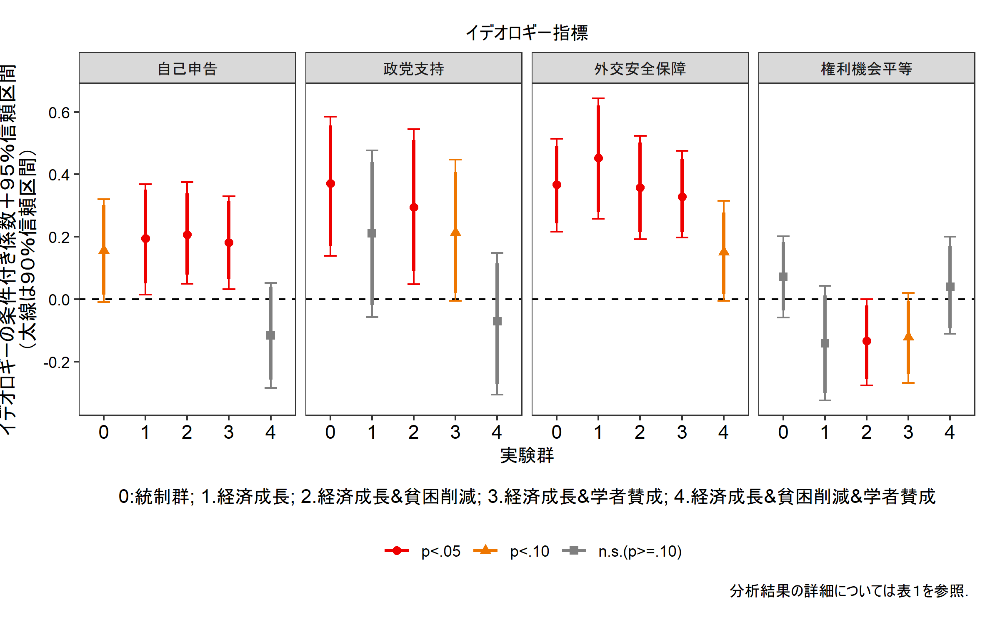

``` r
ggsave("../out/v4_expres.png", p, width=8, height=5)
```

図２：仮説検証用プロット
------------------------

``` r
# H1
h1cf <- rbind(coeftest(m1, vcovHC(m1, "HC1"))[17,],
              coeftest(m3, vcovHC(m3, "HC1"))[17,],
              coeftest(m2_1, vcovHC(m2_1, "HC1"))[17,],
              coeftest(m2_2, vcovHC(m2_2, "HC1"))[17,])

# H2
h2cf <- rbind(coeftest(m1h3a, vcovHC(m1h3a, "HC1"))[18,],
               coeftest(m3h3a, vcovHC(m3h3a, "HC1"))[18,],
               coeftest(m2h3a_1, vcovHC(m2h3a_1, "HC1"))[18,],
               coeftest(m2h3a_2, vcovHC(m2h3a_2, "HC1"))[18,])


# H3A
h3acf <- rbind(coeftest(m1h3a, vcovHC(m1h3a, "HC1"))[19,],
               coeftest(m3h3a, vcovHC(m3h3a, "HC1"))[19,],
               coeftest(m2h3a_1, vcovHC(m2h3a_1, "HC1"))[19,],
               coeftest(m2h3a_2, vcovHC(m2h3a_2, "HC1"))[19,])

# H3B
h3bcf <- rbind(coeftest(m1h3b, vcovHC(m1h3b, "HC1"))[20,],
               coeftest(m3h3b, vcovHC(m3h3b, "HC1"))[20,],
               coeftest(m2h3b_1, vcovHC(m2h3b_1, "HC1"))[20,],
               coeftest(m2h3b_2, vcovHC(m2h3b_2, "HC1"))[20,])

htest <- as.data.frame(rbind(h1cf,h2cf,h3acf,h3bcf))
names(htest) <- c("est","se","tval","pval")
htest$hyp <- rep(c("H1:1.経済成長\nv.s.統制群",
                   "H2:2.経済成長＆貧困削減\nv.s.1.経済成長",
                   "H3:3.経済成長＆学者賛成\nv.s.1.経済成長",
                   "H3:4.成長＆貧困＆学者\nv.s.2.経済成長＆貧困削減"),
                 each=4)
htest$hyp <- factor(htest$hyp, levels=rev(unique(htest$hyp)))
htest$ms <- rep(c("自己申告","政党支持","外交安全保障","権利機会平等"),4)
htest$ms <- factor(htest$ms, levels=unique(htest$ms))

htest$l90CI <- htest$est - htest$se*qnorm(0.95)
htest$u90CI <- htest$est + htest$se*qnorm(0.95)
htest$l95CI <- htest$est - htest$se*qnorm(0.975)
htest$u95CI <- htest$est + htest$se*qnorm(0.975)

htest$ptest <- ifelse(htest$pval<0.05,"p<.05",
                      ifelse(htest$pval<0.10,"p<.10","n.s.(p>=.10)"))
htest$ptest <- factor(htest$ptest, levels=c("p<.05","p<.10","n.s.(p>=.10)"))

p <- ggplot(htest, aes(x=hyp)) + 
  geom_hline(aes(yintercept=0), linetype=2) + 
  geom_errorbar(aes(ymin=l95CI,ymax=u95CI,
                    color=ptest),width=0.1) + 
  geom_errorbar(aes(ymin=l90CI,ymax=u90CI,
                    color=ptest),width=0,size=0.8) + 
  geom_point(aes(y=est,color=ptest,shape=ptest),size=2) + 
  scale_y_continuous(breaks=c(-0.3,0,0.3)) + 
  scale_color_manual(name="", values=c("red2","darkorange2","gray50")) + 
  scale_shape_discrete(name="") + 
  facet_grid(.~ms) +
  xlab(NULL) + ylab("イデオロギー交差項の係数＋９５％信頼区間\n（太線は９０％信頼区間）") + 
  labs(subtitle="イデオロギー指標",
       caption="分析結果の詳細については表１を参照．") + 
  coord_flip() + theme_bw() + 
  theme(plot.margin = unit(c(0.5,0.5,0.5,-0), "cm"),
        panel.grid = element_line(color=NA),
        plot.subtitle = element_text(hjust=0.5),
        axis.text.y = element_text(color="black"),
        legend.position = "bottom")
p
```

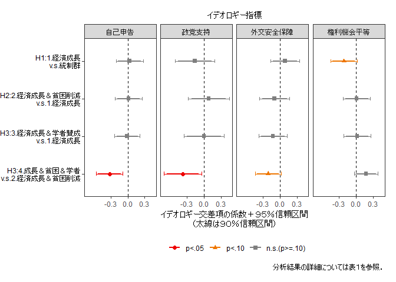

``` r
ggsave("../out/v4_expres_htest.png", p, width=8, height=5)
```

表のエクスポート
----------------

``` r
table_coef(list(m1,m3,m2_1,m2_2), vcov.est="robust", 
           single.row=FALSE, 
           custom.variable.names = c(vnx,vnx[26:30]),
           order.variable = c(1:6,17:35,7:16),
           m.names = c("自己申告","政党支持","外交安全保障","権利機会平等"),
           caption="イデオロギーと金融緩和選好の関係に実験情報刺激が与える効果（重回帰分析）",
           label="idetab", dcolumn = TRUE,
           custom.footnote = "最小二乗法による重回帰分析、ロバスト標準誤差使用．",
           format = "tex", file.name = "../out/v4_idetab")
```

    ## Variable Manipulations: 
    ##    Omitted                         Original                            Final
    ##     KEPT                      (Intercept)                       （定数項）
    ##     KEPT           as.factor(g_easing_N)1                       1.経済成長
    ##     KEPT           as.factor(g_easing_N)2             2.経済成長＆貧困削減
    ##     KEPT           as.factor(g_easing_N)3             3.経済成長＆学者賛成
    ##     KEPT           as.factor(g_easing_N)4           4.経済成長＆貧困＆学者
    ##     KEPT                         ide_self                     イデオロギー
    ##     KEPT                            knall                         政治知識
    ##     KEPT                              fem                     性別（女性）
    ##     KEPT                              age                             年齢
    ##     KEPT                            lvlen                         居住年数
    ##     KEPT                             ownh                           持ち家
    ##     KEPT                 as.factor(edu3)1       教育：短大／高専／専門学校
    ##     KEPT                 as.factor(edu3)2                   教育：大卒以上
    ##     KEPT                               wk                             就労
    ##     KEPT                              mar                             婚姻
    ##     KEPT                              cld                           子ども
    ##     KEPT  as.factor(g_easing_N)1:ide_self             イデオロギー×1.成長
    ##     KEPT  as.factor(g_easing_N)2:ide_self       イデオロギー×2.成長＆貧困
    ##     KEPT  as.factor(g_easing_N)3:ide_self       イデオロギー×3.成長＆学者
    ##     KEPT  as.factor(g_easing_N)4:ide_self イデオロギー×4.成長＆貧困＆学者
    ##     KEPT                         ide_psup                     イデオロギー
    ##     KEPT  as.factor(g_easing_N)1:ide_psup             イデオロギー×1.成長
    ##     KEPT  as.factor(g_easing_N)2:ide_psup       イデオロギー×2.成長＆貧困
    ##     KEPT  as.factor(g_easing_N)3:ide_psup       イデオロギー×3.成長＆学者
    ##     KEPT  as.factor(g_easing_N)4:ide_psup イデオロギー×4.成長＆貧困＆学者
    ##     KEPT                        ide_iss_1                     イデオロギー
    ##     KEPT as.factor(g_easing_N)1:ide_iss_1             イデオロギー×1.成長
    ##     KEPT as.factor(g_easing_N)2:ide_iss_1       イデオロギー×2.成長＆貧困
    ##     KEPT as.factor(g_easing_N)3:ide_iss_1       イデオロギー×3.成長＆学者
    ##     KEPT as.factor(g_easing_N)4:ide_iss_1 イデオロギー×4.成長＆貧困＆学者
    ##     KEPT                        ide_iss_2                     イデオロギー
    ##     KEPT as.factor(g_easing_N)1:ide_iss_2             イデオロギー×1.成長
    ##     KEPT as.factor(g_easing_N)2:ide_iss_2       イデオロギー×2.成長＆貧困
    ##     KEPT as.factor(g_easing_N)3:ide_iss_2       イデオロギー×3.成長＆学者
    ##     KEPT as.factor(g_easing_N)4:ide_iss_2 イデオロギー×4.成長＆貧困＆学者

    ## The table was written to the file '../out/v4_idetab.tex'.

    ## 
    ## =====================================================================
    ##                    自己申告         政党支持         外交安全保障       権利機会平等     
    ## ---------------------------------------------------------------------
    ## （定数項）                1.102 ***    0.959 ***    0.952 ***    1.028 ***
    ##                     (0.224)      (0.224)      (0.211)      (0.222)   
    ## 1.経済成長               0.128        0.238 +      0.158        0.150    
    ##                     (0.129)      (0.129)      (0.121)      (0.130)   
    ## 2.経済成長＆貧困削減          0.279 *      0.350 **     0.304 *      0.289 *  
    ##                     (0.126)      (0.132)      (0.121)      (0.127)   
    ## 3.経済成長＆学者賛成          0.137        0.228 +      0.160        0.155    
    ##                     (0.121)      (0.130)      (0.116)      (0.123)   
    ## 4.経済成長＆貧困＆学者         0.382 **     0.519 ***    0.402 ***    0.393 ** 
    ##                     (0.119)      (0.122)      (0.116)      (0.121)   
    ## イデオロギー               0.159 +      0.368 **     0.364 ***    0.075    
    ##                     (0.085)      (0.116)      (0.078)      (0.069)   
    ## イデオロギー×1.成長          0.033       -0.157        0.089       -0.217 +  
    ##                     (0.123)      (0.177)      (0.128)      (0.120)   
    ## イデオロギー×2.成長＆貧困       0.049       -0.071       -0.007       -0.207 *  
    ##                     (0.119)      (0.169)      (0.116)      (0.101)   
    ## イデオロギー×3.成長＆学者       0.025       -0.155       -0.036       -0.196 *  
    ##                     (0.111)      (0.169)      (0.107)      (0.098)   
    ## イデオロギー×4.成長＆貧困＆学者   -0.272 *     -0.441 **    -0.216 +     -0.034    
    ##                     (0.123)      (0.166)      (0.112)      (0.103)   
    ## 政治知識                 0.262 +      0.251        0.218        0.282 +  
    ##                     (0.155)      (0.156)      (0.148)      (0.158)   
    ## 性別（女性）              -0.324 ***   -0.313 ***   -0.206 *     -0.395 ***
    ##                     (0.088)      (0.088)      (0.087)      (0.090)   
    ## 年齢                  -0.007 +     -0.006       -0.004       -0.005    
    ##                     (0.004)      (0.004)      (0.004)      (0.004)   
    ## 居住年数                -0.071 *     -0.066 *     -0.063 *     -0.063 *  
    ##                     (0.032)      (0.031)      (0.030)      (0.032)   
    ## 持ち家                  0.003       -0.007       -0.018        0.011    
    ##                     (0.090)      (0.089)      (0.086)      (0.091)   
    ## 教育：短大／高専／専門学校        0.175        0.205        0.179        0.181    
    ##                     (0.140)      (0.139)      (0.137)      (0.139)   
    ## 教育：大卒以上              0.088        0.114        0.150        0.093    
    ##                     (0.110)      (0.112)      (0.106)      (0.112)   
    ## 就労                   0.014       -0.013       -0.019       -0.012    
    ##                     (0.091)      (0.091)      (0.088)      (0.091)   
    ## 婚姻                  -0.132       -0.192       -0.200 +     -0.118    
    ##                     (0.119)      (0.123)      (0.117)      (0.122)   
    ## 子ども                  0.211 +      0.243 *      0.269 *      0.234 +  
    ##                     (0.120)      (0.122)      (0.117)      (0.123)   
    ## ---------------------------------------------------------------------
    ## R^2                  0.077        0.074        0.135        0.063    
    ## Adj. R^2             0.058        0.055        0.117        0.043    
    ## Num. obs.          927          927          927          927        
    ## RMSE                 1.197        1.199        1.158        1.206    
    ## =====================================================================
    ## *** p < 0.001, ** p < 0.01, * p < 0.05, + p < 0.1 最小二乗法による重回帰分析、ロバスト標準誤差使用．

``` r
table_coef(list(m1,m3,m2_1,m2_2), vcov.est="robust", 
           single.row=FALSE, 
           drop.intercept = TRUE,
           drop.variable.names = c("knall","fem","age","lvlen","ownh",
                                    "as.factor(edu3)1","as.factor(edu3)2",
                                    "wk","mar","cld"),
           custom.variable.names = c(vnx[-c(1,7:16)],vnx[26:30]),
           m.names = c("自己申告","政党支持","外交安全保障","権利機会平等"),
           caption="イデオロギーと金融緩和選好の関係に実験情報刺激が与える効果（重回帰分析）",
           label="idetab", dcolumn = TRUE,
           custom.footnote = "最小二乗法による重回帰分析、ロバスト標準誤差使用．定数項・統制変数の係数はオンライン付録参照．",
           format = "tex", file.name = "../out/v4_idetab_short")
```

    ## Variable Manipulations: 
    ##    Omitted                         Original                            Final
    ##  OMITTED                      (Intercept)                                 
    ##     KEPT           as.factor(g_easing_N)1                       1.経済成長
    ##     KEPT           as.factor(g_easing_N)2             2.経済成長＆貧困削減
    ##     KEPT           as.factor(g_easing_N)3             3.経済成長＆学者賛成
    ##     KEPT           as.factor(g_easing_N)4           4.経済成長＆貧困＆学者
    ##     KEPT                         ide_self                     イデオロギー
    ##  OMITTED                            knall                                 
    ##  OMITTED                              fem                                 
    ##  OMITTED                              age                                 
    ##  OMITTED                            lvlen                                 
    ##  OMITTED                             ownh                                 
    ##  OMITTED                 as.factor(edu3)1                                 
    ##  OMITTED                 as.factor(edu3)2                                 
    ##  OMITTED                               wk                                 
    ##  OMITTED                              mar                                 
    ##  OMITTED                              cld                                 
    ##     KEPT  as.factor(g_easing_N)1:ide_self             イデオロギー×1.成長
    ##     KEPT  as.factor(g_easing_N)2:ide_self       イデオロギー×2.成長＆貧困
    ##     KEPT  as.factor(g_easing_N)3:ide_self       イデオロギー×3.成長＆学者
    ##     KEPT  as.factor(g_easing_N)4:ide_self イデオロギー×4.成長＆貧困＆学者
    ##     KEPT                         ide_psup                     イデオロギー
    ##     KEPT  as.factor(g_easing_N)1:ide_psup             イデオロギー×1.成長
    ##     KEPT  as.factor(g_easing_N)2:ide_psup       イデオロギー×2.成長＆貧困
    ##     KEPT  as.factor(g_easing_N)3:ide_psup       イデオロギー×3.成長＆学者
    ##     KEPT  as.factor(g_easing_N)4:ide_psup イデオロギー×4.成長＆貧困＆学者
    ##     KEPT                        ide_iss_1                     イデオロギー
    ##     KEPT as.factor(g_easing_N)1:ide_iss_1             イデオロギー×1.成長
    ##     KEPT as.factor(g_easing_N)2:ide_iss_1       イデオロギー×2.成長＆貧困
    ##     KEPT as.factor(g_easing_N)3:ide_iss_1       イデオロギー×3.成長＆学者
    ##     KEPT as.factor(g_easing_N)4:ide_iss_1 イデオロギー×4.成長＆貧困＆学者
    ##     KEPT                        ide_iss_2                     イデオロギー
    ##     KEPT as.factor(g_easing_N)1:ide_iss_2             イデオロギー×1.成長
    ##     KEPT as.factor(g_easing_N)2:ide_iss_2       イデオロギー×2.成長＆貧困
    ##     KEPT as.factor(g_easing_N)3:ide_iss_2       イデオロギー×3.成長＆学者
    ##     KEPT as.factor(g_easing_N)4:ide_iss_2 イデオロギー×4.成長＆貧困＆学者

    ## The table was written to the file '../out/v4_idetab_short.tex'.

    ## 
    ## ===================================================================
    ##                    自己申告        政党支持         外交安全保障       権利機会平等    
    ## -------------------------------------------------------------------
    ## 1.経済成長               0.128       0.238 +      0.158        0.150   
    ##                     (0.129)     (0.129)      (0.121)      (0.130)  
    ## 2.経済成長＆貧困削減          0.279 *     0.350 **     0.304 *      0.289 * 
    ##                     (0.126)     (0.132)      (0.121)      (0.127)  
    ## 3.経済成長＆学者賛成          0.137       0.228 +      0.160        0.155   
    ##                     (0.121)     (0.130)      (0.116)      (0.123)  
    ## 4.経済成長＆貧困＆学者         0.382 **    0.519 ***    0.402 ***    0.393 **
    ##                     (0.119)     (0.122)      (0.116)      (0.121)  
    ## イデオロギー               0.159 +     0.368 **     0.364 ***    0.075   
    ##                     (0.085)     (0.116)      (0.078)      (0.069)  
    ## イデオロギー×1.成長          0.033      -0.157        0.089       -0.217 + 
    ##                     (0.123)     (0.177)      (0.128)      (0.120)  
    ## イデオロギー×2.成長＆貧困       0.049      -0.071       -0.007       -0.207 * 
    ##                     (0.119)     (0.169)      (0.116)      (0.101)  
    ## イデオロギー×3.成長＆学者       0.025      -0.155       -0.036       -0.196 * 
    ##                     (0.111)     (0.169)      (0.107)      (0.098)  
    ## イデオロギー×4.成長＆貧困＆学者   -0.272 *    -0.441 **    -0.216 +     -0.034   
    ##                     (0.123)     (0.166)      (0.112)      (0.103)  
    ## -------------------------------------------------------------------
    ## R^2                  0.077       0.074        0.135        0.063   
    ## Adj. R^2             0.058       0.055        0.117        0.043   
    ## Num. obs.          927         927          927          927       
    ## RMSE                 1.197       1.199        1.158        1.206   
    ## ===================================================================
    ## *** p < 0.001, ** p < 0.01, * p < 0.05, + p < 0.1 最小二乗法による重回帰分析、ロバスト標準誤差使用．定数項・統制変数の係数はオンライン付録参照．
