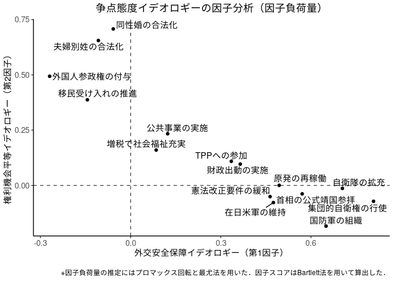
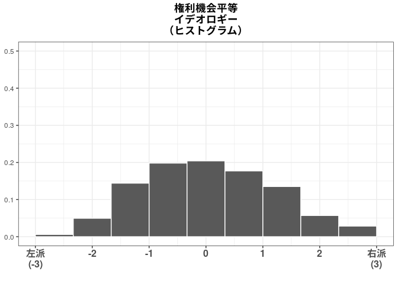
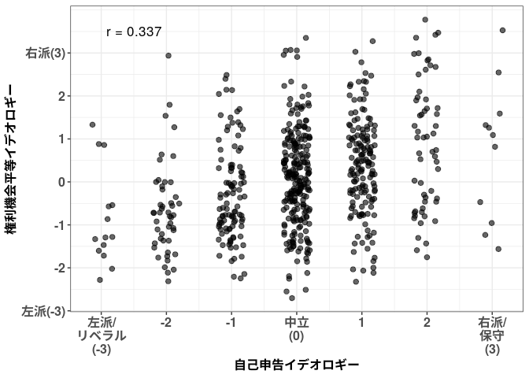
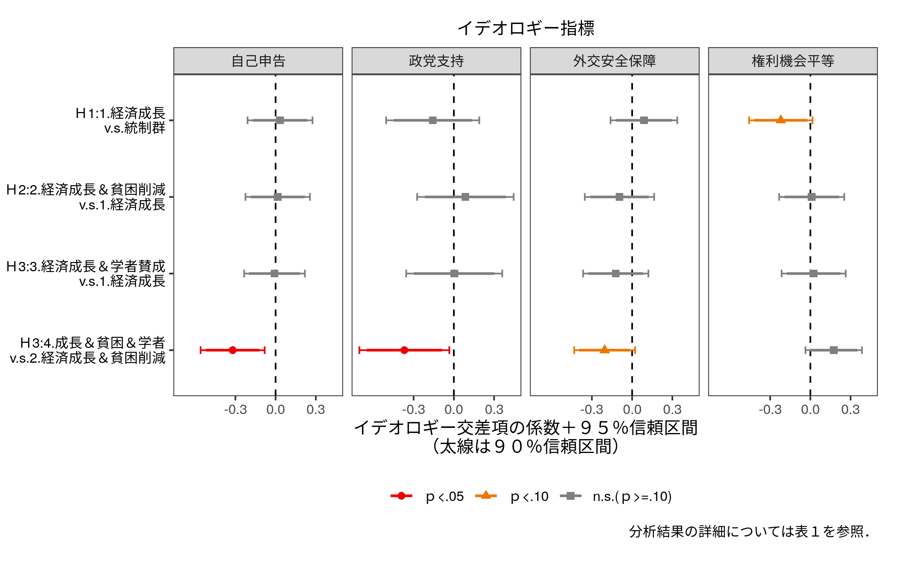
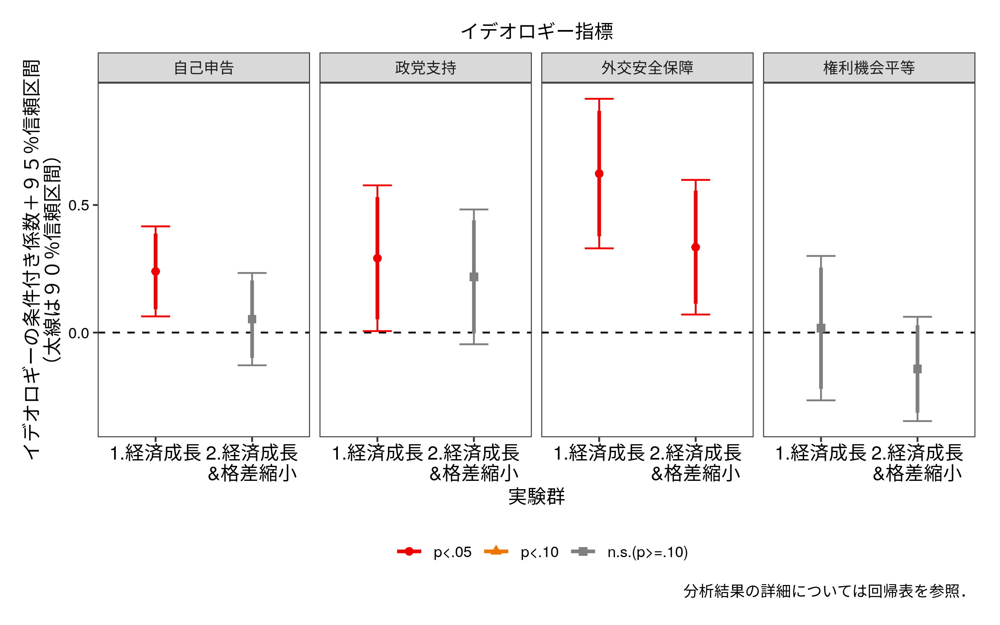
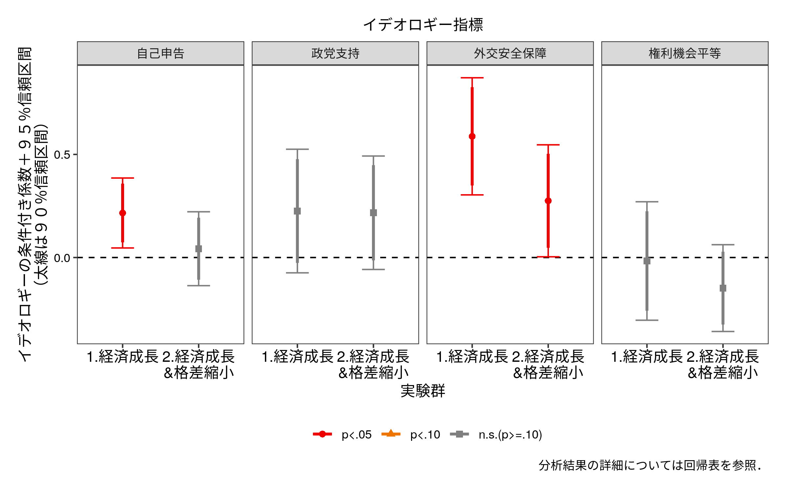

金融緩和実験本調査の分析
================
加藤言人
2020年5月21日

# 争点イデオロギー指標（因子分析）

## 「わからない」回答は中間値とみなした場合

``` r
load("../out/score_ide_iss_data.RData")
```

### スクリープロット

``` r
plot(eigen(cor(mydata))$values, type="b",
     ylab="Eigen Value",xlab="")
```

<!-- -->

### 因子負荷量のグラフ（図A5）

``` r
p
```

<!-- -->

## 「わからない」回答を除外した場合

``` r
load("../out/score_ide_iss_mis_data.RData")
```

### スクリープロット

``` r
plot(eigen(cor(mydata_mis, use="pairwise"))$values, type="b",
     ylab="Eigen Value",xlab="")
```

<!-- -->

### 因子負荷量のグラフ（図A6）

``` r
p
```

<!-- -->

``` r
## Clear Workspace
rm(list=ls())
```

# データの準備

``` r
## Read Data
d <- readRDS("../data_public/main_data_v5.rds")
#d <- read_dta("../data_public/main_data_v6.dta", encoding="UTF-8")
nrow(d)
```

    ## [1] 1240

``` r
## Drop Respondents
# 39 Respondents Failed Satisficing Screening
table(d$satisficer)
```

    ## 
    ##    0    1 
    ## 1201   39

``` r
# One Respondent Took 568 minutes to Answer
sort(d$surveytime, decreasing = TRUE)[1:20]
```

    ##  [1] 568.70000  84.55000  75.63333  75.28333  74.76667  73.08333  64.71667  58.91667  55.40000  50.83333
    ## [11]  48.35000  47.83333  47.58333  47.26667  47.23333  45.21667  43.53333  42.53333  40.80000  40.78333

``` r
d <- d[which(d$satisficer==0),] # Not Satisficers
d <- d[which(d$surveytime<=90),] # Took too long (only one)
nrow(d)
```

    ## [1] 1200

``` r
## Drop Respondents with Missing Value in Demographic Questions
dtmp <- d[complete.cases(d[,c("knall","fem","age","lvlen","ownh",
  "edu3","wk","mar","cld")]),]
nrow(dtmp)
```

    ## [1] 1123

# 統制変数の分布（オンライン付録D）

``` r
# Exporting Tables
exporttab <- function(tmp,filename){
  tab <- paste0(sprintf("%.1f",(tmp/sum(tmp))*100),"%")
  names(tab) <- names(tmp)
  tab <- kable(t(tab), format="latex", align="c")
  writeLines(tab, con=paste0("../out/",filename))
  return(tmp)
}

# Knowledge
tmp <- table(dtmp$knall)
names(tmp) <- round(as.numeric(names(tmp)),3)
exporttab(tmp, "demtab_knall.tex")
```

    ##     0 0.143 0.286 0.429 0.571 0.714 0.857     1 
    ##    94   156   220   187   158   133   110    65

``` r
# Gender
exporttab(table(dtmp$fem), "demtab_fem.tex")
```

    ## 
    ##   0 0.5   1 
    ## 545   4 574

``` r
# Age (Table by Cohort)
tmp <- table(floor(dtmp$age/10))
names(tmp) <- c("18-19","20-29","30-39","40-49","50-59","60-69","70-79")
exporttab(tmp, "demtab_age.tex")
```

    ## 18-19 20-29 30-39 40-49 50-59 60-69 70-79 
    ##    25   301   392   270   106    23     6

``` r
# Living Length 
exporttab(table(dtmp$lvlen),"demtab_lvlen.tex")
```

    ## 
    ##   0   1   2   3   4 
    ## 267 236 125 317 178

``` r
# Own House
exporttab(table(dtmp$ownh),"demtab_ownh.tex")
```

    ## 
    ##   0   1 
    ## 500 623

``` r
# Education
tmp <- table(dtmp$edu3)
names(tmp) <- c("小／中／高","高専／専門学校","大学／大学院")
exporttab(tmp, "demtab_edu3.tex")
```

    ##     小／中／高 高専／専門学校   大学／大学院 
    ##            211            205            707

``` r
tmp <- readLines("../out/demtab_edu3.tex")
# tmp <- iconv(tmp, from="SHIFT-JIS", to="UTF-8")
writeLines(tmp, "../out/demtab_edu3.tex", useBytes = TRUE)
# 就業の有無
exporttab(table(dtmp$wk), "demtab_wk.tex")
```

    ## 
    ##   0   1 
    ## 294 829

``` r
# 結婚の有無
exporttab(table(dtmp$mar), "demtab_mar.tex")
```

    ## 
    ##   0   1 
    ## 642 481

``` r
# 子どもの有無
exporttab(table(dtmp$cld), "demtab_cld.tex")
```

    ## 
    ##   0   1 
    ## 788 335

# イデオロギー指標間の相関

``` r
require(xtable)
```

## 「わからない」回答を中間値とした場合（表A2）

``` r
ctab <- cor(dtmp[,c("ide_self","ide_psup","ide_iss_1","ide_iss_2")])
ctab[upper.tri(ctab)] <- NA
colnames(ctab) <- rownames(ctab) <- c("自己申告","政党支持","外交安全保障","権利機会平等")
round(ctab,3)
```

    ##              自己申告 政党支持 外交安全保障 権利機会平等
    ## 自己申告        1.000       NA           NA           NA
    ## 政党支持        0.356    1.000           NA           NA
    ## 外交安全保障    0.362    0.439        1.000           NA
    ## 権利機会平等    0.266    0.142        0.025            1

``` r
print(xtable(ctab, digits=3,caption="イデオロギー指標間の相関（「わからない」回答は中間値）"), 
      caption.placement="top", file="../out/coride.tex")
tmp <- readLines("../out/coride.tex")
# tmp <- iconv(tmp, from="SHIFT-JIS", to="UTF-8")
writeLines(tmp, "../out/coride.tex", useBytes = TRUE)
```

## 「わからない」回答を除外した場合（表A3）

``` r
ctab <- cor(dtmp[,c("ide_self_mis","ide_psup_mis","ide_iss_mis_1","ide_iss_mis_2")],
            use="pairwise")
ctab[upper.tri(ctab)] <- NA
colnames(ctab) <- rownames(ctab) <- c("自己申告","政党支持","外交安全保障","権利機会平等")
round(ctab,3)
```

    ##              自己申告 政党支持 外交安全保障 権利機会平等
    ## 自己申告        1.000       NA           NA           NA
    ## 政党支持        0.379    1.000           NA           NA
    ## 外交安全保障    0.393    0.455        1.000           NA
    ## 権利機会平等    0.337    0.215        0.062            1

``` r
print(xtable(ctab, digits=3,caption="イデオロギー指標間の相関（「わからない」回答を除外）"), 
      caption.placement="top", file="../out/coride_mis.tex")
tmp <- readLines("../out/coride_mis.tex")
# tmp <- iconv(tmp, from="SHIFT-JIS", to="UTF-8")
writeLines(tmp, "../out/coride_mis.tex", useBytes = TRUE)
```

# 記述統計

## 従属変数：金融緩和政策選好

### 「わからない」回答を中間値とした場合（図A1）

``` r
tab <- table(dtmp$easing_opi)/sum(table(dtmp$easing_opi))
tab <- data.frame(prop = as.numeric(tab),
                  names = c("反対\n(-3)","-2","-1",
                            "どちらともいえない\n／無回答(0)",
                            "1","2","賛成\n(3)"))
tab$names <- factor(tab$names, levels=tab$names)

p <- ggplot(tab, aes(x=names,y=prop)) + 
  geom_bar(stat="identity") + 
  ylab("回答割合") + xlab(NULL) + 
  #ggtitle("金融緩和に対する意見の回答分布") + 
  theme_bw() + 
  theme(plot.title = element_text(hjust=0.5, face="bold"),
        axis.text.x = element_text(size=12, face="bold"))
p
```

<!-- -->

``` r
ggsave("../out/v6_dvdist.png", p, width=7, height=5)
```

### 「わからない」回答を除外した場合（図A3）

``` r
tab <- table(dtmp$easing_opi_mis)/sum(table(dtmp$easing_opi_mis))
tab <- data.frame(prop = as.numeric(tab),
                  names = c("反対\n(-3)","-2","-1",
                            "どちらともいえない\n／無回答(0)",
                            "1","2","賛成\n(3)"))
tab$names <- factor(tab$names, levels=tab$names)

p <- ggplot(tab, aes(x=names,y=prop)) + 
  geom_bar(stat="identity") + 
  ylab("回答割合") + xlab(NULL) + 
  #ggtitle("金融緩和に対する意見の回答分布") + 
  theme_bw() + 
  theme(plot.title = element_text(hjust=0.5, face="bold"),
        axis.text.x = element_text(size=12, face="bold"))
p
```

<!-- -->

``` r
ggsave("../out/v6_dvdist_mis.png", p, width=7, height=5)
```

## 独立変数：イデオロギー

### 自己申告イデオロギー

#### 「わからない」回答を中間値とした場合

``` r
tab <- table(dtmp$ide_self)/sum(table(dtmp$ide_self))
tab <- data.frame(prop = as.numeric(tab),
                  names = c("左派/\nリベラル\n(-3)","-2","-1",
                            "中立\n(0)","1","2","右派/\n保守\n(3)"))
tab$names <- factor(tab$names, levels=tab$names)

p1 <- ggplot(tab, aes(x=names,y=prop)) + 
  geom_bar(stat="identity") + 
  scale_y_continuous(limits=c(0,0.5)) +
  ylab(NULL) + xlab(NULL) + 
  ggtitle("自己申告\nイデオロギー\n（度数分布）") + 
  theme_bw() + 
  theme(plot.title = element_text(hjust=0.5, face="bold"),
        axis.text.x = element_text(size=12, face="bold"))
p1
```

<!-- -->

#### 「わからない」回答を除外した場合

``` r
tab <- table(dtmp$ide_self_mis)/sum(table(dtmp$ide_self_mis))
tab <- data.frame(prop = as.numeric(tab),
                  names = c("左派/\nリベラル\n(-3)","-2","-1",
                            "中立\n(0)","1","2","右派/\n保守\n(3)"))
tab$names <- factor(tab$names, levels=tab$names)

p1_mis <- ggplot(tab, aes(x=names,y=prop)) + 
  geom_bar(stat="identity") + 
  scale_y_continuous(limits=c(0,0.5)) +
  ylab(NULL) + xlab(NULL) + 
  ggtitle("自己申告\nイデオロギー\n（度数分布）") + 
  theme_bw() + 
  theme(plot.title = element_text(hjust=0.5, face="bold"),
        axis.text.x = element_text(size=12, face="bold"))
p1_mis
```

<!-- -->

### 争点態度イデオロギー

#### 「わからない」回答を中間値とした場合

``` r
p2_1 <- ggplot(dtmp, aes(x=ide_iss_1,y=..count../sum(..count..))) + 
  geom_histogram(bins=10,color="white") +
  scale_y_continuous(limits=c(0,0.5)) +
  ylab(NULL) + xlab(NULL) + 
  ggtitle("外交安全保障\nイデオロギー\n（ヒストグラム）") + 
  scale_x_continuous(breaks=c(-3,-2,-1,0,1,2,3),
                     limits=c(-3,3),
                     labels=c("左派\n(-3)\n","-2","-1","0","1","2","右派\n(3)\n")) +
  theme_bw() + 
  theme(plot.title = element_text(hjust=0.5, face="bold"),
        axis.text.x = element_text(size=12, face="bold"))
p2_1
```

    ## Warning: Removed 2 rows containing non-finite values (stat_bin).

    ## Warning: Removed 1 rows containing missing values (geom_bar).

<!-- -->

``` r
p2_2 <- ggplot(dtmp, aes(x=ide_iss_2,y=..count../sum(..count..))) + 
  geom_histogram(bins=10,color="white") +
  scale_y_continuous(limits=c(0,0.5)) +
  ylab(NULL) + xlab(NULL) + 
  ggtitle("権利機会平等\nイデオロギー\n（ヒストグラム）") + 
  scale_x_continuous(breaks=c(-3,-2,-1,0,1,2,3),
                     limits=c(-3,3),
                     labels=c("左派\n(-3)\n","-2","-1","0","1","2","右派\n(3)\n")) +
  theme_bw() + 
  theme(plot.title = element_text(hjust=0.5, face="bold"),
        axis.text.x = element_text(size=12, face="bold"))
p2_2
```

    ## Warning: Removed 15 rows containing non-finite values (stat_bin).
    
    ## Warning: Removed 1 rows containing missing values (geom_bar).

<!-- -->

#### 「わからない」回答を除外した場合

``` r
p2_1_mis <- ggplot(dtmp, aes(x=ide_iss_mis_1,y=..count../sum(..count..))) + 
  geom_histogram(bins=10,color="white") +
  scale_y_continuous(limits=c(0,0.5)) +
  ylab(NULL) + xlab(NULL) + 
  ggtitle("外交安全保障\nイデオロギー\n（ヒストグラム）") + 
  scale_x_continuous(breaks=c(-3,-2,-1,0,1,2,3),
                     limits=c(-3,3),
                     labels=c("左派\n(-3)\n","-2","-1","0","1","2","右派\n(3)\n")) +
  theme_bw() + 
  theme(plot.title = element_text(hjust=0.5, face="bold"),
        axis.text.x = element_text(size=12, face="bold"))
p2_1_mis
```

    ## Warning: Removed 448 rows containing non-finite values (stat_bin).

    ## Warning: Removed 1 rows containing missing values (geom_bar).

<!-- -->

``` r
p2_2_mis <- ggplot(dtmp, aes(x=ide_iss_mis_2,y=..count../sum(..count..))) + 
  geom_histogram(bins=10,color="white") +
  scale_y_continuous(limits=c(0,0.5)) +
  ylab(NULL) + xlab(NULL) + 
  ggtitle("権利機会平等\nイデオロギー\n（ヒストグラム）") + 
  scale_x_continuous(breaks=c(-3,-2,-1,0,1,2,3),
                     limits=c(-3,3),
                     labels=c("左派\n(-3)\n","-2","-1","0","1","2","右派\n(3)\n")) +
  theme_bw() + 
  theme(plot.title = element_text(hjust=0.5, face="bold"),
        axis.text.x = element_text(size=12, face="bold"))
p2_2_mis
```

    ## Warning: Removed 457 rows containing non-finite values (stat_bin).
    
    ## Warning: Removed 1 rows containing missing values (geom_bar).

<!-- -->

### 政党支持イデオロギー

#### 「わからない」回答を中間値とした場合

``` r
tab <- table(dtmp$ide_psup)/sum(table(dtmp$ide_psup))
tab <- data.frame(prop = as.numeric(tab),
                  names = c("左派\n政党支持\n(-1)","無党派\nその他\n(0)",
                            "右派\n政党支持\n(1)"))
tab$names <- factor(tab$names, levels=tab$names)

p3 <- ggplot(tab, aes(x=names,y=prop)) + 
  geom_bar(stat="identity") + 
  scale_y_continuous(limits=c(0,0.5)) +
  ylab(NULL) + xlab(NULL) + 
  ggtitle("政党支持\nイデオロギー\n（度数分布）") + 
  theme_bw() + 
  theme(plot.title = element_text(hjust=0.5, face="bold"),
        axis.text.x = element_text(size=12, face="bold"))
p3
```

<!-- -->

#### 「わからない」回答を除外した場合

``` r
tab <- table(dtmp$ide_psup_mis)/sum(table(dtmp$ide_psup_mis))
tab <- data.frame(prop = as.numeric(tab),
                  names = c("左派\n政党支持\n(-1)","無党派\nその他\n(0)",
                            "右派\n政党支持\n(1)"))
tab$names <- factor(tab$names, levels=tab$names)

p3_mis <- ggplot(tab, aes(x=names,y=prop)) + 
  geom_bar(stat="identity") + 
  scale_y_continuous(limits=c(0,0.5)) +
  ylab(NULL) + xlab(NULL) + 
  ggtitle("政党支持\nイデオロギー\n（度数分布）") + 
  theme_bw() + 
  theme(plot.title = element_text(hjust=0.5, face="bold"),
        axis.text.x = element_text(size=12, face="bold"))
p3_mis
```

<!-- -->

### 全てのイデオロギー指標の分布まとめ

#### 「わからない」回答を中間値とした場合（図A2）

``` r
ggplot() + theme_void()
p <- arrangeGrob(p1,p3,p2_1,p2_2, nrow=1, left="回答割合")
```

    ## Warning: Removed 2 rows containing non-finite values (stat_bin).

    ## Warning: Removed 1 rows containing missing values (geom_bar).

    ## Warning: Removed 15 rows containing non-finite values (stat_bin).

    ## Warning: Removed 1 rows containing missing values (geom_bar).

``` r
grid.draw(p)
```

<!-- -->

``` r
ggsave("../out/v6_idedist123.png", p, width=9.5, height=4)
```

#### 「わからない」回答を除外した場合（図A4）

``` r
ggplot() + theme_void()
p <- arrangeGrob(p1_mis,p3_mis,p2_1_mis,p2_2_mis, nrow=1, left="回答割合")
```

    ## Warning: Removed 448 rows containing non-finite values (stat_bin).

    ## Warning: Removed 1 rows containing missing values (geom_bar).

    ## Warning: Removed 457 rows containing non-finite values (stat_bin).

    ## Warning: Removed 1 rows containing missing values (geom_bar).

``` r
grid.draw(p)
```

<!-- -->

``` r
ggsave("../out/v6_idedist123_mis.png", p, width=9.5, height=4)
```

### 自己申告イデオロギーと争点態度イデオロギーの相関

#### 「わからない」回答を中間値とした場合（図A7）

``` r
p12cor_1 <- ggplot(dtmp, aes(x=ide_self,y=ide_iss_1)) + 
  geom_jitter(alpha=0.6, width=0.2, height=0.2,size=2) + 
  ylab("外交安全保障イデオロギー") + 
  xlab("自己申告イデオロギー") + 
  annotate("text", x=-2.5, y=3.2, size=4.5,
           label=paste("r =",round(cor(dtmp$ide_self,dtmp$ide_iss_1),3))) + 
  scale_x_continuous(breaks=c(-3,-2,-1,0,1,2,3),
                     labels=c("左派/\nリベラル\n(-3)","-2","-1",
                              "中立\n(0)","1","2","右派/\n保守\n(3)")) + 
  scale_y_continuous(breaks=c(-3,-2,-1,0,1,2,3),
                     #limits=c(-3,3),
                     labels=c("左派(-3)","-2","-1","0","1","2","右派(3)")) +
  theme_bw() + 
  theme(plot.title = element_text(hjust=0.5, face="bold"),
        axis.title = element_text(size=12, face="bold"),
        axis.text = element_text(size=12, face="bold"))
p12cor_1
```

<!-- -->

``` r
p12cor_2 <- ggplot(dtmp, aes(x=ide_self,y=ide_iss_2)) + 
  geom_jitter(alpha=0.6, width=0.2, height=0.2,size=2) + 
  ylab("権利機会平等イデオロギー") + 
  xlab("自己申告イデオロギー") + 
  annotate("text", x=-2.5, y=3.5, size=4.5,
           label=paste("r =",round(cor(dtmp$ide_self,dtmp$ide_iss_2),3))) + 
  scale_x_continuous(breaks=c(-3,-2,-1,0,1,2,3),
                     labels=c("左派/\nリベラル\n(-3)","-2","-1",
                              "中立\n(0)","1","2","右派/\n保守\n(3)")) + 
  scale_y_continuous(breaks=c(-3,-2,-1,0,1,2,3),
                     #limits=c(-3,3),
                     labels=c("左派(-3)","-2","-1","0","1","2","右派(3)")) +
  theme_bw() + 
  theme(plot.title = element_text(hjust=0.5, face="bold"),
        axis.title = element_text(size=12, face="bold"),
        axis.text = element_text(size=12, face="bold"))
p12cor_2
```

<!-- -->

``` r
ggplot() + theme_void()
p12cor <- arrangeGrob(p12cor_1 + xlab(NULL) + ylab(NULL) + ggtitle("外交安全保障"),
                 p12cor_2 + xlab(NULL) + ylab(NULL) + ggtitle("権利機会平等"), 
                 nrow=1, left="争点態度イデオロギー",
                 bottom="自己申告イデオロギー")
grid.draw(p12cor)
```

<!-- -->

#### 「わからない」回答を除外した場合（図A8）

``` r
p12cor_1 <- ggplot(dtmp, aes(x=ide_self_mis,y=ide_iss_mis_1)) + 
  geom_jitter(alpha=0.6, width=0.2, height=0.2,size=2) + 
  ylab("外交安全保障イデオロギー") + 
  xlab("自己申告イデオロギー") + 
  annotate("text", x=-2.5, y=3.2, size=4.5,
           label=paste("r =",round(cor(dtmp$ide_self_mis,dtmp$ide_iss_mis_1, use="pairwise"),3))) + 
  scale_x_continuous(breaks=c(-3,-2,-1,0,1,2,3),
                     labels=c("左派/\nリベラル\n(-3)","-2","-1",
                              "中立\n(0)","1","2","右派/\n保守\n(3)")) + 
  scale_y_continuous(breaks=c(-3,-2,-1,0,1,2,3),
                     #limits=c(-3,3),
                     labels=c("左派(-3)","-2","-1","0","1","2","右派(3)")) +
  theme_bw() + 
  theme(plot.title = element_text(hjust=0.5, face="bold"),
        axis.title = element_text(size=12, face="bold"),
        axis.text = element_text(size=12, face="bold"))
p12cor_1
```

    ## Warning: Removed 496 rows containing missing values (geom_point).

<!-- -->

``` r
p12cor_2 <- ggplot(dtmp, aes(x=ide_self_mis,y=ide_iss_mis_2)) + 
  geom_jitter(alpha=0.6, width=0.2, height=0.2,size=2) + 
  ylab("権利機会平等イデオロギー") + 
  xlab("自己申告イデオロギー") + 
  annotate("text", x=-2.5, y=3.5, size=4.5,
           label=paste("r =",round(cor(dtmp$ide_self_mis,dtmp$ide_iss_mis_2, use="pairwise"),3))) + 
  scale_x_continuous(breaks=c(-3,-2,-1,0,1,2,3),
                     labels=c("左派/\nリベラル\n(-3)","-2","-1",
                              "中立\n(0)","1","2","右派/\n保守\n(3)")) + 
  scale_y_continuous(breaks=c(-3,-2,-1,0,1,2,3),
                     #limits=c(-3,3),
                     labels=c("左派(-3)","-2","-1","0","1","2","右派(3)")) +
  theme_bw() + 
  theme(plot.title = element_text(hjust=0.5, face="bold"),
        axis.title = element_text(size=12, face="bold"),
        axis.text = element_text(size=12, face="bold"))
p12cor_2
```

    ## Warning: Removed 496 rows containing missing values (geom_point).

<!-- -->

``` r
ggplot() + theme_void()
p12cor <- arrangeGrob(p12cor_1 + xlab(NULL) + ylab(NULL) + ggtitle("外交安全保障"),
                      p12cor_2 + xlab(NULL) + ylab(NULL) + ggtitle("権利機会平等"), 
                      nrow=1, left="争点態度イデオロギー",
                      bottom="自己申告イデオロギー")
```

    ## Warning: Removed 496 rows containing missing values (geom_point).
    
    ## Warning: Removed 496 rows containing missing values (geom_point).

``` r
grid.draw(p12cor)
```

<!-- -->

# 実験群のバランスチェック（図A9）

``` r
dmod <- data.frame(
  ide_self = dtmp$ide_self,
  ide_self_mis = dtmp$ide_self_mis,
  ide_psup = dtmp$ide_psup,
  ide_psup_mis = dtmp$ide_psup_mis,
  ide_iss_1 = dtmp$ide_iss_1,
  ide_iss_mis_1 = dtmp$ide_iss_mis_1,
  ide_iss_2 = dtmp$ide_iss_2,
  ide_iss_mis_2 = dtmp$ide_iss_mis_2,
  knall = dtmp$knall,
  fem = dtmp$fem, 
  age = dtmp$age,
  lvlen = dtmp$lvlen,
  ownh = dtmp$ownh,
  edu3_1 = ifelse(dtmp$edu3==0, 1, 0),
  edu3_2 = ifelse(dtmp$edu3==1, 1, 0),
  edu3_3 = ifelse(dtmp$edu3==2, 1, 0),
  wk = dtmp$wk,
  mar = dtmp$mar,
  cld = dtmp$cld
)

for(i in 1:ncol(dmod)) {
  dmod[,i] <- (dmod[,i] - mean(dmod[,i], na.rm=TRUE))/sd(dmod[,i], na.rm=TRUE)
}

hypnames <- c("H1:1.経済成長\nv.s.統制群",
  "H2:2.経済成長＆貧困削減\nv.s.1.経済成長",
  "H2X:2X.経済成長＆格差縮小\nv.s.1.経済成長",
  "H3:3.経済成長＆学者賛成\nv.s.1.経済成長",
  "H3:4.成長＆貧困＆学者\nv.s.2.経済成長＆貧困削減")

# H1
res1_h1 <- apply(dmod, 2, function(x) coeftest(lm(x~dtmp$g_h1),vcov.=vcovHC(lm(x~dtmp$g_h1),type="HC2")))
res2_h1 <- as.data.frame(t(apply(res1_h1, 2, function(x) c(x[2],x[4],x[8]))))
colnames(res2_h1) <- c("coef","se","pval")
res2_h1$hyp <- hypnames[1]
# H2
res1_h2 <- apply(dmod, 2, function(x) coeftest(lm(x~dtmp$g_h2),vcov.=vcovHC(lm(x~dtmp$g_h2),type="HC2")))
res2_h2 <- as.data.frame(t(apply(res1_h2, 2, function(x) c(x[2],x[4],x[8]))))
colnames(res2_h2) <- c("coef","se","pval")
res2_h2$hyp <- hypnames[2]
# H2X (Only Appendix)
res1_h2x <- apply(dmod, 2, function(x) coeftest(lm(x~dtmp$g_h2x),vcov.=vcovHC(lm(x~dtmp$g_h2x),type="HC2")))
res2_h2x <- as.data.frame(t(apply(res1_h2x, 2, function(x) c(x[2],x[4],x[8]))))
colnames(res2_h2x) <- c("coef","se","pval")
res2_h2x$hyp <- hypnames[3]
# H3A
res1_h3a <- apply(dmod, 2, function(x) coeftest(lm(x~dtmp$g_h3a),vcov.=vcovHC(lm(x~dtmp$g_h3a),type="HC2")))
res2_h3a <- as.data.frame(t(apply(res1_h3a, 2, function(x) c(x[2],x[4],x[8]))))
colnames(res2_h3a) <- c("coef","se","pval")
res2_h3a$hyp <- hypnames[4]
# H3B
res1_h3b <- apply(dmod, 2, function(x) coeftest(lm(x~dtmp$g_h3b),vcov.=vcovHC(lm(x~dtmp$g_h3b),type="HC2")))
res2_h3b <- as.data.frame(t(apply(res1_h3b, 2, function(x) c(x[2],x[4],x[8]))))
colnames(res2_h3b) <- c("coef","se","pval")
res2_h3b$hyp <- hypnames[5]
# Combine All
res2 <- rbind(res2_h1,res2_h2,res2_h2x,res2_h3a,res2_h3b)
res2$lCI <- res2$coef - qnorm(0.975)*res2$se
res2$uCI <- res2$coef + qnorm(0.975)*res2$se
res2$hyp <- factor(res2$hyp, levels=hypnames)

res_vn <- c("自己申告イデオロギー（DK＝0）",
            "自己申告イデオロギー（DK＝NA）",
            "政党支持イデオロギー（DK＝0）",
            "政党支持イデオロギー（DK＝NA）",
            "外交安全保障イデオロギー（DK＝0）",
            "外交安全保障イデオロギー（DK＝NA）",
            "権利機会平等イデオロギー（DK＝0）",
            "権利機会平等イデオロギー（DK＝NA）",
            "政治知識","性別（女性）",
            "年齢","居住年数","持ち家",
            "教育：小学校／中学校／高校",
            "教育：短大／高専／専門学校",
            "教育：大卒以上",
            "就労","婚姻","子ども")

res3 <- data.frame(Variable = res_vn,
                   hyp = rep(res2$hyp,2),
                   stat = c(res2$coef,res2$pval),
                   lCI = c(res2$lCI,rep(NA,nrow(res2))),
                   uCI = c(res2$uCI,rep(NA,nrow(res2))),
                   val = rep(c("実験群と参照群の差（標準化済）","p値（t検定）"),each=nrow(res2)))
res3$Variable <- factor(res3$Variable,levels=rev(res_vn))
res3$val <- factor(res3$val,levels=unique(res3$val))

data2 <- data.frame(val=c("実験群と参照群の差（標準化済）","p値（t検定）"),
                    vloc1=c(NA,0),
                    vloc2=c(0,0.1))
data2$val <- factor(data2$val,levels=unique(data2$val))
 
p <- ggplot(res3, aes(x=Variable,y=stat)) + 
  geom_errorbar(aes(ymin=lCI,ymax=uCI, color=hyp),width=0.5, 
                position=position_dodge(width=-0.7)) +
  geom_point(aes(shape=hyp, color=hyp), 
             position=position_dodge(width=-0.7)) + 
  geom_hline(data=data2, aes(yintercept=vloc1), linetype=1) +
  geom_hline(data=data2, aes(yintercept=vloc2), linetype=2) +
  #scale_y_continuous(breaks=c(-0.1,0,0.1,0.3,0.6,0.9)) +
  scale_shape_discrete(name="比較対象実験群") + 
  scale_color_discrete(name="比較対象実験群") +
  guides(shape=guide_legend(ncol=2,nrow=3,byrow=FALSE),
         color=guide_legend(ncol=2,nrow=3,byrow=FALSE)) + 
  facet_grid(.~val, scales = "free_x") + coord_flip() + 
  xlab(NULL) + ylab(NULL) + 
  theme_bw() + 
  theme(legend.position = "bottom",
        plot.margin = margin(t=0.2, b=0.2, r=0.2, l=0.2, "cm"))
p
```

    ## Warning: position_dodge requires non-overlapping x intervals
    
    ## Warning: position_dodge requires non-overlapping x intervals

    ## Warning: Removed 1 rows containing missing values (geom_hline).

<!-- -->

``` r
ggsave("../out/v6_balancecheck.png", p, width=8, height=6)
```

# 実験群比較

## 準備

``` r
# 統制変数
ctl <- formula( ~ .+ knall + fem + age + lvlen + ownh + 
                  as.factor(edu3) + wk + mar + cld)

# 変数名
vn <- c("（定数項）",
        "1.経済成長",
        "2.経済成長＆貧困削減",
        "3.経済成長＆学者賛成",
        "4.経済成長＆貧困＆学者",
        "政治知識","性別（女性）",
        "年齢","居住年数","持ち家",
        "教育：短大／高専／専門学校",
        "教育：大卒以上",
        "就労","婚姻","子ども")
vn_ext <- c(vn[1:3],
            "2X.経済成長＆格差縮小",
            vn[4:15])
vn_idex <- c("イデオロギー",
            "イデオロギー×1.成長",
            "イデオロギー×2.成長＆貧困",
            "イデオロギー×3.成長＆学者",
            "イデオロギー×4.成長＆貧困＆学者")
vn_idex_ext <- c(vn_idex[1:3],
                 "イデオロギー×2X.成長＆格差",
                 vn_idex[4:5])
vnx <- c(vn[1:5],vn_idex[1],vn[6:15],
         vn_idex[2:5],rep(vn_idex,3))
vnx_ext <- c(vn_ext[1:6],vn_idex_ext[1],vn_ext[7:16],
             vn_idex_ext[2:6],rep(vn_idex_ext,3))
```

## マニピュレーションチェックに違反した人数の分布

#### 当初の違反基準を適用した場合（表A12）

``` r
ftab <- table(dtmp$g_easing_ext, dtmp$check_fail2)
colnames(ftab) <- c("非違反者数","違反者数")
rownames(ftab) <- c("統制群",vn_ext[2:6])
ftab
```

    ##                         
    ##                          非違反者数 違反者数
    ##   統制群                        143       41
    ##   1.経済成長                     94       91
    ##   2.経済成長＆貧困削減           37      148
    ##   2X.経済成長＆格差縮小          39      157
    ##   3.経済成長＆学者賛成           43      139
    ##   4.経済成長＆貧困＆学者         26      165

``` r
print(xtable(ftab, label="mchecktab_2", align = "lll",
             caption="実験群ごとのマニピュレーションチェック違反者の分布（違反者は回答が表示された／されていない情報と完全に一致しない被験者）"), 
      caption.placement="top", file="../out/mchecktab_2.tex")
tmp <- readLines("../out/mchecktab_2.tex")
# tmp <- iconv(tmp, from="SHIFT-JIS", to="UTF-8")
writeLines(tmp, "../out/mchecktab_2.tex", useBytes = TRUE)
```

#### 緩やかな違反基準を適用した場合（表A13）

``` r
ftab <- table(dtmp$g_easing_ext, dtmp$check_fail)
colnames(ftab) <- c("非違反者数","違反者数")
rownames(ftab) <- c("統制群",vn_ext[2:6])
ftab
```

    ##                         
    ##                          非違反者数 違反者数
    ##   統制群                        143       41
    ##   1.経済成長                    172       13
    ##   2.経済成長＆貧困削減          169       16
    ##   2X.経済成長＆格差縮小         161       35
    ##   3.経済成長＆学者賛成          172       10
    ##   4.経済成長＆貧困＆学者        177       14

``` r
print(xtable(ftab, label="mchecktab", align = "lll",
             caption="実験群ごとのマニピュレーションチェック違反者の分布（違反者は表示されていない情報を表示されたと回答した被験者）"), 
      caption.placement="top", file="../out/mchecktab.tex")
tmp <- readLines("../out/mchecktab.tex")
# tmp <- iconv(tmp, from="SHIFT-JIS", to="UTF-8")
writeLines(tmp, "../out/mchecktab.tex", useBytes = TRUE)
```

## 実験刺激の直接効果（表A18）

``` r
m0_1 <- lm(easing_opi ~ as.factor(g_easing_N_ext), data=dtmp)
m0_2 <- lm(update(easing_opi ~ as.factor(g_easing_N_ext),ctl), data=dtmp)
m0_3 <- lm(easing_opi_mis ~ as.factor(g_easing_N_ext), data=dtmp)
m0_4 <- lm(update(easing_opi_mis ~ as.factor(g_easing_N_ext),ctl), data=dtmp)

table_coef(list(m0_1,m0_2,m0_3,m0_4), vcov.est="robust", robust.type="HC2",
           single.row=FALSE, custom.variable.names = vn_ext,
           m.names = c("基本(DK＝０)","拡張(DK＝０)",
                       "基本(DK除外)","拡張(DK除外)"), 
           dcolumn = TRUE, fontsize = "scriptsize", float.pos = "ht!!",
           caption="情報環境刺激による金融緩和の説明（重回帰分析）",
           custom.footnote = "最小二乗法による重回帰分析．ロバスト標準誤差(HC2)使用．",
           label="basetab", 
           format = "tex", file.name = "../out/v6_basetab")
```

    ## Variable Manipulations: 
    ##    Omitted                   Original                      Final
    ##     KEPT                (Intercept)                 （定数項）
    ##     KEPT as.factor(g_easing_N_ext)1                 1.経済成長
    ##     KEPT as.factor(g_easing_N_ext)2       2.経済成長＆貧困削減
    ##     KEPT as.factor(g_easing_N_ext)3      2X.経済成長＆格差縮小
    ##     KEPT as.factor(g_easing_N_ext)4       3.経済成長＆学者賛成
    ##     KEPT as.factor(g_easing_N_ext)5     4.経済成長＆貧困＆学者
    ##     KEPT                      knall                   政治知識
    ##     KEPT                        fem               性別（女性）
    ##     KEPT                        age                       年齢
    ##     KEPT                      lvlen                   居住年数
    ##     KEPT                       ownh                     持ち家
    ##     KEPT           as.factor(edu3)1 教育：短大／高専／専門学校
    ##     KEPT           as.factor(edu3)2             教育：大卒以上
    ##     KEPT                         wk                       就労
    ##     KEPT                        mar                       婚姻
    ##     KEPT                        cld                     子ども

    ## The table was written to the file '../out/v6_basetab.tex'.

    ## 
    ## =====================================================================
    ##                基本(DK＝０)      拡張(DK＝０)      基本(DK除外)      拡張(DK除外)    
    ## ---------------------------------------------------------------------
    ## （定数項）             0.788 ***     1.131 ***     1.007 ***     1.435 ***
    ##                  (0.089)       (0.204)       (0.106)       (0.230)   
    ## 1.経済成長            0.115         0.130        -0.007         0.017    
    ##                  (0.132)       (0.129)       (0.150)       (0.148)   
    ## 2.経済成長＆貧困削減       0.298 *       0.287 *       0.182         0.185    
    ##                  (0.129)       (0.127)       (0.145)       (0.143)   
    ## 2X.経済成長＆格差縮小      0.100         0.077        -0.007        -0.017    
    ##                  (0.122)       (0.121)       (0.140)       (0.139)   
    ## 3.経済成長＆学者賛成       0.141         0.137        -0.013        -0.006    
    ##                  (0.125)       (0.122)       (0.140)       (0.138)   
    ## 4.経済成長＆貧困＆学者      0.348 **      0.368 **      0.226         0.257 +  
    ##                  (0.122)       (0.120)       (0.138)       (0.137)   
    ## 政治知識                            0.235                       0.056    
    ##                                (0.143)                     (0.158)   
    ## 性別（女性）                         -0.317 ***                  -0.305 ***
    ##                                (0.079)                     (0.086)   
    ## 年齢                             -0.008 *                    -0.008 *  
    ##                                (0.004)                     (0.004)   
    ## 居住年数                           -0.058 +                    -0.053    
    ##                                (0.030)                     (0.033)   
    ## 持ち家                            -0.002                       0.002    
    ##                                (0.082)                     (0.089)   
    ## 教育：短大／高専／専門学校                   0.145                       0.126    
    ##                                (0.124)                     (0.134)   
    ## 教育：大卒以上                         0.102                       0.116    
    ##                                (0.101)                     (0.113)   
    ## 就労                             -0.005                      -0.018    
    ##                                (0.082)                     (0.090)   
    ## 婚姻                             -0.106                      -0.131    
    ##                                (0.111)                     (0.120)   
    ## 子ども                             0.222 *                     0.234 +  
    ##                                (0.112)                     (0.120)   
    ## ---------------------------------------------------------------------
    ## R^2               0.010         0.045         0.007         0.036    
    ## Adj. R^2          0.005         0.032         0.002         0.021    
    ## Num. obs.      1123          1123          1000          1000        
    ## RMSE              1.220         1.203         1.245         1.233    
    ## =====================================================================
    ## *** p < 0.001, ** p < 0.01, * p < 0.05, + p < 0.1 最小二乗法による重回帰分析．ロバスト標準誤差(HC2)使用．

``` r
tmp <- readLines("../out/v6_basetab.tex")
# tmp <- iconv(tmp, from="SHIFT-JIS", to="UTF-8")
writeLines(tmp, "../out/v6_basetab.tex", useBytes = TRUE)
```

## 自己申告イデオロギー条件付け

``` r
# Main Models (With Different Base Category)
m1b0_1 <- lm(easing_opi ~ as.factor(g_easing_N)*ide_self, data=dtmp)
m1b0_2 <- lm(update(easing_opi ~ as.factor(g_easing_N)*ide_self,ctl), data=dtmp)
m1b1_1 <- lm(easing_opi ~ factor(g_easing_N,levels=c("1","0","2","3","4"))*ide_self, data=dtmp)
m1b1_2 <- lm(update(easing_opi ~ factor(g_easing_N,levels=c("1","0","2","3","4"))*ide_self,ctl), data=dtmp)
m1b2_1 <- lm(easing_opi ~ factor(g_easing_N,levels=c("2","0","1","3","4"))*ide_self, data=dtmp)
m1b2_2 <- lm(update(easing_opi ~ factor(g_easing_N,levels=c("2","0","1","3","4"))*ide_self,ctl), data=dtmp)
m1b3_1 <- lm(easing_opi ~ factor(g_easing_N,levels=c("3","0","1","2","4"))*ide_self, data=dtmp)
m1b3_2 <- lm(update(easing_opi ~ factor(g_easing_N,levels=c("3","0","1","2","4"))*ide_self,ctl), data=dtmp)
m1b4_1 <- lm(easing_opi ~ factor(g_easing_N,levels=c("4","0","1","2","3"))*ide_self, data=dtmp)
m1b4_2 <- lm(update(easing_opi ~ factor(g_easing_N,levels=c("4","0","1","2","3"))*ide_self,ctl), data=dtmp)
## Marginal Effect of Ideology on Easing Opinion
m1mg_1 <- data.frame(
  tr = seq(0,4), ide="自己申告",
  rbind(coeftest(m1b0_1, vcovHC(m1b0_1, "HC2"))[6,],
        coeftest(m1b1_1, vcovHC(m1b1_1, "HC2"))[6,],
        coeftest(m1b2_1, vcovHC(m1b2_1, "HC2"))[6,],
        coeftest(m1b3_1, vcovHC(m1b3_1, "HC2"))[6,],
        coeftest(m1b4_1, vcovHC(m1b4_1, "HC2"))[6,])
)
names(m1mg_1)[3:6] <- c("est","se","tval","pval")
m1mg_2 <- data.frame(
  tr = seq(0,4), ide="自己申告",
  rbind(coeftest(m1b0_2, vcovHC(m1b0_2, "HC2"))[6,],
        coeftest(m1b1_2, vcovHC(m1b1_2, "HC2"))[6,],
        coeftest(m1b2_2, vcovHC(m1b2_2, "HC2"))[6,],
        coeftest(m1b3_2, vcovHC(m1b3_2, "HC2"))[6,],
        coeftest(m1b4_2, vcovHC(m1b4_2, "HC2"))[6,])
)
names(m1mg_2)[3:6] <- c("est","se","tval","pval")

# Models with Missing Values as NA
nm1b0_1 <- lm(easing_opi_mis ~ as.factor(g_easing_N)*ide_self_mis, data=dtmp)
nm1b0_2 <- lm(update(easing_opi_mis ~ as.factor(g_easing_N)*ide_self_mis,ctl), data=dtmp)
nm1b1_1 <- lm(easing_opi_mis ~ factor(g_easing_N,levels=c("1","0","2","3","4"))*ide_self_mis, data=dtmp)
nm1b1_2 <- lm(update(easing_opi_mis ~ factor(g_easing_N,levels=c("1","0","2","3","4"))*ide_self_mis,ctl), data=dtmp)
nm1b2_1 <- lm(easing_opi_mis ~ factor(g_easing_N,levels=c("2","0","1","3","4"))*ide_self_mis, data=dtmp)
nm1b2_2 <- lm(update(easing_opi_mis ~ factor(g_easing_N,levels=c("2","0","1","3","4"))*ide_self_mis,ctl), data=dtmp)
nm1b3_1 <- lm(easing_opi_mis ~ factor(g_easing_N,levels=c("3","0","1","2","4"))*ide_self_mis, data=dtmp)
nm1b3_2 <- lm(update(easing_opi_mis ~ factor(g_easing_N,levels=c("3","0","1","2","4"))*ide_self_mis,ctl), data=dtmp)
nm1b4_1 <- lm(easing_opi_mis ~ factor(g_easing_N,levels=c("4","0","1","2","3"))*ide_self_mis, data=dtmp)
nm1b4_2 <- lm(update(easing_opi_mis ~ factor(g_easing_N,levels=c("4","0","1","2","3"))*ide_self_mis,ctl), data=dtmp)
## Marginal Effect of Ideology on Easing Opinion
nm1mg_1 <- data.frame(
  tr = seq(0,4), ide="自己申告",
  rbind(coeftest(nm1b0_1, vcovHC(nm1b0_1, "HC2"))[6,],
        coeftest(nm1b1_1, vcovHC(nm1b1_1, "HC2"))[6,],
        coeftest(nm1b2_1, vcovHC(nm1b2_1, "HC2"))[6,],
        coeftest(nm1b3_1, vcovHC(nm1b3_1, "HC2"))[6,],
        coeftest(nm1b4_1, vcovHC(nm1b4_1, "HC2"))[6,])
)
names(nm1mg_1)[3:6] <- c("est","se","tval","pval")
nm1mg_2 <- data.frame(
  tr = seq(0,4), ide="自己申告",
  rbind(coeftest(nm1b0_2, vcovHC(nm1b0_2, "HC2"))[6,],
        coeftest(nm1b1_2, vcovHC(nm1b1_2, "HC2"))[6,],
        coeftest(nm1b2_2, vcovHC(nm1b2_2, "HC2"))[6,],
        coeftest(nm1b3_2, vcovHC(nm1b3_2, "HC2"))[6,],
        coeftest(nm1b4_2, vcovHC(nm1b4_2, "HC2"))[6,])
)
names(nm1mg_2)[3:6] <- c("est","se","tval","pval")

# Models without Respondents Failing Manipulation Check
fm1b0_1 <- lm(easing_opi ~ as.factor(g_easing_N)*ide_self, data=dtmp[which(dtmp$check_fail==0),])
fm1b0_2 <- lm(update(easing_opi ~ as.factor(g_easing_N)*ide_self,ctl), data=dtmp[which(dtmp$check_fail==0),])
fm1b1_1 <- lm(easing_opi ~ factor(g_easing_N,levels=c("1","0","2","3","4"))*ide_self, data=dtmp[which(dtmp$check_fail==0),])
fm1b1_2 <- lm(update(easing_opi ~ factor(g_easing_N,levels=c("1","0","2","3","4"))*ide_self,ctl), data=dtmp[which(dtmp$check_fail==0),])
fm1b2_1 <- lm(easing_opi ~ factor(g_easing_N,levels=c("2","0","1","3","4"))*ide_self, data=dtmp[which(dtmp$check_fail==0),])
fm1b2_2 <- lm(update(easing_opi ~ factor(g_easing_N,levels=c("2","0","1","3","4"))*ide_self,ctl), data=dtmp[which(dtmp$check_fail==0),])
fm1b3_1 <- lm(easing_opi ~ factor(g_easing_N,levels=c("3","0","1","2","4"))*ide_self, data=dtmp[which(dtmp$check_fail==0),])
fm1b3_2 <- lm(update(easing_opi ~ factor(g_easing_N,levels=c("3","0","1","2","4"))*ide_self,ctl), data=dtmp[which(dtmp$check_fail==0),])
fm1b4_1 <- lm(easing_opi ~ factor(g_easing_N,levels=c("4","0","1","2","3"))*ide_self, data=dtmp[which(dtmp$check_fail==0),])
fm1b4_2 <- lm(update(easing_opi ~ factor(g_easing_N,levels=c("4","0","1","2","3"))*ide_self,ctl), data=dtmp[which(dtmp$check_fail==0),])
## Marginal Effect of Ideology on Easing Opinion
fm1mg_1 <- data.frame(
  tr = seq(0,4), ide="自己申告",
  rbind(coeftest(fm1b0_1, vcovHC(fm1b0_1, "HC2"))[6,],
        coeftest(fm1b1_1, vcovHC(fm1b1_1, "HC2"))[6,],
        coeftest(fm1b2_1, vcovHC(fm1b2_1, "HC2"))[6,],
        coeftest(fm1b3_1, vcovHC(fm1b3_1, "HC2"))[6,],
        coeftest(fm1b4_1, vcovHC(fm1b4_1, "HC2"))[6,])
)
names(fm1mg_1)[3:6] <- c("est","se","tval","pval")
fm1mg_2 <- data.frame(
  tr = seq(0,4), ide="自己申告",
  rbind(coeftest(fm1b0_2, vcovHC(fm1b0_2, "HC2"))[6,],
        coeftest(fm1b1_2, vcovHC(fm1b1_2, "HC2"))[6,],
        coeftest(fm1b2_2, vcovHC(fm1b2_2, "HC2"))[6,],
        coeftest(fm1b3_2, vcovHC(fm1b3_2, "HC2"))[6,],
        coeftest(fm1b4_2, vcovHC(fm1b4_2, "HC2"))[6,])
)
names(fm1mg_2)[3:6] <- c("est","se","tval","pval")
```

## 政党支持イデオロギー条件付け

``` r
# Main Models (With Different Base Category)
m2b0_1 <- lm(easing_opi ~ as.factor(g_easing_N)*ide_psup, data=dtmp)
m2b0_2 <- lm(update(easing_opi ~ as.factor(g_easing_N)*ide_psup,ctl), data=dtmp)
m2b1_1 <- lm(easing_opi ~ factor(g_easing_N,levels=c("1","0","2","3","4"))*ide_psup, data=dtmp)
m2b1_2 <- lm(update(easing_opi ~ factor(g_easing_N,levels=c("1","0","2","3","4"))*ide_psup,ctl), data=dtmp)
m2b2_1 <- lm(easing_opi ~ factor(g_easing_N,levels=c("2","0","1","3","4"))*ide_psup, data=dtmp)
m2b2_2 <- lm(update(easing_opi ~ factor(g_easing_N,levels=c("2","0","1","3","4"))*ide_psup,ctl), data=dtmp)
m2b3_1 <- lm(easing_opi ~ factor(g_easing_N,levels=c("3","0","1","2","4"))*ide_psup, data=dtmp)
m2b3_2 <- lm(update(easing_opi ~ factor(g_easing_N,levels=c("3","0","1","2","4"))*ide_psup,ctl), data=dtmp)
m2b4_1 <- lm(easing_opi ~ factor(g_easing_N,levels=c("4","0","1","2","3"))*ide_psup, data=dtmp)
m2b4_2 <- lm(update(easing_opi ~ factor(g_easing_N,levels=c("4","0","1","2","3"))*ide_psup,ctl), data=dtmp)
## Marginal Effect of Ideology on Easing Opinion
m2mg_1 <- data.frame(
  tr = seq(0,4), ide="政党支持",
  rbind(coeftest(m2b0_1, vcovHC(m2b0_1, "HC2"))[6,],
        coeftest(m2b1_1, vcovHC(m2b1_1, "HC2"))[6,],
        coeftest(m2b2_1, vcovHC(m2b2_1, "HC2"))[6,],
        coeftest(m2b3_1, vcovHC(m2b3_1, "HC2"))[6,],
        coeftest(m2b4_1, vcovHC(m2b4_1, "HC2"))[6,])
)
names(m2mg_1)[3:6] <- c("est","se","tval","pval")
m2mg_2 <- data.frame(
  tr = seq(0,4), ide="政党支持",
  rbind(coeftest(m2b0_2, vcovHC(m2b0_2, "HC2"))[6,],
        coeftest(m2b1_2, vcovHC(m2b1_2, "HC2"))[6,],
        coeftest(m2b2_2, vcovHC(m2b2_2, "HC2"))[6,],
        coeftest(m2b3_2, vcovHC(m2b3_2, "HC2"))[6,],
        coeftest(m2b4_2, vcovHC(m2b4_2, "HC2"))[6,])
)
names(m2mg_2)[3:6] <- c("est","se","tval","pval")

# Models with Missing Values as NA
nm2b0_1 <- lm(easing_opi_mis ~ as.factor(g_easing_N)*ide_psup_mis, data=dtmp)
nm2b0_2 <- lm(update(easing_opi_mis ~ as.factor(g_easing_N)*ide_psup_mis,ctl), data=dtmp)
nm2b1_1 <- lm(easing_opi_mis ~ factor(g_easing_N,levels=c("1","0","2","3","4"))*ide_psup_mis, data=dtmp)
nm2b1_2 <- lm(update(easing_opi_mis ~ factor(g_easing_N,levels=c("1","0","2","3","4"))*ide_psup_mis,ctl), data=dtmp)
nm2b2_1 <- lm(easing_opi_mis ~ factor(g_easing_N,levels=c("2","0","1","3","4"))*ide_psup_mis, data=dtmp)
nm2b2_2 <- lm(update(easing_opi_mis ~ factor(g_easing_N,levels=c("2","0","1","3","4"))*ide_psup_mis,ctl), data=dtmp)
nm2b3_1 <- lm(easing_opi_mis ~ factor(g_easing_N,levels=c("3","0","1","2","4"))*ide_psup_mis, data=dtmp)
nm2b3_2 <- lm(update(easing_opi_mis ~ factor(g_easing_N,levels=c("3","0","1","2","4"))*ide_psup_mis,ctl), data=dtmp)
nm2b4_1 <- lm(easing_opi_mis ~ factor(g_easing_N,levels=c("4","0","1","2","3"))*ide_psup_mis, data=dtmp)
nm2b4_2 <- lm(update(easing_opi_mis ~ factor(g_easing_N,levels=c("4","0","1","2","3"))*ide_psup_mis,ctl), data=dtmp)
## Marginal Effect of Ideology on Easing Opinion
nm2mg_1 <- data.frame(
  tr = seq(0,4), ide="政党支持",
  rbind(coeftest(nm2b0_1, vcovHC(nm2b0_1, "HC2"))[6,],
        coeftest(nm2b1_1, vcovHC(nm2b1_1, "HC2"))[6,],
        coeftest(nm2b2_1, vcovHC(nm2b2_1, "HC2"))[6,],
        coeftest(nm2b3_1, vcovHC(nm2b3_1, "HC2"))[6,],
        coeftest(nm2b4_1, vcovHC(nm2b4_1, "HC2"))[6,])
)
names(nm2mg_1)[3:6] <- c("est","se","tval","pval")
nm2mg_2 <- data.frame(
  tr = seq(0,4), ide="政党支持",
  rbind(coeftest(nm2b0_2, vcovHC(nm2b0_2, "HC2"))[6,],
        coeftest(nm2b1_2, vcovHC(nm2b1_2, "HC2"))[6,],
        coeftest(nm2b2_2, vcovHC(nm2b2_2, "HC2"))[6,],
        coeftest(nm2b3_2, vcovHC(nm2b3_2, "HC2"))[6,],
        coeftest(nm2b4_2, vcovHC(nm2b4_2, "HC2"))[6,])
)
names(nm2mg_2)[3:6] <- c("est","se","tval","pval")

# Models without Respondents Failing Manipulation Check
fm2b0_1 <- lm(easing_opi ~ as.factor(g_easing_N)*ide_psup, data=dtmp[which(dtmp$check_fail==0),])
fm2b0_2 <- lm(update(easing_opi ~ as.factor(g_easing_N)*ide_psup,ctl), data=dtmp[which(dtmp$check_fail==0),])
fm2b1_1 <- lm(easing_opi ~ factor(g_easing_N,levels=c("1","0","2","3","4"))*ide_psup, data=dtmp[which(dtmp$check_fail==0),])
fm2b1_2 <- lm(update(easing_opi ~ factor(g_easing_N,levels=c("1","0","2","3","4"))*ide_psup,ctl), data=dtmp[which(dtmp$check_fail==0),])
fm2b2_1 <- lm(easing_opi ~ factor(g_easing_N,levels=c("2","0","1","3","4"))*ide_psup, data=dtmp[which(dtmp$check_fail==0),])
fm2b2_2 <- lm(update(easing_opi ~ factor(g_easing_N,levels=c("2","0","1","3","4"))*ide_psup,ctl), data=dtmp[which(dtmp$check_fail==0),])
fm2b3_1 <- lm(easing_opi ~ factor(g_easing_N,levels=c("3","0","1","2","4"))*ide_psup, data=dtmp[which(dtmp$check_fail==0),])
fm2b3_2 <- lm(update(easing_opi ~ factor(g_easing_N,levels=c("3","0","1","2","4"))*ide_psup,ctl), data=dtmp[which(dtmp$check_fail==0),])
fm2b4_1 <- lm(easing_opi ~ factor(g_easing_N,levels=c("4","0","1","2","3"))*ide_psup, data=dtmp[which(dtmp$check_fail==0),])
fm2b4_2 <- lm(update(easing_opi ~ factor(g_easing_N,levels=c("4","0","1","2","3"))*ide_psup,ctl), data=dtmp[which(dtmp$check_fail==0),])
## Marginal Effect of Ideology on Easing Opinion
fm2mg_1 <- data.frame(
  tr = seq(0,4), ide="政党支持",
  rbind(coeftest(fm2b0_1, vcovHC(fm2b0_1, "HC2"))[6,],
        coeftest(fm2b1_1, vcovHC(fm2b1_1, "HC2"))[6,],
        coeftest(fm2b2_1, vcovHC(fm2b2_1, "HC2"))[6,],
        coeftest(fm2b3_1, vcovHC(fm2b3_1, "HC2"))[6,],
        coeftest(fm2b4_1, vcovHC(fm2b4_1, "HC2"))[6,])
)
names(fm2mg_1)[3:6] <- c("est","se","tval","pval")
fm2mg_2 <- data.frame(
  tr = seq(0,4), ide="政党支持",
  rbind(coeftest(fm2b0_2, vcovHC(fm2b0_2, "HC2"))[6,],
        coeftest(fm2b1_2, vcovHC(fm2b1_2, "HC2"))[6,],
        coeftest(fm2b2_2, vcovHC(fm2b2_2, "HC2"))[6,],
        coeftest(fm2b3_2, vcovHC(fm2b3_2, "HC2"))[6,],
        coeftest(fm2b4_2, vcovHC(fm2b4_2, "HC2"))[6,])
)
names(fm2mg_2)[3:6] <- c("est","se","tval","pval")
```

## 争点態度イデオロギー条件付け

### 外交安全保障イデオロギー

``` r
# Main Models (With Different Base Category)
m3b0_1 <- lm(easing_opi ~ as.factor(g_easing_N)*ide_iss_1, data=dtmp)
m3b0_2 <- lm(update(easing_opi ~ as.factor(g_easing_N)*ide_iss_1,ctl), data=dtmp)
m3b1_1 <- lm(easing_opi ~ factor(g_easing_N,levels=c("1","0","2","3","4"))*ide_iss_1, data=dtmp)
m3b1_2 <- lm(update(easing_opi ~ factor(g_easing_N,levels=c("1","0","2","3","4"))*ide_iss_1,ctl), data=dtmp)
m3b2_1 <- lm(easing_opi ~ factor(g_easing_N,levels=c("2","0","1","3","4"))*ide_iss_1, data=dtmp)
m3b2_2 <- lm(update(easing_opi ~ factor(g_easing_N,levels=c("2","0","1","3","4"))*ide_iss_1,ctl), data=dtmp)
m3b3_1 <- lm(easing_opi ~ factor(g_easing_N,levels=c("3","0","1","2","4"))*ide_iss_1, data=dtmp)
m3b3_2 <- lm(update(easing_opi ~ factor(g_easing_N,levels=c("3","0","1","2","4"))*ide_iss_1,ctl), data=dtmp)
m3b4_1 <- lm(easing_opi ~ factor(g_easing_N,levels=c("4","0","1","2","3"))*ide_iss_1, data=dtmp)
m3b4_2 <- lm(update(easing_opi ~ factor(g_easing_N,levels=c("4","0","1","2","3"))*ide_iss_1,ctl), data=dtmp)
## Marginal Effect of Ideology on Easing Opinion
m3mg_1 <- data.frame(
  tr = seq(0,4), ide="外交安全保障",
  rbind(coeftest(m3b0_1, vcovHC(m3b0_1, "HC2"))[6,],
        coeftest(m3b1_1, vcovHC(m3b1_1, "HC2"))[6,],
        coeftest(m3b2_1, vcovHC(m3b2_1, "HC2"))[6,],
        coeftest(m3b3_1, vcovHC(m3b3_1, "HC2"))[6,],
        coeftest(m3b4_1, vcovHC(m3b4_1, "HC2"))[6,])
)
names(m3mg_1)[3:6] <- c("est","se","tval","pval")
m3mg_2 <- data.frame(
  tr = seq(0,4), ide="外交安全保障",
  rbind(coeftest(m3b0_2, vcovHC(m3b0_2, "HC2"))[6,],
        coeftest(m3b1_2, vcovHC(m3b1_2, "HC2"))[6,],
        coeftest(m3b2_2, vcovHC(m3b2_2, "HC2"))[6,],
        coeftest(m3b3_2, vcovHC(m3b3_2, "HC2"))[6,],
        coeftest(m3b4_2, vcovHC(m3b4_2, "HC2"))[6,])
)
names(m3mg_2)[3:6] <- c("est","se","tval","pval")

# Models with Missing Values as NA
nm3b0_1 <- lm(easing_opi_mis ~ as.factor(g_easing_N)*ide_iss_mis_1, data=dtmp)
nm3b0_2 <- lm(update(easing_opi_mis ~ as.factor(g_easing_N)*ide_iss_mis_1,ctl), data=dtmp)
nm3b1_1 <- lm(easing_opi_mis ~ factor(g_easing_N,levels=c("1","0","2","3","4"))*ide_iss_mis_1, data=dtmp)
nm3b1_2 <- lm(update(easing_opi_mis ~ factor(g_easing_N,levels=c("1","0","2","3","4"))*ide_iss_mis_1,ctl), data=dtmp)
nm3b2_1 <- lm(easing_opi_mis ~ factor(g_easing_N,levels=c("2","0","1","3","4"))*ide_iss_mis_1, data=dtmp)
nm3b2_2 <- lm(update(easing_opi_mis ~ factor(g_easing_N,levels=c("2","0","1","3","4"))*ide_iss_mis_1,ctl), data=dtmp)
nm3b3_1 <- lm(easing_opi_mis ~ factor(g_easing_N,levels=c("3","0","1","2","4"))*ide_iss_mis_1, data=dtmp)
nm3b3_2 <- lm(update(easing_opi_mis ~ factor(g_easing_N,levels=c("3","0","1","2","4"))*ide_iss_mis_1,ctl), data=dtmp)
nm3b4_1 <- lm(easing_opi_mis ~ factor(g_easing_N,levels=c("4","0","1","2","3"))*ide_iss_mis_1, data=dtmp)
nm3b4_2 <- lm(update(easing_opi_mis ~ factor(g_easing_N,levels=c("4","0","1","2","3"))*ide_iss_mis_1,ctl), data=dtmp)
## Marginal Effect of Ideology on Easing Opinion
nm3mg_1 <- data.frame(
  tr = seq(0,4), ide="外交安全保障",
  rbind(coeftest(nm3b0_1, vcovHC(nm3b0_1, "HC2"))[6,],
        coeftest(nm3b1_1, vcovHC(nm3b1_1, "HC2"))[6,],
        coeftest(nm3b2_1, vcovHC(nm3b2_1, "HC2"))[6,],
        coeftest(nm3b3_1, vcovHC(nm3b3_1, "HC2"))[6,],
        coeftest(nm3b4_1, vcovHC(nm3b4_1, "HC2"))[6,])
)
names(nm3mg_1)[3:6] <- c("est","se","tval","pval")
nm3mg_2 <- data.frame(
  tr = seq(0,4), ide="外交安全保障",
  rbind(coeftest(nm3b0_2, vcovHC(nm3b0_2, "HC2"))[6,],
        coeftest(nm3b1_2, vcovHC(nm3b1_2, "HC2"))[6,],
        coeftest(nm3b2_2, vcovHC(nm3b2_2, "HC2"))[6,],
        coeftest(nm3b3_2, vcovHC(nm3b3_2, "HC2"))[6,],
        coeftest(nm3b4_2, vcovHC(nm3b4_2, "HC2"))[6,])
)
names(nm3mg_2)[3:6] <- c("est","se","tval","pval")

# Models without Respondents Failing Manipulation Check
fm3b0_1 <- lm(easing_opi ~ as.factor(g_easing_N)*ide_iss_1, data=dtmp[which(dtmp$check_fail==0),])
fm3b0_2 <- lm(update(easing_opi ~ as.factor(g_easing_N)*ide_iss_1,ctl), data=dtmp[which(dtmp$check_fail==0),])
fm3b1_1 <- lm(easing_opi ~ factor(g_easing_N,levels=c("1","0","2","3","4"))*ide_iss_1, data=dtmp[which(dtmp$check_fail==0),])
fm3b1_2 <- lm(update(easing_opi ~ factor(g_easing_N,levels=c("1","0","2","3","4"))*ide_iss_1,ctl), data=dtmp[which(dtmp$check_fail==0),])
fm3b2_1 <- lm(easing_opi ~ factor(g_easing_N,levels=c("2","0","1","3","4"))*ide_iss_1, data=dtmp[which(dtmp$check_fail==0),])
fm3b2_2 <- lm(update(easing_opi ~ factor(g_easing_N,levels=c("2","0","1","3","4"))*ide_iss_1,ctl), data=dtmp[which(dtmp$check_fail==0),])
fm3b3_1 <- lm(easing_opi ~ factor(g_easing_N,levels=c("3","0","1","2","4"))*ide_iss_1, data=dtmp[which(dtmp$check_fail==0),])
fm3b3_2 <- lm(update(easing_opi ~ factor(g_easing_N,levels=c("3","0","1","2","4"))*ide_iss_1,ctl), data=dtmp[which(dtmp$check_fail==0),])
fm3b4_1 <- lm(easing_opi ~ factor(g_easing_N,levels=c("4","0","1","2","3"))*ide_iss_1, data=dtmp[which(dtmp$check_fail==0),])
fm3b4_2 <- lm(update(easing_opi ~ factor(g_easing_N,levels=c("4","0","1","2","3"))*ide_iss_1,ctl), data=dtmp[which(dtmp$check_fail==0),])
## Marginal Effect of Ideology on Easing Opinion
fm3mg_1 <- data.frame(
  tr = seq(0,4), ide="外交安全保障",
  rbind(coeftest(fm3b0_1, vcovHC(fm3b0_1, "HC2"))[6,],
        coeftest(fm3b1_1, vcovHC(fm3b1_1, "HC2"))[6,],
        coeftest(fm3b2_1, vcovHC(fm3b2_1, "HC2"))[6,],
        coeftest(fm3b3_1, vcovHC(fm3b3_1, "HC2"))[6,],
        coeftest(fm3b4_1, vcovHC(fm3b4_1, "HC2"))[6,])
)
names(fm3mg_1)[3:6] <- c("est","se","tval","pval")
fm3mg_2 <- data.frame(
  tr = seq(0,4), ide="外交安全保障",
  rbind(coeftest(fm3b0_2, vcovHC(fm3b0_2, "HC2"))[6,],
        coeftest(fm3b1_2, vcovHC(fm3b1_2, "HC2"))[6,],
        coeftest(fm3b2_2, vcovHC(fm3b2_2, "HC2"))[6,],
        coeftest(fm3b3_2, vcovHC(fm3b3_2, "HC2"))[6,],
        coeftest(fm3b4_2, vcovHC(fm3b4_2, "HC2"))[6,])
)
names(fm3mg_2)[3:6] <- c("est","se","tval","pval")
```

### 権利機会平等イデオロギー

``` r
# Main Models (With Different Base Category)
m4b0_1 <- lm(easing_opi ~ as.factor(g_easing_N)*ide_iss_2, data=dtmp)
m4b0_2 <- lm(update(easing_opi ~ as.factor(g_easing_N)*ide_iss_2,ctl), data=dtmp)
m4b1_1 <- lm(easing_opi ~ factor(g_easing_N,levels=c("1","0","2","3","4"))*ide_iss_2, data=dtmp)
m4b1_2 <- lm(update(easing_opi ~ factor(g_easing_N,levels=c("1","0","2","3","4"))*ide_iss_2,ctl), data=dtmp)
m4b2_1 <- lm(easing_opi ~ factor(g_easing_N,levels=c("2","0","1","3","4"))*ide_iss_2, data=dtmp)
m4b2_2 <- lm(update(easing_opi ~ factor(g_easing_N,levels=c("2","0","1","3","4"))*ide_iss_2,ctl), data=dtmp)
m4b3_1 <- lm(easing_opi ~ factor(g_easing_N,levels=c("3","0","1","2","4"))*ide_iss_2, data=dtmp)
m4b3_2 <- lm(update(easing_opi ~ factor(g_easing_N,levels=c("3","0","1","2","4"))*ide_iss_2,ctl), data=dtmp)
m4b4_1 <- lm(easing_opi ~ factor(g_easing_N,levels=c("4","0","1","2","3"))*ide_iss_2, data=dtmp)
m4b4_2 <- lm(update(easing_opi ~ factor(g_easing_N,levels=c("4","0","1","2","3"))*ide_iss_2,ctl), data=dtmp)
## Marginal Effect of Ideology on Easing Opinion
m4mg_1 <- data.frame(
  tr = seq(0,4), ide="権利機会平等",
  rbind(coeftest(m4b0_1, vcovHC(m4b0_1, "HC2"))[6,],
        coeftest(m4b1_1, vcovHC(m4b1_1, "HC2"))[6,],
        coeftest(m4b2_1, vcovHC(m4b2_1, "HC2"))[6,],
        coeftest(m4b3_1, vcovHC(m4b3_1, "HC2"))[6,],
        coeftest(m4b4_1, vcovHC(m4b4_1, "HC2"))[6,])
)
names(m4mg_1)[3:6] <- c("est","se","tval","pval")
m4mg_2 <- data.frame(
  tr = seq(0,4), ide="権利機会平等",
  rbind(coeftest(m4b0_2, vcovHC(m4b0_2, "HC2"))[6,],
        coeftest(m4b1_2, vcovHC(m4b1_2, "HC2"))[6,],
        coeftest(m4b2_2, vcovHC(m4b2_2, "HC2"))[6,],
        coeftest(m4b3_2, vcovHC(m4b3_2, "HC2"))[6,],
        coeftest(m4b4_2, vcovHC(m4b4_2, "HC2"))[6,])
)
names(m4mg_2)[3:6] <- c("est","se","tval","pval")

# Models with Missing Values as NA
nm4b0_1 <- lm(easing_opi_mis ~ as.factor(g_easing_N)*ide_iss_mis_2, data=dtmp)
nm4b0_2 <- lm(update(easing_opi_mis ~ as.factor(g_easing_N)*ide_iss_mis_2,ctl), data=dtmp)
nm4b1_1 <- lm(easing_opi_mis ~ factor(g_easing_N,levels=c("1","0","2","3","4"))*ide_iss_mis_2, data=dtmp)
nm4b1_2 <- lm(update(easing_opi_mis ~ factor(g_easing_N,levels=c("1","0","2","3","4"))*ide_iss_mis_2,ctl), data=dtmp)
nm4b2_1 <- lm(easing_opi_mis ~ factor(g_easing_N,levels=c("2","0","1","3","4"))*ide_iss_mis_2, data=dtmp)
nm4b2_2 <- lm(update(easing_opi_mis ~ factor(g_easing_N,levels=c("2","0","1","3","4"))*ide_iss_mis_2,ctl), data=dtmp)
nm4b3_1 <- lm(easing_opi_mis ~ factor(g_easing_N,levels=c("3","0","1","2","4"))*ide_iss_mis_2, data=dtmp)
nm4b3_2 <- lm(update(easing_opi_mis ~ factor(g_easing_N,levels=c("3","0","1","2","4"))*ide_iss_mis_2,ctl), data=dtmp)
nm4b4_1 <- lm(easing_opi_mis ~ factor(g_easing_N,levels=c("4","0","1","2","3"))*ide_iss_mis_2, data=dtmp)
nm4b4_2 <- lm(update(easing_opi_mis ~ factor(g_easing_N,levels=c("4","0","1","2","3"))*ide_iss_mis_2,ctl), data=dtmp)
## Marginal Effect of Ideology on Easing Opinion
nm4mg_1 <- data.frame(
  tr = seq(0,4), ide="権利機会平等",
  rbind(coeftest(nm4b0_1, vcovHC(nm4b0_1, "HC2"))[6,],
        coeftest(nm4b1_1, vcovHC(nm4b1_1, "HC2"))[6,],
        coeftest(nm4b2_1, vcovHC(nm4b2_1, "HC2"))[6,],
        coeftest(nm4b3_1, vcovHC(nm4b3_1, "HC2"))[6,],
        coeftest(nm4b4_1, vcovHC(nm4b4_1, "HC2"))[6,])
)
names(nm4mg_1)[3:6] <- c("est","se","tval","pval")
nm4mg_2 <- data.frame(
  tr = seq(0,4), ide="権利機会平等",
  rbind(coeftest(nm4b0_2, vcovHC(nm4b0_2, "HC2"))[6,],
        coeftest(nm4b1_2, vcovHC(nm4b1_2, "HC2"))[6,],
        coeftest(nm4b2_2, vcovHC(nm4b2_2, "HC2"))[6,],
        coeftest(nm4b3_2, vcovHC(nm4b3_2, "HC2"))[6,],
        coeftest(nm4b4_2, vcovHC(nm4b4_2, "HC2"))[6,])
)
names(nm4mg_2)[3:6] <- c("est","se","tval","pval")

# Models without Respondents Failing Manipulation Check
fm4b0_1 <- lm(easing_opi ~ as.factor(g_easing_N)*ide_iss_2, data=dtmp[which(dtmp$check_fail==0),])
fm4b0_2 <- lm(update(easing_opi ~ as.factor(g_easing_N)*ide_iss_2,ctl), data=dtmp[which(dtmp$check_fail==0),])
fm4b1_1 <- lm(easing_opi ~ factor(g_easing_N,levels=c("1","0","2","3","4"))*ide_iss_2, data=dtmp[which(dtmp$check_fail==0),])
fm4b1_2 <- lm(update(easing_opi ~ factor(g_easing_N,levels=c("1","0","2","3","4"))*ide_iss_2,ctl), data=dtmp[which(dtmp$check_fail==0),])
fm4b2_1 <- lm(easing_opi ~ factor(g_easing_N,levels=c("2","0","1","3","4"))*ide_iss_2, data=dtmp[which(dtmp$check_fail==0),])
fm4b2_2 <- lm(update(easing_opi ~ factor(g_easing_N,levels=c("2","0","1","3","4"))*ide_iss_2,ctl), data=dtmp[which(dtmp$check_fail==0),])
fm4b3_1 <- lm(easing_opi ~ factor(g_easing_N,levels=c("3","0","1","2","4"))*ide_iss_2, data=dtmp[which(dtmp$check_fail==0),])
fm4b3_2 <- lm(update(easing_opi ~ factor(g_easing_N,levels=c("3","0","1","2","4"))*ide_iss_2,ctl), data=dtmp[which(dtmp$check_fail==0),])
fm4b4_1 <- lm(easing_opi ~ factor(g_easing_N,levels=c("4","0","1","2","3"))*ide_iss_2, data=dtmp[which(dtmp$check_fail==0),])
fm4b4_2 <- lm(update(easing_opi ~ factor(g_easing_N,levels=c("4","0","1","2","3"))*ide_iss_2,ctl), data=dtmp[which(dtmp$check_fail==0),])
## Marginal Effect of Ideology on Easing Opinion
fm4mg_1 <- data.frame(
  tr = seq(0,4), ide="権利機会平等",
  rbind(coeftest(fm4b0_1, vcovHC(fm4b0_1, "HC2"))[6,],
        coeftest(fm4b1_1, vcovHC(fm4b1_1, "HC2"))[6,],
        coeftest(fm4b2_1, vcovHC(fm4b2_1, "HC2"))[6,],
        coeftest(fm4b3_1, vcovHC(fm4b3_1, "HC2"))[6,],
        coeftest(fm4b4_1, vcovHC(fm4b4_1, "HC2"))[6,])
)
names(fm4mg_1)[3:6] <- c("est","se","tval","pval")
fm4mg_2 <- data.frame(
  tr = seq(0,4), ide="権利機会平等",
  rbind(coeftest(fm4b0_2, vcovHC(fm4b0_2, "HC2"))[6,],
        coeftest(fm4b1_2, vcovHC(fm4b1_2, "HC2"))[6,],
        coeftest(fm4b2_2, vcovHC(fm4b2_2, "HC2"))[6,],
        coeftest(fm4b3_2, vcovHC(fm4b3_2, "HC2"))[6,],
        coeftest(fm4b4_2, vcovHC(fm4b4_2, "HC2"))[6,])
)
names(fm4mg_2)[3:6] <- c("est","se","tval","pval")
```

## イデオロギー条件付け効果のプロット

### 信頼区間の計算

``` r
# Combine Outputs
mgdt_1 <- rbind(m1mg_1,m2mg_1,m3mg_1,m4mg_1)
mgdt_2 <- rbind(m1mg_2,m2mg_2,m3mg_2,m4mg_2)
nmgdt_1 <- rbind(nm1mg_1,nm2mg_1,nm3mg_1,nm4mg_1)
nmgdt_2 <- rbind(nm1mg_2,nm2mg_2,nm3mg_2,nm4mg_2)
fmgdt_1 <- rbind(fm1mg_1,fm2mg_1,fm3mg_1,fm4mg_1)
fmgdt_2 <- rbind(fm1mg_2,fm2mg_2,fm3mg_2,fm4mg_2)

# 95% Confidence Intervals
mgdt_1$lci95 <- mgdt_1$est - qnorm(0.975)*mgdt_1$se
mgdt_1$uci95 <- mgdt_1$est + qnorm(0.975)*mgdt_1$se
mgdt_2$lci95 <- mgdt_2$est - qnorm(0.975)*mgdt_2$se
mgdt_2$uci95 <- mgdt_2$est + qnorm(0.975)*mgdt_2$se
nmgdt_1$lci95 <- nmgdt_1$est - qnorm(0.975)*nmgdt_1$se
nmgdt_1$uci95 <- nmgdt_1$est + qnorm(0.975)*nmgdt_1$se
nmgdt_2$lci95 <- nmgdt_2$est - qnorm(0.975)*nmgdt_2$se
nmgdt_2$uci95 <- nmgdt_2$est + qnorm(0.975)*nmgdt_2$se
fmgdt_1$lci95 <- fmgdt_1$est - qnorm(0.975)*fmgdt_1$se
fmgdt_1$uci95 <- fmgdt_1$est + qnorm(0.975)*fmgdt_1$se
fmgdt_2$lci95 <- fmgdt_2$est - qnorm(0.975)*fmgdt_2$se
fmgdt_2$uci95 <- fmgdt_2$est + qnorm(0.975)*fmgdt_2$se

# 90% Confidence Intervals
mgdt_1$lci90 <- mgdt_1$est - qnorm(0.95)*mgdt_1$se
mgdt_1$uci90 <- mgdt_1$est + qnorm(0.95)*mgdt_1$se
mgdt_2$lci90 <- mgdt_2$est - qnorm(0.95)*mgdt_2$se
mgdt_2$uci90 <- mgdt_2$est + qnorm(0.95)*mgdt_2$se
nmgdt_1$lci90 <- nmgdt_1$est - qnorm(0.95)*nmgdt_1$se
nmgdt_1$uci90 <- nmgdt_1$est + qnorm(0.95)*nmgdt_1$se
nmgdt_2$lci90 <- nmgdt_2$est - qnorm(0.95)*nmgdt_2$se
nmgdt_2$uci90 <- nmgdt_2$est + qnorm(0.95)*nmgdt_2$se
fmgdt_1$lci90 <- fmgdt_1$est - qnorm(0.95)*fmgdt_1$se
fmgdt_1$uci90 <- fmgdt_1$est + qnorm(0.95)*fmgdt_1$se
fmgdt_2$lci90 <- fmgdt_2$est - qnorm(0.95)*fmgdt_2$se
fmgdt_2$uci90 <- fmgdt_2$est + qnorm(0.95)*fmgdt_2$se

# P-test Thresholds
mgdt_1$ptest <- ifelse(mgdt_1$pval<0.05,"ｐ<.05",
                       ifelse(mgdt_1$pval<0.1,"ｐ<.10","n.s.(ｐ>=.10)"))
mgdt_1$ptest <- factor(mgdt_1$ptest,
                       levels=c("ｐ<.05","ｐ<.10","n.s.(ｐ>=.10)"))
mgdt_2$ptest <- ifelse(mgdt_2$pval<0.05,"ｐ<.05",
                       ifelse(mgdt_2$pval<0.1,"ｐ<.10","n.s.(ｐ>=.10)"))
mgdt_2$ptest <- factor(mgdt_2$ptest,
                       levels=c("ｐ<.05","ｐ<.10","n.s.(ｐ>=.10)"))
nmgdt_1$ptest <- ifelse(nmgdt_1$pval<0.05,"ｐ<.05",
                       ifelse(nmgdt_1$pval<0.1,"ｐ<.10","n.s.(ｐ>=.10)"))
nmgdt_1$ptest <- factor(nmgdt_1$ptest,
                       levels=c("ｐ<.05","ｐ<.10","n.s.(ｐ>=.10)"))
nmgdt_2$ptest <- ifelse(nmgdt_2$pval<0.05,"ｐ<.05",
                       ifelse(nmgdt_2$pval<0.1,"ｐ<.10","n.s.(ｐ>=.10)"))
nmgdt_2$ptest <- factor(nmgdt_2$ptest,
                       levels=c("ｐ<.05","ｐ<.10","n.s.(ｐ>=.10)"))
fmgdt_1$ptest <- ifelse(fmgdt_1$pval<0.05,"ｐ<.05",
                        ifelse(fmgdt_1$pval<0.1,"ｐ<.10","n.s.(ｐ>=.10)"))
fmgdt_1$ptest <- factor(fmgdt_1$ptest,
                        levels=c("ｐ<.05","ｐ<.10","n.s.(ｐ>=.10)"))
fmgdt_2$ptest <- ifelse(fmgdt_2$pval<0.05,"ｐ<.05",
                        ifelse(fmgdt_2$pval<0.1,"ｐ<.10","n.s.(ｐ>=.10)"))
fmgdt_2$ptest <- factor(fmgdt_2$ptest,
                        levels=c("ｐ<.05","ｐ<.10","n.s.(ｐ>=.10)"))

# Make Other Variables Factor
mgdt_1$tr <- factor(mgdt_1$tr, levels=unique(mgdt_1$tr))
mgdt_1$ide <- factor(mgdt_1$ide, levels=unique(mgdt_1$ide))
mgdt_2$tr <- factor(mgdt_2$tr, levels=unique(mgdt_2$tr))
mgdt_2$ide <- factor(mgdt_2$ide, levels=unique(mgdt_2$ide))
nmgdt_1$tr <- factor(nmgdt_1$tr, levels=unique(nmgdt_1$tr))
nmgdt_1$ide <- factor(nmgdt_1$ide, levels=unique(nmgdt_1$ide))
nmgdt_2$tr <- factor(nmgdt_2$tr, levels=unique(nmgdt_2$tr))
nmgdt_2$ide <- factor(nmgdt_2$ide, levels=unique(nmgdt_2$ide))
fmgdt_1$tr <- factor(fmgdt_1$tr, levels=unique(fmgdt_1$tr))
fmgdt_1$ide <- factor(fmgdt_1$ide, levels=unique(fmgdt_1$ide))
fmgdt_2$tr <- factor(fmgdt_2$tr, levels=unique(fmgdt_2$tr))
fmgdt_2$ide <- factor(fmgdt_2$ide, levels=unique(fmgdt_2$ide))
```

### プロットの出力

``` r
exportsimplot <- function(dt, captiontxt) {
  p <- ggplot(dt, aes_string(x="tr", y="est")) + 
    geom_hline(aes(yintercept=0), linetype=2) + 
    geom_point(aes_string(color="ptest", shape="ptest"), size=2) + 
    geom_errorbar(aes_string(ymin="lci95", ymax="uci95", color="ptest"), width=0.3) + 
    geom_errorbar(aes_string(ymin="lci90", ymax="uci90", color="ptest"), width=0, size=1) + 
    facet_grid(~ide) +
    scale_color_manual(name="", values=c("red2","darkorange2","gray50"),
                       drop = FALSE) + 
    scale_shape_discrete(name="", drop = FALSE) + 
    ylab("イデオロギーの条件付き係数＋９５％信頼区間\n（太線は９０％信頼区間）") + 
    xlab("実験群\n0:統制群; 1.経済成長; 2.経済成長＆貧困削減\n3.経済成長＆学者賛成; 4.経済成長＆貧困削減＆学者賛成") + 
    labs(subtitle="イデオロギー指標",
         caption=captiontxt) + 
    theme_bw() + 
    theme(plot.margin = unit(c(0.5,0.5,0.5,0.5), "cm"),
          panel.grid = element_line(color=NA),
          plot.subtitle = element_text(hjust=0.5),
          axis.text.x = element_text(color="black", size=11),
          axis.text.y = element_text(color="black"),
          legend.position = "bottom")
  p
} 
```

#### 「わからない」回答を中間値とした場合（統制変数無）（図A11）

``` r
p <- exportsimplot(mgdt_1, "分析結果の詳細については回帰表を参照．")
p
```

<!-- -->

``` r
ggsave("../out/v6_expres_1.png", p, width=8, height=5)
```

#### 「わからない」回答を中間値とした場合（統制変数有）（図3）

``` r
p <- exportsimplot(mgdt_2, "分析結果の詳細については表１を参照．")
p
```

<!-- -->

``` r
ggsave("../out/v6_expres_2.png", p, width=8, height=5)
# ggsave("../out/v6_expres_2.pdf", p, width=8, height=5, family = "Japan1")
```

``` r
p <- p + scale_color_manual(name="", values=c("black","gray30","gray60"),
                       drop = FALSE)
```

    ## Scale for 'colour' is already present. Adding another scale for 'colour', which will replace the existing
    ## scale.

``` r
p
```

<!-- -->

``` r
ggsave("../out/v6_expres_2_gray.png", p, width=8, height=5)
# ggsave("../out/v6_expres_2_gray.pdf", p, width=8, height=5, family = "Japan1")
```

#### 「わからない」回答を除外した場合（統制変数無）（図A13）

``` r
p <- exportsimplot(nmgdt_1, "分析結果の詳細については回帰表を参照．")
p
```

<!-- -->

``` r
ggsave("../out/v6_expres_n1.png", p, width=8, height=5)
```

#### 「わからない」回答を除外した場合（統制変数有）（図A15）

``` r
p <- exportsimplot(nmgdt_2, "分析結果の詳細については回帰表を参照．")
p
```

<!-- -->

``` r
ggsave("../out/v6_expres_n2.png", p, width=8, height=5)
```

#### マニピュレーションチェック違反者を除外した場合（統制変数無）（図A22）

``` r
p <- exportsimplot(fmgdt_1, "分析結果の詳細については回帰表を参照．")
p
```

<!-- -->

``` r
ggsave("../out/v6_expres_f1.png", p, width=8, height=5)
```

#### マニピュレーションチェック違反者を除外した場合（統制変数有）（図A24）

``` r
p <- exportsimplot(fmgdt_2, "分析結果の詳細については回帰表を参照．")
p
```

<!-- -->

``` r
ggsave("../out/v6_expres_f2.png", p, width=8, height=5)
```

## 図２：仮説検証用プロット

### データの準備

``` r
# H1
h1cf <- rbind(coeftest(m1b0_1, vcovHC(m1b0_1, "HC2"))[7,],
              coeftest(m2b0_1, vcovHC(m2b0_1, "HC2"))[7,],
              coeftest(m3b0_1, vcovHC(m3b0_1, "HC2"))[7,],
              coeftest(m4b0_1, vcovHC(m4b0_1, "HC2"))[7,],
              coeftest(m1b0_2, vcovHC(m1b0_2, "HC2"))[17,],
              coeftest(m2b0_2, vcovHC(m2b0_2, "HC2"))[17,],
              coeftest(m3b0_2, vcovHC(m3b0_2, "HC2"))[17,],
              coeftest(m4b0_2, vcovHC(m4b0_2, "HC2"))[17,],
              coeftest(nm1b0_1, vcovHC(nm1b0_1, "HC2"))[7,],
              coeftest(nm2b0_1, vcovHC(nm2b0_1, "HC2"))[7,],
              coeftest(nm3b0_1, vcovHC(nm3b0_1, "HC2"))[7,],
              coeftest(nm4b0_1, vcovHC(nm4b0_1, "HC2"))[7,],
              coeftest(nm1b0_2, vcovHC(nm1b0_2, "HC2"))[17,],
              coeftest(nm2b0_2, vcovHC(nm2b0_2, "HC2"))[17,],
              coeftest(nm3b0_2, vcovHC(nm3b0_2, "HC2"))[17,],
              coeftest(nm4b0_2, vcovHC(nm4b0_2, "HC2"))[17,],
              coeftest(fm1b0_1, vcovHC(fm1b0_1, "HC2"))[7,],
              coeftest(fm2b0_1, vcovHC(fm2b0_1, "HC2"))[7,],
              coeftest(fm3b0_1, vcovHC(fm3b0_1, "HC2"))[7,],
              coeftest(fm4b0_1, vcovHC(fm4b0_1, "HC2"))[7,],
              coeftest(fm1b0_2, vcovHC(fm1b0_2, "HC2"))[17,],
              coeftest(fm2b0_2, vcovHC(fm2b0_2, "HC2"))[17,],
              coeftest(fm3b0_2, vcovHC(fm3b0_2, "HC2"))[17,],
              coeftest(fm4b0_2, vcovHC(fm4b0_2, "HC2"))[17,])

# H2
h2cf <- rbind(coeftest(m1b1_1, vcovHC(m1b1_1, "HC2"))[8,],
              coeftest(m2b1_1, vcovHC(m2b1_1, "HC2"))[8,],
              coeftest(m3b1_1, vcovHC(m3b1_1, "HC2"))[8,],
              coeftest(m4b1_1, vcovHC(m4b1_1, "HC2"))[8,],
              coeftest(m1b1_2, vcovHC(m1b1_2, "HC2"))[18,],
              coeftest(m2b1_2, vcovHC(m2b1_2, "HC2"))[18,],
              coeftest(m3b1_2, vcovHC(m3b1_2, "HC2"))[18,],
              coeftest(m4b1_2, vcovHC(m4b1_2, "HC2"))[18,],
              coeftest(nm1b1_1, vcovHC(nm1b1_1, "HC2"))[8,],
              coeftest(nm2b1_1, vcovHC(nm2b1_1, "HC2"))[8,],
              coeftest(nm3b1_1, vcovHC(nm3b1_1, "HC2"))[8,],
              coeftest(nm4b1_1, vcovHC(nm4b1_1, "HC2"))[8,],
              coeftest(nm1b1_2, vcovHC(nm1b1_2, "HC2"))[18,],
              coeftest(nm2b1_2, vcovHC(nm2b1_2, "HC2"))[18,],
              coeftest(nm3b1_2, vcovHC(nm3b1_2, "HC2"))[18,],
              coeftest(nm4b1_2, vcovHC(nm4b1_2, "HC2"))[18,],
              coeftest(fm1b1_1, vcovHC(fm1b1_1, "HC2"))[8,],
              coeftest(fm2b1_1, vcovHC(fm2b1_1, "HC2"))[8,],
              coeftest(fm3b1_1, vcovHC(fm3b1_1, "HC2"))[8,],
              coeftest(fm4b1_1, vcovHC(fm4b1_1, "HC2"))[8,],
              coeftest(fm1b1_2, vcovHC(fm1b1_2, "HC2"))[18,],
              coeftest(fm2b1_2, vcovHC(fm2b1_2, "HC2"))[18,],
              coeftest(fm3b1_2, vcovHC(fm3b1_2, "HC2"))[18,],
              coeftest(fm4b1_2, vcovHC(fm4b1_2, "HC2"))[18,])

# H3A
h3acf <- rbind(coeftest(m1b1_1, vcovHC(m1b1_1, "HC2"))[9,],
              coeftest(m2b1_1, vcovHC(m2b1_1, "HC2"))[9,],
              coeftest(m3b1_1, vcovHC(m3b1_1, "HC2"))[9,],
              coeftest(m4b1_1, vcovHC(m4b1_1, "HC2"))[9,],
              coeftest(m1b1_2, vcovHC(m1b1_2, "HC2"))[19,],
              coeftest(m2b1_2, vcovHC(m2b1_2, "HC2"))[19,],
              coeftest(m3b1_2, vcovHC(m3b1_2, "HC2"))[19,],
              coeftest(m4b1_2, vcovHC(m4b1_2, "HC2"))[19,],
              coeftest(nm1b1_1, vcovHC(nm1b1_1, "HC2"))[9,],
              coeftest(nm2b1_1, vcovHC(nm2b1_1, "HC2"))[9,],
              coeftest(nm3b1_1, vcovHC(nm3b1_1, "HC2"))[9,],
              coeftest(nm4b1_1, vcovHC(nm4b1_1, "HC2"))[9,],
              coeftest(nm1b1_2, vcovHC(nm1b1_2, "HC2"))[19,],
              coeftest(nm2b1_2, vcovHC(nm2b1_2, "HC2"))[19,],
              coeftest(nm3b1_2, vcovHC(nm3b1_2, "HC2"))[19,],
              coeftest(nm4b1_2, vcovHC(nm4b1_2, "HC2"))[19,],
              coeftest(fm1b1_1, vcovHC(fm1b1_1, "HC2"))[9,],
              coeftest(fm2b1_1, vcovHC(fm2b1_1, "HC2"))[9,],
              coeftest(fm3b1_1, vcovHC(fm3b1_1, "HC2"))[9,],
              coeftest(fm4b1_1, vcovHC(fm4b1_1, "HC2"))[9,],
              coeftest(fm1b1_2, vcovHC(fm1b1_2, "HC2"))[19,],
              coeftest(fm2b1_2, vcovHC(fm2b1_2, "HC2"))[19,],
              coeftest(fm3b1_2, vcovHC(fm3b1_2, "HC2"))[19,],
              coeftest(fm4b1_2, vcovHC(fm4b1_2, "HC2"))[19,])

# H3B
h3bcf <- rbind(coeftest(m1b2_1, vcovHC(m1b2_1, "HC2"))[10,],
               coeftest(m2b2_1, vcovHC(m2b2_1, "HC2"))[10,],
               coeftest(m3b2_1, vcovHC(m3b2_1, "HC2"))[10,],
               coeftest(m4b2_1, vcovHC(m4b2_1, "HC2"))[10,],
               coeftest(m1b2_2, vcovHC(m1b2_2, "HC2"))[20,],
               coeftest(m2b2_2, vcovHC(m2b2_2, "HC2"))[20,],
               coeftest(m3b2_2, vcovHC(m3b2_2, "HC2"))[20,],
               coeftest(m4b2_2, vcovHC(m4b2_2, "HC2"))[20,],
               coeftest(nm1b2_1, vcovHC(nm1b2_1, "HC2"))[10,],
               coeftest(nm2b2_1, vcovHC(nm2b2_1, "HC2"))[10,],
               coeftest(nm3b2_1, vcovHC(nm3b2_1, "HC2"))[10,],
               coeftest(nm4b2_1, vcovHC(nm4b2_1, "HC2"))[10,],
               coeftest(nm1b2_2, vcovHC(nm1b2_2, "HC2"))[20,],
               coeftest(nm2b2_2, vcovHC(nm2b2_2, "HC2"))[20,],
               coeftest(nm3b2_2, vcovHC(nm3b2_2, "HC2"))[20,],
               coeftest(nm4b2_2, vcovHC(nm4b2_2, "HC2"))[20,],
               coeftest(fm1b2_1, vcovHC(fm1b2_1, "HC2"))[10,],
               coeftest(fm2b2_1, vcovHC(fm2b2_1, "HC2"))[10,],
               coeftest(fm3b2_1, vcovHC(fm3b2_1, "HC2"))[10,],
               coeftest(fm4b2_1, vcovHC(fm4b2_1, "HC2"))[10,],
               coeftest(fm1b2_2, vcovHC(fm1b2_2, "HC2"))[20,],
               coeftest(fm2b2_2, vcovHC(fm2b2_2, "HC2"))[20,],
               coeftest(fm3b2_2, vcovHC(fm3b2_2, "HC2"))[20,],
               coeftest(fm4b2_2, vcovHC(fm4b2_2, "HC2"))[20,])

htest <- as.data.frame(rbind(h1cf,h2cf,h3acf,h3bcf))
names(htest) <- c("est","se","tval","pval")

htest$meth <- rep(c("main_base","main_ext",
                    "mis_base","mis_ext",
                    "dropfail_base","dropfail_ext"), each=4)

htest$hyp <- rep(c("Ｈ1:1.経済成長\nv.s.統制群",
                   "Ｈ2:2.経済成長＆貧困削減\nv.s.1.経済成長",
                   "Ｈ3:3.経済成長＆学者賛成\nv.s.1.経済成長",
                   "Ｈ3:4.成長＆貧困＆学者\nv.s.2.経済成長＆貧困削減"),
                 each=24)
htest$hyp <- factor(htest$hyp, levels=rev(unique(htest$hyp)))

htest$ms <- c("自己申告","政党支持","外交安全保障","権利機会平等")
htest$ms <- factor(htest$ms, levels=unique(htest$ms))

htest$l90CI <- htest$est - htest$se*qnorm(0.95)
htest$u90CI <- htest$est + htest$se*qnorm(0.95)
htest$l95CI <- htest$est - htest$se*qnorm(0.975)
htest$u95CI <- htest$est + htest$se*qnorm(0.975)

htest$ptest <- ifelse(htest$pval<0.05,"ｐ<.05",
                      ifelse(htest$pval<0.10,"ｐ<.10","n.s.(ｐ>=.10)"))
htest$ptest <- factor(htest$ptest, levels=c("ｐ<.05","ｐ<.10","n.s.(ｐ>=.10)"))
```

### プロットのエクスポート

``` r
exporthtestplot <- function(meth, captiontxt) {
  p <- ggplot(htest[htest$meth==meth,], aes_string(x="hyp")) + 
    geom_hline(aes(yintercept=0), linetype=2) + 
    geom_errorbar(aes_string(ymin="l95CI",ymax="u95CI",
                      color="ptest"),width=0.1) + 
    geom_errorbar(aes_string(ymin="l90CI",ymax="u90CI",
                      color="ptest"),width=0,size=0.8) + 
    geom_point(aes_string(y="est",color="ptest",shape="ptest"),size=2) + 
    scale_y_continuous(breaks=c(-0.3,0,0.3)) + 
    scale_color_manual(name="", values=c("red2","darkorange2","gray50"),
                       drop=FALSE) +
    scale_shape_discrete(name="", drop=FALSE) + 
    facet_grid(.~ms) +
    xlab(NULL) + ylab("イデオロギー交差項の係数＋９５％信頼区間\n（太線は９０％信頼区間）") + 
    labs(subtitle="イデオロギー指標",
         caption=captiontxt) + 
    coord_flip() + theme_bw() + 
    theme(plot.margin = unit(c(0.5,0.5,0.5,0.1), "cm"),
          panel.grid = element_line(color=NA),
          plot.subtitle = element_text(hjust=0.5),
          axis.text.y = element_text(color="black"),
          legend.position = "bottom")
  p
}
```

#### 「わからない」回答を中間値とした場合（統制変数無）（図A10）

``` r
p <- exporthtestplot("main_base", "分析結果の詳細については回帰表を参照．")
p
```

<!-- -->

``` r
ggsave("../out/v6_htestres_1.png", p, width=8, height=5)
```

#### 「わからない」回答を中間値とした場合（統制変数有）（図2）

``` r
p <- exporthtestplot("main_ext", "分析結果の詳細については表１を参照．")
p
```

<!-- -->

``` r
ggsave("../out/v6_htestres_2.png", p, width=8, height=5)
# ggsave("../out/v6_htestres_2.pdf", p, width=8, height=5, family = "Japan1")
```

``` r
p <- p + scale_color_manual(name="", values=c("black","gray30","gray60"),
                              drop = FALSE)
```

    ## Scale for 'colour' is already present. Adding another scale for 'colour', which will replace the existing
    ## scale.

``` r
p
```

<!-- -->

``` r
ggsave("../out/v6_htestres_2_gray.png", p, width=8, height=5)
# ggsave("../out/v6_htestres_2_gray.pdf", p, width=8, height=5, family = "Japan1")
```

#### 「わからない」回答を除外した場合（統制変数無）（図A12）

``` r
p <- exporthtestplot("mis_base", "分析結果の詳細については回帰表を参照．")
p
```

<!-- -->

``` r
ggsave("../out/v6_htestres_n1.png", p, width=8, height=5)
```

#### 「わからない」回答を除外した場合（統制変数有）（図A14）

``` r
p <- exporthtestplot("mis_ext", "分析結果の詳細については回帰表を参照．")
p
```

<!-- -->

``` r
ggsave("../out/v6_htestres_n2.png", p, width=8, height=5)
```

#### マニピュレーションチェック違反者を除外した場合（統制変数無）（図A21）

``` r
p <- exporthtestplot("dropfail_base", "分析結果の詳細については回帰表を参照．")
p
```

<!-- -->

``` r
ggsave("../out/v6_htestres_f1.png", p, width=8, height=5)
```

#### マニピュレーションチェック違反者を除外した場合（統制変数有）（図A23）

``` r
p <- exporthtestplot("dropfail_ext", "分析結果の詳細については回帰表を参照．")
p
```

<!-- -->

``` r
ggsave("../out/v6_htestres_f2.png", p, width=8, height=5)
```

## 条件付け効果の表のエクスポート

### 「わからない」回答を中間値とした場合（統制変数無）（表A5）

``` r
table_coef(list(m1b0_1,m2b0_1,m3b0_1,m4b0_1), 
           vcov.est="robust", robust.type="HC2", 
           single.row=FALSE, 
           custom.variable.names = c(vn[1:5],rep(vn_idex,4)),
           m.names = c("自己申告","政党支持","外交安全保障","権利機会平等"),
           caption="実験情報刺激が金融緩和選好に与える効果に対するイデオロギーの条件付け（統制変数無；金融緩和選好とイデオロギー変数の「わからない」回答には０を代入）",
           label="idetab_1", dcolumn = TRUE, fontsize = "scriptsize", float.pos = "ht!!",
           custom.footnote = "最小二乗法による重回帰分析．( )内はロバスト標準誤差(HC2)．",
           format = "tex", file.name = "../out/v6_idetab_1")
```

    ## Variable Manipulations: 
    ##    Omitted                         Original                           Final
    ##     KEPT                      (Intercept)                      （定数項）
    ##     KEPT           as.factor(g_easing_N)1                      1.経済成長
    ##     KEPT           as.factor(g_easing_N)2            2.経済成長＆貧困削減
    ##     KEPT           as.factor(g_easing_N)3            3.経済成長＆学者賛成
    ##     KEPT           as.factor(g_easing_N)4          4.経済成長＆貧困＆学者
    ##     KEPT                         ide_self                    イデオロギー
    ##     KEPT  as.factor(g_easing_N)1:ide_self             イデオロギー×1.成長
    ##     KEPT  as.factor(g_easing_N)2:ide_self       イデオロギー×2.成長＆貧困
    ##     KEPT  as.factor(g_easing_N)3:ide_self       イデオロギー×3.成長＆学者
    ##     KEPT  as.factor(g_easing_N)4:ide_self イデオロギー×4.成長＆貧困＆学者
    ##     KEPT                         ide_psup                    イデオロギー
    ##     KEPT  as.factor(g_easing_N)1:ide_psup             イデオロギー×1.成長
    ##     KEPT  as.factor(g_easing_N)2:ide_psup       イデオロギー×2.成長＆貧困
    ##     KEPT  as.factor(g_easing_N)3:ide_psup       イデオロギー×3.成長＆学者
    ##     KEPT  as.factor(g_easing_N)4:ide_psup イデオロギー×4.成長＆貧困＆学者
    ##     KEPT                        ide_iss_1                    イデオロギー
    ##     KEPT as.factor(g_easing_N)1:ide_iss_1             イデオロギー×1.成長
    ##     KEPT as.factor(g_easing_N)2:ide_iss_1       イデオロギー×2.成長＆貧困
    ##     KEPT as.factor(g_easing_N)3:ide_iss_1       イデオロギー×3.成長＆学者
    ##     KEPT as.factor(g_easing_N)4:ide_iss_1 イデオロギー×4.成長＆貧困＆学者
    ##     KEPT                        ide_iss_2                    イデオロギー
    ##     KEPT as.factor(g_easing_N)1:ide_iss_2             イデオロギー×1.成長
    ##     KEPT as.factor(g_easing_N)2:ide_iss_2       イデオロギー×2.成長＆貧困
    ##     KEPT as.factor(g_easing_N)3:ide_iss_2       イデオロギー×3.成長＆学者
    ##     KEPT as.factor(g_easing_N)4:ide_iss_2 イデオロギー×4.成長＆貧困＆学者

    ## The table was written to the file '../out/v6_idetab_1.tex'.

    ## 
    ## =====================================================================
    ##                    自己申告         政党支持         外交安全保障       権利機会平等     
    ## ---------------------------------------------------------------------
    ## （定数項）                0.775 ***    0.648 ***    0.755 ***    0.772 ***
    ##                     (0.087)      (0.088)      (0.083)      (0.090)   
    ## 1.経済成長               0.108        0.214        0.143        0.128    
    ##                     (0.131)      (0.132)      (0.123)      (0.133)   
    ## 2.経済成長＆貧困削減          0.293 *      0.355 **     0.310 *      0.306 *  
    ##                     (0.127)      (0.133)      (0.122)      (0.129)   
    ## 3.経済成長＆学者賛成          0.140        0.220 +      0.155        0.158    
    ##                     (0.123)      (0.131)      (0.117)      (0.125)   
    ## 4.経済成長＆貧困＆学者         0.361 **     0.493 ***    0.387 **     0.368 ** 
    ##                     (0.121)      (0.124)      (0.117)      (0.123)   
    ## イデオロギー               0.169 +      0.374 **     0.362 ***    0.083    
    ##                     (0.087)      (0.119)      (0.081)      (0.073)   
    ## イデオロギー×1.成長          0.048       -0.119        0.103       -0.190    
    ##                     (0.126)      (0.180)      (0.130)      (0.124)   
    ## イデオロギー×2.成長＆貧困       0.067       -0.045       -0.011       -0.208 *  
    ##                     (0.121)      (0.172)      (0.118)      (0.104)   
    ## イデオロギー×3.成長＆学者       0.029       -0.116       -0.005       -0.183 +  
    ##                     (0.116)      (0.175)      (0.109)      (0.105)   
    ## イデオロギー×4.成長＆貧困＆学者   -0.261 *     -0.417 *     -0.169       -0.029    
    ##                     (0.124)      (0.167)      (0.113)      (0.106)   
    ## ---------------------------------------------------------------------
    ## R^2                  0.041        0.038        0.107        0.019    
    ## Adj. R^2             0.031        0.029        0.099        0.010    
    ## Num. obs.          927          927          927          927        
    ## RMSE                 1.213        1.215        1.170        1.227    
    ## =====================================================================
    ## *** p < 0.001, ** p < 0.01, * p < 0.05, + p < 0.1 最小二乗法による重回帰分析．( )内はロバスト標準誤差(HC2)．

``` r
tmp <- readLines("../out/v6_idetab_1.tex")
# tmp <- iconv(tmp, from="SHIFT-JIS", to="UTF-8")
writeLines(tmp, "../out/v6_idetab_1.tex", useBytes = TRUE)
```

### 「わからない」回答を中間値とした場合（統制変数有）

#### フル回帰表（表A4）

``` r
table_coef(list(m1b0_2,m2b0_2,m3b0_2,m4b0_2), 
           vcov.est="robust", robust.type="HC2", 
           single.row=FALSE, 
           custom.variable.names = vnx,
           order.variable = c(1:6,17:35,7:16),
           m.names = c("自己申告","政党支持","外交安全保障","権利機会平等"),
           caption="実験情報刺激が金融緩和選好に与える効果に対するイデオロギーの条件付け（統制変数有；金融緩和選好とイデオロギー変数の「わからない」回答には０を代入）",
           label="idetab_2", dcolumn = TRUE, fontsize = "scriptsize", float.pos = "ht!!",
           custom.footnote = "最小二乗法による重回帰分析．( )内はロバスト標準誤差(HC2)．",
           format = "tex", file.name = "../out/v6_idetab_2")
```

    ## Variable Manipulations: 
    ##    Omitted                         Original                           Final
    ##     KEPT                      (Intercept)                      （定数項）
    ##     KEPT           as.factor(g_easing_N)1                      1.経済成長
    ##     KEPT           as.factor(g_easing_N)2            2.経済成長＆貧困削減
    ##     KEPT           as.factor(g_easing_N)3            3.経済成長＆学者賛成
    ##     KEPT           as.factor(g_easing_N)4          4.経済成長＆貧困＆学者
    ##     KEPT                         ide_self                    イデオロギー
    ##     KEPT                            knall                        政治知識
    ##     KEPT                              fem                    性別（女性）
    ##     KEPT                              age                            年齢
    ##     KEPT                            lvlen                        居住年数
    ##     KEPT                             ownh                          持ち家
    ##     KEPT                 as.factor(edu3)1      教育：短大／高専／専門学校
    ##     KEPT                 as.factor(edu3)2                  教育：大卒以上
    ##     KEPT                               wk                            就労
    ##     KEPT                              mar                            婚姻
    ##     KEPT                              cld                          子ども
    ##     KEPT  as.factor(g_easing_N)1:ide_self             イデオロギー×1.成長
    ##     KEPT  as.factor(g_easing_N)2:ide_self       イデオロギー×2.成長＆貧困
    ##     KEPT  as.factor(g_easing_N)3:ide_self       イデオロギー×3.成長＆学者
    ##     KEPT  as.factor(g_easing_N)4:ide_self イデオロギー×4.成長＆貧困＆学者
    ##     KEPT                         ide_psup                    イデオロギー
    ##     KEPT  as.factor(g_easing_N)1:ide_psup             イデオロギー×1.成長
    ##     KEPT  as.factor(g_easing_N)2:ide_psup       イデオロギー×2.成長＆貧困
    ##     KEPT  as.factor(g_easing_N)3:ide_psup       イデオロギー×3.成長＆学者
    ##     KEPT  as.factor(g_easing_N)4:ide_psup イデオロギー×4.成長＆貧困＆学者
    ##     KEPT                        ide_iss_1                    イデオロギー
    ##     KEPT as.factor(g_easing_N)1:ide_iss_1             イデオロギー×1.成長
    ##     KEPT as.factor(g_easing_N)2:ide_iss_1       イデオロギー×2.成長＆貧困
    ##     KEPT as.factor(g_easing_N)3:ide_iss_1       イデオロギー×3.成長＆学者
    ##     KEPT as.factor(g_easing_N)4:ide_iss_1 イデオロギー×4.成長＆貧困＆学者
    ##     KEPT                        ide_iss_2                    イデオロギー
    ##     KEPT as.factor(g_easing_N)1:ide_iss_2             イデオロギー×1.成長
    ##     KEPT as.factor(g_easing_N)2:ide_iss_2       イデオロギー×2.成長＆貧困
    ##     KEPT as.factor(g_easing_N)3:ide_iss_2       イデオロギー×3.成長＆学者
    ##     KEPT as.factor(g_easing_N)4:ide_iss_2 イデオロギー×4.成長＆貧困＆学者

    ## The table was written to the file '../out/v6_idetab_2.tex'.

    ## 
    ## =====================================================================
    ##                    自己申告         政党支持         外交安全保障       権利機会平等     
    ## ---------------------------------------------------------------------
    ## （定数項）                1.102 ***    0.959 ***    0.950 ***    1.030 ***
    ##                     (0.224)      (0.224)      (0.212)      (0.223)   
    ## 1.経済成長               0.128        0.238 +      0.156        0.154    
    ##                     (0.129)      (0.130)      (0.121)      (0.130)   
    ## 2.経済成長＆貧困削減          0.279 *      0.350 **     0.304 *      0.294 *  
    ##                     (0.126)      (0.133)      (0.121)      (0.127)   
    ## 3.経済成長＆学者賛成          0.137        0.228 +      0.159        0.159    
    ##                     (0.121)      (0.130)      (0.116)      (0.123)   
    ## 4.経済成長＆貧困＆学者         0.382 **     0.519 ***    0.405 ***    0.395 ** 
    ##                     (0.119)      (0.122)      (0.116)      (0.121)   
    ## イデオロギー               0.159 +      0.368 **     0.351 ***    0.082    
    ##                     (0.085)      (0.116)      (0.077)      (0.069)   
    ## イデオロギー×1.成長          0.033       -0.157        0.088       -0.220 +  
    ##                     (0.123)      (0.177)      (0.127)      (0.121)   
    ## イデオロギー×2.成長＆貧困       0.049       -0.071       -0.006       -0.211 *  
    ##                     (0.120)      (0.169)      (0.115)      (0.101)   
    ## イデオロギー×3.成長＆学者       0.025       -0.155       -0.034       -0.196 *  
    ##                     (0.112)      (0.170)      (0.105)      (0.098)   
    ## イデオロギー×4.成長＆貧困＆学者   -0.272 *     -0.441 **    -0.211 +     -0.037    
    ##                     (0.124)      (0.166)      (0.111)      (0.104)   
    ## 政治知識                 0.262 +      0.251        0.220        0.283 +  
    ##                     (0.155)      (0.156)      (0.149)      (0.158)   
    ## 性別（女性）              -0.324 ***   -0.313 ***   -0.210 *     -0.393 ***
    ##                     (0.088)      (0.088)      (0.087)      (0.090)   
    ## 年齢                  -0.007 +     -0.006       -0.004       -0.005    
    ##                     (0.004)      (0.004)      (0.004)      (0.004)   
    ## 居住年数                -0.071 *     -0.066 *     -0.063 *     -0.064 *  
    ##                     (0.032)      (0.031)      (0.030)      (0.032)   
    ## 持ち家                  0.003       -0.007       -0.017        0.012    
    ##                     (0.090)      (0.089)      (0.087)      (0.091)   
    ## 教育：短大／高専／専門学校        0.175        0.205        0.179        0.180    
    ##                     (0.140)      (0.140)      (0.137)      (0.139)   
    ## 教育：大卒以上              0.088        0.114        0.149        0.093    
    ##                     (0.110)      (0.112)      (0.107)      (0.112)   
    ## 就労                   0.014       -0.013       -0.019       -0.012    
    ##                     (0.091)      (0.092)      (0.088)      (0.091)   
    ## 婚姻                  -0.132       -0.192       -0.198 +     -0.119    
    ##                     (0.120)      (0.123)      (0.118)      (0.122)   
    ## 子ども                  0.211 +      0.243 *      0.268 *      0.236 +  
    ##                     (0.120)      (0.122)      (0.118)      (0.123)   
    ## ---------------------------------------------------------------------
    ## R^2                  0.077        0.074        0.132        0.062    
    ## Adj. R^2             0.058        0.055        0.114        0.043    
    ## Num. obs.          927          927          927          927        
    ## RMSE                 1.197        1.199        1.160        1.206    
    ## =====================================================================
    ## *** p < 0.001, ** p < 0.01, * p < 0.05, + p < 0.1 最小二乗法による重回帰分析．( )内はロバスト標準誤差(HC2)．

``` r
tmp <- readLines("../out/v6_idetab_2.tex")
# tmp <- iconv(tmp, from="SHIFT-JIS", to="UTF-8")
writeLines(tmp, "../out/v6_idetab_2.tex", useBytes = TRUE)
```

#### 統制変数の係数を削った回帰表（表1）

``` r
table_coef(list(m1b0_2,m2b0_2,m3b0_2,m4b0_2), 
           vcov.est="robust", robust.type="HC2", 
           single.row=FALSE, 
           drop.intercept = TRUE,
           drop.variable.names = c("knall","fem","age","lvlen","ownh",
                                    "as.factor(edu3)1","as.factor(edu3)2",
                                    "wk","mar","cld"),
           custom.variable.names = c(vn[2:5],rep(vn_idex,4)),
           m.names = c("自己申告","政党支持","外交安全保障","権利機会平等"),
           caption="実験情報刺激が金融緩和選好に与える効果に対するイデオロギーの条件付け",
           label="idetab_2_short", dcolumn = TRUE, fontsize = "scriptsize", float.pos = "ht!!",
           custom.footnote = "最小二乗法による重回帰分析．( )内はロバスト標準誤差(HC2)．定数項・統制変数の係数はオンライン付録Hを参照．",
           format = "tex", file.name = "../out/v6_idetab_2_short")
```

    ## Variable Manipulations: 
    ##    Omitted                         Original                           Final
    ##  OMITTED                      (Intercept)                                
    ##     KEPT           as.factor(g_easing_N)1                      1.経済成長
    ##     KEPT           as.factor(g_easing_N)2            2.経済成長＆貧困削減
    ##     KEPT           as.factor(g_easing_N)3            3.経済成長＆学者賛成
    ##     KEPT           as.factor(g_easing_N)4          4.経済成長＆貧困＆学者
    ##     KEPT                         ide_self                    イデオロギー
    ##  OMITTED                            knall                                
    ##  OMITTED                              fem                                
    ##  OMITTED                              age                                
    ##  OMITTED                            lvlen                                
    ##  OMITTED                             ownh                                
    ##  OMITTED                 as.factor(edu3)1                                
    ##  OMITTED                 as.factor(edu3)2                                
    ##  OMITTED                               wk                                
    ##  OMITTED                              mar                                
    ##  OMITTED                              cld                                
    ##     KEPT  as.factor(g_easing_N)1:ide_self             イデオロギー×1.成長
    ##     KEPT  as.factor(g_easing_N)2:ide_self       イデオロギー×2.成長＆貧困
    ##     KEPT  as.factor(g_easing_N)3:ide_self       イデオロギー×3.成長＆学者
    ##     KEPT  as.factor(g_easing_N)4:ide_self イデオロギー×4.成長＆貧困＆学者
    ##     KEPT                         ide_psup                    イデオロギー
    ##     KEPT  as.factor(g_easing_N)1:ide_psup             イデオロギー×1.成長
    ##     KEPT  as.factor(g_easing_N)2:ide_psup       イデオロギー×2.成長＆貧困
    ##     KEPT  as.factor(g_easing_N)3:ide_psup       イデオロギー×3.成長＆学者
    ##     KEPT  as.factor(g_easing_N)4:ide_psup イデオロギー×4.成長＆貧困＆学者
    ##     KEPT                        ide_iss_1                    イデオロギー
    ##     KEPT as.factor(g_easing_N)1:ide_iss_1             イデオロギー×1.成長
    ##     KEPT as.factor(g_easing_N)2:ide_iss_1       イデオロギー×2.成長＆貧困
    ##     KEPT as.factor(g_easing_N)3:ide_iss_1       イデオロギー×3.成長＆学者
    ##     KEPT as.factor(g_easing_N)4:ide_iss_1 イデオロギー×4.成長＆貧困＆学者
    ##     KEPT                        ide_iss_2                    イデオロギー
    ##     KEPT as.factor(g_easing_N)1:ide_iss_2             イデオロギー×1.成長
    ##     KEPT as.factor(g_easing_N)2:ide_iss_2       イデオロギー×2.成長＆貧困
    ##     KEPT as.factor(g_easing_N)3:ide_iss_2       イデオロギー×3.成長＆学者
    ##     KEPT as.factor(g_easing_N)4:ide_iss_2 イデオロギー×4.成長＆貧困＆学者

    ## The table was written to the file '../out/v6_idetab_2_short.tex'.

    ## 
    ## ===================================================================
    ##                    自己申告        政党支持         外交安全保障       権利機会平等    
    ## -------------------------------------------------------------------
    ## 1.経済成長               0.128       0.238 +      0.156        0.154   
    ##                     (0.129)     (0.130)      (0.121)      (0.130)  
    ## 2.経済成長＆貧困削減          0.279 *     0.350 **     0.304 *      0.294 * 
    ##                     (0.126)     (0.133)      (0.121)      (0.127)  
    ## 3.経済成長＆学者賛成          0.137       0.228 +      0.159        0.159   
    ##                     (0.121)     (0.130)      (0.116)      (0.123)  
    ## 4.経済成長＆貧困＆学者         0.382 **    0.519 ***    0.405 ***    0.395 **
    ##                     (0.119)     (0.122)      (0.116)      (0.121)  
    ## イデオロギー               0.159 +     0.368 **     0.351 ***    0.082   
    ##                     (0.085)     (0.116)      (0.077)      (0.069)  
    ## イデオロギー×1.成長          0.033      -0.157        0.088       -0.220 + 
    ##                     (0.123)     (0.177)      (0.127)      (0.121)  
    ## イデオロギー×2.成長＆貧困       0.049      -0.071       -0.006       -0.211 * 
    ##                     (0.120)     (0.169)      (0.115)      (0.101)  
    ## イデオロギー×3.成長＆学者       0.025      -0.155       -0.034       -0.196 * 
    ##                     (0.112)     (0.170)      (0.105)      (0.098)  
    ## イデオロギー×4.成長＆貧困＆学者   -0.272 *    -0.441 **    -0.211 +     -0.037   
    ##                     (0.124)     (0.166)      (0.111)      (0.104)  
    ## -------------------------------------------------------------------
    ## R^2                  0.077       0.074        0.132        0.062   
    ## Adj. R^2             0.058       0.055        0.114        0.043   
    ## Num. obs.          927         927          927          927       
    ## RMSE                 1.197       1.199        1.160        1.206   
    ## ===================================================================
    ## *** p < 0.001, ** p < 0.01, * p < 0.05, + p < 0.1 最小二乗法による重回帰分析．( )内はロバスト標準誤差(HC2)．定数項・統制変数の係数はオンライン付録Hを参照．

``` r
tmp <- readLines("../out/v6_idetab_2_short.tex")
# tmp <- iconv(tmp, from="SHIFT-JIS", to="UTF-8")
writeLines(tmp, "../out/v6_idetab_2_short.tex", useBytes = TRUE)

# table_coef(list(m1b0_2,m2b0_2,m3b0_2,m4b0_2), 
#            vcov.est="robust", robust.type="HC2", 
#            single.row=TRUE, 
#            drop.intercept = TRUE,
#            drop.variable.names = c("knall","fem","age","lvlen","ownh",
#                                    "as.factor(edu3)1","as.factor(edu3)2",
#                                    "wk","mar","cld"),
#            custom.variable.names = c(vn[2:5],rep(vn_idex,4)),
#            m.names = c("自己申告","政党支持","外交安全保障","権利機会平等"),
#            caption="実験情報刺激が金融緩和選好に与える効果に対するイデオロギーの条件付け",
#            label="idetab_2_short", dcolumn = TRUE, fontsize = "scriptsize", float.pos = "ht!!",
#            custom.footnote = "最小二乗法による重回帰分析．( )内はロバスト標準誤差(HC2)．定数項・統制変数の係数はオンライン付録Hを参照．",
#            show.table = FALSE,
#            format = "doc", file.name = "../out/v6_idetab_2_short")
```

### 「わからない」回答を除外した場合（統制変数無）（表A6）

``` r
table_coef(list(nm1b0_1,nm2b0_1,nm3b0_1,nm4b0_1), 
           vcov.est="robust", robust.type="HC2", 
           single.row=FALSE, 
           custom.variable.names = c(vn[1:5],rep(vn_idex,4)),
           m.names = c("自己申告","政党支持","外交安全保障","権利機会平等"),
           caption="実験情報刺激が金融緩和選好に与える効果に対するイデオロギーの条件付け（統制変数無；金融緩和選好とイデオロギー変数の「わからない」回答は分析から除外）",
           label="idetab_n1", dcolumn = TRUE, fontsize = "scriptsize", float.pos = "ht!!",
           custom.footnote = "最小二乗法による重回帰分析．( )内はロバスト標準誤差(HC2)．",
           format = "tex", file.name = "../out/v6_idetab_n1")
```

    ## Variable Manipulations: 
    ##    Omitted                             Original                           Final
    ##     KEPT                          (Intercept)                      （定数項）
    ##     KEPT               as.factor(g_easing_N)1                      1.経済成長
    ##     KEPT               as.factor(g_easing_N)2            2.経済成長＆貧困削減
    ##     KEPT               as.factor(g_easing_N)3            3.経済成長＆学者賛成
    ##     KEPT               as.factor(g_easing_N)4          4.経済成長＆貧困＆学者
    ##     KEPT                         ide_self_mis                    イデオロギー
    ##     KEPT  as.factor(g_easing_N)1:ide_self_mis             イデオロギー×1.成長
    ##     KEPT  as.factor(g_easing_N)2:ide_self_mis       イデオロギー×2.成長＆貧困
    ##     KEPT  as.factor(g_easing_N)3:ide_self_mis       イデオロギー×3.成長＆学者
    ##     KEPT  as.factor(g_easing_N)4:ide_self_mis イデオロギー×4.成長＆貧困＆学者
    ##     KEPT                         ide_psup_mis                    イデオロギー
    ##     KEPT  as.factor(g_easing_N)1:ide_psup_mis             イデオロギー×1.成長
    ##     KEPT  as.factor(g_easing_N)2:ide_psup_mis       イデオロギー×2.成長＆貧困
    ##     KEPT  as.factor(g_easing_N)3:ide_psup_mis       イデオロギー×3.成長＆学者
    ##     KEPT  as.factor(g_easing_N)4:ide_psup_mis イデオロギー×4.成長＆貧困＆学者
    ##     KEPT                        ide_iss_mis_1                    イデオロギー
    ##     KEPT as.factor(g_easing_N)1:ide_iss_mis_1             イデオロギー×1.成長
    ##     KEPT as.factor(g_easing_N)2:ide_iss_mis_1       イデオロギー×2.成長＆貧困
    ##     KEPT as.factor(g_easing_N)3:ide_iss_mis_1       イデオロギー×3.成長＆学者
    ##     KEPT as.factor(g_easing_N)4:ide_iss_mis_1 イデオロギー×4.成長＆貧困＆学者
    ##     KEPT                        ide_iss_mis_2                    イデオロギー
    ##     KEPT as.factor(g_easing_N)1:ide_iss_mis_2             イデオロギー×1.成長
    ##     KEPT as.factor(g_easing_N)2:ide_iss_mis_2       イデオロギー×2.成長＆貧困
    ##     KEPT as.factor(g_easing_N)3:ide_iss_mis_2       イデオロギー×3.成長＆学者
    ##     KEPT as.factor(g_easing_N)4:ide_iss_mis_2 イデオロギー×4.成長＆貧困＆学者

    ## The table was written to the file '../out/v6_idetab_n1.tex'.

    ## 
    ## =====================================================================
    ##                    自己申告         政党支持         外交安全保障       権利機会平等     
    ## ---------------------------------------------------------------------
    ## （定数項）                1.010 ***    0.838 ***    1.026 ***    1.082 ***
    ##                     (0.107)      (0.116)      (0.114)      (0.140)   
    ## 1.経済成長               0.042        0.135       -0.095       -0.155    
    ##                     (0.156)      (0.157)      (0.174)      (0.202)   
    ## 2.経済成長＆貧困削減          0.119        0.266 +      0.198        0.188    
    ##                     (0.147)      (0.159)      (0.153)      (0.177)   
    ## 3.経済成長＆学者賛成          0.008        0.069       -0.140       -0.145    
    ##                     (0.144)      (0.158)      (0.164)      (0.185)   
    ## 4.経済成長＆貧困＆学者         0.217        0.399 **     0.268 +      0.230    
    ##                     (0.141)      (0.148)      (0.155)      (0.176)   
    ## イデオロギー               0.176 +      0.395 **     0.442 ***    0.008    
    ##                     (0.096)      (0.150)      (0.095)      (0.114)   
    ## イデオロギー×1.成長          0.064       -0.103        0.181        0.009    
    ##                     (0.132)      (0.209)      (0.177)      (0.184)   
    ## イデオロギー×2.成長＆貧困       0.081       -0.064       -0.006       -0.102    
    ##                     (0.128)      (0.198)      (0.133)      (0.145)   
    ## イデオロギー×3.成長＆学者       0.021       -0.137       -0.137       -0.073    
    ##                     (0.123)      (0.203)      (0.138)      (0.151)   
    ## イデオロギー×4.成長＆貧困＆学者   -0.233 +     -0.424 *     -0.288 *      0.006    
    ##                     (0.133)      (0.193)      (0.139)      (0.142)   
    ## ---------------------------------------------------------------------
    ## R^2                  0.044        0.036        0.146        0.019    
    ## Adj. R^2             0.032        0.025        0.131        0.002    
    ## Num. obs.          724          806          532          532        
    ## RMSE                 1.218        1.239        1.167        1.251    
    ## =====================================================================
    ## *** p < 0.001, ** p < 0.01, * p < 0.05, + p < 0.1 最小二乗法による重回帰分析．( )内はロバスト標準誤差(HC2)．

``` r
tmp <- readLines("../out/v6_idetab_n1.tex")
# tmp <- iconv(tmp, from="SHIFT-JIS", to="UTF-8")
writeLines(tmp, "../out/v6_idetab_n1.tex", useBytes = TRUE)
```

### 「わからない」回答を除外した場合（統制変数有）（表A7）

``` r
table_coef(list(nm1b0_2,nm2b0_2,nm3b0_2,nm4b0_2), 
           vcov.est="robust", robust.type="HC2", 
           single.row=FALSE, 
           custom.variable.names = vnx,
           order.variable = c(1:6,17:35,7:16),
           m.names = c("自己申告","政党支持","外交安全保障","権利機会平等"),
           caption="実験情報刺激が金融緩和選好に与える効果に対するイデオロギーの条件付け（統制変数有；金融緩和選好とイデオロギー変数の「わからない」回答は分析から除外）",
           label="idetab_n2", dcolumn = TRUE, fontsize = "scriptsize", float.pos = "ht!!",
           custom.footnote = "最小二乗法による重回帰分析．( )内はロバスト標準誤差(HC2)．",
           format = "tex", file.name = "../out/v6_idetab_n2")
```

    ## Variable Manipulations: 
    ##    Omitted                             Original                           Final
    ##     KEPT                          (Intercept)                      （定数項）
    ##     KEPT               as.factor(g_easing_N)1                      1.経済成長
    ##     KEPT               as.factor(g_easing_N)2            2.経済成長＆貧困削減
    ##     KEPT               as.factor(g_easing_N)3            3.経済成長＆学者賛成
    ##     KEPT               as.factor(g_easing_N)4          4.経済成長＆貧困＆学者
    ##     KEPT                         ide_self_mis                    イデオロギー
    ##     KEPT                                knall                        政治知識
    ##     KEPT                                  fem                    性別（女性）
    ##     KEPT                                  age                            年齢
    ##     KEPT                                lvlen                        居住年数
    ##     KEPT                                 ownh                          持ち家
    ##     KEPT                     as.factor(edu3)1      教育：短大／高専／専門学校
    ##     KEPT                     as.factor(edu3)2                  教育：大卒以上
    ##     KEPT                                   wk                            就労
    ##     KEPT                                  mar                            婚姻
    ##     KEPT                                  cld                          子ども
    ##     KEPT  as.factor(g_easing_N)1:ide_self_mis             イデオロギー×1.成長
    ##     KEPT  as.factor(g_easing_N)2:ide_self_mis       イデオロギー×2.成長＆貧困
    ##     KEPT  as.factor(g_easing_N)3:ide_self_mis       イデオロギー×3.成長＆学者
    ##     KEPT  as.factor(g_easing_N)4:ide_self_mis イデオロギー×4.成長＆貧困＆学者
    ##     KEPT                         ide_psup_mis                    イデオロギー
    ##     KEPT  as.factor(g_easing_N)1:ide_psup_mis             イデオロギー×1.成長
    ##     KEPT  as.factor(g_easing_N)2:ide_psup_mis       イデオロギー×2.成長＆貧困
    ##     KEPT  as.factor(g_easing_N)3:ide_psup_mis       イデオロギー×3.成長＆学者
    ##     KEPT  as.factor(g_easing_N)4:ide_psup_mis イデオロギー×4.成長＆貧困＆学者
    ##     KEPT                        ide_iss_mis_1                    イデオロギー
    ##     KEPT as.factor(g_easing_N)1:ide_iss_mis_1             イデオロギー×1.成長
    ##     KEPT as.factor(g_easing_N)2:ide_iss_mis_1       イデオロギー×2.成長＆貧困
    ##     KEPT as.factor(g_easing_N)3:ide_iss_mis_1       イデオロギー×3.成長＆学者
    ##     KEPT as.factor(g_easing_N)4:ide_iss_mis_1 イデオロギー×4.成長＆貧困＆学者
    ##     KEPT                        ide_iss_mis_2                    イデオロギー
    ##     KEPT as.factor(g_easing_N)1:ide_iss_mis_2             イデオロギー×1.成長
    ##     KEPT as.factor(g_easing_N)2:ide_iss_mis_2       イデオロギー×2.成長＆貧困
    ##     KEPT as.factor(g_easing_N)3:ide_iss_mis_2       イデオロギー×3.成長＆学者
    ##     KEPT as.factor(g_easing_N)4:ide_iss_mis_2 イデオロギー×4.成長＆貧困＆学者

    ## The table was written to the file '../out/v6_idetab_n2.tex'.

    ## 
    ## =====================================================================
    ##                    自己申告         政党支持         外交安全保障       権利機会平等     
    ## ---------------------------------------------------------------------
    ## （定数項）                1.323 ***    1.184 ***    1.118 ***    1.250 ***
    ##                     (0.261)      (0.260)      (0.298)      (0.322)   
    ## 1.経済成長               0.067        0.190       -0.053       -0.059    
    ##                     (0.155)      (0.155)      (0.171)      (0.198)   
    ## 2.経済成長＆貧困削減          0.127        0.292 +      0.224        0.233    
    ##                     (0.146)      (0.158)      (0.152)      (0.175)   
    ## 3.経済成長＆学者賛成          0.018        0.100       -0.123       -0.100    
    ##                     (0.143)      (0.156)      (0.163)      (0.183)   
    ## 4.経済成長＆貧困＆学者         0.252 +      0.448 **     0.324 *      0.314 +  
    ##                     (0.141)      (0.146)      (0.155)      (0.176)   
    ## イデオロギー               0.183 +      0.413 **     0.433 ***    0.027    
    ##                     (0.095)      (0.145)      (0.092)      (0.108)   
    ## イデオロギー×1.成長          0.033       -0.178        0.176       -0.069    
    ##                     (0.129)      (0.206)      (0.171)      (0.179)   
    ## イデオロギー×2.成長＆貧困       0.052       -0.117       -0.003       -0.133    
    ##                     (0.128)      (0.195)      (0.132)      (0.138)   
    ## イデオロギー×3.成長＆学者       0.004       -0.185       -0.156       -0.128    
    ##                     (0.120)      (0.198)      (0.137)      (0.143)   
    ## イデオロギー×4.成長＆貧困＆学者   -0.254 +     -0.464 *     -0.348 *     -0.023    
    ##                     (0.135)      (0.192)      (0.143)      (0.142)   
    ## 政治知識                 0.021        0.089       -0.057        0.042    
    ##                     (0.180)      (0.174)      (0.201)      (0.218)   
    ## 性別（女性）              -0.285 **    -0.308 **    -0.331 **    -0.528 ***
    ##                     (0.101)      (0.097)      (0.119)      (0.119)   
    ## 年齢                  -0.006       -0.006       -0.003       -0.002    
    ##                     (0.005)      (0.005)      (0.005)      (0.006)   
    ## 居住年数                -0.073 +     -0.062 +     -0.073 +     -0.084 +  
    ##                     (0.038)      (0.036)      (0.042)      (0.047)   
    ## 持ち家                  0.024        0.002        0.045        0.093    
    ##                     (0.105)      (0.099)      (0.116)      (0.129)   
    ## 教育：短大／高専／専門学校        0.161        0.172        0.261        0.155    
    ##                     (0.165)      (0.154)      (0.193)      (0.202)   
    ## 教育：大卒以上              0.133        0.114        0.276 +      0.145    
    ##                     (0.133)      (0.128)      (0.160)      (0.171)   
    ## 就労                   0.049       -0.026        0.033        0.013    
    ##                     (0.106)      (0.102)      (0.130)      (0.134)   
    ## 婚姻                  -0.209       -0.199       -0.190       -0.093    
    ##                     (0.141)      (0.133)      (0.149)      (0.161)   
    ## 子ども                  0.313 *      0.235 +      0.374 *      0.264    
    ##                     (0.138)      (0.133)      (0.149)      (0.163)   
    ## ---------------------------------------------------------------------
    ## R^2                  0.076        0.064        0.186        0.077    
    ## Adj. R^2             0.051        0.041        0.155        0.042    
    ## Num. obs.          724          806          532          532        
    ## RMSE                 1.206        1.229        1.151        1.225    
    ## =====================================================================
    ## *** p < 0.001, ** p < 0.01, * p < 0.05, + p < 0.1 最小二乗法による重回帰分析．( )内はロバスト標準誤差(HC2)．

``` r
tmp <- readLines("../out/v6_idetab_n2.tex")
# tmp <- iconv(tmp, from="SHIFT-JIS", to="UTF-8")
writeLines(tmp, "../out/v6_idetab_n2.tex", useBytes = TRUE)
```

### マニピュレーションチェック違反者を除外した場合（統制変数無）（表A14）

``` r
table_coef(list(fm1b0_1,fm2b0_1,fm3b0_1,fm4b0_1), 
           vcov.est="robust", robust.type="HC2", 
           single.row=FALSE, 
           custom.variable.names = c(vn[1:5],rep(vn_idex,4)),
           m.names = c("自己申告","政党支持","外交安全保障","権利機会平等"),
           caption="実験情報刺激が金融緩和選好に与える効果に対するイデオロギーの条件付け（統制変数無；マニピュレーションチェックに違反した回答者を分析から除外）",
           label="idetab_f1", dcolumn = TRUE, fontsize = "scriptsize", float.pos = "ht!!",
           custom.footnote = "最小二乗法による重回帰分析．( )内はロバスト標準誤差(HC2)．",
           format = "tex", file.name = "../out/v6_idetab_f1")
```

    ## Variable Manipulations: 
    ##    Omitted                         Original                           Final
    ##     KEPT                      (Intercept)                      （定数項）
    ##     KEPT           as.factor(g_easing_N)1                      1.経済成長
    ##     KEPT           as.factor(g_easing_N)2            2.経済成長＆貧困削減
    ##     KEPT           as.factor(g_easing_N)3            3.経済成長＆学者賛成
    ##     KEPT           as.factor(g_easing_N)4          4.経済成長＆貧困＆学者
    ##     KEPT                         ide_self                    イデオロギー
    ##     KEPT  as.factor(g_easing_N)1:ide_self             イデオロギー×1.成長
    ##     KEPT  as.factor(g_easing_N)2:ide_self       イデオロギー×2.成長＆貧困
    ##     KEPT  as.factor(g_easing_N)3:ide_self       イデオロギー×3.成長＆学者
    ##     KEPT  as.factor(g_easing_N)4:ide_self イデオロギー×4.成長＆貧困＆学者
    ##     KEPT                         ide_psup                    イデオロギー
    ##     KEPT  as.factor(g_easing_N)1:ide_psup             イデオロギー×1.成長
    ##     KEPT  as.factor(g_easing_N)2:ide_psup       イデオロギー×2.成長＆貧困
    ##     KEPT  as.factor(g_easing_N)3:ide_psup       イデオロギー×3.成長＆学者
    ##     KEPT  as.factor(g_easing_N)4:ide_psup イデオロギー×4.成長＆貧困＆学者
    ##     KEPT                        ide_iss_1                    イデオロギー
    ##     KEPT as.factor(g_easing_N)1:ide_iss_1             イデオロギー×1.成長
    ##     KEPT as.factor(g_easing_N)2:ide_iss_1       イデオロギー×2.成長＆貧困
    ##     KEPT as.factor(g_easing_N)3:ide_iss_1       イデオロギー×3.成長＆学者
    ##     KEPT as.factor(g_easing_N)4:ide_iss_1 イデオロギー×4.成長＆貧困＆学者
    ##     KEPT                        ide_iss_2                    イデオロギー
    ##     KEPT as.factor(g_easing_N)1:ide_iss_2             イデオロギー×1.成長
    ##     KEPT as.factor(g_easing_N)2:ide_iss_2       イデオロギー×2.成長＆貧困
    ##     KEPT as.factor(g_easing_N)3:ide_iss_2       イデオロギー×3.成長＆学者
    ##     KEPT as.factor(g_easing_N)4:ide_iss_2 イデオロギー×4.成長＆貧困＆学者

    ## The table was written to the file '../out/v6_idetab_f1.tex'.

    ## 
    ## =====================================================================
    ##                    自己申告         政党支持         外交安全保障       権利機会平等     
    ## ---------------------------------------------------------------------
    ## （定数項）                0.706 ***    0.558 ***    0.710 ***    0.704 ***
    ##                     (0.097)      (0.096)      (0.094)      (0.098)   
    ## 1.経済成長               0.105        0.235 +      0.122        0.116    
    ##                     (0.140)      (0.139)      (0.133)      (0.141)   
    ## 2.経済成長＆貧困削減          0.335 *      0.412 **     0.341 *      0.350 *  
    ##                     (0.135)      (0.140)      (0.133)      (0.138)   
    ## 3.経済成長＆学者賛成          0.227 +      0.325 *      0.216 +      0.235 +  
    ##                     (0.132)      (0.140)      (0.127)      (0.133)   
    ## 4.経済成長＆貧困＆学者         0.451 ***    0.601 ***    0.461 ***    0.462 ***
    ##                     (0.130)      (0.131)      (0.128)      (0.131)   
    ## イデオロギー               0.143        0.443 ***    0.307 ***    0.071    
    ##                     (0.096)      (0.131)      (0.091)      (0.082)   
    ## イデオロギー×1.成長          0.091       -0.199        0.157       -0.219    
    ##                     (0.135)      (0.192)      (0.140)      (0.136)   
    ## イデオロギー×2.成長＆貧困       0.131       -0.092        0.012       -0.168    
    ##                     (0.130)      (0.183)      (0.132)      (0.114)   
    ## イデオロギー×3.成長＆学者       0.045       -0.210        0.031       -0.181    
    ##                     (0.124)      (0.186)      (0.119)      (0.114)   
    ## イデオロギー×4.成長＆貧困＆学者   -0.237 +     -0.451 *     -0.111        0.003    
    ##                     (0.132)      (0.177)      (0.122)      (0.114)   
    ## ---------------------------------------------------------------------
    ## R^2                  0.049        0.046        0.101        0.025    
    ## Adj. R^2             0.039        0.035        0.091        0.015    
    ## Num. obs.          833          833          833          833        
    ## RMSE                 1.205        1.207        1.171        1.220    
    ## =====================================================================
    ## *** p < 0.001, ** p < 0.01, * p < 0.05, + p < 0.1 最小二乗法による重回帰分析．( )内はロバスト標準誤差(HC2)．

``` r
tmp <- readLines("../out/v6_idetab_f1.tex")
# tmp <- iconv(tmp, from="SHIFT-JIS", to="UTF-8")
writeLines(tmp, "../out/v6_idetab_f1.tex", useBytes = TRUE)
```

### マニピュレーションチェック違反者を除外した場合（統制変数有）（表A15）

``` r
table_coef(list(fm1b0_2,fm2b0_2,fm3b0_2,fm4b0_2), 
           vcov.est="robust", robust.type="HC2", 
           single.row=FALSE, 
           custom.variable.names = vnx,
           order.variable = c(1:6,17:35,7:16),
           m.names = c("自己申告","政党支持","外交安全保障","権利機会平等"),
           caption="実験情報刺激が金融緩和選好に与える効果に対するイデオロギーの条件付け（統制変数有；マニピュレーションチェックに違反した回答者を分析から除外）",
           label="idetab_f2", dcolumn = TRUE, fontsize = "scriptsize", float.pos = "ht!!",
           custom.footnote = "最小二乗法による重回帰分析．( )内はロバスト標準誤差(HC2)．",
           format = "tex", file.name = "../out/v6_idetab_f2")
```

    ## Variable Manipulations: 
    ##    Omitted                         Original                           Final
    ##     KEPT                      (Intercept)                      （定数項）
    ##     KEPT           as.factor(g_easing_N)1                      1.経済成長
    ##     KEPT           as.factor(g_easing_N)2            2.経済成長＆貧困削減
    ##     KEPT           as.factor(g_easing_N)3            3.経済成長＆学者賛成
    ##     KEPT           as.factor(g_easing_N)4          4.経済成長＆貧困＆学者
    ##     KEPT                         ide_self                    イデオロギー
    ##     KEPT                            knall                        政治知識
    ##     KEPT                              fem                    性別（女性）
    ##     KEPT                              age                            年齢
    ##     KEPT                            lvlen                        居住年数
    ##     KEPT                             ownh                          持ち家
    ##     KEPT                 as.factor(edu3)1      教育：短大／高専／専門学校
    ##     KEPT                 as.factor(edu3)2                  教育：大卒以上
    ##     KEPT                               wk                            就労
    ##     KEPT                              mar                            婚姻
    ##     KEPT                              cld                          子ども
    ##     KEPT  as.factor(g_easing_N)1:ide_self             イデオロギー×1.成長
    ##     KEPT  as.factor(g_easing_N)2:ide_self       イデオロギー×2.成長＆貧困
    ##     KEPT  as.factor(g_easing_N)3:ide_self       イデオロギー×3.成長＆学者
    ##     KEPT  as.factor(g_easing_N)4:ide_self イデオロギー×4.成長＆貧困＆学者
    ##     KEPT                         ide_psup                    イデオロギー
    ##     KEPT  as.factor(g_easing_N)1:ide_psup             イデオロギー×1.成長
    ##     KEPT  as.factor(g_easing_N)2:ide_psup       イデオロギー×2.成長＆貧困
    ##     KEPT  as.factor(g_easing_N)3:ide_psup       イデオロギー×3.成長＆学者
    ##     KEPT  as.factor(g_easing_N)4:ide_psup イデオロギー×4.成長＆貧困＆学者
    ##     KEPT                        ide_iss_1                    イデオロギー
    ##     KEPT as.factor(g_easing_N)1:ide_iss_1             イデオロギー×1.成長
    ##     KEPT as.factor(g_easing_N)2:ide_iss_1       イデオロギー×2.成長＆貧困
    ##     KEPT as.factor(g_easing_N)3:ide_iss_1       イデオロギー×3.成長＆学者
    ##     KEPT as.factor(g_easing_N)4:ide_iss_1 イデオロギー×4.成長＆貧困＆学者
    ##     KEPT                        ide_iss_2                    イデオロギー
    ##     KEPT as.factor(g_easing_N)1:ide_iss_2             イデオロギー×1.成長
    ##     KEPT as.factor(g_easing_N)2:ide_iss_2       イデオロギー×2.成長＆貧困
    ##     KEPT as.factor(g_easing_N)3:ide_iss_2       イデオロギー×3.成長＆学者
    ##     KEPT as.factor(g_easing_N)4:ide_iss_2 イデオロギー×4.成長＆貧困＆学者

    ## The table was written to the file '../out/v6_idetab_f2.tex'.

    ## 
    ## =====================================================================
    ##                    自己申告         政党支持         外交安全保障       権利機会平等     
    ## ---------------------------------------------------------------------
    ## （定数項）                1.093 ***    0.934 ***    0.930 ***    1.014 ***
    ##                     (0.238)      (0.237)      (0.227)      (0.235)   
    ## 1.経済成長               0.118        0.253 +      0.134        0.134    
    ##                     (0.137)      (0.136)      (0.131)      (0.138)   
    ## 2.経済成長＆貧困削減          0.311 *      0.399 **     0.333 *      0.325 *  
    ##                     (0.133)      (0.138)      (0.131)      (0.135)   
    ## 3.経済成長＆学者賛成          0.219 +      0.331 *      0.221 +      0.228 +  
    ##                     (0.129)      (0.137)      (0.125)      (0.130)   
    ## 4.経済成長＆貧困＆学者         0.469 ***    0.623 ***    0.476 ***    0.484 ***
    ##                     (0.128)      (0.129)      (0.126)      (0.129)   
    ## イデオロギー               0.140        0.440 ***    0.307 ***    0.063    
    ##                     (0.095)      (0.126)      (0.087)      (0.077)   
    ## イデオロギー×1.成長          0.076       -0.237        0.134       -0.231 +  
    ##                     (0.133)      (0.187)      (0.138)      (0.132)   
    ## イデオロギー×2.成長＆貧困       0.111       -0.114        0.002       -0.152    
    ##                     (0.128)      (0.178)      (0.129)      (0.110)   
    ## イデオロギー×3.成長＆学者       0.030       -0.245       -0.012       -0.181 +  
    ##                     (0.120)      (0.179)      (0.114)      (0.106)   
    ## イデオロギー×4.成長＆貧困＆学者   -0.242 +     -0.468 **    -0.160        0.009    
    ##                     (0.133)      (0.174)      (0.122)      (0.110)   
    ## 政治知識                 0.264        0.250        0.236        0.271    
    ##                     (0.162)      (0.163)      (0.156)      (0.165)   
    ## 性別（女性）              -0.303 **    -0.288 **    -0.196 *     -0.363 ***
    ##                     (0.093)      (0.094)      (0.093)      (0.096)   
    ## 年齢                  -0.007       -0.006       -0.004       -0.005    
    ##                     (0.004)      (0.004)      (0.004)      (0.004)   
    ## 居住年数                -0.083 *     -0.077 *     -0.076 *     -0.075 *  
    ##                     (0.033)      (0.033)      (0.031)      (0.033)   
    ## 持ち家                  0.019        0.015        0.018        0.040    
    ##                     (0.094)      (0.094)      (0.092)      (0.096)   
    ## 教育：短大／高専／専門学校        0.139        0.174        0.147        0.155    
    ##                     (0.150)      (0.149)      (0.146)      (0.149)   
    ## 教育：大卒以上              0.058        0.087        0.128        0.084    
    ##                     (0.118)      (0.121)      (0.115)      (0.120)   
    ## 就労                  -0.013       -0.044       -0.045       -0.043    
    ##                     (0.094)      (0.095)      (0.092)      (0.095)   
    ## 婚姻                  -0.193       -0.262 *     -0.239 +     -0.181    
    ##                     (0.125)      (0.129)      (0.124)      (0.128)   
    ## 子ども                  0.289 *      0.317 *      0.325 **     0.317 *  
    ##                     (0.124)      (0.127)      (0.123)      (0.128)   
    ## ---------------------------------------------------------------------
    ## R^2                  0.087        0.084        0.129        0.069    
    ## Adj. R^2             0.066        0.062        0.109        0.047    
    ## Num. obs.          833          833          833          833        
    ## RMSE                 1.187        1.190        1.160        1.199    
    ## =====================================================================
    ## *** p < 0.001, ** p < 0.01, * p < 0.05, + p < 0.1 最小二乗法による重回帰分析．( )内はロバスト標準誤差(HC2)．

``` r
tmp <- readLines("../out/v6_idetab_f2.tex")
# tmp <- iconv(tmp, from="SHIFT-JIS", to="UTF-8")
writeLines(tmp, "../out/v6_idetab_f2.tex", useBytes = TRUE)
```

# H2Xの仮説検証

## 自己申告イデオロギー条件付け

``` r
# Main Models (With Different Base Category)
m1h2xb0_1 <- lm(easing_opi ~ g_h2x*ide_self, data=dtmp)
m1h2xb0_2 <- lm(update(easing_opi ~ g_h2x*ide_self,ctl), data=dtmp)
m1h2xb1_1 <- lm(easing_opi ~ I(1-g_h2x)*ide_self, data=dtmp)
m1h2xb1_2 <- lm(update(easing_opi ~ I(1-g_h2x)*ide_self,ctl), data=dtmp)
## Marginal Effect of Ideology on Easing Opinion
m1h2xmg <- data.frame(
  tr = c(0,1), ide="自己申告", mod=c(1,1,2,2),
  rbind(coeftest(m1h2xb0_1, vcovHC(m1h2xb0_1, "HC2"))[3,],
        coeftest(m1h2xb1_1, vcovHC(m1h2xb1_1, "HC2"))[3,],
        coeftest(m1h2xb0_2, vcovHC(m1h2xb0_2, "HC2"))[3,],
        coeftest(m1h2xb1_2, vcovHC(m1h2xb1_2, "HC2"))[3,])
)
names(m1h2xmg)[4:7] <- c("est","se","tval","pval")

# Models with Missing Values as NA
nm1h2xb0_1 <- lm(easing_opi_mis ~ g_h2x*ide_self_mis, data=dtmp)
nm1h2xb0_2 <- lm(update(easing_opi_mis ~ g_h2x*ide_self_mis,ctl), data=dtmp)
nm1h2xb1_1 <- lm(easing_opi_mis ~ I(1-g_h2x)*ide_self_mis, data=dtmp)
nm1h2xb1_2 <- lm(update(easing_opi_mis ~ I(1-g_h2x)*ide_self_mis,ctl), data=dtmp)
## Marginal Effect of Ideology on Easing Opinion
nm1h2xmg <- data.frame(
  tr = c(0,1), ide="自己申告", mod=c(1,1,2,2),
  rbind(coeftest(nm1h2xb0_1, vcovHC(nm1h2xb0_1, "HC2"))[3,],
        coeftest(nm1h2xb1_1, vcovHC(nm1h2xb1_1, "HC2"))[3,],
        coeftest(nm1h2xb0_2, vcovHC(nm1h2xb0_2, "HC2"))[3,],
        coeftest(nm1h2xb1_2, vcovHC(nm1h2xb1_2, "HC2"))[3,])
)
names(nm1h2xmg)[4:7] <- c("est","se","tval","pval")

# Models without Respondents Failing Manipulation Check
fm1h2xb0_1 <- lm(easing_opi ~ g_h2x*ide_self, data=dtmp[which(dtmp$check_fail==0),])
fm1h2xb0_2 <- lm(update(easing_opi ~ g_h2x*ide_self,ctl), data=dtmp[which(dtmp$check_fail==0),])
fm1h2xb1_1 <- lm(easing_opi ~ I(1-g_h2x)*ide_self, data=dtmp[which(dtmp$check_fail==0),])
fm1h2xb1_2 <- lm(update(easing_opi ~ I(1-g_h2x)*ide_self,ctl), data=dtmp[which(dtmp$check_fail==0),])
## Marginal Effect of Ideology on Easing Opinion
fm1h2xmg <- data.frame(
  tr = c(0,1), ide="自己申告", mod=c(1,1,2,2),
  rbind(coeftest(fm1h2xb0_1, vcovHC(fm1h2xb0_1, "HC2"))[3,],
        coeftest(fm1h2xb1_1, vcovHC(fm1h2xb1_1, "HC2"))[3,],
        coeftest(fm1h2xb0_2, vcovHC(fm1h2xb0_2, "HC2"))[3,],
        coeftest(fm1h2xb1_2, vcovHC(fm1h2xb1_2, "HC2"))[3,])
)
names(fm1h2xmg)[4:7] <- c("est","se","tval","pval")
```

## 政党支持イデオロギー条件付け

``` r
# Main Models (With Different Base Category)
m2h2xb0_1 <- lm(easing_opi ~ g_h2x*ide_psup, data=dtmp)
m2h2xb0_2 <- lm(update(easing_opi ~ g_h2x*ide_psup,ctl), data=dtmp)
m2h2xb1_1 <- lm(easing_opi ~ I(1-g_h2x)*ide_psup, data=dtmp)
m2h2xb1_2 <- lm(update(easing_opi ~ I(1-g_h2x)*ide_psup,ctl), data=dtmp)
## Marginal Effect of Ideology on Easing Opinion
m2h2xmg <- data.frame(
  tr = c(0,1), ide="政党支持", mod=c(1,1,2,2),
  rbind(coeftest(m2h2xb0_1, vcovHC(m2h2xb0_1, "HC2"))[3,],
        coeftest(m2h2xb1_1, vcovHC(m2h2xb1_1, "HC2"))[3,],
        coeftest(m2h2xb0_2, vcovHC(m2h2xb0_2, "HC2"))[3,],
        coeftest(m2h2xb1_2, vcovHC(m2h2xb1_2, "HC2"))[3,])
)
names(m2h2xmg)[4:7] <- c("est","se","tval","pval")

# Models with Missing Values as NA
nm2h2xb0_1 <- lm(easing_opi_mis ~ g_h2x*ide_psup_mis, data=dtmp)
nm2h2xb0_2 <- lm(update(easing_opi_mis ~ g_h2x*ide_psup_mis,ctl), data=dtmp)
nm2h2xb1_1 <- lm(easing_opi_mis ~ I(1-g_h2x)*ide_psup_mis, data=dtmp)
nm2h2xb1_2 <- lm(update(easing_opi_mis ~ I(1-g_h2x)*ide_psup_mis,ctl), data=dtmp)
## Marginal Effect of Ideology on Easing Opinion
nm2h2xmg <- data.frame(
  tr = c(0,1), ide="政党支持", mod=c(1,1,2,2),
  rbind(coeftest(nm2h2xb0_1, vcovHC(nm2h2xb0_1, "HC2"))[3,],
        coeftest(nm2h2xb1_1, vcovHC(nm2h2xb1_1, "HC2"))[3,],
        coeftest(nm2h2xb0_2, vcovHC(nm2h2xb0_2, "HC2"))[3,],
        coeftest(nm2h2xb1_2, vcovHC(nm2h2xb1_2, "HC2"))[3,])
)
names(nm2h2xmg)[4:7] <- c("est","se","tval","pval")

# Models without Respondents Failing Manipulation Check
fm2h2xb0_1 <- lm(easing_opi ~ g_h2x*ide_psup, data=dtmp[which(dtmp$check_fail==0),])
fm2h2xb0_2 <- lm(update(easing_opi ~ g_h2x*ide_psup,ctl), data=dtmp[which(dtmp$check_fail==0),])
fm2h2xb1_1 <- lm(easing_opi ~ I(1-g_h2x)*ide_psup, data=dtmp[which(dtmp$check_fail==0),])
fm2h2xb1_2 <- lm(update(easing_opi ~ I(1-g_h2x)*ide_psup,ctl), data=dtmp[which(dtmp$check_fail==0),])
## Marginal Effect of Ideology on Easing Opinion
fm2h2xmg <- data.frame(
  tr = c(0,1), ide="政党支持", mod=c(1,1,2,2),
  rbind(coeftest(fm2h2xb0_1, vcovHC(fm2h2xb0_1, "HC2"))[3,],
        coeftest(fm2h2xb1_1, vcovHC(fm2h2xb1_1, "HC2"))[3,],
        coeftest(fm2h2xb0_2, vcovHC(fm2h2xb0_2, "HC2"))[3,],
        coeftest(fm2h2xb1_2, vcovHC(fm2h2xb1_2, "HC2"))[3,])
)
names(fm2h2xmg)[4:7] <- c("est","se","tval","pval")
```

## 争点態度イデオロギー条件付け

### 外交安全保障イデオロギー

``` r
# Main Models (With Different Base Category)
m3h2xb0_1 <- lm(easing_opi ~ g_h2x*ide_iss_1, data=dtmp)
m3h2xb0_2 <- lm(update(easing_opi ~ g_h2x*ide_iss_1,ctl), data=dtmp)
m3h2xb1_1 <- lm(easing_opi ~ I(1-g_h2x)*ide_iss_1, data=dtmp)
m3h2xb1_2 <- lm(update(easing_opi ~ I(1-g_h2x)*ide_iss_1,ctl), data=dtmp)
## Marginal Effect of Ideology on Easing Opinion
m3h2xmg <- data.frame(
  tr = c(0,1), ide="外交安全保障", mod=c(1,1,2,2),
  rbind(coeftest(m3h2xb0_1, vcovHC(m3h2xb0_1, "HC2"))[3,],
        coeftest(m3h2xb1_1, vcovHC(m3h2xb1_1, "HC2"))[3,],
        coeftest(m3h2xb0_2, vcovHC(m3h2xb0_2, "HC2"))[3,],
        coeftest(m3h2xb1_2, vcovHC(m3h2xb1_2, "HC2"))[3,])
)
names(m3h2xmg)[4:7] <- c("est","se","tval","pval")

# Models with Missing Values as NA
nm3h2xb0_1 <- lm(easing_opi_mis ~ g_h2x*ide_iss_mis_1, data=dtmp)
nm3h2xb0_2 <- lm(update(easing_opi_mis ~ g_h2x*ide_iss_mis_1,ctl), data=dtmp)
nm3h2xb1_1 <- lm(easing_opi_mis ~ I(1-g_h2x)*ide_iss_mis_1, data=dtmp)
nm3h2xb1_2 <- lm(update(easing_opi_mis ~ I(1-g_h2x)*ide_iss_mis_1,ctl), data=dtmp)
## Marginal Effect of Ideology on Easing Opinion
nm3h2xmg <- data.frame(
  tr = c(0,1), ide="外交安全保障", mod=c(1,1,2,2),
  rbind(coeftest(nm3h2xb0_1, vcovHC(nm3h2xb0_1, "HC2"))[3,],
        coeftest(nm3h2xb1_1, vcovHC(nm3h2xb1_1, "HC2"))[3,],
        coeftest(nm3h2xb0_2, vcovHC(nm3h2xb0_2, "HC2"))[3,],
        coeftest(nm3h2xb1_2, vcovHC(nm3h2xb1_2, "HC2"))[3,])
)
names(nm3h2xmg)[4:7] <- c("est","se","tval","pval")

# Models without Respondents Failing Manipulation Check
fm3h2xb0_1 <- lm(easing_opi ~ g_h2x*ide_iss_1, data=dtmp[which(dtmp$check_fail==0),])
fm3h2xb0_2 <- lm(update(easing_opi ~ g_h2x*ide_iss_1,ctl), data=dtmp[which(dtmp$check_fail==0),])
fm3h2xb1_1 <- lm(easing_opi ~ I(1-g_h2x)*ide_iss_1, data=dtmp[which(dtmp$check_fail==0),])
fm3h2xb1_2 <- lm(update(easing_opi ~ I(1-g_h2x)*ide_iss_1,ctl), data=dtmp[which(dtmp$check_fail==0),])
## Marginal Effect of Ideology on Easing Opinion
fm3h2xmg <- data.frame(
  tr = c(0,1), ide="外交安全保障", mod=c(1,1,2,2),
  rbind(coeftest(fm3h2xb0_1, vcovHC(fm3h2xb0_1, "HC2"))[3,],
        coeftest(fm3h2xb1_1, vcovHC(fm3h2xb1_1, "HC2"))[3,],
        coeftest(fm3h2xb0_2, vcovHC(fm3h2xb0_2, "HC2"))[3,],
        coeftest(fm3h2xb1_2, vcovHC(fm3h2xb1_2, "HC2"))[3,])
)
names(fm3h2xmg)[4:7] <- c("est","se","tval","pval")
```

### 権利機会平等イデオロギー

``` r
# Main Models (With Different Base Category)
m4h2xb0_1 <- lm(easing_opi ~ g_h2x*ide_iss_2, data=dtmp)
m4h2xb0_2 <- lm(update(easing_opi ~ g_h2x*ide_iss_2,ctl), data=dtmp)
m4h2xb1_1 <- lm(easing_opi ~ I(1-g_h2x)*ide_iss_2, data=dtmp)
m4h2xb1_2 <- lm(update(easing_opi ~ I(1-g_h2x)*ide_iss_2,ctl), data=dtmp)
## Marginal Effect of Ideology on Easing Opinion
m4h2xmg <- data.frame(
  tr = c(0,1), ide="権利機会平等", mod=c(1,1,2,2),
  rbind(coeftest(m4h2xb0_1, vcovHC(m4h2xb0_1, "HC2"))[3,],
        coeftest(m4h2xb1_1, vcovHC(m4h2xb1_1, "HC2"))[3,],
        coeftest(m4h2xb0_2, vcovHC(m4h2xb0_2, "HC2"))[3,],
        coeftest(m4h2xb1_2, vcovHC(m4h2xb1_2, "HC2"))[3,])
)
names(m4h2xmg)[4:7] <- c("est","se","tval","pval")

# Models with Missing Values as NA
nm4h2xb0_1 <- lm(easing_opi_mis ~ g_h2x*ide_iss_mis_2, data=dtmp)
nm4h2xb0_2 <- lm(update(easing_opi_mis ~ g_h2x*ide_iss_mis_2,ctl), data=dtmp)
nm4h2xb1_1 <- lm(easing_opi_mis ~ I(1-g_h2x)*ide_iss_mis_2, data=dtmp)
nm4h2xb1_2 <- lm(update(easing_opi_mis ~ I(1-g_h2x)*ide_iss_mis_2,ctl), data=dtmp)
## Marginal Effect of Ideology on Easing Opinion
nm4h2xmg <- data.frame(
  tr = c(0,1), ide="権利機会平等", mod=c(1,1,2,2),
  rbind(coeftest(nm4h2xb0_1, vcovHC(nm4h2xb0_1, "HC2"))[3,],
        coeftest(nm4h2xb1_1, vcovHC(nm4h2xb1_1, "HC2"))[3,],
        coeftest(nm4h2xb0_2, vcovHC(nm4h2xb0_2, "HC2"))[3,],
        coeftest(nm4h2xb1_2, vcovHC(nm4h2xb1_2, "HC2"))[3,])
)
names(nm4h2xmg)[4:7] <- c("est","se","tval","pval")

# Models without Respondents Failing Manipulation Check
fm4h2xb0_1 <- lm(easing_opi ~ g_h2x*ide_iss_2, data=dtmp[which(dtmp$check_fail==0),])
fm4h2xb0_2 <- lm(update(easing_opi ~ g_h2x*ide_iss_2,ctl), data=dtmp[which(dtmp$check_fail==0),])
fm4h2xb1_1 <- lm(easing_opi ~ I(1-g_h2x)*ide_iss_2, data=dtmp[which(dtmp$check_fail==0),])
fm4h2xb1_2 <- lm(update(easing_opi ~ I(1-g_h2x)*ide_iss_2,ctl), data=dtmp[which(dtmp$check_fail==0),])
## Marginal Effect of Ideology on Easing Opinion
fm4h2xmg <- data.frame(
  tr = c(0,1), ide="権利機会平等", mod=c(1,1,2,2),
  rbind(coeftest(fm4h2xb0_1, vcovHC(fm4h2xb0_1, "HC2"))[3,],
        coeftest(fm4h2xb1_1, vcovHC(fm4h2xb1_1, "HC2"))[3,],
        coeftest(fm4h2xb0_2, vcovHC(fm4h2xb0_2, "HC2"))[3,],
        coeftest(fm4h2xb1_2, vcovHC(fm4h2xb1_2, "HC2"))[3,])
)
names(fm4h2xmg)[4:7] <- c("est","se","tval","pval")
```

## 条件付け効果のプロット

### 信頼区間の計算

``` r
# Combine Outputs
mh2x_mgdt <- rbind(m1h2xmg,m2h2xmg,m3h2xmg,m4h2xmg)
nmh2x_mgdt <- rbind(nm1h2xmg,nm2h2xmg,nm3h2xmg,nm4h2xmg)
fmh2x_mgdt <- rbind(fm1h2xmg,fm2h2xmg,fm3h2xmg,fm4h2xmg)

# 95% Confidence Intervals
mh2x_mgdt$lci95 <- mh2x_mgdt$est - qnorm(0.975)*mh2x_mgdt$se
mh2x_mgdt$uci95 <- mh2x_mgdt$est + qnorm(0.975)*mh2x_mgdt$se
nmh2x_mgdt$lci95 <- nmh2x_mgdt$est - qnorm(0.975)*nmh2x_mgdt$se
nmh2x_mgdt$uci95 <- nmh2x_mgdt$est + qnorm(0.975)*nmh2x_mgdt$se
fmh2x_mgdt$lci95 <- fmh2x_mgdt$est - qnorm(0.975)*fmh2x_mgdt$se
fmh2x_mgdt$uci95 <- fmh2x_mgdt$est + qnorm(0.975)*fmh2x_mgdt$se

# 90% Confidence Intervals
mh2x_mgdt$lci90 <- mh2x_mgdt$est - qnorm(0.95)*mh2x_mgdt$se
mh2x_mgdt$uci90 <- mh2x_mgdt$est + qnorm(0.95)*mh2x_mgdt$se
nmh2x_mgdt$lci90 <- nmh2x_mgdt$est - qnorm(0.95)*nmh2x_mgdt$se
nmh2x_mgdt$uci90 <- nmh2x_mgdt$est + qnorm(0.95)*nmh2x_mgdt$se
fmh2x_mgdt$lci90 <- fmh2x_mgdt$est - qnorm(0.95)*fmh2x_mgdt$se
fmh2x_mgdt$uci90 <- fmh2x_mgdt$est + qnorm(0.95)*fmh2x_mgdt$se

# P-test Thresholds
mh2x_mgdt$ptest <- ifelse(mh2x_mgdt$pval<0.05,"p<.05",
                          ifelse(mh2x_mgdt$pval<0.1,"p<.10","n.s.(p>=.10)"))
mh2x_mgdt$ptest <- factor(mh2x_mgdt$ptest,
                          levels=c("p<.05","p<.10","n.s.(p>=.10)"))
nmh2x_mgdt$ptest <- ifelse(nmh2x_mgdt$pval<0.05,"p<.05",
                           ifelse(nmh2x_mgdt$pval<0.1,"p<.10","n.s.(p>=.10)"))
nmh2x_mgdt$ptest <- factor(nmh2x_mgdt$ptest,
                           levels=c("p<.05","p<.10","n.s.(p>=.10)"))
fmh2x_mgdt$ptest <- ifelse(fmh2x_mgdt$pval<0.05,"p<.05",
                           ifelse(fmh2x_mgdt$pval<0.1,"p<.10","n.s.(p>=.10)"))
fmh2x_mgdt$ptest <- factor(fmh2x_mgdt$ptest,
                           levels=c("p<.05","p<.10","n.s.(p>=.10)"))

# Make Other Variables Factor
mh2x_mgdt$tr <- factor(mh2x_mgdt$tr, levels=unique(mh2x_mgdt$tr),
                       labels=c("1.経済成長","2.経済成長\n&格差縮小"))
mh2x_mgdt$ide <- factor(mh2x_mgdt$ide, levels=unique(mh2x_mgdt$ide))
nmh2x_mgdt$tr <- factor(nmh2x_mgdt$tr, levels=unique(nmh2x_mgdt$tr),
                        labels=c("1.経済成長","2.経済成長\n&格差縮小"))
nmh2x_mgdt$ide <- factor(nmh2x_mgdt$ide, levels=unique(nmh2x_mgdt$ide))
fmh2x_mgdt$tr <- factor(fmh2x_mgdt$tr, levels=unique(fmh2x_mgdt$tr),
                        labels=c("1.経済成長","2.経済成長\n&格差縮小"))
fmh2x_mgdt$ide <- factor(fmh2x_mgdt$ide, levels=unique(fmh2x_mgdt$ide))
```

### プロットの出力

### 「わからない」回答を中間値とした場合（統制変数無）（図A17）

``` r
p <- exportsimplot(mh2x_mgdt[which(mh2x_mgdt$mod==1),], 
                   "分析結果の詳細については回帰表を参照．") + 
  xlab("実験群")
p
```

<!-- -->

``` r
ggsave("../out/v6_h2x_expres_1.png", p, width=8, height=5)
```

### 「わからない」回答を中間値とした場合（統制変数有）（図A18）

``` r
p <- exportsimplot(mh2x_mgdt[which(mh2x_mgdt$mod==2),], 
                   "分析結果の詳細については回帰表を参照．") + 
  xlab("実験群")
p
```

<!-- -->

``` r
ggsave("../out/v6_h2x_expres_2.png", p, width=8, height=5)
```

### 「わからない」回答を除外した場合（統制変数無）（図A19）

``` r
p <- exportsimplot(nmh2x_mgdt[which(nmh2x_mgdt$mod==1),], 
                   "分析結果の詳細については回帰表を参照．") + 
  xlab("実験群")
p
```

<!-- -->

``` r
ggsave("../out/v6_h2x_expres_n1.png", p, width=8, height=5)
```

### 「わからない」回答を除外した場合（統制変数有）（図A20）

``` r
p <- exportsimplot(nmh2x_mgdt[which(nmh2x_mgdt$mod==2),], 
                   "分析結果の詳細については回帰表を参照．") + 
  xlab("実験群")
p
```

<!-- -->

``` r
ggsave("../out/v6_h2x_expres_n2.png", p, width=8, height=5)
```

### マニピュレーションチェック違反者を除外した場合（統制変数無）（図A25）

``` r
p <- exportsimplot(fmh2x_mgdt[which(fmh2x_mgdt$mod==1),], 
                   "分析結果の詳細については回帰表を参照．") + 
  xlab("実験群")
p
```

<!-- -->

``` r
ggsave("../out/v6_h2x_expres_f1.png", p, width=8, height=5)
```

### マニピュレーションチェック違反者を除外した場合（統制変数有）（図A26）

``` r
p <- exportsimplot(fmh2x_mgdt[which(fmh2x_mgdt$mod==2),], 
                   "分析結果の詳細については回帰表を参照．") + 
  xlab("実験群")
p
```

<!-- -->

``` r
ggsave("../out/v6_h2x_expres_f2.png", p, width=8, height=5)
```

## 仮説検証用プロット（図A16）

### データの準備

``` r
# H2X
h2xcf <- rbind(coeftest(m1h2xb0_1, vcovHC(m1h2xb0_1, "HC2"))[4,],
               coeftest(m2h2xb0_1, vcovHC(m2h2xb0_1, "HC2"))[4,],
               coeftest(m3h2xb0_1, vcovHC(m3h2xb0_1, "HC2"))[4,],
               coeftest(m4h2xb0_1, vcovHC(m4h2xb0_1, "HC2"))[4,],
               coeftest(m1h2xb0_2, vcovHC(m1h2xb0_2, "HC2"))[14,],
               coeftest(m2h2xb0_2, vcovHC(m2h2xb0_2, "HC2"))[14,],
               coeftest(m3h2xb0_2, vcovHC(m3h2xb0_2, "HC2"))[14,],
               coeftest(m4h2xb0_2, vcovHC(m4h2xb0_2, "HC2"))[14,],
               coeftest(nm1h2xb0_1, vcovHC(nm1h2xb0_1, "HC2"))[4,],
               coeftest(nm2h2xb0_1, vcovHC(nm2h2xb0_1, "HC2"))[4,],
               coeftest(nm3h2xb0_1, vcovHC(nm3h2xb0_1, "HC2"))[4,],
               coeftest(nm4h2xb0_1, vcovHC(nm4h2xb0_1, "HC2"))[4,],
               coeftest(nm1h2xb0_2, vcovHC(nm1h2xb0_2, "HC2"))[14,],
               coeftest(nm2h2xb0_2, vcovHC(nm2h2xb0_2, "HC2"))[14,],
               coeftest(nm3h2xb0_2, vcovHC(nm3h2xb0_2, "HC2"))[14,],
               coeftest(nm4h2xb0_2, vcovHC(nm4h2xb0_2, "HC2"))[14,],
               coeftest(fm1h2xb0_1, vcovHC(fm1h2xb0_1, "HC2"))[4,],
               coeftest(fm2h2xb0_1, vcovHC(fm2h2xb0_1, "HC2"))[4,],
               coeftest(fm3h2xb0_1, vcovHC(fm3h2xb0_1, "HC2"))[4,],
               coeftest(fm4h2xb0_1, vcovHC(fm4h2xb0_1, "HC2"))[4,],
               coeftest(fm1h2xb0_2, vcovHC(fm1h2xb0_2, "HC2"))[14,],
               coeftest(fm2h2xb0_2, vcovHC(fm2h2xb0_2, "HC2"))[14,],
               coeftest(fm3h2xb0_2, vcovHC(fm3h2xb0_2, "HC2"))[14,],
               coeftest(fm4h2xb0_2, vcovHC(fm4h2xb0_2, "HC2"))[14,])
colnames(h2xcf) <- c("est","se","tval","pval")
h2xcf <- as.data.frame(h2xcf)

h2xcf$meth <- rep(c("main_base","main_ext",
                    "mis_base","mis_ext",
                    "dropfail_base","dropfail_ext"), each=4)
h2xcf$meth <- factor(h2xcf$meth, levels=unique(h2xcf$meth),
                     labels = c("「わからない」回答=0;\n統制変数無",
                                "「わからない」回答=0;\n統制変数有",
                                "「わからない」回答除外;\n統制変数無",
                                "「わからない」回答除外;\n統制変数有",
                                "マニピュレーション\nチェック違反除外;\n統制変数無",
                                "マニピュレーション\nチェック違反除外;\n統制変数有"                     ))
h2xcf$meth <- factor(h2xcf$meth, levels=rev(unique(h2xcf$meth)))

h2xcf$hyp <- "H2X:2.経済成長＆格差縮小\nv.s.1.経済成長"
h2xcf$hyp <- factor(h2xcf$hyp, levels=rev(unique(h2xcf$hyp)))

h2xcf$ms <- c("自己申告","政党支持","外交安全保障","権利機会平等")
h2xcf$ms <- factor(h2xcf$ms, levels=unique(h2xcf$ms))

h2xcf$l90CI <- h2xcf$est - h2xcf$se*qnorm(0.95)
h2xcf$u90CI <- h2xcf$est + h2xcf$se*qnorm(0.95)
h2xcf$l95CI <- h2xcf$est - h2xcf$se*qnorm(0.975)
h2xcf$u95CI <- h2xcf$est + h2xcf$se*qnorm(0.975)

h2xcf$ptest <- ifelse(h2xcf$pval<0.05,"p<.05",
                      ifelse(h2xcf$pval<0.10,"p<.10","n.s.(p>=.10)"))
h2xcf$ptest <- factor(h2xcf$ptest, levels=c("p<.05","p<.10","n.s.(p>=.10)"))
```

### プロットのエクスポート

``` r
exporth2xplot <- function(captiontxt) {
  p <- ggplot(h2xcf, aes_string(x="meth")) + 
    geom_hline(aes(yintercept=0), linetype=2) + 
    geom_errorbar(aes_string(ymin="l95CI",ymax="u95CI",
                             color="ptest"),width=0.1) + 
    geom_errorbar(aes_string(ymin="l90CI",ymax="u90CI",
                             color="ptest"),width=0,size=0.8) + 
    geom_point(aes_string(y="est",color="ptest",shape="ptest"),size=2) + 
    scale_y_continuous(breaks=c(-0.3,0,0.3)) + 
    scale_color_manual(name="", values=c("red2","darkorange2","gray50"),
                       drop=FALSE) +
    scale_shape_discrete(name="", drop=FALSE) + 
    facet_grid(.~ms) +
    xlab(NULL) + 
    ylab("イデオロギー交差項の係数＋９５％信頼区間\n（太線は９０％信頼区間）") + 
    labs(subtitle="イデオロギー指標",
         caption=captiontxt) + 
    coord_flip() + theme_bw() + 
    theme(plot.margin = unit(c(0.5,0.5,0.5,0.5), "cm"),
          panel.grid = element_line(color=NA),
          plot.subtitle = element_text(hjust=0.5),
          axis.text.y = element_text(color="black"),
          legend.position = "bottom")
  p
}
```

``` r
p <- exporth2xplot("H2X（2.経済成長＆格差縮小v.s.1.経済成長）の検証．分析結果の詳細については回帰表を参照．")
p
```

<!-- -->

``` r
ggsave("../out/v6_h2xres.png", p, width=8, height=5)
```

## 条件付け効果の表のエクスポート

### 「わからない」回答を中間値とした場合（統制変数無）（表A8）

``` r
table_coef(list(m1h2xb0_1,m2h2xb0_1,m3h2xb0_1,m4h2xb0_1), 
           vcov.est="robust", robust.type="HC2", 
           single.row=FALSE, 
           custom.variable.names = c(vn_ext[c(1,4)],rep(vn_idex_ext[c(1,4)],4)),
           m.names = c("自己申告","政党支持","外交安全保障","権利機会平等"),
           caption="格差縮小フレームが金融緩和選好に与える効果に対するイデオロギーの条件付け（統制変数無；金融緩和選好とイデオロギー変数の「わからない」回答には０を代入）",
           label="idetab_h2x_1", dcolumn = TRUE, fontsize = "scriptsize", float.pos = "ht!!",
           custom.footnote = "最小二乗法による重回帰分析．( )内はロバスト標準誤差(HC2)．",
           format = "tex", file.name = "../out/v6_idetab_h2x_1")
```

    ## Variable Manipulations: 
    ##    Omitted        Original                      Final
    ##     KEPT     (Intercept)                 （定数項）
    ##     KEPT           g_h2x      2X.経済成長＆格差縮小
    ##     KEPT        ide_self               イデオロギー
    ##     KEPT  g_h2x:ide_self イデオロギー×2X.成長＆格差
    ##     KEPT        ide_psup               イデオロギー
    ##     KEPT  g_h2x:ide_psup イデオロギー×2X.成長＆格差
    ##     KEPT       ide_iss_1               イデオロギー
    ##     KEPT g_h2x:ide_iss_1 イデオロギー×2X.成長＆格差
    ##     KEPT       ide_iss_2               イデオロギー
    ##     KEPT g_h2x:ide_iss_2 イデオロギー×2X.成長＆格差

    ## The table was written to the file '../out/v6_idetab_h2x_1.tex'.

    ## 
    ## ===================================================================
    ##                  自己申告         政党支持         外交安全保障       権利機会平等     
    ## -------------------------------------------------------------------
    ## （定数項）              0.883 ***    0.861 ***    0.899 ***    0.899 ***
    ##                   (0.098)      (0.098)      (0.091)      (0.098)   
    ## 2X.経済成長＆格差縮小       0.001       -0.020        0.002       -0.022    
    ##                   (0.131)      (0.133)      (0.123)      (0.128)   
    ## イデオロギー             0.217 *      0.256 +      0.465 ***   -0.106    
    ##                   (0.091)      (0.135)      (0.101)      (0.100)   
    ## イデオロギー×2X.成長＆格差   -0.169        0.006       -0.279 *     -0.013    
    ##                   (0.130)      (0.182)      (0.137)      (0.126)   
    ## -------------------------------------------------------------------
    ## R^2                0.019        0.024        0.078        0.011    
    ## Adj. R^2           0.012        0.016        0.071        0.003    
    ## Num. obs.        381          381          381          381        
    ## RMSE               1.241        1.238        1.203        1.246    
    ## ===================================================================
    ## *** p < 0.001, ** p < 0.01, * p < 0.05, + p < 0.1 最小二乗法による重回帰分析．( )内はロバスト標準誤差(HC2)．

``` r
tmp <- readLines("../out/v6_idetab_h2x_1.tex")
# tmp <- iconv(tmp, from="SHIFT-JIS", to="UTF-8")
writeLines(tmp, "../out/v6_idetab_h2x_1.tex", useBytes = TRUE)
```

### 「わからない」回答を中間値とした場合（統制変数有）（表A9）

``` r
table_coef(list(m1h2xb0_2,m2h2xb0_2,m3h2xb0_2,m4h2xb0_2), 
           vcov.est="robust", robust.type="HC2", 
           single.row=FALSE, 
           custom.variable.names = vnx_ext[-c(2:3,5:6,18:19,21:22,24:25,27:28,30:31,33:34,36:37,39:40)],
           order.variable = c(1:3,14:20,4:13),
           m.names = c("自己申告","政党支持","外交安全保障","権利機会平等"),
           caption="格差縮小フレームが金融緩和選好に与える効果に対するイデオロギーの条件付け（統制変数有；金融緩和選好とイデオロギー変数の「わからない」回答には０を代入）",
           label="idetab_h2x_2", dcolumn = TRUE, fontsize = "scriptsize", float.pos = "ht!!",
           custom.footnote = "最小二乗法による重回帰分析．( )内はロバスト標準誤差(HC2)．",
           format = "tex", file.name = "../out/v6_idetab_h2x_2")
```

    ## Variable Manipulations: 
    ##    Omitted         Original                      Final
    ##     KEPT      (Intercept)                 （定数項）
    ##     KEPT            g_h2x      2X.経済成長＆格差縮小
    ##     KEPT         ide_self               イデオロギー
    ##     KEPT            knall                   政治知識
    ##     KEPT              fem               性別（女性）
    ##     KEPT              age                       年齢
    ##     KEPT            lvlen                   居住年数
    ##     KEPT             ownh                     持ち家
    ##     KEPT as.factor(edu3)1 教育：短大／高専／専門学校
    ##     KEPT as.factor(edu3)2             教育：大卒以上
    ##     KEPT               wk                       就労
    ##     KEPT              mar                       婚姻
    ##     KEPT              cld                     子ども
    ##     KEPT   g_h2x:ide_self イデオロギー×2X.成長＆格差
    ##     KEPT         ide_psup               イデオロギー
    ##     KEPT   g_h2x:ide_psup イデオロギー×2X.成長＆格差
    ##     KEPT        ide_iss_1               イデオロギー
    ##     KEPT  g_h2x:ide_iss_1 イデオロギー×2X.成長＆格差
    ##     KEPT        ide_iss_2               イデオロギー
    ##     KEPT  g_h2x:ide_iss_2 イデオロギー×2X.成長＆格差

    ## The table was written to the file '../out/v6_idetab_h2x_2.tex'.

    ## 
    ## ===================================================================
    ##                  自己申告         政党支持         外交安全保障       権利機会平等     
    ## -------------------------------------------------------------------
    ## （定数項）              1.441 ***    1.398 ***    1.387 ***    1.406 ***
    ##                   (0.317)      (0.314)      (0.303)      (0.321)   
    ## 2X.経済成長＆格差縮小      -0.004       -0.026        0.000       -0.029    
    ##                   (0.131)      (0.133)      (0.123)      (0.128)   
    ## イデオロギー             0.200 *      0.212        0.449 ***   -0.121    
    ##                   (0.089)      (0.139)      (0.103)      (0.101)   
    ## イデオロギー×2X.成長＆格差   -0.153        0.042       -0.289 *      0.008    
    ##                   (0.127)      (0.189)      (0.136)      (0.125)   
    ## 政治知識               0.060        0.035       -0.043        0.057    
    ##                   (0.261)      (0.271)      (0.257)      (0.269)   
    ## 性別（女性）            -0.184       -0.185       -0.116       -0.275 *  
    ##                   (0.139)      (0.140)      (0.139)      (0.137)   
    ## 年齢                -0.015 *     -0.014 *     -0.013 *     -0.013 +  
    ##                   (0.007)      (0.007)      (0.007)      (0.007)   
    ## 居住年数              -0.050       -0.040       -0.050       -0.050    
    ##                   (0.054)      (0.054)      (0.053)      (0.054)   
    ## 持ち家                0.080        0.073        0.096        0.118    
    ##                   (0.142)      (0.142)      (0.136)      (0.144)   
    ## 教育：短大／高専／専門学校     -0.042       -0.075       -0.012       -0.093    
    ##                   (0.225)      (0.229)      (0.220)      (0.224)   
    ## 教育：大卒以上            0.010        0.016        0.050       -0.003    
    ##                   (0.185)      (0.189)      (0.180)      (0.187)   
    ## 就労                 0.126        0.118        0.093        0.130    
    ##                   (0.142)      (0.143)      (0.140)      (0.143)   
    ## 婚姻                -0.053       -0.106       -0.078       -0.037    
    ##                   (0.208)      (0.209)      (0.204)      (0.207)   
    ## 子ども                0.151        0.169        0.169        0.168    
    ##                   (0.205)      (0.208)      (0.204)      (0.208)   
    ## -------------------------------------------------------------------
    ## R^2                0.047        0.050        0.098        0.041    
    ## Adj. R^2           0.013        0.016        0.066        0.007    
    ## Num. obs.        381          381          381          381        
    ## RMSE               1.240        1.238        1.206        1.244    
    ## ===================================================================
    ## *** p < 0.001, ** p < 0.01, * p < 0.05, + p < 0.1 最小二乗法による重回帰分析．( )内はロバスト標準誤差(HC2)．

``` r
tmp <- readLines("../out/v6_idetab_h2x_2.tex")
# tmp <- iconv(tmp, from="SHIFT-JIS", to="UTF-8")
writeLines(tmp, "../out/v6_idetab_h2x_2.tex", useBytes = TRUE)
```

### 「わからない」回答を除外した場合（統制変数無）（表A10）

``` r
table_coef(list(nm1h2xb0_1,nm2h2xb0_1,nm3h2xb0_1,nm4h2xb0_1), 
           vcov.est="robust", robust.type="HC2", 
           single.row=FALSE, 
           custom.variable.names = c(vn_ext[c(1,4)],rep(vn_idex_ext[c(1,4)],4)),
           m.names = c("自己申告","政党支持","外交安全保障","権利機会平等"),
           caption="格差縮小フレームが金融緩和選好に与える効果に対するイデオロギーの条件付け（統制変数無；金融緩和選好とイデオロギー変数の「わからない」回答は分析から除外）",
           label="idetab_h2x_n1", dcolumn = TRUE, fontsize = "scriptsize", float.pos = "ht!!",
           custom.footnote = "最小二乗法による重回帰分析．( )内はロバスト標準誤差(HC2)．",
           format = "tex", file.name = "../out/v6_idetab_h2x_n1")
```

    ## Variable Manipulations: 
    ##    Omitted            Original                      Final
    ##     KEPT         (Intercept)                 （定数項）
    ##     KEPT               g_h2x      2X.経済成長＆格差縮小
    ##     KEPT        ide_self_mis               イデオロギー
    ##     KEPT  g_h2x:ide_self_mis イデオロギー×2X.成長＆格差
    ##     KEPT        ide_psup_mis               イデオロギー
    ##     KEPT  g_h2x:ide_psup_mis イデオロギー×2X.成長＆格差
    ##     KEPT       ide_iss_mis_1               イデオロギー
    ##     KEPT g_h2x:ide_iss_mis_1 イデオロギー×2X.成長＆格差
    ##     KEPT       ide_iss_mis_2               イデオロギー
    ##     KEPT g_h2x:ide_iss_mis_2 イデオロギー×2X.成長＆格差

    ## The table was written to the file '../out/v6_idetab_h2x_n1.tex'.

    ## 
    ## ===================================================================
    ##                  自己申告         政党支持         外交安全保障       権利機会平等     
    ## -------------------------------------------------------------------
    ## （定数項）              1.053 ***    0.972 ***    0.931 ***    0.927 ***
    ##                   (0.114)      (0.105)      (0.132)      (0.146)   
    ## 2X.経済成長＆格差縮小      -0.038       -0.021        0.039        0.042    
    ##                   (0.154)      (0.147)      (0.173)      (0.187)   
    ## イデオロギー             0.240 **     0.291 *      0.623 ***    0.017    
    ##                   (0.090)      (0.146)      (0.150)      (0.144)   
    ## イデオロギー×2X.成長＆格差   -0.187       -0.073       -0.289       -0.160    
    ##                   (0.129)      (0.199)      (0.201)      (0.178)   
    ## -------------------------------------------------------------------
    ## R^2                0.029        0.023        0.136        0.009    
    ## Adj. R^2           0.019        0.015        0.124       -0.006    
    ## Num. obs.        289          337          210          210        
    ## RMSE               1.271        1.264        1.243        1.332    
    ## ===================================================================
    ## *** p < 0.001, ** p < 0.01, * p < 0.05, + p < 0.1 最小二乗法による重回帰分析．( )内はロバスト標準誤差(HC2)．

``` r
tmp <- readLines("../out/v6_idetab_h2x_n1.tex")
# tmp <- iconv(tmp, from="SHIFT-JIS", to="UTF-8")
writeLines(tmp, "../out/v6_idetab_h2x_n1.tex", useBytes = TRUE)
```

### 「わからない」回答を除外した場合（統制変数有）（表A11）

``` r
table_coef(list(nm1h2xb0_2,nm2h2xb0_2,nm3h2xb0_2,nm4h2xb0_2), 
           vcov.est="robust", robust.type="HC2", 
           single.row=FALSE, 
           custom.variable.names = vnx_ext[-c(2:3,5:6,18:19,21:22,24:25,27:28,30:31,33:34,36:37,39:40)],
           order.variable = c(1:3,14:20,4:13),
           m.names = c("自己申告","政党支持","外交安全保障","権利機会平等"),
           caption="格差縮小フレームが金融緩和選好に与える効果に対するイデオロギーの条件付け（統制変数有；金融緩和選好とイデオロギー変数の「わからない」回答は分析から除外）",
           label="idetab_h2x_n2", dcolumn = TRUE, fontsize = "scriptsize", float.pos = "ht!!",
           custom.footnote = "最小二乗法による重回帰分析．( )内はロバスト標準誤差(HC2)．",
           format = "tex", file.name = "../out/v6_idetab_h2x_n2")
```

    ## Variable Manipulations: 
    ##    Omitted            Original                      Final
    ##     KEPT         (Intercept)                 （定数項）
    ##     KEPT               g_h2x      2X.経済成長＆格差縮小
    ##     KEPT        ide_self_mis               イデオロギー
    ##     KEPT               knall                   政治知識
    ##     KEPT                 fem               性別（女性）
    ##     KEPT                 age                       年齢
    ##     KEPT               lvlen                   居住年数
    ##     KEPT                ownh                     持ち家
    ##     KEPT    as.factor(edu3)1 教育：短大／高専／専門学校
    ##     KEPT    as.factor(edu3)2             教育：大卒以上
    ##     KEPT                  wk                       就労
    ##     KEPT                 mar                       婚姻
    ##     KEPT                 cld                     子ども
    ##     KEPT  g_h2x:ide_self_mis イデオロギー×2X.成長＆格差
    ##     KEPT        ide_psup_mis               イデオロギー
    ##     KEPT  g_h2x:ide_psup_mis イデオロギー×2X.成長＆格差
    ##     KEPT       ide_iss_mis_1               イデオロギー
    ##     KEPT g_h2x:ide_iss_mis_1 イデオロギー×2X.成長＆格差
    ##     KEPT       ide_iss_mis_2               イデオロギー
    ##     KEPT g_h2x:ide_iss_mis_2 イデオロギー×2X.成長＆格差

    ## The table was written to the file '../out/v6_idetab_h2x_n2.tex'.

    ## 
    ## ==================================================================
    ##                  自己申告         政党支持         外交安全保障       権利機会平等    
    ## ------------------------------------------------------------------
    ## （定数項）              1.940 ***    1.605 ***    1.289 **     1.382 **
    ##                   (0.376)      (0.349)      (0.446)      (0.479)  
    ## 2X.経済成長＆格差縮小      -0.045       -0.038        0.080        0.080   
    ##                   (0.155)      (0.146)      (0.173)      (0.184)  
    ## イデオロギー             0.216 *      0.225        0.588 ***   -0.017   
    ##                   (0.087)      (0.153)      (0.145)      (0.147)  
    ## イデオロギー×2X.成長＆格差   -0.173       -0.008       -0.313       -0.131   
    ##                   (0.124)      (0.206)      (0.192)      (0.179)  
    ## 政治知識              -0.317       -0.152       -0.104        0.050   
    ##                   (0.299)      (0.292)      (0.372)      (0.386)  
    ## 性別（女性）            -0.261       -0.224       -0.286       -0.490 **
    ##                   (0.163)      (0.155)      (0.182)      (0.174)  
    ## 年齢                -0.013       -0.011       -0.013       -0.014   
    ##                   (0.009)      (0.007)      (0.009)      (0.010)  
    ## 居住年数              -0.104       -0.069       -0.103       -0.111   
    ##                   (0.066)      (0.061)      (0.069)      (0.075)  
    ## 持ち家                0.189        0.089        0.081        0.146   
    ##                   (0.166)      (0.159)      (0.185)      (0.206)  
    ## 教育：短大／高専／専門学校     -0.249       -0.130        0.010       -0.213   
    ##                   (0.273)      (0.246)      (0.346)      (0.367)  
    ## 教育：大卒以上           -0.128        0.016        0.147        0.045   
    ##                   (0.228)      (0.209)      (0.295)      (0.322)  
    ## 就労                 0.149        0.131        0.449 *      0.474 * 
    ##                   (0.167)      (0.155)      (0.194)      (0.211)  
    ## 婚姻                -0.112       -0.166        0.163        0.185   
    ##                   (0.270)      (0.224)      (0.313)      (0.326)  
    ## 子ども                0.140        0.152       -0.145       -0.137   
    ##                   (0.260)      (0.220)      (0.306)      (0.317)  
    ## ------------------------------------------------------------------
    ## R^2                0.076        0.055        0.202        0.106   
    ## Adj. R^2           0.032        0.017        0.149        0.047   
    ## Num. obs.        289          337          210          210       
    ## RMSE               1.263        1.262        1.225        1.296   
    ## ==================================================================
    ## *** p < 0.001, ** p < 0.01, * p < 0.05, + p < 0.1 最小二乗法による重回帰分析．( )内はロバスト標準誤差(HC2)．

``` r
tmp <- readLines("../out/v6_idetab_h2x_n2.tex")
# tmp <- iconv(tmp, from="SHIFT-JIS", to="UTF-8")
writeLines(tmp, "../out/v6_idetab_h2x_n2.tex", useBytes = TRUE)
```

### マニピュレーションチェック違反者を除外した場合（統制変数無）（表A16）

``` r
table_coef(list(fm1h2xb0_1,fm2h2xb0_1,fm3h2xb0_1,fm4h2xb0_1), 
           vcov.est="robust", robust.type="HC2", 
           single.row=FALSE, 
           custom.variable.names = c(vn_ext[c(1,4)],rep(vn_idex_ext[c(1,4)],4)),
           m.names = c("自己申告","政党支持","外交安全保障","権利機会平等"),
           caption="格差縮小フレームが金融緩和選好に与える効果に対するイデオロギーの条件付け（統制変数無；マニピュレーションチェックに違反した回答者を分析から除外）",
           label="idetab_h2x_f1", dcolumn = TRUE, fontsize = "scriptsize", float.pos = "ht!!",
           custom.footnote = "最小二乗法による重回帰分析．( )内はロバスト標準誤差(HC2)．",
           format = "tex", file.name = "../out/v6_idetab_h2x_f1")
```

    ## Variable Manipulations: 
    ##    Omitted        Original                      Final
    ##     KEPT     (Intercept)                 （定数項）
    ##     KEPT           g_h2x      2X.経済成長＆格差縮小
    ##     KEPT        ide_self               イデオロギー
    ##     KEPT  g_h2x:ide_self イデオロギー×2X.成長＆格差
    ##     KEPT        ide_psup               イデオロギー
    ##     KEPT  g_h2x:ide_psup イデオロギー×2X.成長＆格差
    ##     KEPT       ide_iss_1               イデオロギー
    ##     KEPT g_h2x:ide_iss_1 イデオロギー×2X.成長＆格差
    ##     KEPT       ide_iss_2               イデオロギー
    ##     KEPT g_h2x:ide_iss_2 イデオロギー×2X.成長＆格差

    ## The table was written to the file '../out/v6_idetab_h2x_f1.tex'.

    ## 
    ## ===================================================================
    ##                  自己申告         政党支持         外交安全保障       権利機会平等     
    ## -------------------------------------------------------------------
    ## （定数項）              0.811 ***    0.793 ***    0.833 ***    0.820 ***
    ##                   (0.101)      (0.101)      (0.094)      (0.101)   
    ## 2X.経済成長＆格差縮小       0.047        0.011        0.046        0.035    
    ##                   (0.139)      (0.142)      (0.131)      (0.137)   
    ## イデオロギー             0.234 *      0.244 +      0.464 ***   -0.148    
    ##                   (0.095)      (0.140)      (0.106)      (0.108)   
    ## イデオロギー×2X.成長＆格差   -0.170        0.055       -0.310 *      0.049    
    ##                   (0.136)      (0.194)      (0.147)      (0.138)   
    ## -------------------------------------------------------------------
    ## R^2                0.024        0.026        0.078        0.012    
    ## Adj. R^2           0.015        0.017        0.069        0.003    
    ## Num. obs.        333          333          333          333        
    ## RMSE               1.241        1.240        1.207        1.249    
    ## ===================================================================
    ## *** p < 0.001, ** p < 0.01, * p < 0.05, + p < 0.1 最小二乗法による重回帰分析．( )内はロバスト標準誤差(HC2)．

``` r
tmp <- readLines("../out/v6_idetab_h2x_f1.tex")
# tmp <- iconv(tmp, from="SHIFT-JIS", to="UTF-8")
writeLines(tmp, "../out/v6_idetab_h2x_f1.tex", useBytes = TRUE)
```

### マニピュレーションチェック違反者を除外した場合（統制変数有）（表A17）

``` r
table_coef(list(fm1h2xb0_2,fm2h2xb0_2,fm3h2xb0_2,fm4h2xb0_2), 
           vcov.est="robust", robust.type="HC2", 
           single.row=FALSE, 
           custom.variable.names = vnx_ext[-c(2:3,5:6,18:19,21:22,24:25,27:28,30:31,33:34,36:37,39:40)],
           order.variable = c(1:3,14:20,4:13),
           m.names = c("自己申告","政党支持","外交安全保障","権利機会平等"),
           caption="格差縮小フレームが金融緩和選好に与える効果に対するイデオロギーの条件付け（統制変数有；マニピュレーションチェックに違反した回答者を分析から除外）",
           label="idetab_h2x_f2", dcolumn = TRUE, fontsize = "scriptsize", float.pos = "ht!!",
           custom.footnote = "最小二乗法による重回帰分析．( )内はロバスト標準誤差(HC2)．",
           format = "tex", file.name = "../out/v6_idetab_h2x_f2")
```

    ## Variable Manipulations: 
    ##    Omitted         Original                      Final
    ##     KEPT      (Intercept)                 （定数項）
    ##     KEPT            g_h2x      2X.経済成長＆格差縮小
    ##     KEPT         ide_self               イデオロギー
    ##     KEPT            knall                   政治知識
    ##     KEPT              fem               性別（女性）
    ##     KEPT              age                       年齢
    ##     KEPT            lvlen                   居住年数
    ##     KEPT             ownh                     持ち家
    ##     KEPT as.factor(edu3)1 教育：短大／高専／専門学校
    ##     KEPT as.factor(edu3)2             教育：大卒以上
    ##     KEPT               wk                       就労
    ##     KEPT              mar                       婚姻
    ##     KEPT              cld                     子ども
    ##     KEPT   g_h2x:ide_self イデオロギー×2X.成長＆格差
    ##     KEPT         ide_psup               イデオロギー
    ##     KEPT   g_h2x:ide_psup イデオロギー×2X.成長＆格差
    ##     KEPT        ide_iss_1               イデオロギー
    ##     KEPT  g_h2x:ide_iss_1 イデオロギー×2X.成長＆格差
    ##     KEPT        ide_iss_2               イデオロギー
    ##     KEPT  g_h2x:ide_iss_2 イデオロギー×2X.成長＆格差

    ## The table was written to the file '../out/v6_idetab_h2x_f2.tex'.

    ## 
    ## ===================================================================
    ##                  自己申告         政党支持         外交安全保障       権利機会平等     
    ## -------------------------------------------------------------------
    ## （定数項）              1.320 ***    1.262 ***    1.226 ***    1.251 ***
    ##                   (0.340)      (0.336)      (0.323)      (0.342)   
    ## 2X.経済成長＆格差縮小       0.054        0.020        0.056        0.037    
    ##                   (0.140)      (0.144)      (0.133)      (0.138)   
    ## イデオロギー             0.225 *      0.215        0.445 ***   -0.157    
    ##                   (0.092)      (0.144)      (0.107)      (0.110)   
    ## イデオロギー×2X.成長＆格差   -0.158        0.076       -0.311 *      0.051    
    ##                   (0.136)      (0.206)      (0.147)      (0.139)   
    ## 政治知識               0.078        0.053       -0.015        0.066    
    ##                   (0.283)      (0.294)      (0.280)      (0.292)   
    ## 性別（女性）            -0.157       -0.140       -0.085       -0.253 +  
    ##                   (0.148)      (0.149)      (0.148)      (0.147)   
    ## 年齢                -0.011       -0.009       -0.010       -0.009    
    ##                   (0.007)      (0.007)      (0.007)      (0.008)   
    ## 居住年数              -0.061       -0.053       -0.062       -0.059    
    ##                   (0.058)      (0.058)      (0.056)      (0.058)   
    ## 持ち家                0.088        0.074        0.126        0.138    
    ##                   (0.153)      (0.154)      (0.149)      (0.158)   
    ## 教育：短大／高専／専門学校     -0.117       -0.161       -0.072       -0.173    
    ##                   (0.255)      (0.259)      (0.248)      (0.253)   
    ## 教育：大卒以上           -0.108       -0.081       -0.024       -0.098    
    ##                   (0.210)      (0.216)      (0.203)      (0.212)   
    ## 就労                 0.180        0.154        0.136        0.177    
    ##                   (0.152)      (0.153)      (0.150)      (0.153)   
    ## 婚姻                -0.115       -0.183       -0.120       -0.102    
    ##                   (0.213)      (0.215)      (0.213)      (0.213)   
    ## 子ども                0.105        0.112        0.124        0.124    
    ##                   (0.215)      (0.220)      (0.216)      (0.217)   
    ## -------------------------------------------------------------------
    ## R^2                0.050        0.049        0.095        0.040    
    ## Adj. R^2           0.011        0.011        0.058        0.001    
    ## Num. obs.        333          333          333          333        
    ## RMSE               1.243        1.244        1.214        1.250    
    ## ===================================================================
    ## *** p < 0.001, ** p < 0.01, * p < 0.05, + p < 0.1 最小二乗法による重回帰分析．( )内はロバスト標準誤差(HC2)．

``` r
tmp <- readLines("../out/v6_idetab_h2x_f2.tex")
# tmp <- iconv(tmp, from="SHIFT-JIS", to="UTF-8")
writeLines(tmp, "../out/v6_idetab_h2x_f2.tex", useBytes = TRUE)
```
