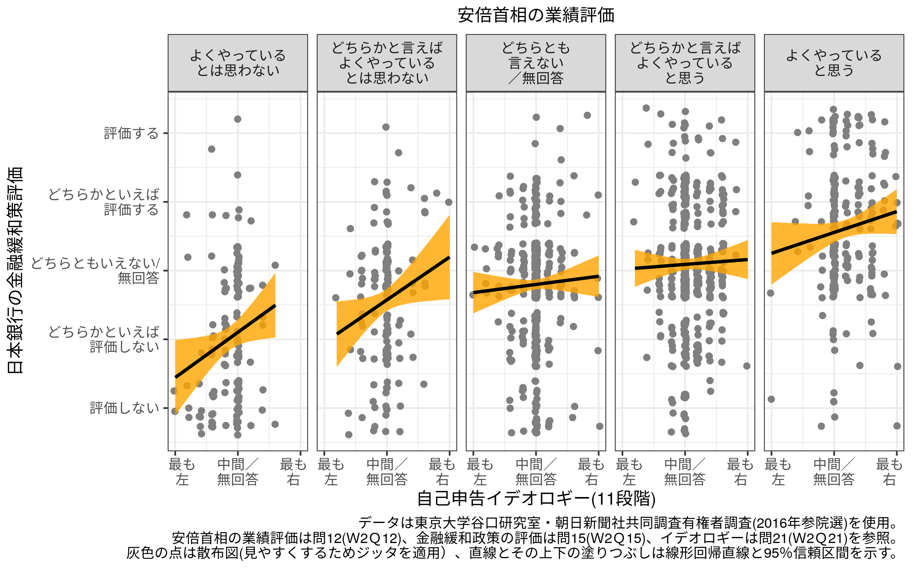
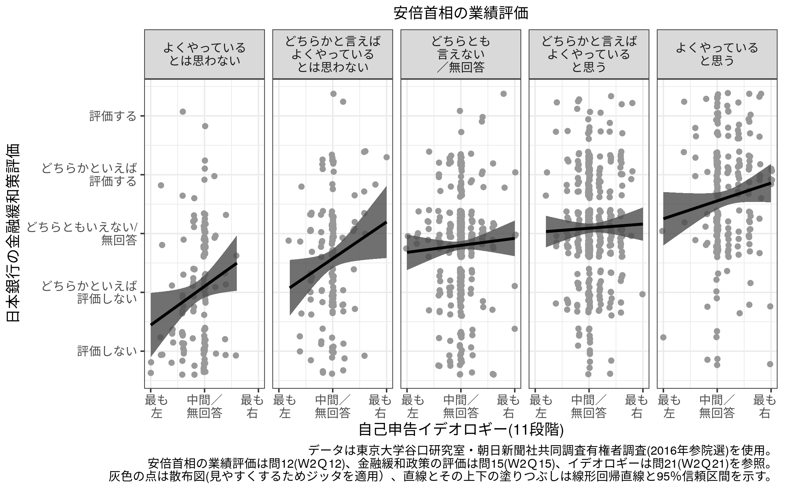

東大朝日調査を用いた金融緩和選好とイデオロギーの関係に関する分析
================
加藤言人
2020年5月21日

# データの読み込み

``` r
## Set Working Directory to the current directory 
## (If using RStudio, can be set automatically)
setwd(dirname(rstudioapi::getActiveDocumentContext()$path))

## Clear Workspace
rm(list=ls())

## データの読み込み
dloc <- "http://www.masaki.j.u-tokyo.ac.jp/utas/2014_2016UTASV20161004.csv"
d <- read.csv(dloc, fileEncoding = "SHIFT-JIS")
```

# 変数の作成

``` r
## イデオロギー
d$ide <- d$W2Q21
d$ide[d$W2Q21==99] <- 5
d$ide <- d$ide - 5
table(d$ide)
```

    ## 
    ##  -5  -4  -3  -2  -1   0   1   2   3   4   5 
    ##   6  12  29  83 119 797 121  95  83  17  14

``` r
## 金融緩和
d$easing <- d$W2Q15
d$easing[d$W2Q15==99] <- 3
d$easing <- 6 - d$easing
table(d$easing)
```

    ## 
    ##   1   2   3   4   5 
    ## 134 227 697 249  69

``` r
## 安倍内閣支持
d$abesup <- d$W2Q12
d$abesup[d$W2Q12==99] <- 3
d$abesup <- 6 - d$abesup
table(d$abesup)
```

    ## 
    ##   1   2   3   4   5 
    ## 134 136 442 451 213

``` r
d$abesup5 <- NA
d$abesup5[d$abesup==1] <- "よくやっている\nとは思わない"
d$abesup5[d$abesup==2] <- "どちらかと言えば\nよくやっている\nとは思わない"
d$abesup5[d$abesup==3] <- "どちらとも\n言えない\n／無回答"
d$abesup5[d$abesup==4] <- "どちらかと言えば\nよくやっている\nと思う"
d$abesup5[d$abesup==5] <- "よくやっている\nと思う"
d$abesup5 <- factor(d$abesup5, levels=c("よくやっている\nとは思わない",
                                        "どちらかと言えば\nよくやっている\nとは思わない",
                                        "どちらとも\n言えない\n／無回答",
                                        "どちらかと言えば\nよくやっている\nと思う",
                                        "よくやっている\nと思う"))

# Demographies
# 性別(女性)
d$fem <- ifelse(d$W1F1==2, 1, ifelse(d$W1F1==3,NA,0))
table(d$fem)
```

    ## 
    ##   0   1 
    ## 859 954

``` r
# 年齢
d$age_20s <- ifelse(d$W1F2==1, 1, ifelse(d$W1F2==99,NA,0))
d$age_30s <- ifelse(d$W1F2==2, 1, ifelse(d$W1F2==99,NA,0))
d$age_40s <- ifelse(d$W1F2==3, 1, ifelse(d$W1F2==99,NA,0))
d$age_50s <- ifelse(d$W1F2==4, 1, ifelse(d$W1F2==99,NA,0))
d$age_60s <- ifelse(d$W1F2==5, 1, ifelse(d$W1F2==99,NA,0))
# d$age_70s <- ifelse(d$W1F2==6, 1, ifelse(d$W1F2==99,NA,0))
# 学歴
table(d$W1F3FA)
```

    ## 
    ##                               S23年・04年制の高等女学校卆                     大学中退 
    ##                         1799                            1                            1 
    ##                       女子高                       女学校                   実浅女学校 
    ##                            1                            1                            1 
    ##                 専門学校中退               尋常高等小学校 小学校もまともに行けなかった 
    ##                            1                            1                            1 
    ##                   旧制女学校                     旧女学校           転勤のため大学中退 
    ##                            1                            1                            1 
    ##                         高専                   高等小学校 
    ##                            2                            1

``` r
d$W1F3[which(d$W1F3FA%in%c("尋常高等小学校","高等小学校",
                           "小学校もまともに行けなかった"))] <- 1
d$W1F3[which(d$W1F3FA%in%c("旧女学校","旧制女学校",
                           "S23年・04年制の高等女学校卆",
                           "実浅女学校","女学校","女子高",
                           "女子高","専門学校中退",
                           "大学中退","転勤のため大学中退"))] <- 2
d$W1F3[which(d$W1F3FA=="高専")] <- 4
#d$edu_el_hi <- ifelse(d$W1F3%in%c(1,2), 1, ifelse(d$W1F3%in%c(7,99),NA,0))
d$edu_vo_ju <- ifelse(d$W1F3%in%c(3,4), 1, ifelse(d$W1F3%in%c(7,99),NA,0))
d$edu_un_gr <- ifelse(d$W1F3%in%c(5,6), 1, ifelse(d$W1F3%in%c(7,99),NA,0))
# table(d$edu_el_hi)
table(d$edu_vo_ju)
```

    ## 
    ##    0    1 
    ## 1432  356

``` r
table(d$edu_un_gr)
```

    ## 
    ##    0    1 
    ## 1347  441

# 安倍首相支持を統制した場合の重回帰分析(表A1)

``` r
# devtools::install_github("gentok/estvis")
library(estvis)

m1 <- lm(easing ~ ide + abesup, data=d)
summary(m1)
```

    ## 
    ## Call:
    ## lm(formula = easing ~ ide + abesup, data = d)
    ## 
    ## Residuals:
    ##      Min       1Q   Median       3Q      Max 
    ## -2.75415 -0.48626  0.04662  0.51374  3.00814 
    ## 
    ## Coefficients:
    ##             Estimate Std. Error t value Pr(>|t|)    
    ## (Intercept)  1.75221    0.07400  23.679  < 2e-16 ***
    ## ide          0.05358    0.01686   3.178  0.00151 ** 
    ## abesup       0.34681    0.02125  16.322  < 2e-16 ***
    ## ---
    ## Signif. codes:  0 '***' 0.001 '**' 0.01 '*' 0.05 '.' 0.1 ' ' 1
    ## 
    ## Residual standard error: 0.8655 on 1373 degrees of freedom
    ##   (437 observations deleted due to missingness)
    ## Multiple R-squared:  0.1961, Adjusted R-squared:  0.1949 
    ## F-statistic: 167.5 on 2 and 1373 DF,  p-value: < 2.2e-16

``` r
m2 <- lm(easing ~ ide + abesup + fem + 
           age_20s + age_30s + age_40s + age_50s + age_60s + 
           edu_vo_ju + edu_un_gr, data=d)
summary(m2)
```

    ## 
    ## Call:
    ## lm(formula = easing ~ ide + abesup + fem + age_20s + age_30s + 
    ##     age_40s + age_50s + age_60s + edu_vo_ju + edu_un_gr, data = d)
    ## 
    ## Residuals:
    ##      Min       1Q   Median       3Q      Max 
    ## -2.71760 -0.49268  0.03661  0.50732  3.04902 
    ## 
    ## Coefficients:
    ##             Estimate Std. Error t value Pr(>|t|)    
    ## (Intercept)  1.74513    0.09376  18.614  < 2e-16 ***
    ## ide          0.05721    0.01707   3.352 0.000825 ***
    ## abesup       0.34597    0.02161  16.010  < 2e-16 ***
    ## fem          0.01771    0.04962   0.357 0.721183    
    ## age_20s      0.19390    0.10441   1.857 0.063526 .  
    ## age_30s      0.21984    0.08768   2.507 0.012284 *  
    ## age_40s      0.06625    0.07950   0.833 0.404789    
    ## age_50s      0.08627    0.07362   1.172 0.241456    
    ## age_60s     -0.04342    0.06763  -0.642 0.520959    
    ## edu_vo_ju   -0.09937    0.06583  -1.510 0.131385    
    ## edu_un_gr   -0.12219    0.06086  -2.008 0.044880 *  
    ## ---
    ## Signif. codes:  0 '***' 0.001 '**' 0.01 '*' 0.05 '.' 0.1 ' ' 1
    ## 
    ## Residual standard error: 0.863 on 1343 degrees of freedom
    ##   (459 observations deleted due to missingness)
    ## Multiple R-squared:  0.2074, Adjusted R-squared:  0.2015 
    ## F-statistic: 35.15 on 10 and 1343 DF,  p-value: < 2.2e-16

``` r
table_coef(list(m1,m2), single.row = TRUE, 
           file.name="../out/utas16_evidence_ols.tex",
           custom.variable.names = c("(定数項)","自己申告イデオロギー",
                                     "安倍首相の業績評価","性別(女性)",
                                     "20代(vs.70代以上)","30代(vs.70代以上)",
                                     "40代(vs.70代以上)","50代(vs.70代以上)",
                                     "60代(vs.70代以上)",
                                     "短期大学・専門学校卒(vs.高卒以下)",
                                     "大学・大学院卒(vs.高卒以下)"),
           dcolumn = TRUE, fontsize = "scriptsize", float.pos = "ht!!",
           caption = "2016年東大朝日調査を用いた金融緩和政策に対する評価の決定要因に関する重回帰分析",
           label="utas16_olstab")
```

    ## Variable Manipulations: 
    ##    Omitted    Original                             Final
    ##     KEPT (Intercept)                          (定数項)
    ##     KEPT         ide              自己申告イデオロギー
    ##     KEPT      abesup                安倍首相の業績評価
    ##     KEPT         fem                        性別(女性)
    ##     KEPT     age_20s                 20代(vs.70代以上)
    ##     KEPT     age_30s                 30代(vs.70代以上)
    ##     KEPT     age_40s                 40代(vs.70代以上)
    ##     KEPT     age_50s                 50代(vs.70代以上)
    ##     KEPT     age_60s                 60代(vs.70代以上)
    ##     KEPT   edu_vo_ju 短期大学・専門学校卒(vs.高卒以下)
    ##     KEPT   edu_un_gr       大学・大学院卒(vs.高卒以下)

    ## The table was written to the file '../out/utas16_evidence_ols.tex'.

    ## 
    ## ===============================================================
    ##                      Model 1               Model 2             
    ## ---------------------------------------------------------------
    ## (定数項)                   1.752 (0.074) ***     1.745 (0.094) ***
    ## 自己申告イデオロギー              0.054 (0.017) **      0.057 (0.017) ***
    ## 安倍首相の業績評価               0.347 (0.021) ***     0.346 (0.022) ***
    ## 性別(女性)                                        0.018 (0.050)    
    ## 20代(vs.70代以上)                                 0.194 (0.104) +  
    ## 30代(vs.70代以上)                                 0.220 (0.088) *  
    ## 40代(vs.70代以上)                                 0.066 (0.079)    
    ## 50代(vs.70代以上)                                 0.086 (0.074)    
    ## 60代(vs.70代以上)                                -0.043 (0.068)    
    ## 短期大学・専門学校卒(vs.高卒以下)                          -0.099 (0.066)    
    ## 大学・大学院卒(vs.高卒以下)                             -0.122 (0.061) *  
    ## ---------------------------------------------------------------
    ## R^2                     0.196                 0.207            
    ## Adj. R^2                0.195                 0.202            
    ## Num. obs.            1376                  1354                
    ## RMSE                    0.866                 0.863            
    ## ===============================================================
    ## *** p < 0.001, ** p < 0.01, * p < 0.05, + p < 0.1

``` r
tmp <- readLines("../out/utas16_evidence_ols.tex")
# tmp <- iconv(tmp, from="SHIFT-JIS", to="UTF-8")
writeLines(tmp, "../out/utas16_evidence_ols.tex", useBytes = TRUE)
```

# プロット（図1）

``` r
dplot <- d[which(!is.na(d$abesup5)),]

library(ggplot2)
```

``` r
p <- ggplot(dplot, aes(x=ide,y=easing)) + 
  geom_jitter(width=0.1, color="gray50") + 
  geom_smooth(method='lm', color="black", fill="orange", alpha=0.8) + 
  facet_grid(.~abesup5) + 
  xlab("自己申告イデオロギー(11段階)") + ylab("日本銀行の金融緩和策評価") + 
  scale_x_continuous(breaks=c(-5,0,5),labels=c("　最も\n　左","中間／\n無回答","最も　\n右　")) + 
  scale_y_continuous(breaks=c(1,2,3,4,5),labels=c("評価しない",
                                                  "どちらかといえば\n評価しない",
                                                  "どちらともいえない/\n無回答",
                                                  "どちらかといえば\n評価する",
                                                  "評価する")) + 
  labs(caption=paste("データは東京大学谷口研究室・朝日新聞社共同調査有権者調査(2016年参院選)を使用。",
                     "安倍首相の業績評価は問12(Ｗ2Ｑ12)、金融緩和政策の評価は問15(Ｗ2Ｑ15)、イデオロギーは問21(Ｗ2Ｑ21)を参照。",
                     "灰色の点は散布図(見やすくするためジッタを適用）、直線とその上下の塗りつぶしは線形回帰直線と95％信頼区間を示す。",
                     sep="\n"),
       subtitle = "安倍首相の業績評価") + 
  theme_bw() + 
  theme(plot.subtitle = element_text(hjust=0.5))
p
```

    ## `geom_smooth()` using formula 'y ~ x'

<!-- -->

``` r
ggsave("../out/utas16_evidence.png", p, width=8, height=5)
# ggsave("../out/utas16_evidence.pdf", p, width=8, height=5, family="Japan1")
```

``` r
p <- ggplot(dplot, aes(x=ide,y=easing)) + 
  geom_jitter(width=0.1, color="gray60") + 
  geom_smooth(method='lm', color="black", fill="gray30", alpha=0.8) + 
  facet_grid(.~abesup5) + 
  xlab("自己申告イデオロギー(11段階)") + ylab("日本銀行の金融緩和策評価") + 
  scale_x_continuous(breaks=c(-5,0,5),labels=c("　最も\n　左","中間／\n無回答","最も　\n右　")) + 
  scale_y_continuous(breaks=c(1,2,3,4,5),labels=c("評価しない",
                                                  "どちらかといえば\n評価しない",
                                                  "どちらともいえない/\n無回答",
                                                  "どちらかといえば\n評価する",
                                                  "評価する")) + 
  labs(caption=paste("データは東京大学谷口研究室・朝日新聞社共同調査有権者調査(2016年参院選)を使用。",
                     "安倍首相の業績評価は問12(Ｗ2Ｑ12)、金融緩和政策の評価は問15(Ｗ2Ｑ15)、イデオロギーは問21(Ｗ2Ｑ21)を参照。",
                     "灰色の点は散布図(見やすくするためジッタを適用）、直線とその上下の塗りつぶしは線形回帰直線と95％信頼区間を示す。",
                     sep="\n"),
       subtitle = "安倍首相の業績評価") + 
  theme_bw() + 
  theme(plot.subtitle = element_text(hjust=0.5))
p
```

    ## `geom_smooth()` using formula 'y ~ x'

<!-- -->

``` r
ggsave("../out/utas16_evidence_gray.png", p, width=8, height=5)
# ggsave("../out/utas16_evidence_gray.pdf", p, width=8, height=5, family="Japan1")
```
